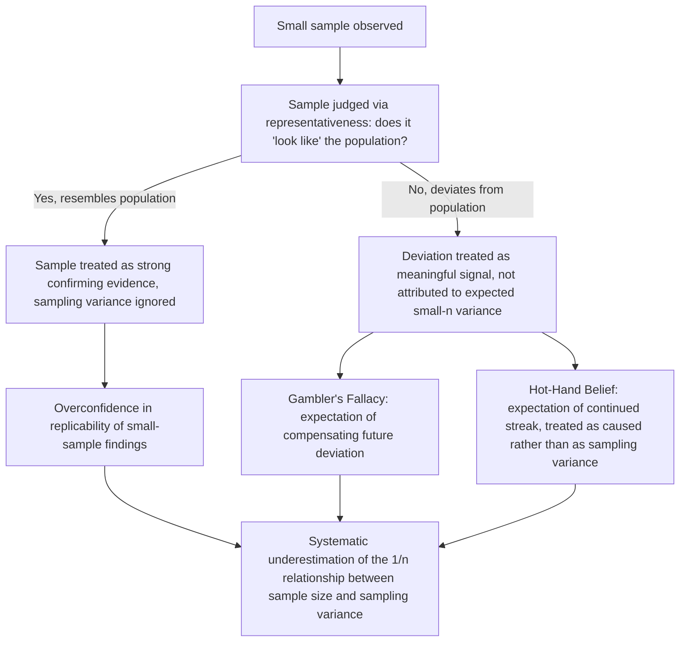

## The Law of Small Numbers and Sample Size Neglect

### Overview

The "law of small numbers" is a term coined by Tversky and Kahneman (1971) to describe a systematic misapplication of statistical intuition: people treat small samples as if they were nearly as representative of the underlying population as large samples — behaving as though the true statistical **law of large numbers** applied even to samples of only a handful of observations. This is not a formal statistical law at all but a deliberately ironic label for a cognitive bias: an erroneous belief that local, small-sample regularities should closely mirror global, population-level regularities. Sample size neglect is the closely related, more general tendency to underweight or entirely ignore sample size when evaluating the reliability, precision, or evidentiary weight of statistical information. Together these constructs are foundational to the broader **representativeness heuristic** research program (Tversky & Kahneman, 1974) and have substantial downstream implications for the gambler's fallacy, hot-hand beliefs, and misjudgments of statistical significance in both lay and, notably, some expert populations.

### The Actual Law of Large Numbers (Normative Benchmark)

To understand the bias, the true statistical benchmark must be stated precisely. The law of large numbers states that as sample size $n$ increases, the sample mean $\bar{X}_n$ converges in probability to the true population mean $\mu$:

$$\bar{X}_n \xrightarrow{p} \mu \quad \text{as } n \to \infty$$

Critically, this convergence is a large-$n$ asymptotic property. For small $n$, the sample mean can deviate substantially from $\mu$, and the *variance* of the sampling distribution of the mean is:

$$\text{Var}(\bar{X}_n) = \frac{\sigma^2}{n}$$

This variance term is the crux of the normative issue: as $n$ decreases, the sampling variance increases (proportionally to $1/n$), meaning small samples are expected to show *more* extreme and *more* variable results than large samples purely due to sampling error — not because the underlying data-generating process has changed. The law-of-small-numbers bias is precisely the failure to internalize this $1/n$ relationship: treating a small sample's result as if it carried the same evidentiary weight, precision, or representativeness as a large sample's result.

### Tversky and Kahneman's Original Demonstration (1971)

In their foundational paper, "Belief in the Law of Small Numbers," Tversky and Kahneman surveyed professional research psychologists (attendees at mathematical psychology conferences — i.e., statistically sophisticated experts, not naive lay participants) and found that even this expert population:

- Substantially overestimated the replicability of results obtained from small initial samples.
- Underestimated the sample sizes needed to achieve a desired level of statistical power.
- Showed excessive confidence that a small-sample result found in an initial study would replicate closely in a follow-up study of similar (small) size.

**[Confirmed]** This finding — that trained statisticians and research psychologists themselves exhibited the bias — is one of the most cited pieces of evidence in the heuristics-and-biases program for the claim that statistical intuitions are not simply a matter of untrained naivety and can persist despite formal statistical training, distinguishing this bias from ones more readily corrected by education alone.

### Mechanism: The Representativeness Heuristic

The law of small numbers is explained as a specific application of the broader **representativeness heuristic** (Tversky & Kahneman, 1974): people judge the probability or validity of an outcome based on how well it resembles (is "representative of") a prototype or generating process, rather than by correctly incorporating base-rate and sample-size information.

Under representativeness, a small sample that *looks like* the population it was drawn from (e.g., a short sequence of coin flips that has roughly 50% heads) is judged as more probable, or more strongly diagnostic of a fair coin, than statistically warranted — and, conversely, a small sample that *doesn't* superficially resemble the population's known properties is treated as surprising or diagnostic of something unusual, even when such deviations are, in fact, statistically unremarkable and expected for small $n$.

### Diagram: Law of Small Numbers Mechanism

### The Gambler's Fallacy as a Direct Corollary

The **gambler's fallacy** — the mistaken belief that, after a run of one outcome in an independent random process (e.g., several coin flips landing heads), the opposite outcome becomes "due" and more likely — is a direct behavioral manifestation of the law of small numbers. It reflects the erroneous belief that even a short sequence must locally "self-correct" to resemble the true long-run population probability (50/50), rather than correctly recognizing that each trial is independent and the sequence's deviation will simply be diluted, not compensated for, as $n$ grows.

**[Confirmed]** The gambler's fallacy and the law of small numbers are conceptually the *same underlying misconception applied to sequential, independent trials specifically*; the law of small numbers is the more general statistical-inference bias, while the gambler's fallacy is its canonical instantiation in random sequences.

### The Hot-Hand Phenomenon: A Genuinely Contested Related Case

The "hot hand" belief — that a basketball player who has made several consecutive shots is more likely to make the next shot ("streak shooting" or being "in the zone") — was originally treated by Gilovich, Vallone & Tversky (1985, "GVT") as the *opposite-direction* sibling bias to the gambler's fallacy: whereas the gambler's fallacy expects reversal after a streak, the hot-hand belief expects continuation after a streak, and GVT argued both were fallacious mismodelings of what is actually a sequence of independent, identically distributed (i.i.d.) shots, with observed streaks being ordinary statistical clustering rather than evidence of a real "hot" causal state.

**[Unverified] — important technical caveat**: This original GVT conclusion has been substantially revisited. Miller and Sanjurjo (2018) identified a subtle but consequential **selection bias in the original GVT analysis method**: when calculating the conditional probability of a hit following a streak of hits within a *finite* sequence, the standard method of averaging within-sequence proportions systematically underestimates the true conditional probability, even under the null hypothesis of genuine i.i.d. shooting. Correcting for this bias, Miller and Sanjurjo found evidence for a real, modest hot-hand effect in the original GVT data and in NBA shooting data more broadly, essentially reversing the field's dominant 30-year conclusion that the hot hand was purely illusory. **This should be flagged explicitly**: the hot-hand phenomenon is not simply a clean example of the law of small numbers producing an illusory belief; the empirical status of the belief itself has been substantially revised by a subtle statistical correction, and treating "the hot hand is a fallacy" as settled fact is now outdated relative to the current state of that specific literature, even though the law of small numbers remains a valid and independently well-supported bias in its own right, including as (at minimum) a *contributing* distortion to how dramatically people overestimate the size and reliability of any genuine hot-hand effect that does exist.

### Applied Manifestations in Economic and Financial Behavior

1. **Mutual fund and manager selection**: Investors and even some financial professionals have been documented drawing strong inferences about a fund manager's skill from a short track record (e.g., three to five years of outperformance), significantly underweighting how much of that short-run performance is attributable to sampling variance rather than persistent skill — a direct application of the law of small numbers to investment decision-making, and a contributing explanation for performance-chasing behavior in mutual fund flows.
2. **Small-sample business and policy inference**: Managers and policymakers drawing strong conclusions from pilot programs, small A/B tests, or early sales data with inadequate sample sizes exhibit the same bias, often leading to premature scaling of interventions or products based on statistically unreliable small-sample signals.
3. **Misinterpretation of streaks in performance evaluation**: Similar to the hot-hand context, managers evaluating a salesperson's or employee's recent short run of good or bad performance may over-attribute the streak to a real, persistent change in ability rather than appropriately discounting it as expected variance for a short observation window — connecting this topic to the Attribution Bias material (dispositional over-attribution) but with a specifically statistical, sample-size-driven mechanism.
4. **Clinical and scientific overinterpretation of small studies**: Sample size neglect contributes to the broader replication crisis literature: small, underpowered studies producing dramatic, headline-worthy effect sizes are disproportionately likely to be false positives or substantial overestimates of the true effect size (a statistical fact sometimes called the "winner's curse" for small-sample findings), and both researchers and science journalism have been documented underappreciating this relationship. **[Inference]** This connects the law of small numbers directly to the replication-crisis and publication-bias literatures in meta-science, though the replication crisis itself has multiple contributing causes (publication bias, p-hacking, low statistical power) beyond pure cognitive misjudgment of sample size.

### Relationship to Other Biases in This Chapter

| Related Bias | Relationship |
| --- | --- |
| Representativeness Heuristic | The law of small numbers is a specific, well-documented sub-case of the broader representativeness heuristic applied to sample-based inference. |
| Confirmation Bias / Motivated Belief Updating | Distinct mechanism, but can compound: a small confirmatory sample may be both over-weighted due to sample size neglect *and* preferentially sought out or retained due to confirmation bias. |
| Attribution Bias | Overinterpreting a short performance streak as reflecting a real change in a person's underlying disposition/skill (rather than sampling variance) combines sample size neglect with dispositional over-attribution. |
| Base Rate Neglect | A closely related, sometimes overlapping bias: both involve failing to properly weight statistical/structural information (sample size in one case, population base rates in the other) in favor of a more vivid, specific, case-level judgment. |

### Critiques and Boundary Conditions

- **Expertise does not fully eliminate the bias, but training can help**: While Tversky and Kahneman's original finding that trained researchers exhibited the bias is well-established, later work on statistical education and debiasing interventions suggests explicit, targeted training on sampling distributions and statistical power can meaningfully improve calibration in specific applied contexts, even if it does not eliminate the intuitive default bias entirely. **[Unverified]** The durability and generalizability of such debiasing interventions outside the specific trained task domain is not fully settled.
- **The hot-hand revision is a significant, field-altering caveat**: As detailed above, this is not a minor footnote — the Miller and Sanjurjo (2018) correction materially changed the empirical conclusion about one of the most famous applications of this bias, and any presentation of the law of small numbers that cites the hot hand as a clean, still-uncontested example of pure illusion is presenting outdated information.
- **Distinguishing genuine small-sample skepticism from excessive skepticism**: The normative point is not that small samples provide *no* information — a small sample can still be meaningfully updated on via correct Bayesian reasoning, just with appropriately wide confidence intervals. The bias is specifically about treating small-sample results with *inappropriately narrow* implied confidence, not about the more defensible position that small samples are simply uninformative.

### Measurement Approaches

- **Sample-size sensitivity tasks**: Presenting participants with statistically identical scenarios varying only in stated sample size and measuring whether confidence/probability judgments appropriately widen for smaller $n$ (the original Tversky-Kahneman "hospital problem" — comparing likelihood of extreme male-birth-ratio days at large vs. small hospitals — is a classic instantiation).
- **Sequence-judgment paradigms**: Presenting binary random sequences (coin flips, sports shot sequences) and measuring predicted continuation probabilities, used for gambler's-fallacy and hot-hand-belief research; contemporary work in this area must apply Miller-Sanjurjo-style bias correction when calculating true conditional hit probabilities from finite sequences.
- **Field data on investment/fund flows**: Analyzing money flows into and out of mutual funds and other investment vehicles as a function of short-term versus long-term track record, used as a revealed-preference measure of sample-size neglect in real financial decision-making.
- **Statistical literacy and numeracy scales**: Used as covariates or moderators in many of the above designs to test whether general statistical training or numeracy reduces (without necessarily eliminating) the bias.

### Practical Implications for Choice Architecture and Institutional Design

- Investment and fund-selection platforms can mitigate performance-chasing behavior by prominently displaying sample size, confidence intervals, or statistical-significance caveats alongside short-term track-record data, rather than presenting raw returns without appropriate uncertainty framing.
- Organizational decision processes relying on pilot programs or early-stage data should build in explicit minimum-sample-size or minimum-duration thresholds before drawing conclusions or scaling decisions, specifically to counteract the tendency to treat early, small-sample signals as more conclusive than they statistically are.
- Given the hot-hand revision, any pedagogical or applied material using the hot hand as an illustrative example of the law of small numbers should either update the framing to reflect the Miller-Sanjurjo correction or use an alternative, less contested example (e.g., small-sample fund manager evaluation, the original hospital-birth-ratio problem) to avoid presenting a now-outdated empirical claim as settled fact.

**Next Steps**

- Representativeness Heuristic (Tversky and Kahneman)
- Gambler's Fallacy and Sequential Independence Misjudgment
- The Hot-Hand Fallacy and the Miller-Sanjurjo Correction
- Base Rate Neglect
- Replication Crisis and Publication Bias in Meta-Science
- Statistical Power and Sample Size in Applied Research Design
- Attribution Bias
- Performance-Chasing Behavior in Mutual Fund Investing