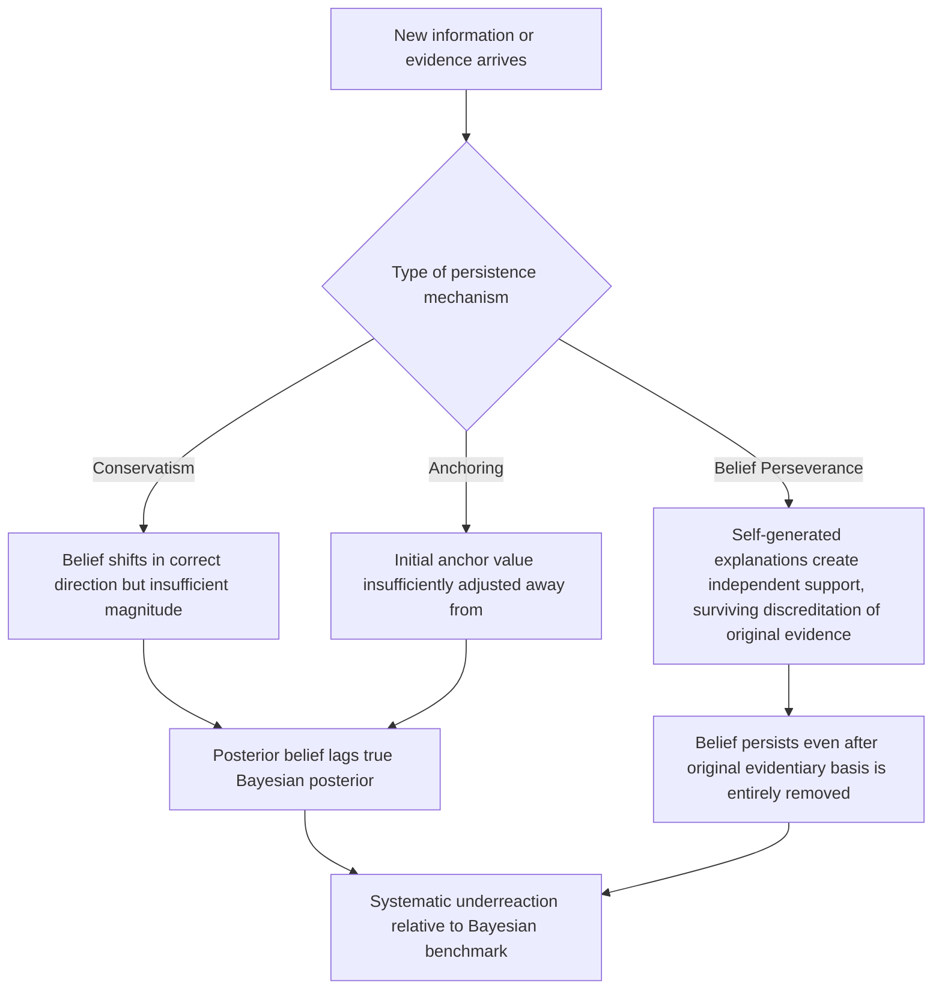

## Belief Persistence and Underreaction to News

### Overview

Belief persistence and underreaction to news describe a family of related phenomena in which individuals update their beliefs in response to new information *more slowly or incompletely* than a Bayesian benchmark would prescribe, causing existing beliefs to persist longer than the evidence warrants. This sits conceptually opposite to overreaction phenomena (where beliefs swing too far in response to new information, as in representativeness-driven extrapolation) and the two together — underreaction and overreaction — form the two poles of the anomalous-updating literature in behavioral finance and judgment research. Belief persistence draws on several distinct but related mechanisms: **conservatism bias** (Edwards, 1968), **anchoring** (Tversky & Kahneman, 1974), **belief perseverance** in the face of discredited evidence (Ross, Lepper & Hubbard, 1975), and formal underreaction models in behavioral asset pricing (Barberis, Shleifer & Vishny, 1998).

### Conservatism Bias: The Foundational Construct

Ward Edwards' (1968) conservatism bias is the original, most direct formal statement of underreaction: when presented with new diagnostic evidence, people revise their probability estimates in the correct Bayesian *direction*, but by a smaller *magnitude* than Bayes' rule prescribes.

**Formal characterization**: For a prior $P(H)$ and evidence $E$ with likelihood ratio $LR = P(E\mid H) / P(E \mid \neg H)$, the correct Bayesian posterior odds are:

$$\text{Posterior odds} = LR \times \text{Prior odds}$$

Conservatism is characterized empirically as observed posterior odds shifting by *less* than this multiplicative factor would imply — as though the decision-maker applies an attenuated likelihood ratio, $LR^{\alpha}$ for some $0 < \alpha < 1$, effectively "discounting" the diagnostic value of new evidence relative to its true statistical weight.

**[Confirmed]** This distinguishes conservatism specifically from confirmation bias (covered earlier in this chapter): confirmation bias involves *asymmetric* processing depending on whether evidence confirms or disconfirms a prior, whereas conservatism, in its classical formulation, is a more general *symmetric* underweighting of new evidence's diagnostic value, regardless of its direction relative to the prior — though the two frequently co-occur and interact in applied settings, and later literature (as discussed under Confirmation Bias) has shown the disconfirming-evidence case is often subject to *additional* discounting beyond the baseline conservatism effect.

### Belief Perseverance: Persistence After Discreditation

A more extreme form of belief persistence is **belief perseverance**, documented in the classic **debriefing paradigm** studies (Ross, Lepper & Hubbard, 1975). Participants were given false feedback about their performance on a task (e.g., told they had unusually high or low ability at distinguishing real from fake suicide notes), asked to generate explanations for why this feedback might be accurate, and then explicitly and thoroughly informed that the original feedback had been entirely fabricated and bore no relationship to their actual performance.

**Key finding**: Despite complete, explicit discreditation of the original evidentiary basis for their belief, participants' self-assessments of their ability remained significantly shifted in the direction of the original (false) feedback, relative to a control group that never received the false feedback at all. **[Confirmed]** This is a stronger and more striking claim than simple conservatism (underweighting new evidence): it demonstrates that a belief can persist even when its *entire original evidentiary basis has been completely removed*, which the standard Bayesian model — where a posterior belief should have no independent existence apart from the evidence that generated it — cannot easily accommodate. The proposed mechanism is that generating explanations for the (false) feedback created new, independent cognitive support for the belief (self-generated causal narratives, recalled anecdotal "supporting" instances) that persisted even after the original evidence was withdrawn.

### Diagram: Belief Persistence Across Related Mechanisms

### Underreaction in Behavioral Asset Pricing

The most economically consequential extension of belief persistence is in behavioral finance, where **underreaction to news** is offered as an explanation for well-documented market anomalies that standard efficient-markets models struggle to accommodate.

**Barberis, Shleifer & Vishny (1998) — the BSV model**

This influential model proposes that investors' belief updating is characterized by two competing, psychologically-motivated biases operating in different informational regimes:

1. **Conservatism (underreaction)**: When a single new piece of earnings news arrives, investors underreact, causing stock prices to adjust only partially to the news's true information content. This produces **post-earnings-announcement drift** — the well-documented empirical finding that stock prices continue moving in the direction of an earnings surprise for weeks to months *after* the announcement, rather than adjusting instantaneously as efficient-market theory predicts.
2. **Representativeness (overreaction)**: When investors observe a consistent *pattern* of several similarly-surprising news events in a row, they over-extrapolate this pattern (via representativeness) into an excessively strong belief about a persistent trend, producing overreaction and subsequent long-run price reversals.

**[Inference]** The BSV model's key theoretical contribution is proposing that these two seemingly contradictory documented anomalies (short-run underreaction/drift and long-run overreaction/reversal) can be generated by a *single* underlying investor psychology, with conservatism dominating single-signal updating and representativeness dominating multi-signal pattern extrapolation — rather than requiring two entirely separate, unrelated explanations for the two anomalies.

**Post-Earnings-Announcement Drift (PEAD)**: This is the most robustly documented empirical anomaly connected to underreaction. Ball and Brown (1968) first documented that stock prices continue to drift in the direction of an earnings surprise for a substantial period after the announcement — a finding that has been replicated across many decades and markets and remains one of the most persistent anomalies in the asset-pricing literature, though **[Unverified]** the magnitude of the anomaly and the extent to which it has been arbitraged away in more recent, more liquid, and more algorithmically-traded markets is a subject of ongoing debate, with some evidence that the effect has weaked somewhat as awareness and quantitative trading around the anomaly have increased.

### Relationship to Anchoring and Adjustment

**Anchoring** (Tversky & Kahneman, 1974) is often treated as a related, partially overlapping mechanism for belief persistence: when forming an estimate, people start from an initial "anchor" value (which may be arbitrary, self-generated, or externally provided) and adjust away from it, but this adjustment is typically insufficient, leaving the final estimate biased toward the anchor.

**[Inference]** In the context of belief updating specifically, a prior belief can itself function as an anchor for the posterior: rather than fully recomputing a probability estimate from the prior and new evidence via Bayes' rule, decision-makers may effectively "anchor" on the prior belief and insufficiently adjust it toward what the new evidence warrants — providing a plausible cognitive-mechanism account for conservatism bias, though the degree to which anchoring-and-adjustment is *the* mechanism underlying conservatism (as opposed to a related but formally distinct heuristic) is not fully resolved in the literature and different theoretical treatments emphasize this connection to varying degrees.

### Applied and Empirical Evidence

1. **Post-earnings-announcement drift**: As detailed above, the single most cited financial-market manifestation of underreaction, with decades of supporting empirical documentation across markets and time periods.
2. **Underreaction to corporate news beyond earnings**: Similar drift patterns have been documented following other corporate news events, including analyst recommendation changes, stock splits, and share buyback announcements, with prices continuing to adjust gradually in the direction of the initial news's implications rather than jumping immediately to the new efficient level.
3. **Political and social belief persistence**: Belief perseverance effects have been examined in political attitude research, where debunked claims or discredited factual assertions have been found in some studies to leave residual attitudinal effects even after explicit correction — connecting to the broader "continued influence effect" of misinformation literature in cognitive psychology, which studies specifically how corrected misinformation continues to influence subsequent reasoning and judgment.
4. **Clinical and diagnostic judgment**: Conservatism in updating diagnostic probability estimates has been documented in medical decision-making contexts, where clinicians updating a diagnostic probability based on sequential test results have been found in some studies to underweight the diagnostic value of new test information relative to the Bayesian-optimal update, particularly for tests with high diagnostic power. **[Unverified]** The consistency and magnitude of this specific finding across different clinical specialties and decision contexts is less uniformly established than the finance-specific PEAD literature, and should be treated as a documented but less extensively replicated application.
5. **Organizational forecasting and planning**: Corporate revenue and demand forecasts have been observed to adjust too slowly in response to new market information (a form of organizational conservatism), contributing to phenomena like the bullwhip effect in supply chain management, where demand signal distortions are amplified as they propagate through a supply chain partly due to slow, conservative belief updating at each stage.

### Relationship to Other Biases in This Chapter

| Related Bias | Relationship |
| --- | --- |
| Confirmation Bias / Motivated Belief Updating | Both involve deviation from Bayesian updating, but conservatism/underreaction is more general and symmetric in its classical form, while confirmation bias is specifically asymmetric with respect to evidence direction; they can compound in applied settings. |
| The Law of Small Numbers | An interesting theoretical tension: the law of small numbers describes *overreaction* to small samples (treating them as more representative/conclusive than warranted), while conservatism describes *underreaction* to individual pieces of evidence — the BSV model's key insight is precisely that both can coexist by operating over different evidence structures (single signals vs. patterns of signals). |
| Attribution Bias | Distinct mechanism, but belief perseverance's finding that self-generated causal explanations sustain a belief independent of its original evidence connects to how attribution processes can create durable, self-reinforcing belief structures. |
| Anchoring and Adjustment | Frequently proposed as a proximate cognitive mechanism underlying conservatism bias specifically, treating the prior belief itself as the "anchor" that is insufficiently adjusted. |

### Critiques and Boundary Conditions

- **Underreaction vs. overreaction is not a fixed, universal property of a person or market**: As the BSV model itself emphasizes, the same underlying psychology can produce underreaction in some informational contexts (single ambiguous signals) and overreaction in others (extrapolated patterns), meaning it is a modeling error to treat "underreaction" as a fixed trait characterizing an entire market or population without specifying the informational structure of the evidence involved.
- **Market efficiency debate**: The persistence and robustness of anomalies like PEAD remain contested within finance as a genuine market inefficiency versus a compensation for some unmodeled risk factor or transaction-cost/liquidity constraint that prevents full arbitrage — this is part of the broader, long-running efficient-markets-versus-behavioral-finance debate, and **[Unverified]** the current academic consensus on the precise decomposition between genuine behavioral mispricing and risk-based or friction-based explanations for PEAD specifically is not fully settled.
- **Belief perseverance's replication and boundary conditions**: While the original Ross, Lepper & Hubbard debriefing paradigm is a classic and influential finding, the size of the perseverance effect and the conditions under which more thorough or differently-worded debriefing can more fully eliminate it have been explored in subsequent work, and the effect should not be treated as an immovable, debriefing-proof phenomenon under all circumstances.
- **Distinguishing conservatism from rational information processing costs**: As with motivated reasoning more broadly, some apparent underreaction could reflect rational costly-attention or costly-information-processing responses (i.e., agents optimally not fully processing low-stakes signals) rather than a pure cognitive bias — a distinction that, as in the confirmation-bias literature, requires careful experimental or econometric design to disentangle.

### Measurement Approaches

- **Bayesian-updating deviation designs**: As with confirmation bias, comparing stated or revealed posterior beliefs to the Bayesian-rational posterior given a known likelihood ratio, used to directly quantify the degree of conservatism (the $\alpha$ attenuation parameter described above).
- **Event-study methodology**: The standard financial-economics tool for measuring PEAD and related underreaction anomalies, tracking abnormal returns in the days, weeks, and months following a corporate news event relative to a benchmark expected-return model.
- **Debriefing/discreditation paradigms**: The Ross-Lepper-Hubbard design, measuring residual belief shift after explicit, thorough discreditation of the original evidentiary basis, used for belief perseverance research specifically.
- **Analyst forecast revision studies**: Measuring how slowly professional financial analysts revise earnings forecasts in response to new information, used as a real-world, expert-population test of conservatism bias outside the laboratory.

### Practical Implications for Choice Architecture and Institutional Design

- Recognizing conservatism bias has direct trading-strategy implications (which is precisely why PEAD-based trading strategies exist), but from a policy/institutional-design perspective, it also suggests that disclosure and communication systems delivering important sequential information (regulatory findings, safety updates, medical test results) may benefit from explicit framing that counteracts the natural tendency to underweight new diagnostic information relative to a prior.
- Given belief perseverance's demonstration that a belief can survive complete discreditation of its original evidence, correction and debunking strategies for misinformation should not assume that simply presenting a clear, explicit correction is sufficient; the "continued influence effect" literature suggests corrections are more effective when they include an alternative causal narrative to replace the discredited one, rather than a correction alone.
- Organizational forecasting processes vulnerable to conservatism-driven demand-signal lag (contributing to bullwhip-effect-style distortions) can benefit from structured, systematic forecast-revision protocols that explicitly quantify the Bayesian-implied update from new information, rather than relying on unaided managerial judgment, which is the population in which conservatism bias has been repeatedly documented.

**Next Steps**

- Post-Earnings-Announcement Drift and Market Efficiency Debates
- Barberis-Shleifer-Vishny Model of Investor Sentiment
- Anchoring and Adjustment Heuristic
- Confirmation Bias and Motivated Belief Updating
- The Law of Small Numbers and Sample Size Neglect
- Continued Influence Effect and Misinformation Correction
- Bullwhip Effect in Supply Chain Forecasting
- Efficient Market Hypothesis vs. Behavioral Finance