## Information Avoidance and Willful Ignorance

### Overview

Information avoidance describes the deliberate choice to avoid, delay, or resist acquiring information that is freely or cheaply available, when that information is expected to be useful for decision-making but is also anticipated to be potentially unwelcome, distressing, or identity-threatening. Willful ignorance is the closer-to-colloquial term for the same underlying behavior, often used specifically to describe cases where a person could easily learn a consequential fact and chooses not to, sometimes with a self-serving motive to preserve later deniability or moral cover. This topic formalizes what is sometimes called the **"ostrich effect"** in behavioral finance and connects directly to the belief-utility framework introduced under Confirmation Bias and Motivated Belief Updating, but focuses specifically on the *pre-emptive* decision to avoid information altogether, rather than on how already-received information gets distorted after the fact. The foundational economic treatment is Golman, Hagmann and Loewenstein's (2017) synthesis review, building on earlier formal work by Akerlof and Dickens (1982) on cognitive dissonance in economic choice, and Karlsson, Loewenstein and Seppi's (2009) coining of the "ostrich effect" in an investment context.

### Defining Information Avoidance

Golman, Hagmann and Loewenstein (2017) define information avoidance as any behavior intended to prevent or delay the acquisition of available information — distinguishing it clearly from mere lack of information-seeking effort (a passive absence of curiosity) by requiring an **active, intentional choice to avoid a specific, known, obtainable piece of information**.

**Key structural feature distinguishing this from post-hoc motivated reasoning**: In confirmation bias and motivated belief updating (covered earlier), the information has already arrived and is being distorted, discounted, or selectively weighted *after receipt*. In information avoidance, the decision point is *earlier*: the person chooses not to receive the signal at all, foreclosing the need to process or distort it later. This makes information avoidance, in principle, easier to detect via revealed-preference designs, since it manifests as an observable choice (declining a test, not opening a statement, not asking a question) rather than requiring inference about internal processing of received information.

### Formal Rationale: Why Avoid Free Information?

Under standard expected-utility theory with a positive value of information (the classical Blackwell/Savage result that more information weakly increases expected utility for any rational decision-maker with the option to ignore it), information avoidance for costlessly-obtained information is, strictly speaking, a violation of a foundational normative principle: a rational Bayesian decision-maker should never refuse a free, decision-relevant signal, since they can always choose to ignore it once received.

Golman, Hagmann and Loewenstein (and the broader belief-utility literature) resolve this apparent paradox by identifying several distinct mechanisms through which information avoidance can be understood, even while treating the phenomenon as a genuine departure from strict information-value maximization:

1. **Direct hedonic/belief-utility cost of receiving bad news**: Building on the belief-utility framework (Bénabou & Tirole), if a signal itself is unpleasant to receive — independent of any decision it might inform — a person may rationally (in a hedonic-utility-maximizing sense) trade off the instrumental value of the information against the anticipated emotional cost of receiving it, particularly for information with no immediate actionable consequence.
2. **Regret-avoidance**: Directly connecting to Regret Theory (covered earlier in this syllabus), avoiding information can be a strategy to avoid future regret — if a person avoids learning that a chosen course of action was suboptimal, they avoid the anticipated regret of that comparison, even though avoiding it also forecloses any opportunity for corrective action.
3. **Preserving beneficial beliefs with instrumental value**: If a currently-held optimistic belief has genuine motivational or performance-relevant instrumental value (e.g., confidence aiding persistence at a difficult task), receiving accurate but discouraging information could be instrumentally costly, not just hedonically unpleasant — creating a scenario where avoidance can be modeled as *instrumentally*, not merely hedonically, rational under certain conditions.
4. **Moral wiggle room and strategic ignorance**: Avoiding information can serve a self-serving strategic function distinct from hedonic or motivational concerns: not learning a fact (e.g., the true consequences of an economic choice for another person) can provide moral cover, allowing a person to act in their own self-interest while avoiding the guilt or reputational cost of *knowingly* acting against another's welfare. This is the specific mechanism most closely associated with the term "willful ignorance" as opposed to the broader "information avoidance."

### The Ostrich Effect

Karlsson, Loewenstein and Seppi (2009) coined the "ostrich effect" specifically in the context of investment behavior: investors were found to check their portfolio account balances **less frequently during periods of declining or volatile markets** than during periods of rising markets — a direct behavioral signature of information avoidance driven by anticipated bad news.

**[Confirmed]** This finding is notable because portfolio-checking behavior is a naturally occurring, easily measurable, high-frequency revealed-preference indicator, making the ostrich effect one of the most robustly field-validated instances of information avoidance in the economics literature, as distinct from lab-only demonstrations.

### Diagram: Information Avoidance Decision Structure

```mermaid
flowchart TD
    A[Decision-relevant information is available at low or zero cost] --> B{Anticipated valence of the information}
    B -- Expected to be favorable or neutral --> C[Information sought or accepted readily]
    B -- Expected to be unfavorable or threatening --> D{Mechanism driving avoidance}
    D -- Hedonic cost of bad news --> E[Direct belief-utility loss anticipated]
    D -- Regret avoidance --> F[Avoiding future comparison to a forgone better outcome]
    D -- Instrumental belief protection --> G[Preserving a currently useful, motivating belief]
    D -- Moral wiggle room --> H[Preserving deniability to avoid guilt or reputational cost of acting selfishly]
    E --> I[Information actively avoided or delayed]
    F --> I
    G --> I
    H --> I
    I --> J[Decision-relevant uncertainty persists, unlike standard rational information-seeking model]
```

### Moral Wiggle Room: The Experimental Economics Literature

The "moral wiggle room" concept, developed primarily by Dana, Weber and Kuang (2007), provides some of the cleanest experimental evidence for the strategic-ignorance mechanism specifically.

**Classic dictator-game-with-uncertainty design**: In a modified dictator game, a participant can choose an allocation between themselves and another player, but is given the *option* to avoid learning the exact payoff consequences of their choice for the other player (e.g., choosing an option that could result in either a fair or unfair outcome for the recipient, with the specific mapping deliberately hidden unless the participant pays a small cost, or explicitly chooses, to reveal it).

**Key finding**: A substantial proportion of participants choose to remain willfully ignorant of the exact consequences of their choice for the other player, and — critically — those who remain ignorant subsequently behave *more selfishly* on average than those who acquire full information, or than the same population behaves in a standard, fully-transparent dictator game. This demonstrates that willful ignorance is not merely a passive absence of curiosity but functions as an active enabler of self-interested behavior that the person would find harder to justify (to themselves or others) under full transparency.

**[Confirmed]** This experimental paradigm is the primary empirical anchor for distinguishing "willful ignorance" (strategic, self-interest-preserving) from the broader, more hedonically-motivated "information avoidance" (e.g., ostrich-effect-style avoidance of one's own bad news), even though both fall under the same general Golman-Hagmann-Loewenstein umbrella framework.

### Applied and Empirical Evidence

1. **Investment and financial monitoring behavior**: Beyond the original Karlsson-Loewenstein-Seppi finding, subsequent research has documented similar ostrich-effect patterns in retirement account monitoring and financial app usage, with users' account-checking frequency correlating negatively with recent unfavorable market performance.
2. **Health information avoidance**: A substantial literature examines avoidance of genetic testing, HIV testing, and other diagnostic health information, even when testing is free, low-cost, or actionable. Sweeny, Melnyk, Miller and Shepperd's (2010) review categorizes health-information-avoidance motivations along lines consistent with the broader Golman-Hagmann-Loewenstein framework (anticipated negative affect, unwanted advice or behavior change requirements, and threats to a valued self-image or worldview). **[Unverified]** The relative weight of these different motivations varies substantially across specific health-information contexts (e.g., genetic testing for an untreatable condition versus a highly treatable one), and this heterogeneity means findings from one health-information-avoidance context should not be assumed to generalize uniformly to others.
3. **Charitable giving and moral wiggle room**: Beyond the original dictator-game paradigm, field and lab studies have found that potential donors sometimes avoid learning specific details about a charity's effectiveness or a beneficiary's actual circumstances when such information might reveal that a preferred, comfortable giving decision is less impactful or less warranted than assumed — connecting information avoidance directly to the economics of charitable giving and warm-glow motivations.
4. **Corporate and managerial willful ignorance**: Organizational research has examined patterns in which managers or employees avoid seeking out information about potential compliance violations, product safety issues, or ethical problems within their purview, preserving deniability — a topic of direct relevance to corporate governance, whistleblower policy design, and legal doctrines around "willful blindness" (which in some legal systems can, notably, still be treated as equivalent to actual knowledge for liability purposes, precisely because courts recognize the strategic-avoidance mechanism this literature documents). **[Unverified]** The academic behavioral-economics literature on this specific corporate-governance application is smaller and less extensively empirically validated than the health and financial domains, and much of the connection here is conceptual/legal rather than a large body of dedicated behavioral experiments.
5. **Political and news information avoidance**: Selective avoidance of counter-attitudinal political news and information (related to but distinct from the selective-exposure/echo-chamber phenomenon discussed under Confirmation Bias) has been documented as a related form of information avoidance specifically motivated by anticipated identity threat or cognitive-dissonance-avoidance, rather than simple preference for congenial content.

### Relationship to Other Biases in This Chapter

| Related Bias | Relationship |
| --- | --- |
| Confirmation Bias / Motivated Belief Updating | Closely related; confirmation bias's "biased search" sub-mechanism is essentially information avoidance applied to a search-and-selection process among available sources, while this topic covers the more general, deliberate avoidance decision, including of a single specific known signal. |
| Regret Theory and Anticipated Regret | Regret-avoidance is one of the specific formal mechanisms proposed for why people avoid information — avoiding a signal forecloses the counterfactual comparison that would generate regret. |
| Belief Persistence and Underreaction to News | Distinct but complementary: belief persistence concerns underweighting information *once received*; information avoidance concerns preventing receipt altogether. A person might both avoid information and, if it does arrive despite avoidance efforts, underreact to it. |
| Visceral Factors and the Hot-Cold Empathy Gap | Some information avoidance may be partly explained by an inability to accurately forecast, from a "cold" state, how manageable an anticipated "hot," distressing piece of information will actually feel to receive — connecting this topic to affective-forecasting error more broadly. |

### Critiques and Boundary Conditions

- **Distinguishing genuine avoidance from rational cost-benefit calculation**: Not all instances of not seeking information reflect a bias; if the instrumental value of a signal is genuinely low (no actionable decision depends on it) and there is any non-trivial cost (even attention cost) to acquiring it, rational information economics predicts non-acquisition without needing to invoke belief-utility or strategic-ignorance mechanisms. The behavioral claim is specifically about avoidance of information that has clear, positive instrumental decision value or is available at genuinely negligible cost, not about all instances of incomplete information-seeking.
- **Difficulty establishing causal intent in field settings**: Especially for corporate/managerial "willful blindness" applications, establishing that an observed pattern of non-investigation reflects deliberate strategic avoidance (as opposed to genuine oversight, resource constraints, or incompetence) is empirically and legally difficult, and much of the applied literature in this specific domain remains more conceptual/doctrinal than tightly experimentally validated.
- **Heterogeneity across information domains**: As with the health-information-avoidance literature, the relative importance of hedonic, instrumental, regret-based, and strategic mechanisms varies considerably depending on the specific type of information and decision context, and general claims about "why people avoid information" should specify which mechanism is most likely operative in the specific case under discussion.
- **Potential adaptive value of some avoidance**: Some scholars (including Golman, Hagmann & Loewenstein themselves) note that limited information avoidance is not always welfare-reducing from the individual's own perspective — e.g., avoiding information that would undermine a currently instrumentally useful motivating belief could, in specific bounded cases, be second-best rational given genuine limits on the ability to act on demotivating information constructively. This nuance argues against treating all information avoidance as straightforwardly irrational or a policy problem to be corrected in every instance.

### Measurement Approaches

- **Revealed-preference field data**: Naturally occurring behavioral logs (portfolio-checking frequency, health-screening uptake rates, email/statement open rates) correlated with the anticipated valence of the underlying information, as in the original ostrich-effect study.
- **Moral-wiggle-room experimental paradigms**: The Dana-Weber-Kuang-style modified dictator or trust games with an explicit, costless or low-cost option to avoid learning payoff-relevant information, used to isolate strategic/moral-image-protective avoidance specifically.
- **Willingness-to-pay for (or to avoid) information**: Direct elicitation of how much participants would pay to receive, or to avoid receiving, a specific piece of information (e.g., genetic risk results, relative ability feedback), used to quantify the implied hedonic cost or instrumental value driving the avoidance decision.
- **Survey-based motivational taxonomies**: Structured self-report instruments (as in the Sweeny et al. health-information-avoidance review) used to categorize which of the several proposed mechanisms (affective, instrumental, self-image-related) best characterizes a given avoidance decision.

### Practical Implications for Choice Architecture and Institutional Design

- Health and financial institutions seeking to increase uptake of beneficial but potentially anxiety-inducing information (screenings, account monitoring, risk disclosures) may benefit from designs that reduce the anticipated hedonic cost of receiving the information (e.g., pairing disclosure with immediate, concrete supportive next steps) rather than relying solely on emphasizing the instrumental value of the information, since instrumental value alone has been repeatedly shown insufficient to overcome avoidance driven by anticipated negative affect.
- Corporate governance and compliance systems aiming to counteract strategic willful ignorance may need structural mechanisms (mandatory audits, whistleblower protections, "knew or should have known" legal standards) precisely because voluntary information-seeking incentives are, per this literature, systematically undermined when ignorance provides self-interested deniability.
- Policymakers designing default disclosure or opt-out information regimes (e.g., automatic delivery of test results, automatic portfolio statements) should recognize that making information the default (removing the avoidance option) fundamentally changes the decision architecture in a way that voluntary access to the same information does not, given the demonstrated gap between instrumental information value and actual voluntary uptake.

**Next Steps**

- Confirmation Bias and Motivated Belief Updating
- Regret Theory and Anticipated Regret
- Moral Wiggle Room and Strategic Ignorance in Experimental Economics
- The Ostrich Effect in Financial Decision-Making
- Affective Forecasting and the Hot-Cold Empathy Gap
- Willful Blindness as a Legal Doctrine
- Belief Persistence and Underreaction to News
- Value of Information Theory (Blackwell, Savage)