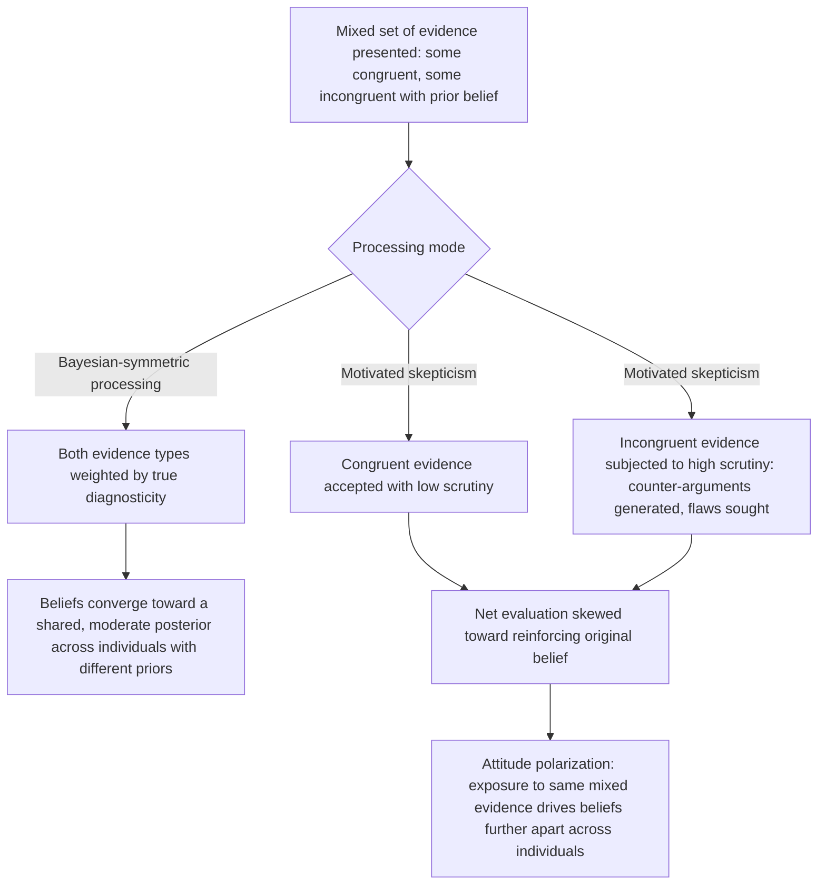

## Motivated Skepticism and Selective Scrutiny of Evidence

### Overview

Motivated skepticism describes the asymmetric application of critical scrutiny to evidence depending on whether that evidence supports or challenges a pre-existing, valued belief: attitude-congruent evidence is accepted with minimal critical evaluation, while attitude-incongruent evidence of equal or even superior quality is subjected to intense, often selectively-applied methodological scrutiny, generating reasons to dismiss, discount, or reinterpret it. This construct, formalized primarily by Ditto and Lopez (1992) and Taber and Lodge (2006), is best understood as a *specific mechanism* within the broader motivated-reasoning and confirmation-bias literature covered earlier in this chapter — it isolates and names the particular process by which the *standard of evidence itself* is what gets biased, rather than the search for evidence (biased search) or the weighting of an already-accepted piece of evidence (conservatism/confirmation). This distinction matters because motivated skepticism explains a pattern that pure confirmation bias does not fully capture on its own: why exposure to more, and sometimes objectively strong, counter-attitudinal evidence can leave a belief not just unchanged but *more* entrenched.

### Distinguishing Motivated Skepticism from Adjacent Constructs

| Construct | What Gets Biased |
| --- | --- |
| Confirmation bias (biased search) | Which evidence is sought out or exposed to in the first place |
| Conservatism / underreaction | How much an already-accepted piece of evidence shifts the posterior belief |
| Motivated skepticism (this topic) | The standard of scrutiny and rigor applied in *evaluating* a given piece of evidence, depending on its conclusion |
| Belief perseverance | Whether a belief survives after its original evidentiary basis is fully discredited |

**[Inference]** Motivated skepticism is, in a sense, the mirror image of confirmation bias's biased-interpretation component, but formalized with a specific mechanism: it is not merely that ambiguous evidence gets interpreted charitably or uncharitably depending on prior belief (which biased interpretation covers generally), but that the *rigor of the critical process itself* — how many counter-arguments are generated, how many methodological flaws are searched for, how much corroboration is demanded — is dialed up or down asymmetrically. This is a more specific, testable claim than generic "biased interpretation."

### Ditto and Lopez's Foundational Paradigm (1992)

Ditto and Lopez demonstrated the core asymmetry using a diagnostic-test paradigm: participants were told they had tested positive (undesirable) or negative (desirable) for a fictitious enzyme deficiency associated with later-life health problems, based on a saliva-based color-change test.

**Key findings**:

- Participants receiving the undesirable (positive/deficiency) result rated the test as *less accurate*, generated more alternative explanations for the result (e.g., recent food or drink consumption), and were more likely to request a retest, compared to participants receiving the desirable (negative) result — despite the test procedure being identical for both groups.
- Participants also spent *more time* scrutinizing and reviewing background scientific-sounding material when it supported an undesirable conclusion, consistent with heightened critical engagement specifically triggered by unwelcome information.

**[Confirmed]** This asymmetric-scrutiny pattern — more time spent, more alternative hypotheses generated, and lower rated validity specifically for undesirable results using an *identical* underlying test procedure — is the signature experimental evidence establishing motivated skepticism as a scrutiny-level, not merely an acceptance-level, phenomenon.

### Taber and Lodge's Political Extension (2006)

Building on Ditto and Lopez, Taber and Lodge applied the same asymmetric-scrutiny logic to politically charged reasoning, using politically engaged participants evaluating arguments on contested policy issues (gun control, affirmative action).

**Key findings, distinguishing several related sub-effects**:

1. **Disconfirmation bias**: Participants spent more time and generated more counter-arguments when evaluating attitude-incongruent arguments than attitude-congruent arguments of matched objective quality.
2. **Confirmation bias (in their specific operationalization)**: Participants sought out attitude-congruent sources preferentially when given a choice of which additional arguments to review — a biased-search component operating alongside the scrutiny asymmetry.
3. **Attitude polarization**: Critically, after being exposed to a *balanced, mixed* set of pro and con arguments (not a one-sided set), participants' attitudes became *more extreme* in their original direction, rather than converging toward a shared, moderate position — the outcome that normatively rational, symmetrically-processed exposure to mixed evidence should produce.

**[Confirmed]** The attitude-polarization finding is the most economically and socially consequential result in this specific line of research: it demonstrates that motivated skepticism does not merely *fail* to move beliefs toward a shared truth when confronted with balanced evidence — it can actively drive beliefs *further apart* across a population exposed to the identical evidentiary set, directly undermining a common intuition (and a common assumption in some economic models of information and learning) that shared, public information should generally produce belief convergence.

### Diagram: Motivated Skepticism vs. Symmetric Bayesian Updating Under Mixed Evidence

### Proposed Underlying Mechanisms

1. **Asymmetric evidentiary threshold (Ditto & Lopez's original account)**: People apply a lower threshold of evidence needed to accept a congenial conclusion and a higher threshold to accept an uncongenial one — analogous to a signal-detection framework in which the *decision criterion*, not the sensitivity to the underlying signal, shifts depending on the desirability of the conclusion.
2. **Directional goal versus accuracy goal (Kunda, 1990)**: Ziva Kunda's influential distinction between reasoning driven by a **directional goal** (reaching a particular, preferred conclusion) versus an **accuracy goal** (reaching the objectively best-supported conclusion) provides the broader motivational framing: motivated skepticism is what directional-goal-driven reasoning looks like specifically when applied to the evaluation of formal or empirical evidence, as opposed to autobiographical or social judgments.
3. **Identity-protective cognition (Kahan and colleagues)**: For politically or socially charged topics specifically, Dan Kahan's identity-protective cognition thesis proposes that individuals process evidence in a way that protects their standing within a valued social/political in-group, meaning the "motivation" driving skepticism is not necessarily individual self-esteem protection (as in Ditto & Lopez's health-diagnosis paradigm) but group-identity and social-belonging protection specifically. **[Inference]** This is a meaningful theoretical refinement for political-belief applications specifically, though the original Ditto-Lopez paradigm (health test results, no political or group-identity content) demonstrates that motivated skepticism does not *require* group-identity threat to operate — self-esteem-relevant personal information alone is sufficient to trigger the effect, suggesting political identity-protection is one important driver among others rather than the sole necessary condition.

### Applied and Empirical Evidence

1. **Political polarization on empirical/scientific issues**: Kahan, Peters, Dawson and Slovic's (2017) work on "motivated numeracy" extends this framework in a striking way: participants with *higher* quantitative/numeracy skill showed *greater*, not lesser, polarization when interpreting an identical numerical dataset framed as being about a politically charged topic (gun control) compared to a politically neutral topic (a skin-cream trial) — demonstrating that motivated skepticism is not simply a product of insufficient analytical capacity, and that greater cognitive skill can, in the presence of a directional motivation, be *redeployed* to more effectively rationalize a preferred conclusion rather than to reach a more accurate one. **[Confirmed]** This "motivated numeracy" finding is one of the more counter-intuitive and widely cited results in this specific literature, precisely because it runs against the common assumption that more analytical skill should reduce, not amplify, politically motivated bias.
2. **Climate science and scientific consensus perception**: Motivated skepticism has been extensively documented in the perception and evaluation of climate science evidence, with individuals' prior ideological commitments predicting differential scrutiny and acceptance of climate data and expert consensus claims, a topic with substantial applied relevance to science communication strategy design.
3. **Consumer and product-safety evaluation**: Evidence of a product defect or safety concern involving a brand a consumer is loyal to, or a product category the consumer has already invested in, has been examined as subject to similar asymmetric-scrutiny dynamics, connecting this topic to consumer behavior and product-recall response research. **[Unverified]** This specific consumer-behavior application is less extensively and rigorously documented in peer-reviewed behavioral economics compared to the political and health-diagnosis paradigms, and should be treated as a plausible extension of the mechanism rather than an equally well-established finding.
4. **Jury and legal decision-making**: Motivated skepticism has been proposed as a contributing mechanism to how jurors evaluate expert testimony and evidence differentially depending on which side's narrative the evidence supports, connecting to broader work on cognitive bias in legal fact-finding, though **[Unverified]** isolating motivated skepticism specifically from other juror-decision biases (e.g., attribution bias, anchoring on initial impressions) in actual courtroom or jury-simulation settings is methodologically difficult.

### Relationship to Other Biases in This Chapter

| Related Bias | Relationship |
| --- | --- |
| Confirmation Bias and Motivated Belief Updating | Motivated skepticism is a specific, well-characterized sub-mechanism of the broader biased-interpretation component of confirmation bias, distinguished by its focus specifically on asymmetric *scrutiny/evidentiary threshold* rather than search or memory. |
| Belief Persistence and Underreaction to News | Related but distinguishable: underreaction/conservatism is typically modeled as a roughly symmetric attenuation of updating regardless of evidence direction, whereas motivated skepticism is explicitly and necessarily asymmetric, applying only to attitude-incongruent evidence. |
| Attribution Bias | Both can compound: a person motivated to discredit an uncongenial finding might combine motivated skepticism (attacking the study's methodology) with self-serving or biased attribution (attributing the researchers' conclusions to their own political bias or incompetence). |
| The Law of Small Numbers | Motivated skepticism can interact with sample-size reasoning asymmetrically: a small, methodologically weak study supporting a preferred conclusion may be uncritically accepted (ignoring its small-sample limitations), while an equally small study reaching an uncongenial conclusion is criticized specifically for its small sample size — a documented pattern of *selectively applied* statistical criticism. |

### Critiques and Boundary Conditions

- **Distinguishing genuine, warranted skepticism from motivated skepticism**: Not all critical scrutiny of uncongenial evidence is biased; a study may have genuine methodological flaws, and identifying them is proper scientific practice. The bias-relevant claim is specifically about the *asymmetry* — that the same level of scrutiny is not applied to methodologically comparable congenial evidence — which requires a comparative experimental design (as in Ditto & Lopez and Taber & Lodge) to establish, rather than being inferable from any single instance of criticism.
- **Motivated numeracy replication and generalizability**: While the Kahan et al. motivated-numeracy finding is influential, **[Unverified]** the size and consistency of the effect across different politically charged topics, different populations, and different operationalizations of numeracy has been the subject of ongoing methodological discussion, and the specific claim that higher numeracy *straightforwardly amplifies* polarization (rather than, for instance, interacting with topic salience or partisan strength in more complex ways) should not be treated as a fully settled, universal finding.
- **Political-asymmetry debates**: A separate and more contested empirical and normative question in this literature concerns whether motivated skepticism operates symmetrically across the political spectrum or is more pronounced among some ideological groups than others; findings on this specific question have varied across studies and have themselves become a subject of politically charged academic and public debate, making this a case where researchers should be especially cautious about overstating confidence in any particular directional claim without close attention to the specific study design and population.
- **Overextension to any instance of disagreement**: As with confirmation bias generally, "motivated skepticism" risks being invoked as an unfalsifiable explanation for any case where someone rejects evidence the invoker finds persuasive; rigorous application of the construct requires the kind of matched-quality, comparative evidentiary design used in the foundational studies, not simply an assumption that disagreement implies bias.

### Measurement Approaches

- **Matched-quality argument/evidence comparison designs**: The Ditto-Lopez and Taber-Lodge paradigms, presenting participants with evidence or arguments of experimentally matched objective quality, varying only whether the conclusion is attitude-congruent or incongruent, and measuring differential scrutiny (time spent, counter-arguments generated, requested corroboration, rated validity).
- **Attitude-extremity pre/post measurement**: Measuring attitude position before and after exposure to a balanced, mixed evidentiary set, used specifically to detect the polarization signature that distinguishes motivated skepticism from simple non-updating.
- **Numeracy and analytical-skill interaction designs**: The Kahan et al. design, crossing topic (politically neutral vs. politically charged) with numerical skill level, used to test whether analytical capacity moderates (and specifically, amplifies) motivated-reasoning effects.
- **Physiological and reaction-time measures**: Some studies have supplemented self-report scrutiny measures with reaction-time and, in a smaller subset, neuroimaging measures of cognitive engagement when processing congenial versus uncongenial evidence, though **[Unverified]** this physiological sub-literature is less extensive and standardized than the core behavioral paradigms.

### Practical Implications for Choice Architecture and Institutional Design

- Science communication and public-health messaging strategies increasingly account for motivated-skepticism dynamics by avoiding framings that trigger identity-protective processing (e.g., decoupling factual content from politically polarized messengers or framing), rather than assuming that simply presenting more or better-quality evidence will reliably shift belief, given the demonstrated risk of backfire/polarization effects.
- Given the motivated-numeracy finding, educational and communication interventions aimed at improving public engagement with data should not assume that improving quantitative literacy alone will reduce politically motivated misinterpretation of that data; complementary interventions targeting the directional motivation itself (e.g., self-affirmation techniques shown in some studies to reduce identity-protective processing) may be necessary alongside numeracy improvements.
- Organizational and scientific-review processes (peer review, red-teaming, structured analytic techniques in intelligence analysis) that build in explicitly *symmetric* scrutiny requirements — requiring the same level of methodological challenge applied to a novel or unwelcome finding be applied to a comfortable or expected one — are a direct institutional countermeasure to the asymmetric-scrutiny mechanism this topic describes.

**Next Steps**

- Confirmation Bias and Motivated Belief Updating
- Kunda's Directional Goals vs. Accuracy Goals Framework
- Identity-Protective Cognition (Kahan) and Political Polarization
- Motivated Numeracy and Analytical Skill as a Polarization Amplifier
- Belief Persistence and Underreaction to News
- Attribution Bias
- Science Communication Strategy and the Backfire Effect
- Structured Analytic Techniques in Intelligence and Organizational Decision-Making