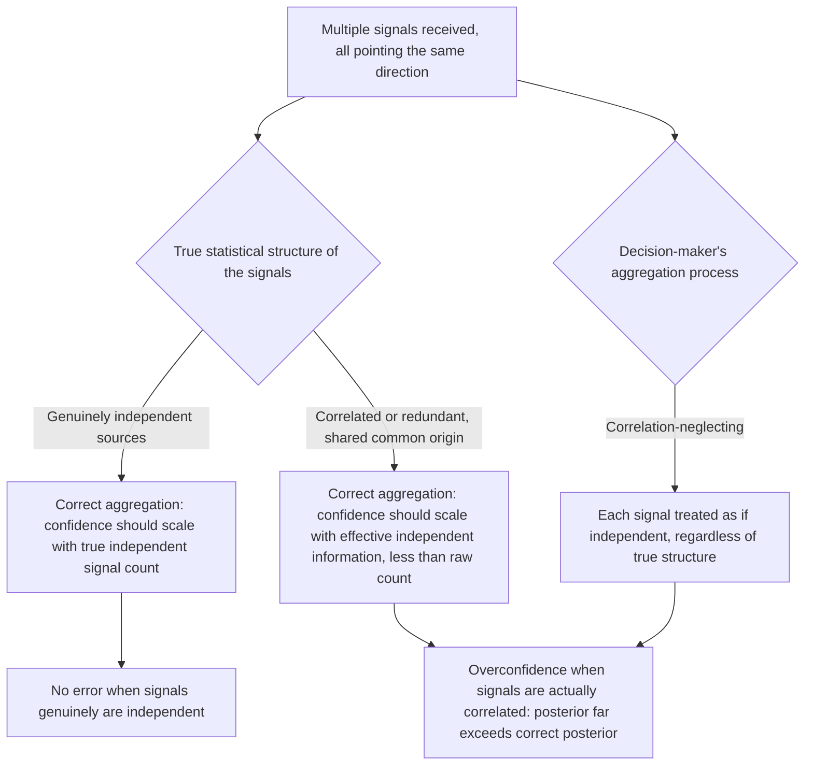

## Correlation Neglect and Redundant Information

### Overview

Correlation neglect describes the systematic failure to account for statistical dependence between multiple signals or sources of information when aggregating them into an overall belief, leading decision-makers to treat correlated (non-independent) signals as though they were independent. The direct behavioral consequence is **redundancy overweighting**: when several correlated sources point in the same direction, this is treated as though it constitutes several genuinely independent pieces of confirming evidence, producing overconfidence that scales with the *number* of sources consulted rather than with their true, correlation-adjusted informational content. This topic formalizes a distinct statistical error within the broader "beliefs and biased information processing" chapter — while confirmation bias and motivated skepticism concern *directional* distortion in evidence weighting, correlation neglect is a *structural/statistical* error that can occur even absent any directional motivation, though it very often interacts with and amplifies the other biases in this chapter. The primary formal economic treatment is Enke and Zimmermann (2019, "Correlation Neglect in Belief Formation"), building on earlier work by DeMarzo, Vayanos and Zwiebel (2003) on social-network-based information aggregation.

### The Normative Benchmark: Correct Aggregation of Correlated Signals

For a decision-maker aggregating $n$ signals $s_1, \ldots, s_n$ about an unknown state, the correctly Bayesian-aggregated posterior depends critically on the **joint** likelihood $P(s_1, \ldots, s_n \mid H)$, not simply the product of individual marginal likelihoods.

If signals are truly independent conditional on the state $H$:

$$P(s_1, \ldots, s_n \mid H) = \prod_{i=1}^{n} P(s_i \mid H)$$

and treating them as independent (multiplying individual likelihood ratios) is correct. But if signals share a **common underlying source** — e.g., several news outlets reporting on the same original wire story, several analysts using the same underlying dataset, several friends who all heard the same rumor from one original source — the signals are **not** conditionally independent, and naively multiplying their individual likelihood ratios as though they were produces a posterior that is systematically overconfident, in a way that grows worse the more (correlated) signals are added.

**Formal illustration**: Suppose two signals are perfectly correlated (they are, in fact, the exact same underlying piece of information relayed twice) but a decision-maker treats them as two independent signals, each with likelihood ratio $LR$. The naive, incorrect posterior odds update would be:

$$\text{Posterior odds (naive)} = LR^2 \times \text{Prior odds}$$

when the correct update, recognizing the redundancy, should be:

$$\text{Posterior odds (correct)} = LR^1 \times \text{Prior odds}$$

**[Confirmed]** This is a clean, formally demonstrable overconfidence result: the naive aggregator's implied confidence grows with the *count* of signals received, even when the true informational content has not increased at all beyond the single original source — a mechanically different mechanism from either the law of small numbers (misjudging the reliability of a small sample) or conservatism (underweighting a single signal's diagnosticity).

### Enke and Zimmermann's Experimental Demonstration (2019)

Enke and Zimmermann designed controlled experiments in which participants received multiple signals about an unknown state, with the experimenters directly manipulating the true statistical correlation structure between the signals (fully independent, partially correlated, or fully redundant/duplicated).

**Key findings**:

- Participants' belief updating was largely insensitive to the manipulated correlation structure: beliefs after receiving several highly correlated (or even outright duplicated) signals were nearly as confident as beliefs after receiving the same number of genuinely independent signals.
- This held even when the correlation structure was made explicit and transparent to participants (e.g., clearly informing them that two signals came from the same original source) — indicating the neglect is not purely an inference problem about *unknown* correlation, but persists even with full information about the dependence structure, a "wants to fix but doesn't fully know how to reweight" failure of correlation-adjusted aggregation, distinct from information avoidance or motivated distortion.
- The magnitude of overconfidence induced by correlation neglect scaled systematically with the degree of true redundancy in the signal set, consistent with the formal $LR^n$-versus-$LR^1$ mechanism illustrated above.

**[Inference]** The finding that correlation neglect persists even under full transparency about the dependence structure is the paper's most theoretically important contribution: it suggests the failure is not primarily an *information* problem (not knowing the signals are correlated) but a *computational/procedural* one (not knowing how, or not bothering, to correctly discount for known correlation when aggregating), which has different debiasing implications than an information-based account would.

### Diagram: Correlation Neglect Mechanism

### Related Prior Work: Social Network Information Aggregation

DeMarzo, Vayanos and Zwiebel's (2003) earlier theoretical model, "Persuasion Bias, Social Influence, and Unidimensional Opinions," examines a closely related dynamic in the specific context of social networks and repeated communication: if agents naively update their beliefs by simply averaging the opinions of their network neighbors without accounting for how much those neighbors' opinions already reflect previously shared, common information circulating through the network, well-connected or centrally-located agents' opinions can become **overweighted** in the aggregate social consensus — not because their information is more accurate, but purely because their view (or information correlated with it) has been repeated and echoed through the network more often.

**[Inference]** This model provides a formal social/network-level mechanism for correlation neglect: even a single original informative signal, if it propagates through and is repeated across many nodes of a communication network, can produce an emergent, aggregate social consensus that appears far more strongly evidenced than the true, singular informational origin actually warrants — a phenomenon closely related to, but formally distinct from, the individual-level correlation-neglect experiments of Enke and Zimmermann, since it concerns aggregation *across people in a network* rather than aggregation of multiple signals *by a single individual*.

### Applied and Empirical Evidence

1. **Media echo chambers and repeated-story amplification**: When multiple news outlets report on the same original story or wire-service report, audiences who encounter the story across several outlets have been documented to develop inflated confidence in the story's veracity or importance relative to audiences who encountered it via a single outlet — a real-world instantiation of the DeMarzo-Vayanos-Zwiebel mechanism, closely related to (though conceptually distinct from) the "illusory truth effect" in cognitive psychology (mere repeated exposure increasing perceived truthfulness, independent of any correlation-structure reasoning at all).
2. **Financial analyst forecasts and herding**: Multiple sell-side equity analysts covering the same stock frequently draw on substantially overlapping underlying data (the same earnings call, the same industry reports, the same macroeconomic releases), yet investors aggregating multiple analysts' price targets or ratings have been examined for the degree to which they appropriately discount for this shared-information redundancy versus treating each analyst's rating as an independent, additive vote of confidence. **[Unverified]** Direct experimental isolation of correlation neglect specifically (versus other explanations for analyst-forecast clustering, such as genuine agreement due to shared correct interpretation of public information, or reputational herding incentives among analysts themselves) is methodologically challenging in field settings, and this application should be understood as a plausible extension of the mechanism rather than as tightly experimentally confirmed as the core lab paradigm.
3. **Expert committee and jury deliberation**: Groups relying on multiple experts or witnesses whose views or testimony derive from a shared, common underlying dataset or investigative source (rather than genuinely independent lines of evidence) risk correlation-neglect-driven overconfidence in the resulting collective judgment — a concern with direct relevance to forensic science practice (e.g., multiple forensic examiners reviewing the same underlying evidence, whose agreement may reflect shared method biases rather than independent corroboration) and to the design of expert-panel and peer-review processes more broadly.
4. **Diversification and portfolio risk assessment**: A closely related economically consequential manifestation is investors' or risk managers' failure to fully account for correlation between asset returns when assessing portfolio diversification, leading to underestimation of true portfolio risk (a distinct but structurally analogous failure: neglecting the correlation structure among assets, rather than among information signals, though the same core statistical error — treating correlated things as though they behaved independently — underlies both). **[Inference]** This portfolio-risk application is more typically discussed within standard financial risk-management and diversification literature than within the belief-formation/correlation-neglect literature specifically, but the underlying statistical mechanism (failure to discount for known positive correlation) is directly analogous, and the connection is worth making explicit for a comprehensive treatment of this general class of error.

### Relationship to Other Biases in This Chapter

| Related Bias | Relationship |
| --- | --- |
| The Law of Small Numbers | Distinct statistical error: the law of small numbers concerns misjudging the reliability of a small *independent* sample; correlation neglect concerns misjudging the effective independence of multiple signals that are, in fact, dependent. Both produce overconfidence, but via different statistical mechanisms. |
| Confirmation Bias and Motivated Belief Updating | Can compound directly: a person motivated to hold a particular belief may selectively seek out multiple sources that, unbeknownst to them (or conveniently ignored by them), all derive from the same original correlated source, combining biased search with correlation neglect to produce especially severe overconfidence. |
| Motivated Skepticism | Distinguishable in mechanism but can interact: motivated skepticism could, in principle, be selectively applied to *discount* correlation only when it is inconvenient (e.g., dismissing multiple corroborating sources as "all just repeating the same flawed original story" specifically when the conclusion is uncongenial), which would itself be a form of asymmetric, motivated correlation-accounting rather than the more general, non-directional correlation neglect this topic primarily describes. |
| Belief Persistence and Underreaction to News | Distinct and, in a sense, opposite in valence: underreaction/conservatism describes underweighting new evidence, while correlation neglect describes overweighting the redundant repetition of already-seen evidence; the two are not mutually exclusive within a single person's overall belief-updating process across different evidence structures. |

### Critiques and Boundary Conditions

- **Distinguishing correlation neglect from genuine rational updating on shared-source but still partially informative signals**: Signals sharing a common origin are not necessarily perfectly redundant — a second report on the same story might add genuinely new corroborating detail or independent verification of the original claim. The normative benchmark requires correctly estimating the *degree* of correlation, not naively treating all shared-origin signals as either fully independent or fully redundant; real-world application of this topic requires case-specific judgment about the actual correlation structure, which is itself often uncertain.
- **Computational demandingness of correct correlation-adjustment**: Even a decision-maker motivated to correctly adjust for known correlation faces a genuinely difficult computational task in many real-world settings (the true correlation structure among many real-world information sources is rarely precisely known), meaning some degree of "neglect" may reflect a reasonable, boundedly-rational simplification under genuine uncertainty about the correlation structure, rather than a pure processing failure under perfect information — though Enke and Zimmermann's finding that neglect persists even under experimentally *disclosed*, known correlation structures indicates the bias is not purely attributable to this computational-difficulty defense.
- **Overlap with, but distinctness from, the illusory truth effect**: The illusory truth effect (repeated exposure to a claim increases its perceived truthfulness, a memory-fluency-based mechanism) can produce similar-looking overconfidence from repeated correlated exposure, but operates through a different proposed cognitive mechanism (processing fluency) than the explicit belief-aggregation failure that Enke and Zimmermann's correlation-neglect framework describes; both may contribute to real-world media-repetition effects simultaneously, and disentangling their relative contributions in field settings is difficult.

### Measurement Approaches

- **Controlled signal-correlation-manipulation experiments**: The Enke-Zimmermann design, directly manipulating and disclosing the true statistical correlation structure among multiple signals presented to participants, and comparing elicited posterior beliefs to the correlation-adjusted Bayesian benchmark — the primary and most rigorous design for isolating this specific bias.
- **Network-structure belief-propagation studies**: Experimental or simulated social-network designs (building on DeMarzo-Vayanos-Zwiebel) tracking how an initial informative signal's apparent evidentiary weight changes as it propagates and is repeated across a communication network with varying connectivity structures.
- **Field data on analyst forecast dispersion and shared-information sources**: Examining the relationship between the number of analysts covering a stock, the correlation of their underlying information sources, and the market's aggregate confidence (as reflected in trading volume or price reaction) in the resulting consensus forecast.
- **Portfolio risk-assessment surveys and behavior**: Measuring investors' or risk managers' stated versus statistically correct assessment of portfolio diversification benefit given disclosed asset-return correlation data, as a closely related applied measurement approach in the asset-allocation domain.

### Practical Implications for Choice Architecture and Institutional Design

- Institutional decision processes that aggregate multiple expert opinions, analyst forecasts, or witness accounts should explicitly document and disclose the degree of shared underlying data or methodology across sources, and ideally weight the aggregate judgment by an explicit correlation-adjustment procedure, rather than presenting or treating a simple headcount of concurring sources as equivalent to that same headcount of genuinely independent corroboration.
- Media literacy and science communication efforts can incorporate explicit correlation-neglect-awareness training, given Enke and Zimmermann's finding that even disclosed correlation structure is often insufficiently discounted — suggesting that simply *labeling* sources as derivative of a single original report may be a necessary but insufficient debiasing step, and more structural changes (e.g., limiting or flagging how many "independent" outlets are, in fact, echoing one wire report) may be needed.
- Financial risk-management and portfolio-construction frameworks that explicitly model and stress-test asset-return correlation (rather than relying on naive diversification-by-count heuristics) directly counteract the portfolio-risk-assessment manifestation of this same underlying statistical error.

**Next Steps**

- Enke and Zimmermann's Formal Model of Correlation Neglect
- DeMarzo-Vayanos-Zwiebel Model of Social Network Belief Aggregation
- The Illusory Truth Effect and Repetition-Based Persuasion
- The Law of Small Numbers and Sample Size Neglect
- Analyst Herding and Forecast Clustering in Financial Markets
- Portfolio Diversification and Correlation Risk in Asset Allocation
- Confirmation Bias and Motivated Belief Updating
- Structured Analytic Techniques for Correlated-Evidence Aggregation