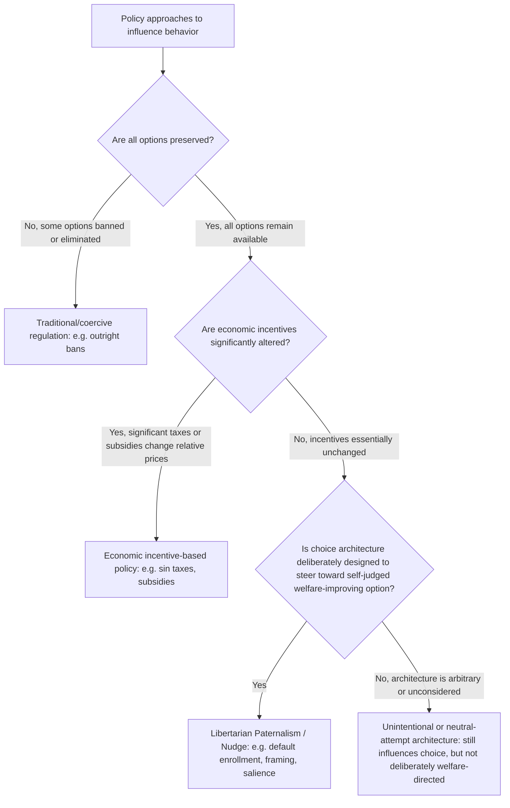

## Libertarian Paternalism

### Overview

Libertarian paternalism is the normative and design framework, developed primarily by Richard Thaler and Cass Sunstein (2003, 2008), that argues choice architects can and should design decision environments to steer people toward choices that improve their own welfare, while preserving each individual's freedom to choose otherwise. The term deliberately combines two words often treated as opposites: "libertarian" (preserving freedom of choice, no options are eliminated or made meaningfully more costly to select) and "paternalism" (designers deliberately steering people toward outcomes judged to be in their own interest). This framework provides the foundational normative justification for the broader nudge literature and underlies most applied choice-architecture interventions across public policy, employee benefits design, health, and consumer protection.

### Core Definitional Claims

Thaler and Sunstein define a **nudge** as any aspect of choice architecture that alters people's behavior in a predictable way without forbidding any options or significantly changing their economic incentives — meaning a true nudge must be:

1. **Choice-preserving**: All original options remain available; no option is banned, and none is made substantially more expensive or effortful to choose than the paternalistic default would suggest.
2. **Low-cost to avoid**: The person can opt out or choose differently with minimal effort — Thaler and Sunstein's benchmark phrase is that a nudge should be as easy to reject as it is to accept.
3. **Directed at improving decision-maker welfare, as judged by themselves**: Unlike traditional paternalism (which may impose an external, third-party conception of what is good for someone), libertarian paternalism explicitly aims for outcomes the person would choose *for themselves* if they had full information, unlimited cognitive resources, and complete self-control — an important, and contested, normative anchor discussed further below.

**The premise this rests on**: Given the extensive documentation elsewhere in behavioral economics of systematic, predictable deviations from this "fully rational" benchmark (present bias, status-quo bias, limited attention, framing effects), some form of choice architecture is *unavoidable* — there is no neutral, architecture-free way to present choices (a default must be set somehow; a menu must be ordered somehow). Given this unavoidability, Thaler and Sunstein argue, the relevant normative question is not *whether* to influence choice architecture at all, but how to design the choice environment thoughtfully, given that it will inevitably have some structuring effect.

### The "Unavoidability of Choice Architecture" Argument

This is the most philosophically load-bearing move in the theory and merits explicit treatment. Consider a cafeteria manager deciding how to arrange food options. Whatever arrangement is chosen — placing healthy food at eye level, placing dessert first, or any other arrangement — will have some predictable effect on what people select, given well-documented effects of visual salience and ordering on choice. There is no "neutral" arrangement that has zero influence.

**[Confirmed]** This unavoidability argument is central to the libertarian-paternalism defense against critiques that any deliberate steering is objectionably manipulative: if influence is unavoidable regardless of what the architect does, the argument goes, the relevant ethical question shifts from "should we influence choice?" (not really an option) to "in which direction, and by what means, should the unavoidable influence be exercised?" — and Thaler and Sunstein's answer is: in the direction that improves the chooser's own welfare by their own criteria, using means (defaults, framing, salience) rather than mandates or price changes.

### Diagram: Libertarian Paternalism Positioning Relative to Other Policy Approaches

### Foundational Applied Example: Retirement Savings Defaults

The single most cited and empirically robust real-world application is automatic enrollment in employer-sponsored retirement savings plans (e.g., 401(k) plans in the United States).

**The empirical pattern**: Under an **opt-in** default (employees must actively enroll to participate), retirement-plan participation rates are typically substantially lower than under an **opt-out** default (employees are automatically enrolled unless they actively choose to leave), even though the economically available options and financial terms are held completely identical between the two regimes — only the default has changed. Madrian and Shea's (2001) foundational study documented dramatic increases in 401(k) participation following a switch to automatic enrollment at one firm, a finding widely replicated in subsequent research across many employer contexts.

**[Confirmed]** This default-effect finding is one of the most robustly replicated results in applied behavioral economics and is the empirical bedrock example most consistently invoked to justify the practical relevance of libertarian paternalism as a policy tool, precisely because it demonstrates a large, welfare-relevant behavior change achieved purely through architecture (the default), with the underlying menu of choices and their financial terms completely unchanged.

### Distinguishing Libertarian Paternalism from Adjacent Concepts

| Concept | Key Distinguishing Feature |
| --- | --- |
| Libertarian Paternalism (Thaler & Sunstein) | Preserves all options; steers via choice architecture (defaults, framing, salience), not incentives or mandates |
| Asymmetric Paternalism (Camerer, Issacharoff, Loewenstein, O'Donoghue & Rabin, 2003) | A closely related, earlier-published, largely overlapping framework emphasizing policies that help boundedly-rational individuals while imposing minimal or no cost on fully rational individuals — the key distinguishing emphasis is the *asymmetric cost* across rational and boundedly-rational populations, rather than choice-preservation per se, though in practice many asymmetric-paternalist policies are also nudges |
| Traditional/Hard Paternalism | May restrict options, ban choices, or impose significant costs on choosing the disfavored option, based on an externally-imposed judgment of the person's welfare |
| Economic Incentive Policy (taxes, subsidies) | Preserves all options but deliberately and significantly changes relative prices, unlike a nudge, which by definition should not substantially alter economic incentives |
| Mandates | Requires a specific choice, eliminating the option to choose otherwise entirely |

**[Inference]** The Camerer-Issacharoff-Loewenstein-O'Donoghue-Rabin asymmetric-paternalism framework is worth distinguishing carefully because it is sometimes conflated with libertarian paternalism in secondary literature, but its normative justification (minimizing cost to the fully rational) is subtly different from libertarian paternalism's justification (preserving freedom to choose while steering toward self-judged welfare) — the two frameworks often recommend similar or identical real-world policies, but for distinguishable underlying normative reasons, and careful technical treatment should not present them as strictly synonymous.

### Applied Domains

**Retirement and Savings Policy**

- Automatic enrollment (as above) and **automatic escalation** (Thaler & Benartzi's 2004 "Save More Tomorrow" program, in which employees pre-commit to having future salary raises automatically diverted to increased retirement contributions) are the flagship applications, with Save More Tomorrow specifically designed to also address present bias and loss aversion by timing the contribution increase to coincide with a raise (avoiding the felt loss of a nominal paycheck reduction).

**Organ Donation Policy**

- Default rules for organ donor registration (opt-in vs. opt-out/presumed-consent systems) are a widely cited cross-country natural experiment in default effects, with several European countries using presumed-consent systems showing substantially higher registered-donor rates than comparable opt-in systems. **[Unverified]** The relationship between registration defaults and actual organ donation *rates* (as opposed to registration rates) is more complex and mediated by family-consent practices and healthcare-system factors that vary by country, so the often-cited claim that switching a country's default would straightforwardly and proportionally increase actual transplantation rates is a more contested empirical claim than the more narrowly well-established registration-rate default effect itself.

**Public Health and Food Policy**

- Cafeteria and food-service redesign (placement, ordering, and visual salience of healthier options) has been implemented in schools, workplaces, and public institutions as a nudge-based public-health intervention, building directly on the cafeteria thought experiment used to motivate the unavoidability-of-architecture argument.

**Government "Nudge Units"**

- The UK's Behavioural Insights Team (established 2010, sometimes informally called the "Nudge Unit") and subsequent similar units in the US (the Social and Behavioral Sciences Team) and other governments represent direct institutional implementation of libertarian-paternalist principles into public policy design, applying randomized-controlled-trial methodology to test choice-architecture interventions (e.g., simplified, personalized tax-reminder letters; default options in public benefit enrollment) before wider rollout.

**Consumer Financial Protection**

- Simplified, standardized disclosure formats (e.g., simplified credit card terms, standardized loan comparison summaries) are designed as libertarian-paternalist interventions intended to make the financially advantageous choice more salient and comparable without restricting which financial products remain available for purchase.

### Critiques and Philosophical Objections

**The manipulation objection**

Critics (e.g., Hausman & Welch, 2010; various philosophical commentators) argue that many nudges work precisely *by exploiting* the same cognitive biases and heuristics documented elsewhere in behavioral economics (default inertia, framing effects, present bias) rather than by engaging a person's deliberative rational agency — and that influencing behavior through channels that bypass conscious deliberation is a form of manipulation, regardless of whether formal choice is technically preserved. This is sometimes summarized as the claim that "the freedom to choose otherwise" is not, by itself, sufficient to render an influence technique non-manipulative or fully respectful of autonomy, if the influence mechanism specifically operates by exploiting a known cognitive shortcoming rather than by providing better reasons or information.

**The "who decides what's good for you" objection**

A more classically anti-paternalist critique questions the epistemic authority of the choice architect (whether a government agency, employer, or firm) to determine what outcome the person would "really" want absent bias — since this determination requires the architect to have (or claim to have) a more accurate model of the person's own true, considered preferences than the person's own revealed choices provide, which critics argue risks smuggling in the architect's own values or a paternalistic elite's preferences under the guise of neutral welfare-improvement. **[Inference]** Thaler and Sunstein's response — that the counterfactual to designed architecture is not a bias-free "neutral" architecture but simply a different, potentially worse, unconsidered architecture — mitigates but does not, in the view of these critics, fully resolve this objection, since it does not establish that the specific architect's chosen direction of nudging is correct, only that some direction must be chosen.

**The slippery-slope / scope-creep concern**

Some critics worry that accepting libertarian paternalism as a legitimate category opens space for progressively more intrusive interventions to be justified under the same "still technically preserves choice" framing, gradually eroding meaningful freedom of choice in practice even while formally preserving it — sometimes discussed under the broader label of "nudge creep" or "sludge" (see the related concept of sludge below).

**The "sludge" critique (Thaler's own later refinement, 2018)**

In a notable self-critique, Thaler himself introduced the term **"sludge"** to describe choice-architecture friction that works in the *opposite* direction of a beneficial nudge — deliberately introducing needless friction, complexity, or delay to discourage a choice that would benefit the chooser but harm the choice architect's interests (e.g., deliberately complicated cancellation processes for subscription services, excessive paperwork requirements for benefit claims). **[Confirmed]** This is an important and directly relevant refinement: it demonstrates that the same choice-architecture toolkit justified under libertarian paternalism for pro-social ends can be, and empirically has been, redeployed for self-interested or anti-social ends by architects whose interests diverge from the chooser's, meaning the normative case for libertarian paternalism depends critically on the architect's actual motives and incentives, not merely on the formal preservation of choice.

### Empirical Evidence on Effectiveness and Limits

- Default effects (retirement savings, organ donation registration) remain among the most robust and largest-effect-size findings in the applied nudge literature.
- A large-scale replication and meta-analytic effort (DellaVigna & Linos, 2022, examining a substantial body of nudge interventions run by government Nudge Units specifically) found that average effect sizes for nudges implemented and evaluated by government behavioral-science units were considerably smaller than the effect sizes reported in the original, foundational academic nudge studies that motivated the units' creation — a meaningful publication-bias-adjusted or "real-world implementation" caveat on the generalizability of headline nudge results. **[Unverified]** This finding does not invalidate the existence or usefulness of nudge effects, but it is an important corrective to overly optimistic extrapolation from the most famous original studies (often conducted under particularly favorable or novel conditions) to average real-world nudge-unit performance, and should be incorporated into any comprehensive, current treatment of nudge effectiveness rather than relying solely on the original foundational studies' effect sizes.

### Practical Implications for Choice Architecture Design

- Given the "sludge" critique, any organization or policymaker implementing libertarian-paternalist interventions should audit its own choice architecture for asymmetric friction — ensuring that opting out of a beneficial default is made no harder than opting in would be, and that friction is not being selectively applied to discourage choices that benefit the chooser at the architect's expense.
- Given the DellaVigna-Linos effect-size moderation finding, policymakers and organizations should treat foundational nudge studies as suggestive of a general mechanism and plausible direction of effect, while empirically testing (via randomized evaluation, where feasible) the actual magnitude of a given nudge's effect in their own specific implementation context, rather than assuming the original studies' effect sizes will transfer directly.
- Transparency about the existence and purpose of a nudge (sometimes discussed as the difference between "System 1" nudges operating below conscious awareness and more transparent "educative" nudges) is an active design and ethical consideration; some evidence suggests transparently disclosed defaults can still retain much of their behavioral effect while addressing some of the manipulation objection, though **[Unverified]** the generalizability of this specific transparency-preserves-effectiveness finding across different nudge types and contexts is not fully established.

**Next Steps**

- Default Effects and Status-Quo Bias
- Save More Tomorrow (Thaler and Benartzi) and Precommitment in Savings Behavior
- Asymmetric Paternalism (Camerer, Issacharoff, Loewenstein, O'Donoghue and Rabin)
- Sludge: Adversarial Choice Architecture
- The Manipulation Objection to Nudging (Hausman and Welch)
- Government Behavioral Insights Units and Nudge Effect-Size Replication
- Present Bias and Hyperbolic Discounting
- Framing Effects and Salience in Choice Architecture