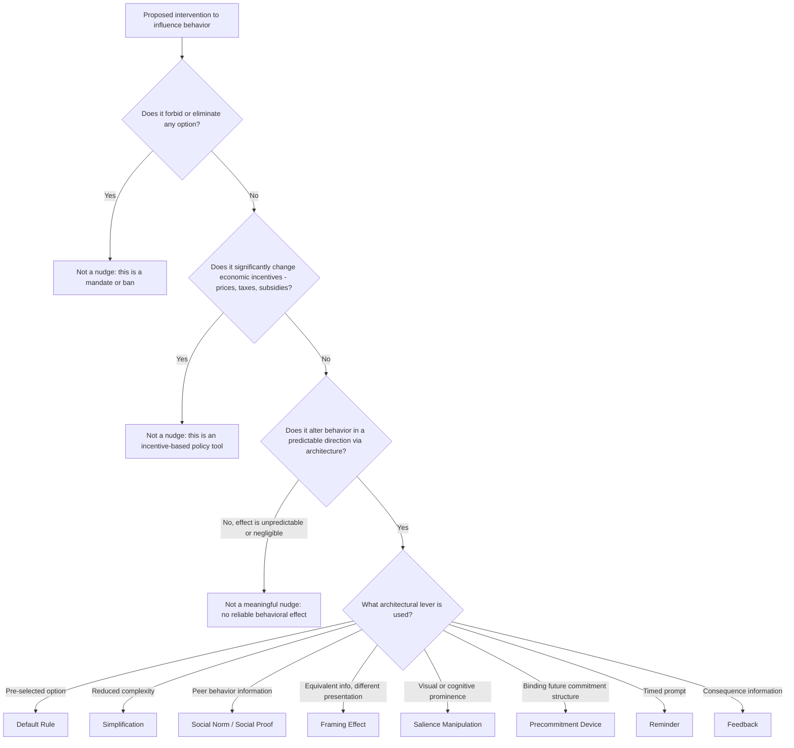

## The Concept of a Nudge

### Overview

A nudge, as formally defined by Richard Thaler and Cass Sunstein in *Nudge: Improving Decisions About Health, Wealth, and Happiness* (2008), is any aspect of the architecture of choice that alters people's behavior in a predictable way without forbidding any options or significantly changing their economic incentives. This topic treats the nudge concept itself as the foundational analytical unit of the choice-architecture literature — its precise definitional boundaries, its formal taxonomy, and the criteria that distinguish a genuine nudge from adjacent but distinct policy tools. Where the previous topic (Libertarian Paternalism) addressed the *normative justification* for using nudges, this topic addresses the *definitional and technical* question of what, precisely, counts as a nudge, how nudges are classified, and what conditions must hold for an intervention to qualify as one.

### The Formal Definition, Parsed

Thaler and Sunstein's definition contains three necessary conditions, each of which does independent definitional work and excludes a distinct category of non-nudge interventions:

1. **"Alters behavior in a predictable way"**: The intervention must have a systematic, reasonably foreseeable directional effect on choice — this excludes interventions whose effects are essentially random or unpredictable from the definition of a nudge, and implicitly requires that the behavioral mechanism being exploited (a documented bias or heuristic) is well enough understood to make the direction of effect predictable in advance.
2. **"Without forbidding any options"**: This excludes bans, mandates, and any regulatory tool that removes a choice from the available menu. A genuine nudge must leave the full original choice set intact.
3. **"Without significantly changing economic incentives"**: This excludes taxes, subsidies, fines, and other price-based interventions. A nudge must operate through the *architecture* of the choice (how options are presented, ordered, defaulted, or framed), not through their *relative cost*.

**[Confirmed]** The exclusion of significant incentive changes is the condition most often overlooked or blurred in casual, non-technical usage of the term "nudge" — a modest tax or subsidy is, by Thaler and Sunstein's own definition, not a nudge, even though it is sometimes loosely described as one in popular discourse. Precise technical usage should reserve the term specifically for architecture-based, not price-based, interventions.

### The "Unavoidability" Precondition

As established under Libertarian Paternalism, the nudge concept rests on the premise that some choice architecture is unavoidable — a designer must choose *some* default, *some* ordering, *some* framing — and given this unavoidability, the concept of a nudge names the deliberate, welfare-directed exercise of that unavoidable design choice. **[Inference]** This precondition matters for the definitional boundary of the concept itself: an architectural feature that has a predictable behavioral effect but was not deliberately designed with a welfare-improving direction in mind (e.g., an arbitrary, historically accidental default) is sometimes discussed in the literature as a "nudge" in a loose, descriptive sense (it has nudge-like effects) even though it lacks the deliberate, welfare-directed intent that Thaler and Sunstein's normative framework builds into the term's fuller meaning — this is a genuine ambiguity in how strictly "nudge" is used across the literature, between a purely descriptive/mechanistic sense and a normatively loaded sense.

### Taxonomy of Nudge Types

The applied nudge literature has converged on several recurring categories of intervention, often summarized using mnemonic frameworks (e.g., Sunstein's own "ten types of nudges," or the UK Behavioural Insights Team's "EAST" framework — Easy, Attractive, Social, Timely). A more analytically-organized taxonomy:

**1. Default Rules**

Setting a pre-selected option that takes effect unless the person actively opts out (or, less commonly, opts in). This is the most extensively studied and largest-effect-size category, exploiting status-quo bias and the effort cost of active choice. Example: automatic enrollment in retirement savings plans.

**2. Simplification and Framework Structuring**

Reducing complexity in the choice environment itself — simplifying forms, reducing the number of steps required to complete a beneficial action, or restructuring a decision into more digestible sub-choices. Example: simplified financial aid application forms shown to increase college enrollment among eligible students.

**3. Use of Social Norms and Social Proof**

Providing information about what other people (particularly relevant peer or reference groups) typically do, exploiting the well-documented tendency for behavior to conform toward perceived social norms. Example: energy-usage reports comparing a household's consumption to that of similar neighboring households (the OPOWER-style home energy report, studied extensively by Allcott, 2011), which has produced measurable, if modest, reductions in energy consumption.

**4. Framing and Presentation Effects**

Presenting logically equivalent information in different ways to leverage documented framing effects (loss-framing vs. gain-framing, as established in Prospect Theory) without altering the substantive content or options available.

**5. Increasing Salience and Attention**

Making a particular option, piece of information, or consequence more visually or cognitively prominent, exploiting limited and selective attention — e.g., placing healthier food options at eye level or near the start of a cafeteria line, or highlighting a specific plan feature in an enrollment interface.

**6. Precommitment Devices**

Structuring a choice architecture to allow (or default) people into binding or semi-binding commitments to their own future behavior, addressing self-control problems from present bias — e.g., Thaler and Benartzi's "Save More Tomorrow" program (discussed under Libertarian Paternalism), which allows employees to pre-commit future salary increases to retirement savings.

**7. Reminders and Timely Prompts**

Delivering information or prompts at a psychologically and practically optimal moment relative to the decision or action required, exploiting limited attention and present bias around effortful tasks — e.g., text-message reminders for medication adherence or bill payment.

**8. Feedback**

Providing timely, clear information about the consequences of past behavior to inform future choices — e.g., real-time feedback on energy or water usage, or spending-category breakdowns in banking apps.

### Diagram: Nudge Classification Decision Tree

### Distinguishing Nudges from Adjacent Concepts

| Concept | Key Distinguishing Feature from a Nudge |
| --- | --- |
| Mandate | Eliminates the option to choose otherwise; a nudge preserves all options |
| Sin tax / subsidy | Significantly changes relative price/incentive; a nudge does not |
| Education / information provision | A pure information campaign that provides new substantive facts is sometimes distinguished from a nudge specifically because it works by expanding what the person *knows*, engaging deliberative reasoning, rather than by restructuring the architecture around an unchanged information set — though the boundary here is genuinely contested (see the "System 1 vs. System 2" nudge distinction below) |
| Sludge (Thaler, 2018) | Uses the identical architectural toolkit (friction, defaults, complexity) but in the *opposite* welfare direction — deliberately discouraging a choice that would benefit the chooser, typically to benefit the architect instead |
| Boost (Grüne-Yanoff & Hertwig, 2016) | An alternative choice-architecture philosophy (discussed further below) that aims to improve people's own decision-making competencies (e.g., statistical literacy, risk-comprehension skills) rather than to structure the immediate choice environment to produce a specific outcome |

### The "Type 1 / Type 2" or "System 1 / System 2" Nudge Distinction

A meaningful internal taxonomic debate within the nudge literature itself distinguishes:

- **Type 1 (automatic-system) nudges**: Interventions that work primarily by engaging fast, automatic, largely non-deliberative processing (defaults exploiting inertia, salience effects exploiting attention capture, framing effects exploiting non-deliberative loss/gain evaluation) — these are the nudges most associated with, and most vulnerable to, the manipulation objection discussed under Libertarian Paternalism, since they are specifically designed to influence behavior without requiring, or sometimes even without the person consciously noticing, deliberative engagement.
- **Type 2 (reflective-system) nudges**: Interventions that work by engaging more deliberative processing — e.g., prompts that ask a person to make an active, considered choice ("active choice" designs, which require an explicit yes/no decision rather than defaulting silently), or reminders that surface relevant information for conscious consideration.

**[Inference]** This internal distinction is relevant to the nudge concept's definitional boundary because it maps onto the manipulation-objection debate covered under Libertarian Paternalism: critics of nudging are typically most concerned about Type 1 interventions specifically, and some commentators have proposed that Type 2 ("System 2-engaging") nudges represent a less ethically fraught, though potentially less powerful, subset of the broader nudge toolkit — though this proposed dividing line is itself an area of ongoing conceptual refinement rather than a fully settled taxonomic consensus in the field.

### "Boosts" as a Distinguishable Alternative Framework

Grüne-Yanoff and Hertwig's (2016) "boost" concept is worth treating as directly adjacent to, and instructively contrasted with, the nudge concept: a boost aims to improve a person's own decision-making *competencies* (statistical literacy, risk-comprehension, self-control strategies they can deploy themselves) rather than to restructure the immediate choice environment to produce a specific target behavior. Proponents of boosts argue this approach is more respectful of individual autonomy (since it enhances the person's own capacity to choose well across many future decisions, rather than encoding a particular preferred outcome into a single specific choice architecture) and avoids some of the manipulation objection's force, though at the potential cost of being slower-acting and less immediately effective for time-sensitive decisions (e.g., a boost to improve someone's general statistical literacy will not necessarily produce an immediate behavior change on a specific retirement-savings decision the way a well-designed default would).

**[Unverified]** The relative real-world effectiveness of boosts versus nudges across comparable applied domains is an active and not fully settled area of empirical comparison, and the two approaches are increasingly discussed in the literature as complementary rather than strictly competing tools, rather than one being straightforwardly superior to the other across all contexts.

### Empirical Considerations Specific to the Nudge Concept

- As discussed under Libertarian Paternalism, DellaVigna and Linos's (2022) large-scale analysis of government-run nudge trials found materially smaller average effect sizes than the original foundational academic studies, a finding directly relevant to how confidently the nudge concept's practical power should be generalized across all eight taxonomic categories above — some categories (defaults) have shown more consistently large and replicable effects than others (e.g., some social-norm interventions have shown more modest and context-dependent effects).
- Effect sizes and even effect *direction* for a given nudge type can depend heavily on contextual factors (cultural context, the specific population, the framing details), meaning the nudge taxonomy above should be understood as a classification of *mechanism*, not a guarantee of effect size or even effect direction in any specific application — testing in the specific implementation context remains best practice rather than relying on the categorical taxonomy alone to predict outcomes.

### Practical Implications for Choice Architecture Design

- Practitioners designing an intervention should first verify it meets all three defining conditions (predictable behavioral effect, no forbidden options, no significant incentive change) before labeling and evaluating it as a "nudge" specifically, since interventions that blur these boundaries (e.g., a "nudge" that in practice makes an option meaningfully more costly or effortful to select) may not deliver the ethical and practical benefits associated with genuine libertarian-paternalist design, and may be more accurately understood, and should be more critically scrutinized, as sludge or as a disguised incentive/mandate.
- Given the documented variability in effect size across nudge types and contexts, an evidence-based choice-architecture practice should treat the taxonomy presented here as a menu of *candidate mechanisms* to test empirically in the specific target population and context, rather than assuming any category (even a generally robust one like defaults) will automatically replicate the magnitude of its most famous foundational demonstration.
- Practitioners concerned about the manipulation objection may consider favoring Type 2 (reflective-system-engaging) nudges or complementary boost-style interventions where the decision context allows sufficient time and cognitive engagement, reserving Type 1 automatic-system nudges for contexts where the welfare case for the specific steered direction is especially well-established and the person's own stated preferences (where elicitable) are consistent with the nudge's direction.

**Next Steps**

- Libertarian Paternalism (Thaler and Sunstein)
- Default Effects and Status-Quo Bias
- Boosts as an Alternative to Nudges (Grüne-Yanoff and Hertwig)
- Sludge: Adversarial Choice Architecture
- The EAST Framework and Behavioural Insights Team Methodology
- Active Choice Design in Health and Retirement Decisions
- Social Norms and Social Proof Interventions
- Government Behavioral Insights Units and Nudge Effect-Size Replication