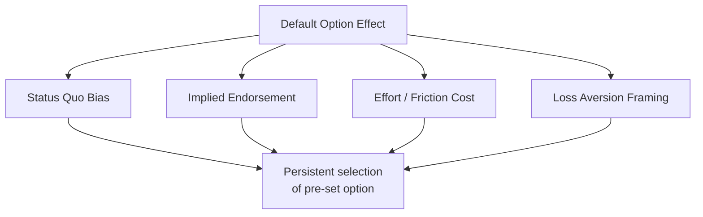
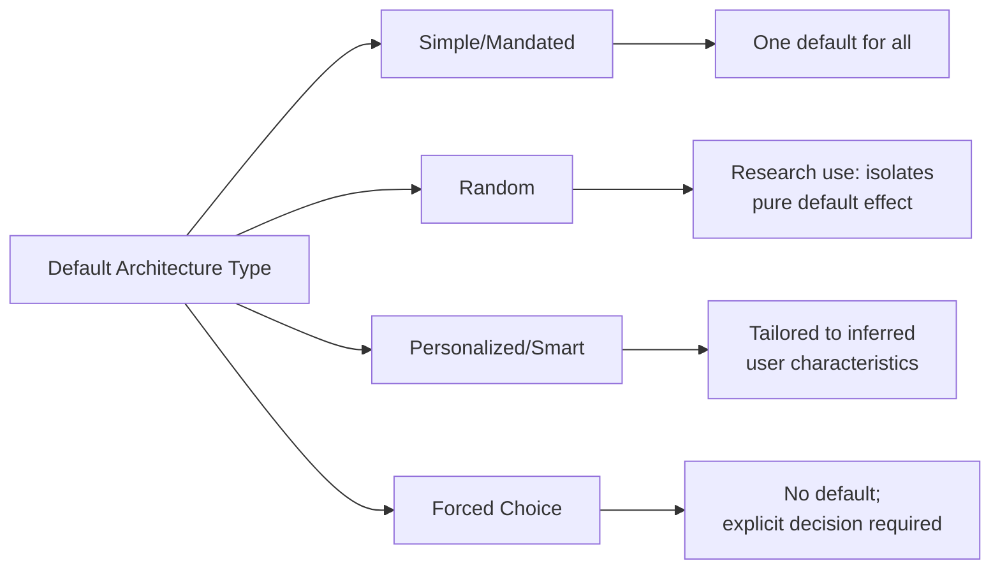

## Default Options and Opt-Out Design

### Overview

Default options are the pre-selected outcomes an individual receives if they take no action. Opt-out design is a specific application in which participation in a program is the default state, requiring active effort to withdraw, in contrast to opt-in design, where non-participation is default and active effort is required to enroll. Defaults are among the most extensively studied and most reliably effective tools in choice architecture, producing large behavioral effects without altering the economic incentives or restricting the choice set available to the decision-maker.

### Theoretical Basis

**Key Points**

- Defaults derive their power from several converging behavioral mechanisms rather than a single cause
- The effect is robust across domains: retirement savings, organ donation, insurance selection, email subscriptions, printer settings, and privacy consent
- Thaler and Sunstein (2008) classify default-setting as a central technique of **libertarian paternalism** — it nudges behavior while formally preserving the ability to choose otherwise

**Mechanism 1: Status Quo Bias**

Individuals exhibit a systematic preference for the current state of affairs, first formalized experimentally by Samuelson and Zeckhauser (1988). This is distinct from but related to the endowment effect; it applies even absent formal "ownership" of the default outcome.

**Mechanism 2: Implied Endorsement**

Defaults are often interpreted as an implicit recommendation from the choice architect (employer, government, platform), particularly under uncertainty about the "correct" choice. This is sometimes termed the **implicit-recommendation channel** (McKenzie, Liersch & Finkelstein, 2006).

**Mechanism 3: Effort and Friction Costs**

Switching away from a default requires cognitive and procedural effort — understanding the alternatives, completing a form, making an active decision under uncertainty. Even minimal friction produces measurable non-switching, consistent with a broader finding that small transaction costs disproportionately affect behavior relative to their objective magnitude.

**Mechanism 4: Loss Aversion Framing**

Under Prospect Theory, switching away from a default can be cognitively framed as *giving up* the default outcome (a loss) rather than *acquiring* the alternative (a gain), amplifying reluctance to switch even when the alternative is objectively preferable.

### Opt-In vs. Opt-Out Architecture

| Dimension | Opt-In | Opt-Out |
| --- | --- | --- |
| Default state | Non-participation | Participation |
| Action required | Active enrollment | Active withdrawal |
| Typical participation rate | Lower | Substantially higher |
| Perceived autonomy | High (explicit consent) | High in principle, contested in practice |
| Common domains | Traditional 401(k) enrollment (pre-reform), email newsletters | Organ donation (in "presumed consent" countries), auto-enrollment pensions, pre-checked add-ons |

**Example — Retirement Savings (Madrian & Shea, 2001)**

In a widely cited natural experiment, a U.S. firm switched its 401(k) plan from opt-in to automatic enrollment (opt-out). Participation rose from approximately 37% under opt-in to approximately 86% under opt-out within the same employee population and plan design, with the default contribution rate and fund allocation also exerting a strong anchoring effect on those who did not actively adjust their selections.

**Example — Organ Donation (Johnson & Goldstein, 2003)**

Cross-country comparisons show that nations with presumed-consent (opt-out) organ donation policies exhibit dramatically higher effective donor registration rates than otherwise similar countries with explicit-consent (opt-in) policies, illustrating the effect at a national-policy scale.

### Formal Representation

The default effect can be represented as a wedge between the *revealed* choice probability under a given default $D$ and the *underlying* preference distribution $P^*$:

$$P(\text{choice} = D) = P^*(D) + \phi(D)$$

where $\phi(D) > 0$ represents the additive behavioral bias toward whichever option is set as default, holding underlying preferences $P^*$ constant. Empirically, $\phi(D)$ is large and robust enough that manipulating $D$ alone is frequently a more powerful policy lever than manipulating price incentives of comparable magnitude.

[Inference] The additive decomposition above is a simplified expository model for pedagogical purposes; the empirical literature typically estimates default effects via difference-in-differences or regression discontinuity designs around a policy change, not via direct estimation of $\phi(D)$ as a standalone parameter.

### Design Taxonomy of Default Architectures

**Key Points**

- **Simple/Mandated default**: choice architect sets a single, one-size-fits-all default across all users (e.g., standard opt-out pension enrollment)
- **Random default**: a default assigned randomly across users, typically used only in research settings to isolate the pure default effect from any implied-endorsement signal
- **Personalized/Smart default**: a default tailored to inferred characteristics of the individual (e.g., defaulting new hires into an age-appropriate target-date retirement fund)
- **Forced choice / Active choosing**: no default is set; the individual must make an explicit selection before proceeding, eliminating the default effect but also removing its potential welfare benefits for disengaged users (Carroll et al., 2009)

### Welfare and Ethical Considerations

**Key Points**

- Defaults are most defensible on welfare grounds when they align with what a well-informed majority would choose absent friction (Thaler & Sunstein's "as judged by themselves" standard)
- Critics (e.g., Sunstein's own later work acknowledges this tension) note defaults can be used to advance the *choice architect's* interests rather than the decision-maker's, particularly in commercial contexts (pre-checked add-ons, negative-option billing)
- Regulatory responses have emerged specifically targeting exploitative opt-out design, including consent frameworks (e.g., GDPR's requirement that consent be freely given, specific, and unambiguous, which restricts pre-ticked opt-out boxes for data processing)
- The ethical distinction commonly drawn is between defaults that reduce friction toward a *presumed pre-existing preference* versus defaults that *manufacture* participation the individual would not otherwise choose

[Inference] Regulatory specifics (such as GDPR consent requirements) are subject to jurisdictional variation and ongoing legal interpretation; the general principle that regulators increasingly scrutinize opt-out consent mechanisms is well documented, but exact compliance requirements should be verified against current legal text for any applied use.

### Practical Implementation Considerations

**Key Points**

- **Reversibility**: opt-out defaults are generally considered more ethically acceptable when switching costs are genuinely low and clearly communicated, preserving actual (not merely nominal) freedom to choose
- **Transparency**: disclosure of the default and the switching mechanism should be salient, not buried in fine print, to avoid the criticism that opt-out design exploits inattention rather than merely accommodating it
- **Testing**: A/B testing of default configurations is standard practice in digital product design (e.g., testing auto-renewal defaults, privacy setting defaults, notification defaults) and should be evaluated against both engagement metrics and independent measures of user welfare
- **Combination with other nudges**: defaults are frequently paired with framing and simplification nudges (e.g., an opt-out default combined with a clear, single-step withdrawal link) to preserve genuine opt-out capability

### Conclusion

Default options function as one of the most cost-effective and evidence-supported levers in choice architecture, operating through status quo bias, implied endorsement, friction costs, and loss-averse framing simultaneously. Their empirical effect sizes — as demonstrated in retirement savings and organ donation policy — frequently exceed those achievable through price-based interventions of comparable administrative cost. Their ethical use hinges on alignment with the decision-maker's own likely preferences and genuine preservation of low-friction reversibility, distinguishing legitimate opt-out nudging from exploitative dark-pattern design.

**Related Topics**

- Status Quo Bias: Formal Models and Experimental Evidence
- Save More Tomorrow: Auto-Escalation as a Combined Default and Commitment Device
- Dark Patterns and the Ethics of Digital Choice Architecture
- GDPR and Consent Design: Regulatory Constraints on Opt-Out Mechanisms
- Active Choosing as an Alternative to Default-Setting
- Smart Defaults and Personalization in Algorithmic Choice Architecture