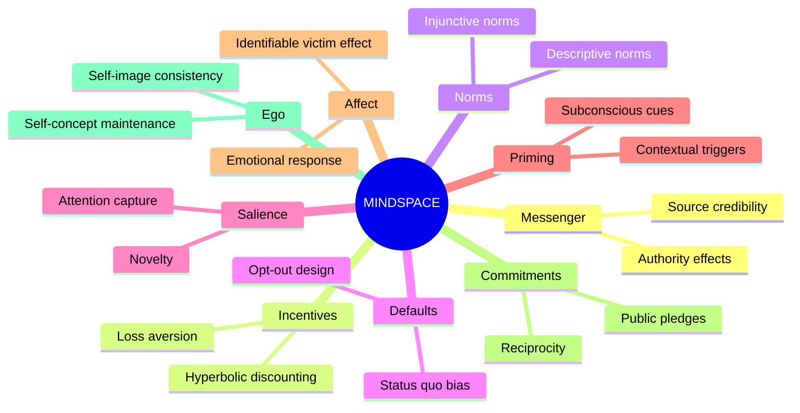

## The MINDSPACE Framework

### Overview

MINDSPACE is a mnemonic checklist of nine behavioral influences on decision-making, developed in 2010 by the UK's Institute for Government in collaboration with the Behavioural Insights Team (BIT), commonly known as the "Nudge Unit." It was authored primarily by Paul Dolan, Michael Hallsworth, David Halpern, and colleagues, and was designed as a practical tool for policymakers to identify which behavioral levers might be effective when designing interventions, without requiring a legislative change, financial incentive, or persuasive argument to change behavior.

The framework's core premise is that context and presentation ("choice architecture") systematically shape decisions, often more than the deliberative weighing of costs and benefits assumed by rational-choice models. MINDSPACE distills decades of research in behavioral economics and social psychology into nine memorable, letter-coded effects.

### The Nine Components

**Messenger**

We are heavily influenced by who communicates information, not just its content. Identical information delivered by a trusted, likable, or authoritative source is processed and acted upon differently than the same information from a source perceived as untrustworthy or low-status.

- **Example**: Public health campaigns using respected local doctors rather than generic government spokespeople to promote vaccination.

**Incentives**

Our responses to incentives are shaped by predictable mental shortcuts, such as strong loss aversion (losses loom larger than equivalent gains) and heavy discounting of future rewards relative to immediate ones.

- **Example**: Framing a bill discount as "you will lose your $50 early-payment discount" rather than "pay early to get $50 off" tends to produce a stronger response, since it is framed as an avoidable loss.

**Norms**

We are strongly influenced by what others do. Communicating that a behavior is common (descriptive norms) or socially approved (injunctive norms) can shift behavior toward the perceived norm.

- **Example**: Hotel towel-reuse cards stating "75% of guests in this room reused their towel" outperform generic environmental appeals.

**Defaults**

We tend to go along with pre-set options because doing so requires no action, and pre-set options are often (rightly or wrongly) interpreted as implicit recommendations. This links closely to status quo bias.

- **Example**: Switching pension enrollment from opt-in to opt-out (automatic enrollment) dramatically increases participation rates, as demonstrated in UK auto-enrollment reforms.

**Salience**

Our attention is drawn to what is novel, accessible, or seems relevant to us; we tend to ignore or discount information that is dull or hard to process, even if it is important.

- **Example**: Graphic warning images on cigarette packaging capture attention far more effectively than small-print text warnings.

**Priming**

Our actions are often influenced by subconscious cues, including images, words, and sensations, that precede a decision, even when we are unaware of the connection.

- **Example**: Playing French versus German music in a wine aisle has been shown to shift consumer preference toward wine from the corresponding country. [Inference: effect sizes for priming in field settings are often smaller and less reliable than in controlled lab studies, and replication has been mixed.]

**Affect**

Emotional associations attached to a stimulus are powerful drivers of behavior, frequently outweighing logical or statistical reasoning ("affect heuristic").

- **Example**: Charity appeals featuring a single identifiable individual's story typically generate more donations than appeals citing aggregate statistics about millions affected (the "identifiable victim effect").

**Commitments**

We seek to be consistent with our public promises and to reciprocate acts. Public or active commitments increase the likelihood of follow-through.

- **Example**: Having patients state aloud and sign a written commitment to a scheduled medical appointment reduces no-show rates compared to a standard appointment card.

**Ego**

We act in ways that make us feel good about ourselves, and we tend to behave consistently with our self-image ("self-concept maintenance").

- **Example**: Framing tax compliance messaging around "most people like you pay their tax on time" invokes both norms and self-image as a law-abiding citizen.

### Structural Diagram

### Application Process

A typical policy or design workflow using MINDSPACE proceeds as follows:

1. **Define the target behavior** precisely (e.g., "increase on-time tax filing," not "improve tax compliance" broadly).
2. **Map the current choice environment** — identify existing defaults, messengers, and framing already in place.
3. **Screen against all nine MINDSPACE letters** — for each component, ask whether it is currently being leveraged, working against the goal, or unused.
4. **Prioritize interventions** by estimated impact-to-cost ratio, favoring low-cost changes (defaults, framing, messenger changes) over high-cost ones (new incentive structures).
5. **Pilot and test**, ideally via randomized controlled trial (RCT), since behavioral effects are often context-dependent and non-obvious effect sizes make prediction unreliable. [Inference: this iterative testing emphasis reflects BIT's broader institutional practice rather than a strict requirement of the MINDSPACE checklist itself.]

### Relationship to Broader Nudge Theory

MINDSPACE operationalizes concepts introduced in Thaler and Sunstein's *Nudge* (2008), particularly libertarian paternalism and choice architecture, by converting abstract behavioral economics findings into an actionable audit tool. It complements (rather than replaces) frameworks such as:

- **EAST** (Easy, Attractive, Social, Timely) — a simplified four-part framework also developed by BIT for faster practical application.
- **Fogg Behavior Model** (Motivation, Ability, Trigger) — from behavior design, emphasizing the interaction of capability and prompts.
- **Dual-process theory** (System 1 / System 2, Kahneman) — the cognitive-science foundation underlying most MINDSPACE components, since most operate on automatic (System 1) processing.

### Limitations and Critiques

- **Overlap between components**: Norms, Affect, and Ego frequently co-occur in a single intervention, making clean attribution of which lever drove an effect difficult.
- **Context-dependency**: Effect sizes vary substantially by population, culture, and domain; a nudge validated in one country's tax authority may not generalize elsewhere. [Inference]
- **Ethical concerns**: Critics argue that exploiting automatic cognitive processes, even for beneficial ends, raises questions about autonomy and manipulation, prompting the transparency test proposed by some ethicists — a nudge should be acceptable to publicly disclose to those subject to it.
- **Not a causal theory**: MINDSPACE is descriptive and organizational, not predictive; it does not specify which lever will dominate in a given context, and multiple letters often compete or interact non-additively.

### Related Topics

- EAST framework (Easy, Attractive, Social, Timely)
- Libertarian paternalism (Thaler & Sunstein)
- Choice architecture design principles
- Status quo bias and default effects
- Loss aversion and prospect theory
- Social proof and descriptive vs. injunctive norms
- Randomized controlled trials in public policy
- The identifiable victim effect
- Dual-process theory (System 1/System 2 cognition)
- Behavioural Insights Team (BIT) case studies