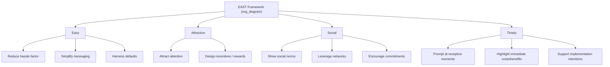

## The EAST Framework

### Overview

EAST is a simplified, four-part behavioral framework developed by the UK's Behavioural Insights Team (BIT) in 2014, building directly on the earlier and more granular MINDSPACE framework. Where MINDSPACE offers nine distinct psychological levers, EAST condenses the same underlying evidence base into four higher-level, action-oriented principles: **Easy, Attractive, Social, Timely**. It was designed explicitly as a practitioner's tool — simpler to teach, apply, and communicate to non-specialist policymakers and program designers than the more academically granular MINDSPACE.

The framework's guiding heuristic is: if you want to encourage a behavior, make it Easy, Attractive, Social, and Timely. If you want to discourage a behavior, do the opposite — make it effortful, unattractive, socially discouraged, or badly timed.

### The Four Components

**Easy**

People are more likely to act when the behavior requires minimal effort, cognitive load, or friction. This draws on defaults, simplification of information, and reducing the number of steps ("hassle factors") required to complete an action.

- **Key Points**:
  - Harness defaults (opt-out rather than opt-in).
  - Reduce the "hassle factor" — minimize steps, forms, and decisions required.
  - Simplify messages — plain language, clear calls to action.
- **Example**: Pre-filling tax forms with known data so citizens only need to verify and submit, rather than enter figures from scratch, substantially increases completion rates.

**Attractive**

Attention is a scarce resource; people are drawn to what is salient, personalized, or visually engaging, and respond to well-designed incentives.

- **Key Points**:
  - Attract attention using salience (color, imagery, personalization).
  - Design rewards and sanctions for maximum effectiveness (e.g., lotteries can outperform equivalent-value guaranteed small incentives due to probability weighting).
- **Example**: Personalizing a reminder letter with the recipient's name and a specific, salient consequence (e.g., "You are one of a small number of people who have not yet claimed $X") increases response rates over generic mass mailings.

**Social**

Human behavior is deeply embedded in social context; people are influenced by what others do (descriptive norms) and by their relationships and reciprocal obligations.

- **Key Points**:
  - Show that most people perform the desired behavior (social proof).
  - Use the power of networks — leverage peer influence and social diffusion.
  - Encourage people to make commitments to others.
- **Example**: The UK court-fine text-message reminder trial found that messages personalized with the recipient's name and referencing social commitment (e.g., "most people pay their fine on time") reduced non-payment compared to standard reminder letters.

**Timely**

The effect of a prompt or intervention depends heavily on *when* it is delivered — people are more receptive at certain moments, such as immediately before a decision or during a life transition.

- **Key Points**:
  - Prompt people when they are likely to be most receptive.
  - Consider the immediate costs and benefits — people heavily discount future consequences relative to present ones.
  - Help people plan their response to events (implementation intentions).
- **Example**: Sending a savings-plan prompt immediately after a salary increase or bonus payment ("save before you get used to spending it") capitalizes on a moment of temporarily increased willingness to commit funds.

### Structural Diagram

### Application Process

1. **Define the target behavior** with precision (e.g., "increase online submission of a specific form" rather than "improve digital engagement").
2. **Map the current process** the target audience must go through, identifying every point of friction, distraction, or delay.
3. **Apply the EAST checklist** systematically:
   - Where can steps be removed or defaults changed? (Easy)
   - Where can attention or incentive design be improved? (Attractive)
   - Where can social proof or peer commitment be introduced? (Social)
   - Where can the timing of the prompt be shifted closer to the decision point or a relevant life event? (Timely)
4. **Generate a testable intervention** for each applicable letter, rather than assuming all four must be used simultaneously.
5. **Run a randomized controlled trial (RCT)** where feasible, since BIT's own methodology emphasizes empirical testing over assumption — EAST is a generative checklist for hypotheses, not a guarantee of effect.

### Relationship to MINDSPACE

EAST can be understood as a compressed remapping of MINDSPACE's nine components into four operational categories:

| EAST Component | Overlapping MINDSPACE Components |
| --- | --- |
| Easy | Defaults, Salience (partially) |
| Attractive | Salience, Affect, Incentives |
| Social | Norms, Messenger, Commitments |
| Timely | Priming (partially), Ego (partially) |

[Inference: This mapping is an approximate conceptual correspondence rather than an official one-to-one crosswalk published by BIT; the two frameworks were designed for different purposes — MINDSPACE for comprehensive diagnostic coverage, EAST for rapid practitioner application — so some conceptual bleed at the edges is expected.]

### Limitations and Critiques

- **Loss of granularity**: By compressing nine psychological mechanisms into four, EAST can obscure which specific underlying mechanism is driving an observed effect, complicating theoretical interpretation even when the intervention succeeds practically.
- **Risk of superficial application**: Because the framework is easy to memorize, there is a risk that practitioners apply it as a surface checklist ("did we make it colorful?") without engaging the deeper evidence base each letter represents.
- **Context-dependency**: As with MINDSPACE, effect sizes are highly sensitive to population, cultural context, and domain; the same "Timely" prompt might succeed in one administrative system and fail in another due to differing baseline receptiveness. [Inference]
- **Ethical considerations**: The "Attractive" component in particular raises the same manipulation concerns as MINDSPACE's Affect and Salience — using emotionally or visually compelling design to influence behavior invites scrutiny under the transparency test (would the intervention remain acceptable if publicly disclosed to those affected).

### Related Topics

- MINDSPACE framework
- Choice architecture and libertarian paternalism
- Implementation intentions
- Hassle costs / administrative burden research
- Social proof and descriptive norms
- Behavioural Insights Team (BIT) trial case studies
- Randomized controlled trials in public policy
- Present bias and hyperbolic discounting