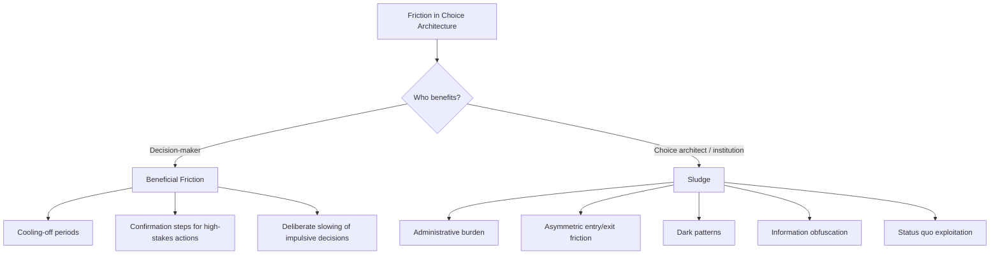

## Sludge and Frictions in Choice Architecture

### Overview

Sludge refers to excessive or unnecessary friction deliberately or inadvertently embedded in a choice environment that impedes people from taking an action that is in their own interest. The term was popularized by Richard Thaler (notably in a 2018 article and subsequent writing with Cass Sunstein) as the conceptual inverse of a "nudge" — while a nudge steers behavior toward a beneficial outcome by reducing friction or leveraging behavioral biases, sludge steers behavior *away* from a beneficial outcome by adding friction, or exploits behavioral biases against the individual's interest.

Frictions, more broadly, are any features of a choice environment that make an action more effortful, whether physically, cognitively, emotionally, or temporally. Frictions are not inherently negative: some frictions (sometimes called "good friction" or deliberately introduced "speed bumps") are intentionally designed to slow down harmful impulsive decisions. The ethical and design distinction lies in *whose interest* the friction serves.

### Core Distinction: Sludge vs. Beneficial Friction

| Dimension | Sludge | Beneficial Friction |
| --- | --- | --- |
| Beneficiary | Primarily the choice architect (firm, institution) | Primarily the decision-maker |
| Typical effect | Discourages a desirable action or exploits inertia | Discourages a harmful/impulsive action |
| Common intent | Retention, profit extraction, cost-shifting, obstruction | Deliberation, error prevention, harm reduction |
| Example | Multi-step, opaque subscription cancellation process | A "cooling-off" delay before a large financial transaction |

### Taxonomy of Sludge Mechanisms

**Administrative burden**

Bureaucratic requirements — forms, documentation, in-person visits, verification steps — that impose learning costs, compliance costs, and psychological costs on the individual seeking a benefit or service.

- **Example**: Complex, multi-page enrollment forms for public assistance programs that require supporting documents obtainable only through additional bureaucratic steps, resulting in eligible individuals failing to enroll (a well-documented phenomenon in public administration research).

**Asymmetric friction ("roach motel" design)**

Deliberately making it easy to enter a commitment (e.g., a subscription, a gym membership) but disproportionately difficult to exit it.

- **Example**: A service that allows sign-up with a single click online but requires a phone call during limited business hours, combined with a retention script, to cancel.

**Dark patterns**

UI/UX design choices that manipulate users into actions they would not otherwise choose, often through misdirection, confusing framing, or the "confirmshaming" of an opt-out option (e.g., a decline button phrased as "No, I don't want to save money").

- **Example**: Pre-checked add-on boxes at online checkout that require the user to actively notice and uncheck them to avoid an unwanted charge.

**Information overload / obfuscation**

Burying important terms in dense text, or providing so much information that the individual cannot practically identify the relevant details, effectively increasing cognitive friction to the point of discouraging informed choice.

- **Example**: Lengthy terms-of-service agreements that make the practical exercise of a legal right (e.g., data deletion) technically possible but practically obscure.

**Status quo exploitation**

Leveraging default inertia not to benefit the individual (as in beneficial default design) but to retain revenue or compliance advantageous to the institution.

- **Example**: Auto-renewing subscriptions with default renewal and no advance reminder, relying on inattention rather than active consent.

### Diagram: Friction Classification

### Measuring and Auditing Sludge

Sunstein and subsequent researchers have proposed a "sludge audit" methodology for organizations and regulators:

1. **Inventory all administrative steps** required to complete a given process (enrollment, cancellation, claim, refund).
2. **Quantify the burden** along established dimensions from administrative-burden research:
   - *Learning costs*: effort to discover that a program/option exists and understand eligibility.
   - *Compliance costs*: effort and time to gather documentation and complete required steps.
   - *Psychological costs*: stigma, stress, or loss of autonomy associated with the process.
3. **Compare entry friction to exit friction** — a significant asymmetry is a strong signal of sludge rather than neutral process design.
4. **Assess the beneficiary** — determine whether the friction primarily serves risk management/informed consent (beneficial) or retention/revenue (sludge).
5. **Benchmark against a low-friction alternative** — estimate what completion or take-up rates would look like if the process were simplified, often via A/B testing or RCT.

### Policy and Regulatory Responses

- **"Click-to-cancel" rules**: Regulatory requirements (e.g., proposals and rules considered by the U.S. Federal Trade Commission) mandating that cancellation of a service be no more difficult than sign-up.
- **Plain-language mandates**: Requirements that key disclosures (loan terms, privacy policies) be written at an accessible reading level and presented prominently rather than buried.
- **Default reminder requirements**: Rules requiring advance notice before auto-renewal charges, reducing the sludge value of status-quo exploitation.
- **Administrative burden reduction in public benefits**: Initiatives such as pre-populated eligibility data, "no-wrong-door" enrollment, and presumptive eligibility to lower administrative burden in social program access.

[Inference: The specific regulatory mechanisms and their enforcement status vary by jurisdiction and change over time; readers should verify current rules in their relevant jurisdiction rather than treat any single regulatory example as a stable, universal standard.]

### Behavioral Mechanisms Underlying Sludge's Effectiveness

- **Present bias / hyperbolic discounting**: The immediate effort cost of navigating friction is weighted more heavily than the deferred cost of remaining in an unwanted arrangement.
- **Status quo bias**: Once enrolled, the default of "doing nothing" favors staying rather than actively pursuing exit.
- **Loss aversion (reframed)**: Sludge can reframe cancellation as "losing" a benefit rather than "gaining" freedom from an unwanted cost, discouraging exit.
- **Limited attention / bounded rationality**: Information overload exploits the cognitive limits on how much text or how many steps an individual can process before abandoning the task.
- **Ego depletion** [Inference: contested in current psychological literature]: Some early sludge research invoked the idea that repeated friction depletes a finite pool of self-control, though the empirical robustness of ego-depletion as a general phenomenon has been substantially challenged by replication studies since roughly 2015; sludge's effectiveness is more robustly explained by present bias and status quo bias without needing to invoke depletion.

### Limitations and Critiques

- **Definitional ambiguity**: The line between "beneficial friction" and "sludge" is not always objectively clear-cut; the same design (e.g., a delay before a purchase) can be sludge in one framing and consumer protection in another, depending on intent and context, which complicates regulatory enforcement.
- **Measurement difficulty**: Unlike a nudge's uplift, which can often be measured via conversion rate, sludge's cost is partly psychological and non-monetary (stress, humiliation, lost time), making its full impact harder to quantify in a cost-benefit framework.
- **Enforcement gaps**: Even where "click-to-cancel"-style rules exist, enforcement resources are limited relative to the scale of digital commerce, and firms can adapt friction to remain technically compliant while still imposing meaningful burden.
- **Behavioral overlap with legitimate risk disclosure**: Regulators requiring additional confirmation steps for genuinely risky financial products must distinguish this from arbitrary sludge, since well-intentioned protective friction can resemble sludge in surface form.

### Related Topics

- MINDSPACE framework
- EAST framework
- Administrative burden theory (Herd & Moynihan)
- Dark patterns in UX/UI design
- Status quo bias and default effects
- Present bias and hyperbolic discounting
- Libertarian paternalism and the ethics of nudging
- Regulatory approaches to consumer protection (e.g., FTC click-to-cancel rules)