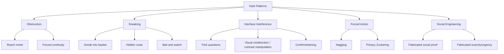

## Dark Patterns and Manipulative Design

### Overview

Dark patterns are user interface and choice-architecture design elements deliberately crafted to manipulate users into decisions they would not otherwise make, typically benefiting the designing entity at the user's expense. The term was coined in 2010 by UX researcher Harry Brignull, who created a taxonomy and public registry (darkpatterns.org, later rebranded deceptive.design) to document and name recurring manipulative techniques.

Dark patterns sit at the intersection of behavioral economics and interaction design: whereas a nudge is typically framed as preserving freedom of choice while steering toward a welfare-improving default, a dark pattern actively degrades the user's ability to exercise informed, autonomous choice — often by exploiting the same cognitive biases nudges rely on, but directed against the user's interest. Dark patterns are closely related to but not identical to sludge: sludge emphasizes *friction* (making beneficial actions hard), while dark patterns encompass a broader set of manipulative techniques, including ones that make harmful actions artificially *easy* or falsely appealing.

### Taxonomy of Dark Patterns

**Confirmshaming**

Guilt- or shame-based framing of a decline option to discourage the user from opting out.

- **Example**: A pop-up's "No thanks" button rephrased as "No, I don't care about saving money" or "No, I prefer to pay full price."

**Forced continuity / hidden subscription**

Automatically converting a free trial into a paid subscription without a clear, prominent reminder, relying on inattention and status quo bias.

- **Example**: A "free trial" requiring credit card entry upfront, with renewal terms disclosed only in fine print, and no reminder notification before the first charge.

**Roach motel**

Asymmetric design making an action (subscribing, signing up) easy to initiate but disproportionately difficult to reverse (canceling, unsubscribing) — a specific instantiation of asymmetric sludge.

- **Example**: One-click online sign-up paired with a cancellation process requiring a phone call during restricted hours.

**Bait and switch**

Presenting an interface element that appears to lead to one outcome but actually produces a different, often undesired, outcome.

- **Example**: Clicking a prominent "Update now" button that is actually designed to install additional unwanted software alongside the intended update.

**Trick questions / misdirection**

Using confusing wording, double negatives, or visual design (e.g., contrasting button colors) to lead users toward an unintended selection.

- **Example**: A privacy settings screen where the visually prominent, brightly colored button selects the *more* data-sharing option, while the option protecting privacy is a small, low-contrast text link.

**Sneak into basket**

Adding an additional item, service, or charge to a user's order without clear, affirmative consent.

- **Example**: Pre-checked travel insurance or warranty add-ons at checkout that require the user to actively notice and deselect them.

**Privacy Zuckering**

Named after Facebook founder Mark Zuckerberg, this pattern tricks users into sharing more personal information than they intend, often via confusingly layered privacy settings.

- **Example**: Default settings that broadcast activity publicly, with the more private setting buried several menu levels deep.

**Scarcity and urgency manipulation**

Fabricated or exaggerated claims of limited availability or time pressure designed to short-circuit deliberation via artificial urgency.

- **Example**: A countdown timer on an e-commerce page that resets upon page refresh, or "Only 2 left in stock!" messaging that does not reflect actual inventory.

**Social proof manipulation**

Displaying fabricated or misleading indicators of popularity or endorsement.

- **Example**: Pop-up notifications claiming "23 people are viewing this right now" or "Sarah from Chicago just purchased this" generated by scripts rather than reflecting real user activity.

**Nagging**

Repeated interruptive requests (for permissions, ratings, upgrades) designed to wear down resistance through persistence rather than persuasion.

- **Example**: A mobile app that re-prompts for a five-star rating or push-notification permission on every session launch until the user relents.

### Diagram: Dark Pattern Taxonomy

### Underlying Behavioral Mechanisms

Dark patterns systematically exploit well-documented cognitive biases:

- **Loss aversion**: Confirmshaming and urgency manipulation frame inaction as a loss to be avoided.
- **Anchoring and framing effects**: Trick questions and asymmetric visual contrast exploit how the presentation of options shapes perceived defaults.
- **Status quo bias**: Forced continuity and the roach motel pattern rely on the tendency to leave things as they are.
- **Social proof**: Manipulated indicators of popularity exploit the descriptive-norms mechanism (see MINDSPACE's "Norms" and EAST's "Social").
- **Scarcity heuristic**: Perceived scarcity increases subjective value and urgency, a well-documented effect in consumer psychology, independent of actual scarcity.
- **Bounded attention**: Nagging and information overload exploit limited attentional and self-regulatory resources to increase compliance through persistence rather than reasoned persuasion.

### Distinguishing Dark Patterns from Legitimate Persuasion and Nudging

| Criterion | Legitimate Nudge / Persuasion | Dark Pattern |
| --- | --- | --- |
| Transparency | Would remain acceptable if publicly disclosed | Relies on concealment or misdirection to work |
| Reversibility | Errors are easy to correct | Deliberately difficult to reverse |
| Alignment of interest | Aligned with or neutral to user's interest | Primarily serves the designer's interest at user's expense |
| Preserves choice | Genuine alternative remains easy to select | Alternative is obscured, discouraged, or punished |

This aligns with the "transparency test" and "publicity principle" proposed in the ethics-of-nudging literature (Thaler & Sunstein; subsequently elaborated by other behavioral ethicists): if an organization would be unwilling to openly disclose a design's manipulative intent to those affected by it, this is a strong signal the design is a dark pattern rather than an ethical nudge.

### Regulatory and Industry Responses

- **General Data Protection Regulation (GDPR) and ePrivacy rules** (EU): Address privacy-specific dark patterns such as manipulative cookie-consent interfaces and Privacy Zuckering by requiring genuinely informed, freely given consent.
- **California Consumer Privacy Act (CCPA) / CPRA** (US): Explicitly prohibits dark patterns in the context of opt-out mechanisms for data sales.
- **EU Digital Services Act (DSA)**: Contains provisions specifically targeting dark patterns on online platforms.
- **U.S. Federal Trade Commission (FTC) enforcement actions**: The FTC has pursued cases and rulemaking (including "click-to-cancel" style rules) targeting subscription-related dark patterns such as forced continuity and the roach motel pattern.

[Inference: Specific statutory provisions, enforcement scope, and rulemaking status are subject to ongoing legal and regulatory change across jurisdictions; readers should consult current legal sources for the applicable rules in a specific jurisdiction rather than treating this list as exhaustive or current at the time of reading.]

### Detection and Audit Methodology

1. **Heuristic walkthroughs**: UX researchers systematically compare each taxonomy category (obstruction, sneaking, interface interference, forced action, social engineering) against a product's actual flows.
2. **A/B comparison against a "neutral" baseline**: Compare conversion or retention metrics under a manipulative design versus a plainly-worded, symmetric-friction alternative to quantify the manipulation's behavioral lift.
3. **Automated large-scale scanning**: Academic researchers (e.g., studies from Princeton and other institutions circa 2019 onward) have used automated crawlers to detect dark patterns at scale across e-commerce sites by pattern-matching on known UI structures and text.
4. **User comprehension testing**: Assessing whether users can accurately state what action they just took or what they agreed to, as a proxy for whether informed consent was genuinely obtained.

### Limitations and Critiques

- **Definitional boundary problems**: As with sludge, the line between assertive marketing/persuasion and manipulation is not always sharp, and reasonable designers can disagree about where legitimate urgency messaging ends and fabricated urgency begins.
- **Enforcement lag**: Regulatory frameworks often lag behind the pace of interface design innovation, meaning novel manipulative patterns frequently precede formal prohibition.
- **Cross-cultural variation**: Perceptions of what constitutes manipulative versus acceptable persuasive design vary across cultural and regulatory contexts, complicating the development of universal standards. [Inference]
- **Attribution difficulty in A/B testing**: When companies test multiple simultaneous design variants for legitimate optimization purposes, distinguishing intentional dark-pattern design from incidental higher-converting-but-unintentionally-manipulative variants can be methodologically and legally ambiguous.

### Related Topics

- Sludge and frictions in choice architecture
- MINDSPACE and EAST frameworks
- Ethics of nudging (transparency test, publicity principle)
- GDPR/CCPA consent design requirements
- Scarcity heuristic and urgency bias
- Social proof and norm manipulation
- FTC "click-to-cancel" rulemaking
- Behavioral audit methodologies in UX research