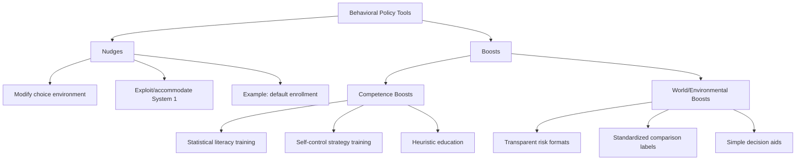

## Boosts as an Alternative to Nudges

### Overview

Boosts are a category of behavioral policy interventions designed to enhance an individual's own decision-making competences — such as statistical literacy, self-control strategies, or risk-comprehension skills — rather than to steer behavior through changes in the choice environment. The concept was developed primarily by Ralph Hertwig and colleagues at the Max Planck Institute for Human Development, most notably articulated in Hertwig and Grüne-Yanoff's 2017 paper "Nudging and Boosting: Steering or Empowering Good Decisions" (Perspectives on Psychological Science).

Boosts represent a deliberate theoretical and practical alternative to nudges. While nudges (as defined by Thaler and Sunstein) work by exploiting or accommodating cognitive biases and heuristics within a person's existing decision-making architecture, boosts aim to change that architecture itself — either by improving the individual's competence directly, or by improving the environment's transparency in a way that makes existing competences more effective. The guiding philosophy is one of empowerment rather than steering: boosts seek to expand the individual's repertoire of decision-making tools and durable capabilities, ideally such that the improvement persists across contexts and does not depend on the continued presence of a specific choice architect.

### Core Distinction: Boosts vs. Nudges

| Dimension | Nudge | Boost |
| --- | --- | --- |
| Mechanism | Modifies the choice environment | Modifies the person's competence or the environment's transparency |
| Target | System 1 (automatic, heuristic processing) | System 2 (deliberate reasoning) or improved heuristic use |
| Underlying model of error | Bias as an inherent, largely fixed limitation to be worked around | Bias as often correctable through skill-building or better information format |
| Durability | Effect depends on continued presence of the nudge/default | Effect intended to persist and transfer across contexts |
| Dependence on choice architect | Requires ongoing intervention by the architect | Aims for eventual independence from the architect |
| Transparency requirement | Can work even if the mechanism is not understood by the individual | Requires the individual to understand and actively use the tool |
| Example | Automatic enrollment in a pension plan | Teaching someone to calculate compound interest to evaluate loan terms |

### Two Types of Boosts

Hertwig and Grüne-Yanoff distinguish two main subtypes:

**1. Competence boosts**

Direct interventions that build or strengthen an individual's cognitive skills, domain knowledge, or self-regulatory strategies.

- **Example**: Statistical literacy training programs that teach people to interpret natural frequencies (e.g., "10 out of 1,000") rather than conditional probabilities (e.g., "1%"), which has been shown in research by Gerd Gigerenzer and colleagues to substantially improve accurate interpretation of medical test results and reduce systematic misjudgment of false-positive rates.

**2. World/environmental boosts**

Interventions that restructure how information is presented to make it more transparent and easier for existing competences to operate correctly, without exploiting a bias — the boost equivalent of environmental redesign, but aimed at enabling accurate deliberate reasoning rather than steering automatic response.

- **Example**: Presenting food nutritional information in a standardized, easily comparable format (e.g., a consistent traffic-light label across all products) so that a consumer's existing ability to reason about health trade-offs can be applied effectively, rather than being undermined by inconsistent or opaque labeling formats.

### Diagram: Boost Taxonomy and Comparison

### Illustrative Applications by Domain

**Health and risk literacy**

- **Example**: Training clinicians and patients to use natural-frequency trees rather than percentages when discussing screening test results, improving accurate understanding of positive predictive value without requiring any change to the test itself or the choice architecture of the clinic.

**Financial decision-making**

- **Example**: Teaching simple heuristics (e.g., "the rule of 72" for estimating compound growth) that empower individuals to independently evaluate loan or investment offers, rather than relying on a mandated simplified disclosure they may not use.

**Digital and algorithmic literacy**

- **Example**: Boosting interventions aimed at improving people's ability to detect manipulative online content or evaluate source credibility (media literacy training), intended to generalize across platforms rather than depending on any single platform's moderation nudges. [Inference: empirical evidence on the durability and transfer of digital-literacy boosts across contexts is still an active area of research with mixed findings, and effect sizes vary by study design and population.]

**Self-control and habit formation**

- **Example**: Teaching implementation-intention formation ("if-then" planning) as a general-purpose self-regulation skill that individuals can apply across many future decisions (diet, exercise, savings), rather than embedding a single default in one specific context.

### Application Process

1. **Diagnose the source of the decision-making shortfall**: Determine whether poor outcomes stem from a lack of competence/knowledge (boost-amenable) or from environmental features that reliably override competence regardless of skill (potentially better addressed by a nudge or regulation).
2. **Select boost type**: Choose a competence boost when the goal is building a transferable skill; choose a world boost when the goal is improving the transparency/format of existing information without teaching a new skill.
3. **Design for genuine transparency**: Ensure the individual understands why the boost works, since (unlike many nudges) a boost's legitimacy and durability depend on the individual's comprehension and voluntary engagement with the tool.
4. **Test for transfer and durability**: Because a core claim of boosts is that they generalize beyond the immediate context, evaluation should include follow-up measurement in novel contexts, not only immediate task performance.
5. **Combine with nudges where appropriate**: Boosts and nudges are not mutually exclusive; a well-designed choice environment may use a default (nudge) for individuals who have not yet developed relevant competence while simultaneously offering a boost intervention (e.g., an educational module) to build durable skill over time.

### Relationship to the Wider Nudge/Boost Debate

The nudge/boost distinction reflects a deeper disagreement in behavioral policy about the nature of "irrationality." Nudge advocates (Thaler, Sunstein) tend to treat many heuristics and biases as robust, evolutionarily or structurally embedded features of cognition that are more efficiently accommodated than corrected. Boost advocates (Hertwig, Gigerenzer, and the broader "ecological rationality" tradition) argue that many apparent biases are not fixed cognitive flaws but rather mismatches between a heuristic and an unfamiliar information format (e.g., percentages versus natural frequencies), and that correcting the format or building the relevant skill can produce durable improvement without needing to bypass deliberate reasoning.

### Limitations and Critiques

- **Higher initial cost and effort**: Boosts generally require more active engagement, time, and cognitive investment from the individual than a nudge, which can reduce uptake, particularly among populations with limited time, motivation, or existing capacity to engage with training.
- **Slower and less certain effect**: Because boosts work by building competence rather than directly altering behavior, their effects may be smaller, slower to materialize, and more variable across individuals than a well-designed default nudge. [Inference]
- **Equity concerns**: If boost uptake correlates with existing education, motivation, or cognitive resources, boosts risk widening rather than narrowing outcome disparities between more and less resourced individuals, unless deliberately designed and targeted to reach lower-resource groups.
- **Measurement and transfer challenges**: Demonstrating that a competence gained in one context (e.g., a training session) genuinely transfers to real-world decisions in different contexts is empirically demanding, and the literature on transfer of statistical/decision-making training shows mixed and context-dependent results. [Inference]
- **Not a universal substitute for nudges**: In situations requiring an immediate behavior change at scale (e.g., a public health emergency) or where building competence is infeasible in the available time, nudges or harder regulatory tools may remain more practical than a boost strategy.

### Related Topics

- MINDSPACE framework
- EAST framework
- Libertarian paternalism and the ethics of nudging
- Ecological rationality and fast-and-frugal heuristics (Gigerenzer)
- Natural frequency framing in risk communication
- Statistical and financial literacy interventions
- Implementation intentions and self-regulation
- Choice architecture design principles