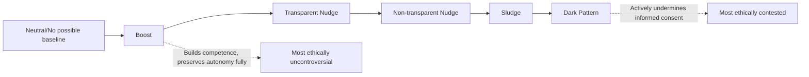

## Ethics and Autonomy in Choice Architecture

### Overview

The ethics of choice architecture concerns the normative question of when, and under what conditions, deliberately designing decision environments to influence behavior is morally permissible. Because every choice environment necessarily has *some* structure — there is no truly "neutral" way to present options, arrange a cafeteria, or design a default — the central ethical debate is not whether to have choice architecture, but how to constrain and justify the influence it exerts. This debate sits at the intersection of behavioral economics, moral philosophy, and public policy, and was substantially shaped by Richard Thaler and Cass Sunstein's concept of **libertarian paternalism**, introduced in their 2003 paper of the same name and elaborated in *Nudge* (2008).

### Libertarian Paternalism: The Foundational Framework

Libertarian paternalism attempts to reconcile two traditionally opposed values:

- **Libertarian**: Choice architecture should preserve freedom of choice; no option should be forbidden, and exiting a default should remain easy and low-cost.
- **Paternalistic**: Choice architecture is deliberately designed to steer people toward outcomes that (by some standard) improve their welfare, as judged by the choice architect.

Thaler and Sunstein argue this combination is justified because choice architecture is *unavoidable* — since some default or framing must exist regardless, it is better to design that default deliberately toward welfare-improving outcomes than to leave it to arbitrary or self-interested forces (e.g., a cafeteria designer prioritizing profit, or historical inertia).

### Core Ethical Criteria for Legitimate Nudges

Building on Thaler and Sunstein's original conditions and subsequent scholarly elaboration (e.g., Sunstein's later work on nudging ethics), several criteria are commonly proposed to distinguish ethically legitimate choice architecture from manipulation:

**1. Preservation of freedom of choice**

The nudged option must remain genuinely available, and the cost of choosing the alternative should not be artificially inflated as punishment for opting out.

**2. Transparency / the publicity principle**

A nudge should be one the choice architect would be willing to publicly disclose and defend to those affected by it. If revealing the mechanism would undermine its effectiveness or provoke reasonable objection, this is a signal the intervention may cross into manipulation.

**3. Alignment with the individual's own values and interests**

The intervention should promote outcomes the individual would endorse on reflection (sometimes called their "considered preferences" or "true preferences"), rather than merely the choice architect's preferences or institutional interests.

**4. Avoidance of exploitation of cognitive frailty for the architect's benefit**

Where a technique works specifically *because* it bypasses deliberate reasoning, ethical scrutiny is heightened, particularly where the beneficiary is the architect rather than the individual (the boundary that also separates a nudge from a dark pattern or sludge).

**5. Correctability and reversibility**

Legitimate choice architecture allows for correction of the "false positive" case — someone nudged toward an option that is not actually good for their specific circumstances should be able to reverse course with minimal cost.

### Diagram: Spectrum of Choice-Architecture Interventions

### Major Philosophical Objections to Nudging

**The autonomy objection**

Critics (e.g., philosophers working in the Kantian tradition) argue that nudges, even well-intentioned ones, treat individuals as objects to be managed rather than rational agents to be reasoned with, thereby failing to respect their autonomy regardless of the outcome's quality. Deliberately engineering someone's environment to produce a predetermined outcome without their conscious awareness is argued to be inherently disrespectful of their status as a rational agent, independent of whether the outcome benefits them.

**The manipulation objection**

Even accepting that some influence is unavoidable, critics distinguish between *rational persuasion* (which engages a person's reasoning capacities, e.g., providing accurate information and sound arguments) and *manipulation* (which bypasses or subverts those capacities, e.g., exploiting a bias). Since many nudges are specifically designed to work *through* biases rather than *despite* them, they may fall on the manipulation side of this line even when well-intentioned. Cass Sunstein and others have responded that not all bias-exploitation is manipulative if it is transparent and welfare-aligned, but the boundary remains contested. [Inference: this remains an active and unresolved area of philosophical debate rather than a settled consensus.]

**The "who decides welfare" objection**

Paternalistic interventions require the choice architect to have a defensible account of what counts as the individual's welfare or "true preferences." Critics note this is often assumed rather than empirically established, and that architects (governments, firms) may have implicit biases or institutional interests that shape their definition of the "good" outcome being nudged toward.

**The slippery-slope / scale objection**

Because nudges are low-visibility and low-cost to implement relative to legislation, critics worry they face weaker democratic scrutiny and accountability than laws or regulations, potentially enabling a larger cumulative scope of state or corporate influence over behavior than would be tolerated if implemented through more visible means.

**The behavioral market failure counter-objection to laissez-faire**

Proponents of choice architecture counter that objections premised on "just leave people alone" implicitly assume choice architecture can be neutral, which they argue is empirically false — every environment already nudges in some direction (deliberately or not), so refusing to engage in intentional choice architecture does not preserve neutrality, it simply cedes the architecture to unexamined defaults, commercial interests, or historical accident.

### Institutional and Governance Responses

**Ethics review frameworks for behavioral units**

Government behavioral insights teams (e.g., the UK's Behavioural Insights Team, the US Office of Evaluation Sciences, and equivalents in other countries) have developed internal ethics guidelines, generally requiring:

- Clear identification of the intended beneficiary of the intervention.
- A transparency/disclosure standard consistent with the publicity principle.
- Preference for RCT-tested interventions with measurable, disclosed effect sizes over speculative or opaque designs.
- Avoidance of techniques that would be classified as sludge or dark patterns under the frameworks discussed elsewhere in this chapter.

**Regulatory guardrails**

Distinct from voluntary ethics guidelines, some jurisdictions impose binding legal constraints on choice architecture, particularly in digital contexts (see GDPR consent design rules, CCPA dark-pattern prohibitions, and EU Digital Services Act provisions covered under "Dark Patterns and Manipulative Design").

### A Practical Ethical Test: The "Would I Be Comfortable Explaining This?" Heuristic

A commonly taught practical heuristic for practitioners, derived from the publicity principle, asks the choice architect to imagine explaining the specific mechanism of the intervention, in plain language, directly to the people affected by it, before it is deployed:

- If the explanation would not undermine the intervention's effectiveness or provoke reasonable objection, the intervention is more likely ethically sound.
- If effectiveness depends on concealment, or if disclosure would likely provoke a sense of having been deceived, this is a strong signal the intervention should be redesigned or abandoned.

### Limitations and Open Questions

- **No fully objective line**: Despite multiple proposed criteria (transparency, alignment of interest, reversibility), there is no universally agreed, operationalizable boundary that cleanly separates ethical nudging from manipulation in every case; most frameworks function as heuristics for judgment rather than bright-line rules. [Inference]
- **Aggregation problem**: An intervention might be individually justifiable but ethically concerning in aggregate if applied at national scale without commensurate public deliberation or accountability mechanisms.
- **Cultural and political variation**: Judgments about acceptable paternalism vary substantially across political and cultural contexts; a nudge considered mild and acceptable in one policy culture may be viewed as an unacceptable state overreach in another. [Inference]
- **Empirical uncertainty about "true preferences"**: The concept of a stable "true preference" that a nudge helps someone realize is itself philosophically contested, since preferences can be constructed or context-dependent rather than fixed, complicating the claim that any given nudge simply "helps people get what they already wanted."

### Related Topics

- MINDSPACE and EAST frameworks
- Sludge and frictions in choice architecture
- Dark patterns and manipulative design
- Boosts as an alternative to nudges
- Libertarian paternalism (Thaler & Sunstein)
- The manipulation vs. persuasion distinction in moral philosophy
- Behavioural Insights Team ethics guidelines
- Regulatory frameworks for digital consent (GDPR, CCPA, DSA)