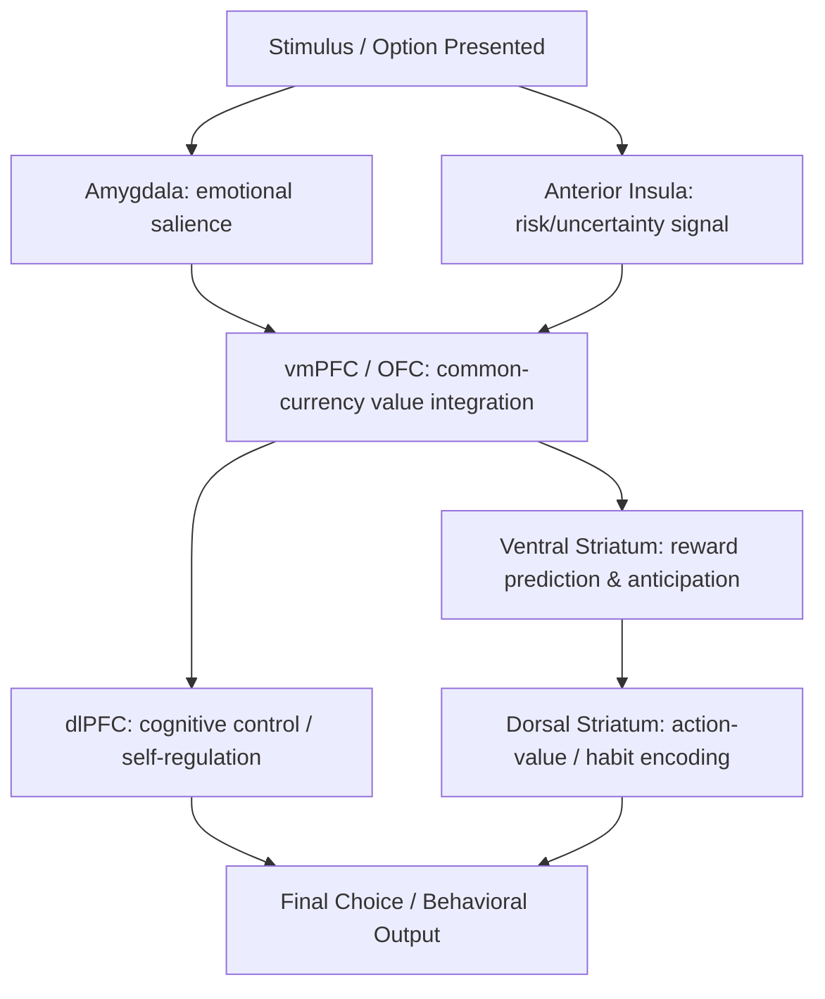

## Neural Correlates of Value and Reward

### Overview

Neuroeconomics investigates the neural mechanisms underlying economic decision-making by combining tools from neuroscience (single-neuron electrophysiology, functional neuroimaging, lesion studies, pharmacology) with formal decision-theoretic models from economics and psychology. The study of neural correlates of value and reward specifically addresses how the brain represents the subjective worth of options, computes and compares those values, and translates them into choices. This body of work provides the biological substrate for many phenomena behavioral economics documents at the level of observed behavior — loss aversion, hyperbolic discounting, and reference-dependence, among others, have all been linked to identifiable neural signatures.

### Key Brain Regions Implicated in Value Representation

**Ventral striatum (including nucleus accumbens)**

A central hub of the mesolimbic dopamine system, the ventral striatum shows activity that scales with the anticipation and receipt of rewards across nearly every reward type studied — monetary, food, social approval, and abstract gains. It is frequently implicated in signaling reward prediction errors (see below).

**Ventromedial prefrontal cortex (vmPFC) and orbitofrontal cortex (OFC)**

These interconnected regions are consistently implicated in representing a "common currency" subjective value signal that allows comparison across qualitatively different types of rewards (e.g., choosing between money and food), a computational requirement for any coherent choice process. Lesion studies in patients with vmPFC damage (following work building on the seminal case of Phineas Gage and more systematic studies by Antonio Damasio and colleagues) show impaired real-world decision-making despite preserved general intelligence, suggesting this region integrates value signals into an actionable choice.

**Dorsal striatum**

Associated with the representation of action values and habitual, stimulus-response-based learning, distinct from the more goal-directed value representations of the ventral striatum and vmPFC.

**Amygdala**

Implicated in encoding the emotional salience and aversive value of stimuli, contributing to loss-related processing and risk assessment; interacts closely with the vmPFC in integrating affective signals into value computations.

**Anterior insula**

Frequently activated during anticipation of losses, risk, and interoceptive (bodily) states associated with uncertainty; insula activity has been linked in several studies to loss aversion and risk-averse choice, consistent with a role in signaling anticipated negative outcomes.

**Dorsolateral prefrontal cortex (dlPFC)**

Associated with cognitive control, deliberation, and the capacity to override more impulsive value signals — implicated in self-control tasks and in the ability to resist immediate temptation in favor of larger delayed rewards.

### Diagram: Simplified Value-Processing Circuit

### Dopamine and Reward Prediction Error

A foundational finding in neuroeconomics, established through single-neuron recordings in non-human primates (notably by Wolfram Schultz and colleagues in the 1990s), is that midbrain dopamine neurons (in the ventral tegmental area and substantia nigra) do not simply encode reward magnitude — they encode a **reward prediction error (RPE)**: the difference between an *expected* reward and the reward *actually received*.

$$RPE = R_{actual} - R_{expected}$$

- If an outcome is better than expected, dopamine neurons show a phasic burst of activity (positive prediction error).
- If an outcome matches expectations exactly, there is little to no phasic change in firing.
- If an outcome is worse than expected, dopamine neuron firing is suppressed below baseline (negative prediction error).

This mechanism is the biological basis for **temporal difference (TD) learning**, a reinforcement-learning algorithm from computer science that closely matches the observed dopaminergic signal, providing one of neuroeconomics' most robust and widely cited links between a formal computational model and a specific, quantifiable neural mechanism. [Note: this correspondence between dopaminergic RPE and TD-learning models is one of the most well-replicated findings in the field, though the completeness of the correspondence across all reward contexts remains an active area of refinement in ongoing research.]

### Neuroeconomic Correlates of Key Behavioral Economics Phenomena

**Loss aversion**

Neuroimaging studies (notably work by Sabrina Tom, Craig Fox, and colleagues, 2007) found that neural responses to potential losses in the striatum and vmPFC were more sensitive (steeper slope) than responses to equivalent-magnitude potential gains, providing a plausible neural substrate consistent with prospect theory's loss-aversion parameter.

**Hyperbolic/temporal discounting**

Studies using intertemporal choice tasks (e.g., McClure et al., 2004) found that choices involving immediate rewards preferentially engage limbic and paralimbic regions (including the ventral striatum), while choices involving only delayed rewards more consistently engage the lateral prefrontal cortex and posterior parietal cortex, suggesting a dual-system neural architecture broadly consistent with dual-process behavioral models, though the strict dichotomy proposed in early work has since been refined and partially challenged by subsequent research using alternative computational modeling approaches. [Inference: the field has moved toward more unified, single-system computational accounts of discounting in some subsequent literature, so this dual-system finding should not be treated as an uncontested final account.]

**Ambiguity and risk aversion**

Distinct neural signatures have been identified for decisions under known probabilistic risk versus decisions under genuine ambiguity (unknown probabilities), with the anterior insula and lateral orbitofrontal cortex showing differential engagement for ambiguity specifically, supporting behavioral evidence (e.g., the Ellsberg paradox) that risk and ambiguity are processed as at least partially distinct constructs rather than a single undifferentiated form of uncertainty.

**Social preferences and fairness**

Studies using economic games (e.g., the Ultimatum Game) have found that rejecting unfair offers is associated with increased activity in the anterior insula, while the dorsolateral prefrontal cortex is implicated in overriding an initial emotional urge to reject in favor of accepting an economically rational but unfair offer, illustrating a neural tension between affective and deliberative processing in social decision contexts.

### Methodological Approaches in Neuroeconomics

| Method | What it Measures | Strengths | Limitations |
| --- | --- | --- | --- |
| Single-unit electrophysiology | Firing of individual neurons (primarily in animal models) | High temporal and spatial precision | Invasive; typically limited to non-human primates or clinical populations |
| fMRI (BOLD signal) | Indirect, blood-oxygenation-based proxy for regional neural activity | Whole-brain coverage; non-invasive; good spatial resolution | Poor temporal resolution; measures correlated hemodynamic response, not neural activity directly |
| EEG/MEG | Electrical/magnetic signals reflecting synchronized neural activity | Excellent temporal resolution | Poor spatial resolution (especially EEG) |
| Lesion / neuropsychological studies | Behavioral effects of naturally occurring or induced brain damage | Provides causal (not merely correlational) evidence | Rare, heterogeneous lesions; difficult to generalize |
| Pharmacological manipulation | Effects of neurotransmitter modulation (e.g., dopamine agonists/antagonists) on choice behavior | Causal manipulation of a specific neurochemical system | Systemic effects can be difficult to localize to specific circuits |
| Transcranial magnetic/direct current stimulation (TMS/tDCS) | Causal, temporary modulation of cortical activity | Non-invasive causal manipulation in humans | Limited depth of penetration; effects on deep structures (e.g., striatum) are indirect |

### Limitations and Critiques

- **Reverse inference problem**: Concluding that a specific cognitive process (e.g., "value comparison") occurred merely because a brain region associated with that process in prior studies was active risks the logical fallacy of reverse inference, since most brain regions are involved in multiple cognitive functions.
- **Correlational nature of most neuroimaging findings**: The majority of fMRI-based neuroeconomic findings are correlational; establishing that a given neural signal is causally necessary for a specific choice behavior generally requires converging lesion, stimulation, or pharmacological evidence, which exists for only a subset of the correlational findings.
- **Individual and contextual variability**: Neural value signals show meaningful individual differences and can be modulated by context, mood, and task framing, complicating the search for a single universal "value" circuit that applies identically across all people and situations. [Inference]
- **Translational gap to policy**: While neuroeconomic findings illuminate mechanism, translating a specific neural finding (e.g., a loss-aversion-related insula signal) into a validated, generalizable policy or clinical recommendation remains a substantially separate and more demanding empirical step than establishing the correlation itself.
- **Replication concerns**: As with much of social and cognitive neuroscience, some earlier influential neuroeconomic findings (particularly small-sample fMRI studies from the 2000s) have faced replication and statistical power concerns raised in the broader "replication crisis" literature, warranting appropriate caution before treating any single early study as definitive. [Inference]

### Related Topics

- Prospect theory and loss aversion
- Reinforcement learning and temporal difference models
- Dual-process theory (System 1/System 2)
- Intertemporal choice and hyperbolic discounting
- The Ultimatum Game and social preferences
- Ambiguity aversion and the Ellsberg paradox
- Dopamine and the mesolimbic reward pathway
- fMRI methodology in decision neuroscience