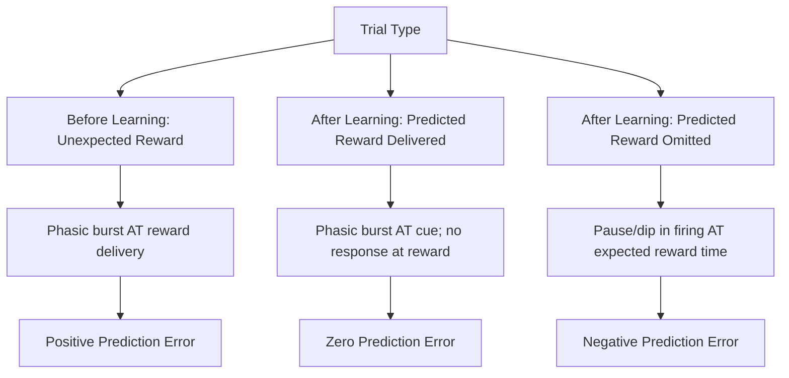

## Dopamine and Reward Prediction Error

### Overview

Reward prediction error (RPE) theory describes how midbrain dopamine neurons encode not the absolute magnitude of a reward, but the discrepancy between an expected and an actually received outcome. This finding, established primarily through single-unit electrophysiological recordings in non-human primates by Wolfram Schultz and colleagues beginning in the early-to-mid 1990s, is one of the most influential and well-replicated results in neuroeconomics, providing a direct, mechanistic bridge between a formal computational learning algorithm (temporal difference learning) and a specific, identifiable neural signal.

### The Core Finding

Schultz's experiments recorded from dopaminergic neurons in the ventral tegmental area (VTA) and substantia nigra pars compacta (SNc) of monkeys performing simple conditioning tasks pairing a cue (e.g., a light or tone) with a subsequent reward (typically fruit juice). Three canonical firing patterns emerged, depending on the relationship between expectation and outcome:

**1. Unexpected reward (positive prediction error)**

Before learning, when a reward is delivered unexpectedly (with no predictive cue), dopamine neurons fire a strong phasic burst at the time of reward delivery.

**2. Fully predicted reward (zero prediction error)**

After learning, once a cue reliably predicts the reward, the phasic burst shifts backward in time to occur at the *cue*, not the reward itself. If the reward then arrives exactly as predicted, there is little or no additional phasic response at reward delivery — the outcome was already "expected," so the error term is approximately zero.

**3. Omitted or worse-than-expected reward (negative prediction error)**

If a cue predicts a reward but the reward is withheld or is smaller than expected, dopamine neurons show a pause or depression in firing below their baseline (tonic) rate, precisely timed to when the reward was expected to occur.

### Formal Model: Temporal Difference Learning

The dopaminergic RPE signal closely matches the error term in **temporal difference (TD) learning**, a reinforcement-learning algorithm originally developed in computer science (notably by Richard Sutton) independently of the neuroscience findings, with the correspondence identified and formalized primarily by Schultz, Peter Dayan, and Read Montague in influential papers from the mid-to-late 1990s.

The basic TD error at time $t$ is expressed as:

$$\delta_t = r_t + \gamma V(s_{t+1}) - V(s_t)$$

Where:

- $\delta_t$ is the prediction error (proposed to correspond to phasic dopamine firing)
- $r_t$ is the reward received at time $t$
- $V(s_t)$ is the estimated value of the current state
- $V(s_{t+1})$ is the estimated value of the subsequent state
- $\gamma$ is a discount factor (weighting future value relative to immediate reward), where $0 \le \gamma \le 1$

Learning proceeds by using this error signal to update the value estimate of the preceding state or cue:

$$V(s_t) \leftarrow V(s_t) + \alpha \delta_t$$

Where $\alpha$ is a learning rate parameter controlling how much a single prediction error updates the stored value estimate. This update rule allows an agent (biological or artificial) to progressively learn accurate value predictions purely from the pattern of prediction errors experienced over repeated trials, without requiring an explicit model of the environment's full structure.

### Diagram: Dopamine Firing Across Learning Stages

### Neuroanatomical Circuit

The primary dopaminergic pathways implicated in RPE signaling are:

- **Mesolimbic pathway**: Projects from the VTA to the ventral striatum (particularly the nucleus accumbens), implicated in reward valuation, motivation, and the "wanting" component of reward processing.
- **Mesocortical pathway**: Projects from the VTA to the prefrontal cortex, implicated in integrating reward signals with executive function, planning, and goal-directed behavior.
- **Nigrostriatal pathway**: Projects from the SNc to the dorsal striatum, more strongly implicated in motor control and the encoding of action values / habit formation than in the phasic RPE signal itself, though it is affected by dopaminergic dysfunction in movement disorders.

### Relevance to Behavioral Economics and Decision-Making

**Learning and updating expectations**

RPE theory provides a mechanistic account of how individuals update their expectations about rewards (financial, social, or otherwise) through experience, offering a biological grounding for reference-dependent models in behavioral economics, where current evaluations are shaped by a previously formed reference point (as in prospect theory).

**Addiction and pathological reward-seeking**

Many addictive substances (e.g., cocaine, amphetamines) directly or indirectly amplify dopaminergic signaling, producing pharmacologically inflated positive prediction errors that are argued to drive maladaptive, compulsive reinforcement learning toward drug-seeking behavior, a model with substantial influence in addiction neuroscience. [Inference: this "hijacked learning signal" account is influential but not the only model of addiction, and other researchers emphasize additional mechanisms such as habit formation, incentive salience distinct from prediction error per se, and stress-related dysregulation.]

**Gambling and variable reinforcement**

The strong, sustained phasic dopamine responses associated with unpredictable, variable-ratio reward schedules (as in slot machines) are frequently cited as a neurobiological contributor to the particular reinforcing power of gambling, since maximal, sustained RPE signaling occurs precisely when outcomes are uncertain rather than either fully predictable or fully random. [Inference: while this connects plausibly to established RPE mechanisms, the specific claim that variable-ratio schedules produce measurably larger cumulative RPE-driven reinforcement in gambling contexts specifically is an extrapolation from the core electrophysiological findings rather than a finding established by the original primate studies themselves.]

**Consumer behavior and marketing**

Behavioral economists and marketing researchers have drawn on RPE theory to explain phenomena such as the appeal of surprise rewards, loyalty program "surprise and delight" tactics, and the diminishing satisfaction from fully anticipated, routine purchases (since a fully predicted reward generates a near-zero prediction error and correspondingly less phasic dopaminergic reinforcement than a comparable unexpected reward).

### Distinguishing "Wanting" from "Liking"

An important refinement to naive dopamine-reward theory, developed primarily by Kent Berridge and Terry Robinson, distinguishes:

- **"Wanting" (incentive salience)**: The motivational pull toward a reward-predicting stimulus, closely associated with dopaminergic signaling.
- **"Liking" (hedonic impact)**: The actual pleasurable experience of consuming a reward, associated more with opioid and endocannabinoid systems than dopamine specifically.

This distinction is significant because it implies dopamine's role is better characterized as driving motivated pursuit and prediction-based learning rather than hedonic pleasure itself — a person or animal can show dopamine-driven "wanting" for a stimulus without a corresponding increase in subjective "liking," a dissociation with particular relevance to compulsive and addictive behavior where wanting appears to persist or intensify even as liking diminishes.

### Limitations and Critiques

- **Overgeneralization risk**: While the core RPE finding is robust and well-replicated in the specific paradigms it was derived from (simple Pavlovian and instrumental conditioning tasks), extending the model to complex, real-world, multi-attribute human economic decisions (e.g., stock market investment, major purchase decisions) involves substantial additional assumptions that go beyond what the original primate electrophysiology directly demonstrates. [Inference]
- **Not the sole reward-relevant neurotransmitter system**: Serotonin, opioids, and endocannabinoids all play significant, partially distinct roles in reward and motivation, meaning dopaminergic RPE, while central, is not a complete account of the neurochemistry of reward.
- **Heterogeneity of dopamine neuron populations**: More recent research has identified that dopamine neurons are not a fully homogeneous population encoding a single unified RPE signal; some subpopulations show more selective sensitivity to particular reward or aversive dimensions, complicating the original, simpler unitary RPE model. [Inference: this reflects an active area of refinement in current neuroscience literature rather than the original, simpler formulation, which remains a broadly accurate approximation for many purposes.]
- **Species and translational caution**: The foundational data comes primarily from non-human primate electrophysiology; while substantial converging human neuroimaging and pharmacological evidence supports analogous mechanisms in humans, direct single-neuron confirmation in humans is limited to rare clinical recording opportunities (e.g., during neurosurgical procedures), warranting some caution in directly equating monkey and human dopaminergic mechanisms in full detail.

### Related Topics

- Neural correlates of value and reward
- Reinforcement learning and temporal difference models
- Prospect theory and reference-dependence
- Addiction neuroscience and incentive salience
- Variable-ratio reinforcement schedules
- Wanting vs. liking (Berridge & Robinson)
- Mesolimbic and mesocortical dopamine pathways