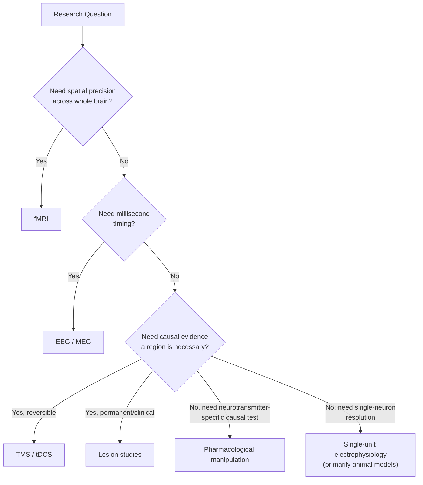

## Neuroimaging Methods in Economic Decision-Making

### Overview

Neuroimaging methods provide the primary empirical toolkit through which neuroeconomics investigates the brain mechanisms underlying valuation, risk assessment, and choice in humans. Because most economic decisions of interest — investment choices, consumption trade-offs, social bargaining — cannot ethically or practically be studied via invasive single-neuron recording in humans, the field relies heavily on non-invasive and minimally invasive imaging and stimulation techniques, each offering a different trade-off between spatial resolution, temporal resolution, invasiveness, and causal inferential power.

### Functional Magnetic Resonance Imaging (fMRI)

**Principle**: fMRI measures the blood-oxygen-level-dependent (BOLD) signal, an indirect proxy for regional neural activity based on the fact that active neural tissue triggers a local increase in blood flow and oxygenated hemoglobin concentration, which alters the local magnetic environment detectably by the scanner.

**Application in economic decision-making**: fMRI is the dominant method in neuroeconomics research, used extensively to identify brain regions correlating with subjective value, risk, ambiguity, social preferences, and self-control during tasks such as intertemporal choice, gambling tasks, and economic games (Ultimatum Game, Trust Game, Dictator Game).

**Strengths**:

- Whole-brain coverage in a single session, allowing simultaneous examination of cortical and subcortical regions (striatum, prefrontal cortex, insula, amygdala).
- Good spatial resolution (typically several millimeters), enabling localization to specific anatomical structures.
- Non-invasive, permitting large-sample human studies and repeated-measures designs.

**Limitations**:

- Poor temporal resolution (the BOLD hemodynamic response unfolds over several seconds, far slower than the millisecond timescale of actual neural firing), limiting the ability to resolve rapid sequential cognitive processes.
- Measures a correlate (blood oxygenation), not neural activity directly, introducing interpretive uncertainty about the precise neural events underlying an observed signal change.
- Susceptible to motion artifacts and physiological noise, and analysis involves substantial statistical processing choices (smoothing, multiple-comparisons correction, region-of-interest definition) that can affect reported findings — a source of the "researcher degrees of freedom" concern raised in methodological critiques of fMRI research generally. [Inference]

### Electroencephalography (EEG) and Magnetoencephalography (MEG)

**Principle**: EEG measures electrical potentials at the scalp generated by synchronized post-synaptic activity of large neuronal populations; MEG measures the associated magnetic fields, offering somewhat better spatial resolution than EEG due to reduced signal distortion by the skull.

**Application**: Used to study the precise timing of decision-related neural events — for example, event-related potential (ERP) components such as the feedback-related negativity (FRN), which occurs approximately 200–300 ms after outcome feedback and is modulated by whether an outcome is better or worse than expected, providing a millisecond-resolution electrophysiological marker closely related to the reward-prediction-error concept established in single-unit dopamine research.

**Strengths**:

- Excellent temporal resolution (millisecond-scale), well suited to tracking the time course of rapid cognitive events such as outcome evaluation.
- Directly measures electrical (EEG) or magnetic (MEG) signals generated by neural activity, rather than an indirect hemodynamic proxy.

**Limitations**:

- Poor spatial resolution, particularly for EEG, due to signal distortion as electrical activity passes through the skull and scalp; MEG offers improved but still limited spatial precision relative to fMRI.
- Limited sensitivity to activity in deep subcortical structures (e.g., striatum, amygdala) that are of central interest in reward-related neuroeconomics, since signals from deep sources are attenuated and difficult to localize accurately.

### Single-Unit and Multi-Unit Electrophysiology

**Principle**: Microelectrodes record the firing activity of individual neurons or small clusters of neurons directly.

**Application**: The primary method used in non-human primate studies establishing foundational neuroeconomic findings, including Wolfram Schultz's dopamine reward-prediction-error research and subsequent studies characterizing value-coding neurons in the orbitofrontal cortex and parietal cortex.

**Strengths**:

- Highest possible spatial and temporal precision, capable of isolating the activity of single identified neurons with millisecond timing.
- Enables direct testing of computational models (e.g., temporal difference learning) against actual firing patterns.

**Limitations**:

- Invasive; in humans, largely restricted to rare clinical opportunities such as recordings taken during epilepsy surgery or deep brain stimulation electrode placement, severely limiting sample sizes and generalizability.
- The bulk of single-unit data in neuroeconomics comes from non-human primates, requiring caution when extrapolating findings to full human economic cognition.

### Lesion and Neuropsychological Studies

**Principle**: Examines decision-making behavior in individuals with naturally occurring or surgically induced damage to specific brain regions, allowing causal (rather than merely correlational) inference about a region's necessity for a given function.

**Application**: Studies of patients with ventromedial prefrontal cortex damage (building on Antonio Damasio's influential work following the historical case of Phineas Gage) demonstrated that vmPFC damage produces markedly impaired real-world financial and social decision-making despite intact general intelligence and working memory, providing causal evidence for the region's role in value-based choice that fMRI correlational data alone cannot establish.

**Strengths**:

- Provides causal, not merely correlational, evidence regarding a brain region's necessity for a specific decision-making function.

**Limitations**:

- Naturally occurring lesions are rare, heterogeneous in size and location, and often affect multiple functionally distinct regions simultaneously, complicating precise functional attribution.
- Findings from a small number of case studies or case series carry inherent limits on statistical generalizability.

### Pharmacological Manipulation

**Principle**: Administering agents that enhance, block, or otherwise modulate specific neurotransmitter systems (dopamine, serotonin, oxytocin, cortisol) to causally test their role in decision-making.

**Application**: Studies administering dopamine agonists/antagonists to healthy volunteers or patients with Parkinson's disease (who have depleted dopamine and are sometimes treated with dopaminergic medication) have been used to probe dopamine's causal role in reward learning, risk-taking, and impulsivity; oxytocin administration studies have examined effects on trust and prosocial economic-game behavior.

**Strengths**:

- Provides causal manipulation of a specific, identified neurochemical system in humans, complementing correlational imaging data.

**Limitations**:

- Most pharmacological agents act systemically across the brain (and body) rather than on a single localized circuit, making it difficult to attribute observed behavioral effects to any one specific region or pathway.
- Individual variability in drug metabolism, baseline neurochemistry, and dosage-response relationships introduces substantial noise into pharmacological studies. [Inference]

### Non-Invasive Brain Stimulation (TMS and tDCS)

**Principle**: Transcranial magnetic stimulation (TMS) uses magnetic pulses to induce electrical currents that temporarily excite or inhibit activity in targeted cortical regions; transcranial direct current stimulation (tDCS) applies a weak, constant electrical current to modulate cortical excitability over a sustained period.

**Application**: Used to causally test the necessity of specific cortical regions (typically the dlPFC or vmPFC, given their surface accessibility) for economic decision-making functions — for example, temporarily disrupting dlPFC activity has been shown in some studies to increase impulsive, present-biased choice in intertemporal decision tasks, consistent with the region's proposed role in self-control.

**Strengths**:

- Non-invasive causal manipulation achievable in healthy human volunteers, avoiding the need for clinical lesion populations.
- Reversible and temporary, allowing within-subject sham-controlled experimental designs.

**Limitations**:

- Limited penetration depth restricts direct stimulation to cortical surface regions; deep structures central to reward processing (striatum, amygdala, VTA) cannot be directly targeted, only indirectly influenced via connected cortical circuits.
- Effect sizes and reliability can vary considerably across studies and stimulation parameters (intensity, duration, electrode placement). [Inference]

### Diagram: Method Selection by Research Question

### Common Experimental Paradigms Combined with These Methods

- **Intertemporal choice tasks**: Present choices between smaller-sooner and larger-later rewards, used to study discounting and self-control, typically combined with fMRI or TMS/tDCS.
- **Economic games**: Ultimatum Game, Trust Game, Dictator Game, and Public Goods Game, used to study fairness, reciprocity, and social preferences, frequently combined with fMRI, pharmacological manipulation (e.g., oxytocin), or EEG (for outcome-evaluation ERP components).
- **Gambling and risk tasks**: Present choices among options with varying probabilities and magnitudes of gain/loss, used to study risk and ambiguity attitudes, typically paired with fMRI or single-unit recording in animal analogues.
- **Reversal learning tasks**: Require updating learned reward associations as reward contingencies change, used to probe reward-prediction-error signaling and its neural substrates, often combined with fMRI or single-unit recording.

### Cross-Method Convergence as a Standard of Evidence

Because each individual method carries distinct limitations, contemporary neuroeconomics research is generally regarded as most persuasive when a proposed neural mechanism is supported by **converging evidence across multiple methods** — for example, a value signal identified via fMRI in the vmPFC that is further supported by impaired value-based choice following vmPFC lesions, and by altered vmPFC-linked choice behavior following pharmacological modulation of a relevant neurotransmitter system. Findings resting on a single method and a single study are generally treated with more caution than multiply-converging findings. [Inference: this is a widely endorsed methodological norm in the field rather than a strictly formalized requirement, and the degree of convergence achieved varies considerably across specific research questions.]

### Limitations and Critiques

- **Reverse inference**: A persistent methodological concern across fMRI-based neuroeconomics is the risk of inferring a specific cognitive process from regional activation alone, since most brain regions participate in multiple distinct cognitive functions, and activation in a given region does not uniquely confirm the presence of any single interpreted process.
- **Small sample sizes in early literature**: Many influential early fMRI neuroeconomics studies (2000s era) used sample sizes now considered underpowered by contemporary standards, raising replication concerns consistent with broader statistical power critiques in social and cognitive neuroscience. [Inference]
- **Ecological validity**: Most neuroimaging paradigms involve simplified, abstracted decision tasks (choosing between small monetary gambles) conducted inside a scanner, which may not fully capture the complexity, stakes, or context of real-world major economic decisions (e.g., home purchases, retirement savings), limiting generalizability. [Inference]
- **Cost and accessibility constraints**: fMRI, MEG, and TMS/tDCS equipment and operating costs are substantial, which can limit sample sizes, restrict research to well-funded institutions, and constrain the diversity of populations studied relative to purely behavioral economics research.

### Related Topics

- Neural correlates of value and reward
- Dopamine and reward prediction error
- The Ultimatum Game and social preferences
- Intertemporal choice and hyperbolic discounting
- Ambiguity aversion and the Ellsberg paradox
- Reverse inference problem in cognitive neuroscience
- Reinforcement learning and temporal difference models