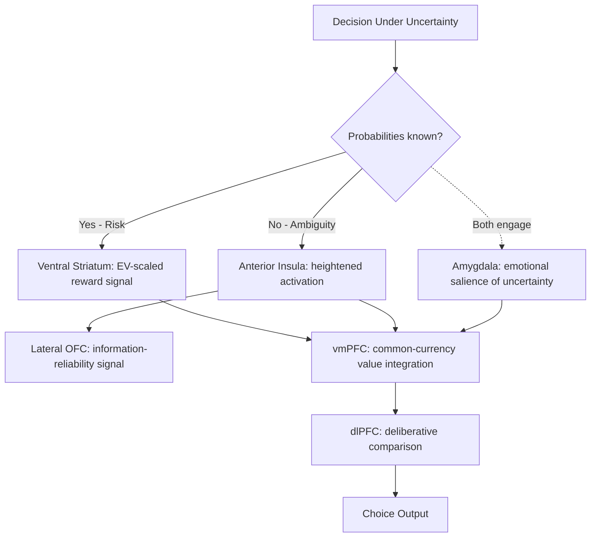

## The Neural Basis of Risk and Ambiguity Processing

### Overview

A central finding in neuroeconomics is that the brain treats decision-making under **risk** (outcomes with known probabilities) and decision-making under **ambiguity** (outcomes with unknown or poorly specified probabilities) as at least partially dissociable processes, engaging overlapping but non-identical neural circuits. This dissociation provides a biological substrate for the behavioral distinction long recognized in decision theory — most notably formalized in the **Ellsberg paradox** (Daniel Ellsberg, 1961), which demonstrated that people systematically prefer known probabilities over unknown ones even when expected values are identical, a pattern inconsistent with classical subjective expected utility theory.

### Conceptual Distinction: Risk vs. Ambiguity

| Dimension | Risk | Ambiguity |
| --- | --- | --- |
| Probability information | Known, well-specified (e.g., "50% chance") | Unknown or vaguely specified (e.g., "unknown proportion of red vs. black balls") |
| Classical economic treatment | Modeled via expected utility theory with defined probabilities | Not well-accommodated by classical subjective expected utility theory |
| Behavioral finding | Risk aversion (concave utility over gains) | Ambiguity aversion — a further, independent aversion beyond risk aversion alone |
| Formal decision-theoretic response | Expected utility theory (von Neumann-Morgenstern) | Alternative models: Choquet expected utility, maxmin expected utility, smooth ambiguity models |

### The Ellsberg Paradox as Behavioral Foundation

Ellsberg's classic thought experiment presents two urns: Urn A contains 50 red and 50 black balls (known proportions — risk); Urn B contains 100 red and black balls in an unknown proportion (ambiguity). Most people prefer betting on a color drawn from Urn A over Urn B, even though the objective expected value of betting on either color is identical for both urns under a neutral prior. This preference for known over unknown probabilities — "ambiguity aversion" — cannot be explained by risk aversion alone, since risk aversion concerns the *variance* of a known probability distribution, not the *absence* of a specified distribution altogether.

### Key Neural Regions Implicated

**Anterior insula**

Consistently identified across multiple neuroimaging studies as showing greater activation during ambiguous choices compared to equivalently risky choices, and insula activity has been linked to individual differences in the degree of ambiguity aversion exhibited — people with stronger insula responses to ambiguity tend to show greater behavioral ambiguity aversion. The insula is also implicated more generally in interoceptive awareness (sensing internal bodily states) and negative affect anticipation, consistent with a proposed role in signaling an aversive, uncertainty-related bodily/affective state that discourages ambiguous choices.

**Lateral orbitofrontal cortex (lOFC)**

Shows differential engagement specifically during ambiguous decisions in several studies, and has been proposed to play a role distinct from the more medial OFC/vmPFC regions associated with general value computation, potentially reflecting a specialized role in representing the reliability or precision of available information.

**Amygdala**

Implicated in both risk and ambiguity processing, though its role is less specifically tied to the risk-versus-ambiguity distinction than the insula's; more broadly associated with encoding the emotional salience of uncertain or potentially aversive outcomes.

**Dorsolateral prefrontal cortex (dlPFC)**

Associated with the more deliberative evaluation and comparison of both risky and ambiguous options; disruption of dlPFC activity via TMS in some studies has been shown to shift choice behavior, though findings regarding its specific differential role in ambiguity versus risk processing are less consistent than those for the insula. [Inference: the dlPFC's precise, differentiated contribution to ambiguity versus risk processing specifically remains a more actively debated question in the literature than the insula's role.]

**Ventral striatum**

Shows reward-related activation scaling with expected value under both risk and ambiguity, but several studies report that this scaling is attenuated or discounted under ambiguity relative to an equivalent-expected-value risky option, providing a neural correlate consistent with reduced subjective valuation of ambiguous prospects.

### Diagram: Risk vs. Ambiguity Neural Processing

### Formal Models Motivated by the Neural and Behavioral Dissociation

**Choquet Expected Utility (Schmeidler, 1989)**

Replaces standard additive probability weighting with a non-additive "capacity" function, allowing systematic pessimism (or optimism) toward ambiguous events to be formally represented.

**Maxmin Expected Utility (Gilboa & Schmeidler, 1989)**

Models an ambiguity-averse decision-maker as evaluating an ambiguous option according to its *worst-case* probability distribution among a set of plausible distributions, formally capturing a "pessimistic" response to ambiguity consistent with the Ellsberg pattern.

**Smooth Ambiguity Model (Klibanoff, Marinacci & Mukerji, 2005)**

Introduces a second-order probability distribution over possible first-order probability distributions, combined with a separate utility function capturing attitude toward this second-order uncertainty, allowing ambiguity aversion to be modeled with smoother, more flexible functional properties than the maxmin approach.

[Note: These are standard, well-established formal models in decision theory; their mathematical structure is documented and not merely inferential, though the question of which model best captures actual human neural and behavioral data for any specific task remains an active empirical research question.]

### Individual and Contextual Variation

**Domain-specific ambiguity attitudes**

Neuroimaging and behavioral studies suggest ambiguity aversion is not a single unified trait but can vary substantially across domains (financial, medical, social), with insula-related activation patterns differing depending on the decision domain. [Inference]

**Clinical populations**

Altered ambiguity processing has been reported in some studies of individuals with anxiety disorders (heightened ambiguity aversion, consistent with amplified insula reactivity to uncertainty) and in certain populations with orbitofrontal or insula damage (reduced or abolished ambiguity aversion), providing further causal-lesion-based support for these regions' roles. [Inference: findings in clinical populations are based on a more limited body of research than the healthy-population neuroimaging literature and should be treated as suggestive rather than fully established.]

**Aging**

Some research suggests age-related changes in ambiguity tolerance and corresponding shifts in insula and prefrontal engagement during ambiguous decision-making, though findings are not fully consistent across studies. [Inference]

### Relevance to Applied Economic Contexts

**Financial decision-making**

Ambiguity aversion is often invoked to explain the "home bias" puzzle in international finance (investors' tendency to overweight domestic, more familiar/less ambiguous assets relative to what portfolio theory alone would predict) and broader patterns of under-investment in novel or poorly understood financial instruments.

**Insurance and risk communication**

Understanding neural ambiguity aversion informs the design of risk communication (e.g., in medical or financial contexts), since presenting information in a way that reduces perceived ambiguity (providing a specific probability estimate rather than a vague range) can shift decision-making even when the underlying substantive risk is unchanged.

**Innovation adoption and "unknown unknowns"**

Ambiguity aversion has been proposed as a contributing mechanism behind slow adoption of novel technologies or unfamiliar financial products, where the *absence* of a well-established track record (and therefore known probability distribution of outcomes) may deter adoption independent of the technology's genuine expected value. [Inference]

### Limitations and Critiques

- **Task and framing dependence**: The degree and even direction of measured ambiguity aversion can vary depending on specific experimental framing, elicitation method, and stakes, raising questions about how stable and context-independent the underlying neural mechanism truly is. [Inference]
- **Reverse inference risk**: As with much of fMRI-based neuroeconomics, attributing a specific cognitive interpretation ("ambiguity aversion") to insula activation risks reverse-inference error, since the insula is implicated in numerous other processes (interoception, disgust, general arousal) beyond ambiguity processing specifically.
- **Model selection remains unresolved**: While multiple formal models (Choquet, maxmin, smooth ambiguity) can each fit certain behavioral patterns, no single model has achieved universal empirical consensus as uniquely correct across all contexts and populations, and the neural data alone has not definitively adjudicated between these competing formalizations. [Inference]
- **Sample and generalizability limitations**: Much of the foundational neuroimaging evidence comes from relatively small, often WEIRD (Western, Educated, Industrialized, Rich, Democratic) university samples performing abstract laboratory gambling tasks, limiting confidence in generalizing precise findings to broader populations and real-world high-stakes decisions. [Inference]

### Related Topics

- Neural correlates of value and reward
- Neuroimaging methods in economic decision-making
- The Ellsberg paradox and ambiguity aversion
- Prospect theory and probability weighting
- Home bias in international portfolio investment
- Choquet expected utility and non-additive probability models
- Risk communication in medical and financial decision-making