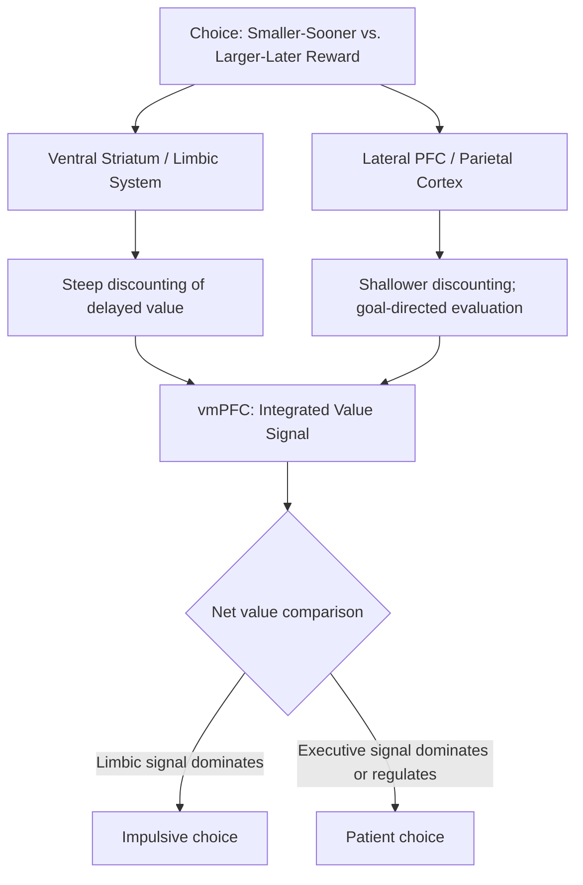

## The Neuroscience of Self-Control

### Overview

The neuroscience of self-control examines the neural mechanisms that allow individuals to override immediate impulses, resist temptation, and pursue longer-term goals in the face of competing short-term rewards. In neuroeconomics, this domain is closely tied to the study of intertemporal choice — decisions involving trade-offs between smaller-sooner and larger-later rewards — and provides a biological account for behavioral phenomena such as hyperbolic discounting, present bias, and preference reversals that classical exponential-discounting economic models struggle to explain.

### The Dual-Systems Framework

A foundational, though later refined, model in this literature proposes that self-control reflects a dynamic competition between two partially dissociable neural systems:

**The "impulsive" or limbic system**

Associated with the ventral striatum and other limbic/paralimbic structures, this system is proposed to respond preferentially to immediate, concrete rewards and to discount delayed rewards steeply.

**The "deliberative" or executive system**

Associated with the lateral prefrontal cortex (particularly dorsolateral prefrontal cortex, dlPFC) and posterior parietal cortex, this system is proposed to evaluate delayed rewards and support goal-directed, patient choice, and to exert top-down regulatory control over the impulsive system's output.

This framework was substantially shaped by an influential 2004 study (McClure, Laibson, Loewenstein, and Cohen) using fMRI during an intertemporal choice task, which found that choices involving an immediately available reward preferentially engaged limbic/paralimbic regions, while all choices (immediate or delayed) engaged lateral prefrontal and parietal regions, with the relative balance of activation across these regions predicting the degree of impatience in the choice made.

[Inference: While highly influential and widely cited, this strict two-system dichotomy has been substantially refined and partially challenged by subsequent research using more sophisticated computational modeling approaches (e.g., single-system models where a unified value signal is computed with different weighting parameters rather than requiring two competing systems). Contemporary neuroeconomics generally treats the dual-systems account as a useful heuristic and historically important framework rather than a fully settled, uncontested model of the underlying computation.]

### Diagram: Self-Control as Value Competition

### Key Brain Regions in Self-Control

**Dorsolateral prefrontal cortex (dlPFC)**

Central to cognitive control broadly, including the capacity to hold goals in working memory and exert top-down modulation over value signals computed elsewhere. TMS studies disrupting dlPFC activity have been shown in several studies to shift choice behavior toward greater impatience, providing causal (not merely correlational) support for its regulatory role.

**Ventromedial prefrontal cortex (vmPFC)**

Rather than representing one side of a "impulsive vs. deliberative" dichotomy, the vmPFC is more commonly interpreted as computing an integrated, common-currency subjective value signal that already incorporates the net influence of both limbic and executive inputs — self-control failures may partly reflect a failure to adequately incorporate future-oriented executive input into this final value computation, rather than the vmPFC being a purely "impulsive" region itself.

**Inferior frontal gyrus / right inferior frontal cortex**

Frequently implicated in general response inhibition tasks (e.g., the Stop-Signal Task, the Go/No-Go task), which are related to but conceptually distinct from intertemporal self-control — response inhibition concerns halting an already-initiated motor response, whereas intertemporal self-control concerns the evaluative comparison of delayed versus immediate rewards. [Inference: the degree of shared neural mechanism between these two related-but-distinct constructs of "self-control" remains an active area of investigation.]

**Anterior cingulate cortex (ACC)**

Implicated in conflict monitoring and detecting when competing response tendencies (e.g., impulsive versus patient choice) are in tension, potentially signaling the need for increased cognitive control recruitment from the dlPFC.

### Self-Control as Value Modulation, Not a Separate Faculty

An influential alternative to the strict dual-systems view, developed substantially through work by Todd Hare, Colin Camerer, and Antonio Rangel, proposes that self-control does not require a wholly separate "willpower" faculty overriding value computation, but instead reflects the dlPFC modulating the inputs that feed into a single, unified vmPFC value signal. In this account, successful self-control (e.g., resisting an unhealthy food choice in favor of a healthier one) corresponds to the dlPFC increasing the *weight* given to health-relevant attributes (or future-oriented considerations) within the vmPFC's value computation, rather than a separate system "battling" and defeating an impulsive signal. This reframes self-control as a matter of *what information is weighted* in a common valuation process, rather than a contest between fundamentally distinct value systems. [Inference: this "value modulation" account and the earlier strict dual-systems account are both actively represented in the current literature, with ongoing debate about which better captures the underlying computation across different task contexts.]

### Neurochemical Modulators of Self-Control

**Dopamine**

Beyond its role in reward prediction error, dopaminergic tone in prefrontal circuits is implicated in working memory and cognitive control capacity, with both insufficient and excessive dopaminergic signaling associated with impaired executive function (an inverted-U relationship commonly reported in the pharmacology of prefrontal cognition).

**Serotonin**

Pharmacological studies manipulating serotonin levels (e.g., via tryptophan depletion) have found effects on impulsivity and intertemporal discounting in some studies, suggesting a role for serotonergic signaling in patience and impulse control, though findings across studies are not fully consistent. [Inference]

**Cortisol and stress hormones**

Acute stress and elevated cortisol have been associated in several studies with a shift toward more impulsive, present-biased choice and reduced prefrontal regulatory engagement, consistent with behavioral findings that stress and cognitive load tend to increase susceptibility to temptation. [Inference]

### Applications to Behavioral Economics Phenomena

**Hyperbolic discounting and preference reversals**

The dual-systems and value-modulation frameworks both provide candidate neural mechanisms for why people exhibit hyperbolic rather than exponential discounting — a pattern where the relative preference for a smaller-sooner reward over a larger-later one can reverse depending on whether both options are immediate or both are shifted equally into the future, a behavioral pattern difficult to reconcile with a single, time-consistent discount rate.

**Cognitive load and depletion effects**

Some studies report that engaging cognitive control resources on one task (e.g., a demanding working-memory task) can reduce self-control performance on a subsequent, unrelated task, historically discussed under the "ego depletion" framework; however, this specific framework has faced substantial replication challenges in recent years, and the field has moved toward more cautious interpretations emphasizing motivational and attentional shifts rather than a literal depletable resource. [Inference: the "ego depletion as a limited resource" model specifically is now considered contested rather than well-established, though the broader observation that self-control performance varies with cognitive and motivational state remains an active research area.]

**Commitment devices**

The neuroscience of self-control provides a mechanistic rationale for behavioral-economic commitment devices (e.g., pre-committing to a savings plan, or Ulysses contracts), since these devices function by removing the option for the "impulsive" evaluation to occur at the moment of temptation, effectively shifting the decision to a moment when deliberative, future-oriented valuation dominates.

### Limitations and Critiques

- **Model ambiguity**: As noted, the field has not converged on a single, universally accepted computational and neural account of self-control — the dual-systems and value-modulation frameworks each have empirical support and each face specific challenges, and the correct characterization likely varies by task and context. [Inference]
- **Ego depletion replication concerns**: A substantial portion of earlier self-control neuroscience drew on the ego-depletion behavioral paradigm, which has faced significant replication difficulties in large-scale, pre-registered studies since approximately 2015, warranting caution in relying on findings that assume this framework as a settled premise.
- **Task-specificity of "self-control" measures**: Different experimental paradigms (delay discounting tasks, Stop-Signal tasks, dietary choice tasks) are all labeled as measuring "self-control" but may engage only partially overlapping neural and cognitive mechanisms, complicating efforts to draw unified conclusions across the literature. [Inference]
- **Individual and state variability**: Self-control-related neural engagement shows substantial individual variability (related to trait impulsivity, age, and clinical status) and within-person state variability (related to stress, fatigue, and motivation), meaning findings from any single study or population should not be assumed to generalize universally. [Inference]
- **Correlational limits of much fMRI evidence**: As with other neuroeconomic subfields, a substantial portion of self-control neuroscience evidence is correlational fMRI data; causal claims are better supported where converging TMS, lesion, or pharmacological evidence exists, which is available for only a subset of the proposed mechanisms.

### Related Topics

- Neural correlates of value and reward
- Dopamine and reward prediction error
- Intertemporal choice and hyperbolic discounting
- Commitment devices in behavioral economics
- Ego depletion and self-control resource models (and their replication challenges)
- Neuroimaging methods in economic decision-making
- Stress, cortisol, and decision-making under pressure