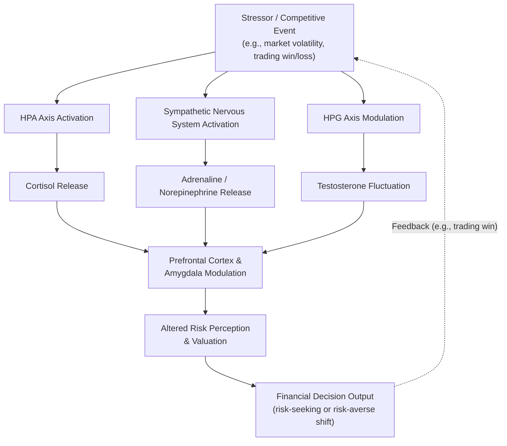

## Hormones, Stress, and Financial Risk-Taking

### Overview

This topic examines how endocrine (hormonal) signaling and the physiological stress response causally influence financial risk-taking and economic decision-making. This body of research extends neuroeconomics beyond neural circuitry alone to incorporate the broader biological systems — the hypothalamic-pituitary-adrenal (HPA) axis, the hypothalamic-pituitary-gonadal (HPG) axis, and the sympathetic-adreno-medullary (SAM) system — that regulate hormone release in response to environmental and psychological challenges, and that in turn modulate the neural circuits (striatum, prefrontal cortex, amygdala) implicated in valuation and risk processing.

### Key Hormonal Systems and Their Proposed Roles

**Cortisol and the HPA axis**

Cortisol is the primary "stress hormone" released via activation of the hypothalamic-pituitary-adrenal axis in response to physical or psychological stressors. Acute cortisol elevation has been associated in several studies with shifts toward more risk-averse financial choices in some experimental paradigms, while chronic, sustained cortisol elevation has been associated with impaired prefrontal regulatory function and, in some studies, increased impulsivity — an apparently divergent pattern that researchers have attempted to reconcile via a distinction between acute-adaptive and chronic-dysregulating effects of the same hormone. [Inference: findings on cortisol's precise directional effect on risk-taking are notably mixed across the literature, with some studies reporting increased risk aversion under acute stress and others reporting increased risk-seeking depending on task type, timing of hormone measurement relative to the stressor, and individual baseline cortisol reactivity; this remains an area without full scientific consensus.]

**Testosterone and the HPG axis**

Testosterone has been studied extensively in relation to financial risk-taking, competitive behavior, and status-seeking. A frequently cited line of research by John Coates and colleagues, studying professional traders on a London trading floor, found that traders' morning testosterone levels were associated with their subsequent daily trading profitability, and proposed a "winner effect" feedback loop in which trading success elevates testosterone, which in turn may increase risk appetite and confidence in subsequent trades — a potentially self-reinforcing cycle that Coates has argued could contribute to excessive risk-taking and boom-bust dynamics in financial markets. [Inference: this specific line of field research, while influential and widely discussed, involves a relatively small number of studies with modest sample sizes typical of field-based endocrinology research on trading floors; the causal direction and generalizability of the proposed "winner effect" to broader financial market dynamics remains a matter of ongoing scientific and interpretive debate rather than an established, uncontested finding.]

**Cortisol-to-testosterone ratio (the "dual-hormone hypothesis")**

Some researchers propose that the *ratio* between cortisol and testosterone, rather than either hormone in isolation, better predicts risk-taking and status-seeking behavior, with high testosterone combined with low cortisol associated with the greatest propensity for risk-taking and dominant behavior in some studies. [Inference: the dual-hormone hypothesis has produced a mixed replication record in the broader psychoendocrinology literature, and should be treated as a proposed refinement under active investigation rather than a fully settled finding.]

**Oxytocin**

Oxytocin, often studied in relation to social bonding and trust, has been examined in economic-game contexts (particularly the Trust Game), with several studies reporting that intranasal oxytocin administration increases trusting behavior toward other humans in an economic exchange context, though effects appear more specific to interpersonal trust than to general financial risk-taking involving non-social uncertainty (e.g., an impersonal lottery). [Inference: the broader oxytocin-and-trust literature has also faced notable replication challenges in some subsequent large-sample studies, and effect sizes reported in smaller original studies may not fully generalize.]

**Adrenaline (epinephrine) and the sympathetic-adreno-medullary (SAM) system**

Acute sympathetic nervous system activation (the "fight-or-flight" response), involving rapid adrenaline release, is associated with heightened physiological arousal that can influence risk perception and decision speed; some models propose this system operates on a faster timescale than the cortisol-mediated HPA axis response, contributing to immediate, rapid shifts in risk-related decision-making during acutely stressful situations distinct from the slower, more sustained hormonal effects of cortisol.

### Diagram: Hormonal Pathways Influencing Financial Decision-Making

### Sex Differences and Individual Variation

Some studies report sex differences in both baseline hormonal profiles and hormonal reactivity to financial stressors, with associated (though not universally consistent) differences in risk-taking behavior under stress; however, the broader literature on sex differences in financial risk-taking implicates multiple contributing factors beyond hormones alone (socialization, differential experience, self-selection into risk-taking professions), and disentangling the specific causal contribution of hormonal mechanisms from these other factors remains methodologically challenging. [Inference: given the complexity of this literature and its documented mixed and sometimes contested findings, sex-difference claims in this domain should be treated with particular caution and are not the primary focus of the more robust individual-level and within-subject hormonal findings described above.]

### Chronic Stress and Longer-Term Financial Behavior

Beyond acute hormonal fluctuations affecting single decisions, sustained exposure to chronic stress (e.g., financial hardship, job insecurity) has been associated in some studies with broader shifts in cognitive resources available for financial planning, sometimes discussed under the "scarcity mindset" or "bandwidth tax" framework (associated with research by Sendhil Mullainathan and Eldar Shafir), proposing that the cognitive load imposed by chronic financial scarcity itself consumes limited attentional and executive resources, potentially impairing the quality of financial decisions independent of any single hormonal mechanism. [Inference: while conceptually related to the hormonal stress literature, the scarcity/bandwidth framework operates at a more cognitive-behavioral level of description and its specific proposed mechanism has also faced replication scrutiny and refinement in subsequent research; it should be treated as one complementary strand within this broader literature rather than a fully unified single explanation alongside the hormonal findings above.]

### Applications to Financial Markets and Regulation

**Market volatility and collective hormonal dynamics**

Coates and colleagues have proposed that hormonally-mediated risk-appetite shifts occurring simultaneously across many market participants during periods of sustained gains (a market-wide "winner effect") or sustained losses (a market-wide stress/cortisol response) could contribute to the amplification of bull and bear market dynamics beyond what purely rational, hormonally-neutral models would predict. [Inference: this remains a theoretical and partially evidenced extrapolation from individual-level hormonal findings to aggregate market dynamics, and is best treated as a plausible contributing hypothesis rather than an empirically confirmed driver of specific historical market events.]

**Trading floor design and risk management**

Some of this research has been cited in discussions of trading floor management practices (e.g., considerations around rotation, rest periods, and monitoring for excessive risk-taking following winning streaks), reflecting a practical application of the proposed "winner effect" feedback loop, though the extent of formal adoption of such practices based specifically on this research varies across financial institutions. [Inference]

**Implications for individual investors**

At the individual level, awareness of acute stress and emotional-arousal effects on risk perception has informed general behavioral-finance advice to avoid major financial decisions during periods of acute emotional or physiological arousal (e.g., immediately following a large gain or loss), consistent with the broader proposed mechanism, though this specific advisory application is a reasonable extrapolation rather than something directly tested via controlled experiment in real-world investor populations. [Inference]

### Limitations and Critiques

- **Mixed and sometimes contradictory findings**: As noted throughout, several of the specific hormone-behavior relationships in this literature (cortisol's directional effect on risk-taking, the dual-hormone hypothesis, oxytocin-and-trust effects) show notably mixed results across studies, and some influential early findings have faced difficulty replicating at the effect sizes originally reported, a pattern consistent with broader replication concerns across social/behavioral endocrinology research.
- **Small field-study sample sizes**: Much of the most publicly discussed research in this domain (e.g., trading-floor testosterone studies) involves relatively small samples of a specialized, non-random population (professional traders at a single or few institutions), limiting statistical power and generalizability to broader populations of financial decision-makers.
- **Correlation versus causation in field studies**: Field studies measuring naturally occurring hormone levels alongside trading outcomes are correlational; establishing genuine causal direction (hormones causing risk-taking versus risk-taking/success causing hormone changes, or both influenced by a third factor) generally requires converging experimental (hormone administration) studies, which exist for only some of the hormones discussed here (most notably testosterone and oxytocin administration studies) and not universally across this entire research area.
- **Individual and contextual variability**: Hormonal effects on decision-making show substantial individual variation (related to baseline hormone levels, receptor sensitivity, prior experience) and are likely modulated by task context and stakes, meaning findings from one specific experimental paradigm should not be assumed to generalize uniformly across all financial decision contexts. [Inference]
- **Ethical and practical constraints on causal research**: Randomized hormone-administration studies in realistic, high-stakes financial decision-making contexts face substantial ethical and practical constraints, meaning much of the most policy-relevant evidence (real trading floor behavior) remains correlational rather than experimentally causal.

### Related Topics

- Neural correlates of value and reward
- The neuroscience of self-control
- Neuroimaging methods in economic decision-making
- The "winner effect" and status-seeking behavior
- Scarcity mindset and the bandwidth tax (Mullainathan & Shafir)
- The Trust Game and oxytocin research
- Behavioral finance and market volatility