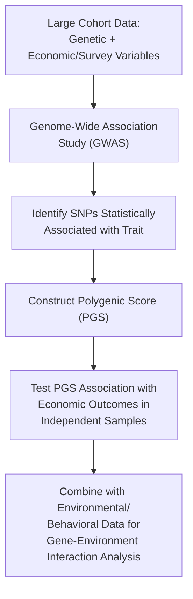

## Genoeconomics and Individual Differences

### Overview

Genoeconomics is an interdisciplinary research field examining the association between genetic variation and economic outcomes, preferences, and behaviors, including risk tolerance, time preference (patience/discounting), educational attainment, income, and financial decision-making more broadly. The field emerged from the intersection of behavioral genetics, molecular genetics, and economics, and has been substantially shaped by the availability of large-scale genome-wide association study (GWAS) datasets combined with economic and survey data, with prominent contributors including Daniel Benjamin, David Cesarini, and Philipp Koellinger, among others.

### Methodological Foundations

**Twin and family studies**

The earliest genoeconomics-relevant evidence came from classical behavioral genetics designs comparing monozygotic (identical) and dizygotic (fraternal) twins, using the differential genetic relatedness between twin types to estimate the proportion of variance in a trait attributable to genetic factors (heritability), shared environment, and non-shared environment. Twin studies of economic preferences (risk tolerance, patience, and various measures of financial behavior) have generally reported moderate heritability estimates, though estimates vary across specific traits, populations, and studies. [Inference: heritability estimates from twin studies carry well-known methodological caveats — including the "equal environments assumption" that MZ and DZ twins experience similarly correlated environments — that are actively debated within behavioral genetics as a field, independent of genoeconomics specifically.]

**Genome-wide association studies (GWAS)**

Building on twin-study evidence for genetic influence, GWAS approaches directly test for statistical associations between millions of common genetic variants (single nucleotide polymorphisms, or SNPs) across the genome and a measured economic trait or outcome, typically requiring very large sample sizes (often hundreds of thousands of individuals) to achieve adequate statistical power given the small effect size of any single genetic variant.

**Polygenic scores (PGS)**

Because individual genetic variants typically explain only a tiny fraction of variance in complex economic traits, researchers construct polygenic scores — a single composite index summarizing the estimated combined effect of many (often thousands to millions of) genetic variants — to capture a more substantial, though still generally modest, proportion of trait variance for research purposes.

### Diagram: Genoeconomics Research Pipeline

### Key Substantive Findings

**Educational attainment**

One of the most extensively studied genoeconomics outcomes, large-scale GWAS of educational attainment (notably studies coordinated through the Social Science Genetic Association Consortium) have identified thousands of genetic variants individually associated with small effects on years of schooling completed, with an aggregate polygenic score explaining a meaningful, though still modest, proportion of variance in educational attainment in independent samples. [Note: this is among the more robustly replicated findings in genoeconomics given the large sample sizes involved, though the proportion of variance explained by even well-powered polygenic scores remains substantially smaller than the total estimated heritability from twin studies — a gap often referred to as "missing heritability."]

**Risk tolerance and time preference**

GWAS of self-reported risk tolerance and measures of patience/time preference have identified specific genetic loci showing modest but statistically significant associations, with some overlap reported between genetic variants associated with risk tolerance and variants associated with other traits such as certain personality dimensions and some psychiatric conditions, suggesting shared underlying biological pathways across seemingly distinct traits. [Inference: given generally smaller sample sizes for risk-preference GWAS relative to educational-attainment GWAS, findings in this specific subdomain should be considered less robustly established and more subject to revision as sample sizes grow.]

**Financial decision-making and outcomes**

Some studies have examined polygenic score associations with financial behaviors such as savings behavior, investment portfolio choices, and debt, generally finding modest associations that are typically smaller in magnitude than those found for educational attainment, and that are substantially mediated by educational attainment and other socioeconomic pathways rather than reflecting a direct, independent genetic effect on financial behavior itself. [Inference]

### Gene-Environment Interaction

A central theme in genoeconomics is that genetic effects on economic outcomes are rarely, if ever, deterministic or independent of environmental context; rather, genetic predispositions are proposed to interact with environmental and institutional factors to jointly shape outcomes. For example, some studies suggest the association between a given polygenic score and educational attainment can vary depending on historical educational policy context, family socioeconomic resources, or broader social and institutional conditions, consistent with a gene-environment interaction framework rather than a simple, fixed genetic "determinism" interpretation. [Inference: while gene-environment interaction is a well-established general principle in behavioral genetics, the specific magnitude and consistency of such interaction effects for any particular economic trait is an active and evolving area of research with findings that vary across studies and cohorts.]

### Applications and Proposed Uses

**Refining models of preference heterogeneity**

Genoeconomics findings are sometimes used to inform theoretical economic models of preference heterogeneity, providing an additional empirical basis (alongside experimental and survey-based approaches) for understanding why individuals differ systematically in risk tolerance, patience, and related economic parameters.

**Mendelian randomization for causal inference**

Because genetic variants are fixed at conception and (under certain assumptions) are not subject to reverse causation from later-life outcomes, some researchers use genetic variants as "instrumental variables" in a technique called Mendelian randomization, aiming to draw more robust causal inferences about the relationship between an economic trait (e.g., education) and a health or behavioral outcome than would be possible using purely observational data alone. [Note: Mendelian randomization is a well-established and widely used technique in genetic epidemiology broadly; its specific application to economic questions is a smaller but active subfield, and the validity of any specific Mendelian randomization analysis depends on satisfying assumptions (e.g., no pleiotropy — the genetic variant affecting the outcome only through the exposure of interest) that require careful methodological justification in each application.]

### Limitations and Critiques

- **Small individual effect sizes and "missing heritability"**: Even well-powered polygenic scores for economic traits typically explain a meaningfully smaller proportion of outcome variance than twin-study heritability estimates would suggest is genetically influenced, a persistent "missing heritability" gap attributed to factors including rare variants not well captured by common-SNP GWAS, gene-gene interactions, and gene-environment interactions not fully modeled in standard GWAS approaches.
- **Population and ancestry limitations**: The large majority of GWAS and resulting polygenic scores in genoeconomics (as in genetics research generally) have been developed primarily using data from populations of European ancestry, and polygenic scores generally show substantially reduced predictive accuracy when applied to populations of different ancestries, limiting the generalizability of current findings and raising equity concerns about unequal research investment across global populations.
- **Risk of genetic determinism misinterpretation**: A significant concern raised by researchers within and outside the field is that genoeconomics findings — despite typically explaining only a modest proportion of variance in any given outcome, and being explicitly understood by researchers as operating through complex gene-environment interaction rather than direct determinism — can be misinterpreted or misrepresented in public and policy discourse as implying a stronger, more deterministic genetic influence on economic outcomes than the actual statistical evidence supports.
- **Ethical and social policy concerns**: The prospect of using polygenic scores in applied contexts (e.g., insurance underwriting, educational placement, employment screening) raises substantial ethical concerns regarding genetic discrimination, privacy, and the potential to reify existing social inequalities under a veneer of biological legitimacy; most genoeconomics researchers explicitly caution against premature applied use of current polygenic scores given their modest predictive power and population-generalizability limitations. [Inference: while this cautionary stance is widely represented among genoeconomics researchers, actual policy and commercial practice regarding polygenic score use varies and is subject to ongoing regulatory and ethical debate across jurisdictions.]
- **Confounding by population stratification and family effects**: GWAS associations can be confounded by population stratification (systematic ancestry-correlated differences unrelated to the causal biological pathway of interest) and by indirect genetic effects operating through parental genotypes shaping the childhood environment ("genetic nurture") rather than through the individual's own genotype directly, both of which require specific methodological corrections (e.g., within-family design studies) that are not uniformly applied across all published genoeconomics research to date. [Inference]

### Related Topics

- Neural correlates of value and reward
- Evolutionary and biological origins of heuristics
- Prospect theory and individual risk preference heterogeneity
- Twin studies and behavioral genetics methodology
- Mendelian randomization in causal inference
- Educational attainment and socioeconomic outcome research
- Ethics of genetic data use in economic and social policy