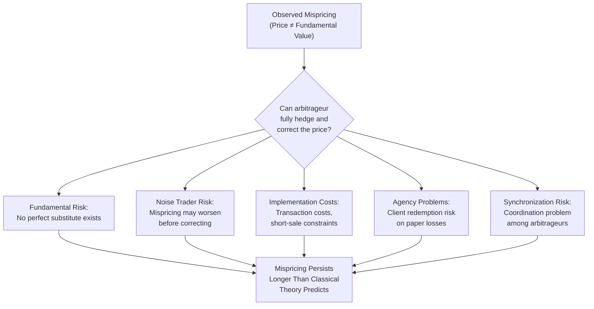

## Limits to Arbitrage

### Overview

Limits to arbitrage is a foundational concept in behavioral finance explaining why mispricing in financial markets — deviations of asset prices from their fundamental value driven by irrational investor behavior — can persist rather than being immediately eliminated by rational arbitrageurs. Classical finance theory (notably the Efficient Market Hypothesis, associated with Eugene Fama) argues that even if some "noise traders" behave irrationally, rational arbitrageurs will exploit any resulting mispricing for profit, and in doing so will push prices back toward fundamental value, rendering irrational behavior largely irrelevant to aggregate market outcomes. Limits-to-arbitrage theory, developed substantially in a foundational 1997 paper by Andrei Shleifer and Robert Vishny ("The Limits of Arbitrage," *Journal of Finance*), and further elaborated by researchers including Richard Thaler, J. Bradford De Long, and others, challenges this assumption by identifying specific real-world frictions, risks, and constraints that prevent arbitrage from fully correcting mispricing in practice.

### The Core Theoretical Challenge to Market Efficiency

For the Efficient Market Hypothesis's self-correcting mechanism to function as described, arbitrage must be effectively costless and riskless: an arbitrageur identifying a mispriced asset should be able to take an offsetting position (e.g., short the overpriced asset, buy an appropriately correlated substitute) that guarantees a profit regardless of subsequent price movements, with no capital constraints preventing them from scaling the position to a size sufficient to correct the price. Limits-to-arbitrage theory argues that in real markets, several of these idealized conditions are frequently violated.

### Key Categories of Limits to Arbitrage

**Fundamental risk**

Even when an arbitrageur correctly identifies that an asset is mispriced, a perfect substitute security that would allow a fully hedged position frequently does not exist, meaning the arbitrageur bears residual fundamental risk — the risk that the asset's underlying fundamentals could change adversely before the mispricing corrects, independent of whether the original mispricing assessment was correct.

- **Example**: An investor believing a company's stock is overpriced relative to fundamentals might short the stock, but no perfect hedge exists for company-specific risk (e.g., an unexpected earnings surprise or product breakthrough), exposing the arbitrageur to genuine fundamental risk beyond the mispricing itself.

**Noise trader risk**

Even if an asset is genuinely mispriced and a good hedge exists, mispricing can worsen in the short run before it corrects, because irrational "noise traders" may push prices further from fundamental value rather than immediately reversing. Because arbitrageurs often operate with finite time horizons and capital, this risk that mispricing deepens before it resolves — famously summarized in the aphorism often attributed to John Maynard Keynes, "markets can remain irrational longer than you can remain solvent" — can prevent rational arbitrageurs from taking or maintaining a position large enough to correct the price.

- **Example**: A hedge fund correctly identifying that a "meme stock" is overpriced relative to fundamentals may short the stock, only to see the price rise further as retail-driven buying continues, potentially forcing the fund to close the position at a loss before the eventual price correction occurs — a dynamic widely discussed in relation to the GameStop trading episode of early 2021. [Inference: this specific episode is frequently cited as an illustrative real-world example of noise trader risk and short-squeeze dynamics, though the full set of causal drivers behind that specific event involved multiple contributing factors beyond noise trader risk alone, including social-media coordination and short-interest dynamics.]

**Implementation costs**

Real-world arbitrage involves transaction costs (bid-ask spreads, commissions, market impact costs from trading in size), costs of short selling (borrowing fees, and in some cases outright restrictions or unavailability of shares to borrow), and legal or institutional constraints, all of which can render an apparent mispricing unprofitable to exploit after accounting for the full cost of implementation.

- **Example**: A theoretically identified pricing discrepancy between a stock and a related derivative might be too small to profitably exploit once realistic transaction costs, bid-ask spreads, and short-selling borrow fees are factored in, even though the discrepancy is statistically real.

**Agency problems and career/institutional risk**

Many real-world arbitrageurs are professional money managers acting on behalf of clients (pension funds, institutional investors) rather than trading their own capital directly. This creates a principal-agent dynamic in which the arbitrageur's clients, observing short-term losses on a correct-but-not-yet-realized arbitrage position, may withdraw capital or terminate the manager's mandate before the mispricing corrects — a phenomenon Shleifer and Vishny term "performance-based arbitrage." This creates a disincentive for arbitrageurs to take large, contrarian positions against persistent (even if eventually self-correcting) mispricing, since doing so risks losing the capital or career standing needed to hold the position to its eventual resolution.

- **Example**: A fund manager who correctly shorts an overvalued asset class ahead of a bubble's eventual collapse may face substantial client redemptions and reputational damage if the bubble continues inflating for an extended period before bursting, potentially forcing early position closure at a loss — a dynamic frequently cited in discussions of the dot-com bubble of the late 1990s, where several managers who identified overvaluation early reportedly faced significant career and business pressure before the eventual 2000–2001 market correction. [Inference: specific individual cases are often cited anecdotally in the behavioral finance literature as illustrative of this dynamic; the general phenomenon of performance-based arbitrage constraints is well-established theoretically and supported by broader empirical patterns in fund flows and manager behavior, though attributing any single historical episode entirely to this mechanism involves some degree of interpretive judgment.]

**Synchronization risk**

Even when many individual arbitrageurs recognize a mispricing, correcting it may require a sufficiently coordinated mass of arbitrageurs acting simultaneously; if each individual arbitrageur is uncertain about when others will act, there can be a coordination problem in which no single arbitrageur wants to be the first (and potentially most exposed) mover, delaying the aggregate correction even when the mispricing is widely recognized. [Inference: synchronization risk is a theoretically well-motivated extension of limits-to-arbitrage theory, developed in subsequent academic literature building on the original Shleifer-Vishny framework, though it is somewhat less extensively empirically tested in isolation from the other categories described here.]

### Diagram: Limits to Arbitrage Framework

### Empirical Evidence and Illustrative Cases

**Closed-end fund puzzle**

Closed-end mutual funds frequently trade at persistent discounts (or occasionally premiums) to their net asset value (NAV) — the value of their underlying holdings — despite the theoretical availability of arbitrage (in principle, an investor could buy the fund's shares below NAV and profit from the discount closing). This persistent, well-documented anomaly is frequently cited as classic evidence for limits-to-arbitrage theory, since closed-end fund structures often make it difficult or impossible to directly arbitrage the discount (unlike an open-end fund, shares generally cannot be redeemed at NAV), leaving the mispricing to persist due to the combination of implementation constraints and noise trader risk regarding future discount movements.

**Twin/dual-listed shares mispricing**

Cases of nearly identical claims on the same underlying cash flows trading at persistently different prices (such as historically documented cases involving dual-listed company shares, e.g., Royal Dutch and Shell prior to their 2005 unification) have been cited as evidence that even close-to-perfect arbitrage opportunities can persist for extended periods due to a combination of implementation frictions, short-sale constraints, and noise trader risk, rather than being instantaneously corrected as classical efficient-market theory would predict.

**Long-Term Capital Management (LTCM) collapse, 1998**

The near-collapse of the hedge fund LTCM is frequently cited as a real-world illustration of noise-trader/liquidity risk combined with leverage constraints: LTCM held positions based on identified relative-value mispricings that were arguably fundamentally sound, but a period of extreme market stress (triggered by the 1998 Russian financial crisis) caused these spreads to widen further rather than converge, and LTCM's substantial leverage meant it could not sustain the mark-to-market losses long enough to hold positions to eventual convergence, ultimately requiring a coordinated private-sector bailout organized by the Federal Reserve Bank of New York. [Note: this is a well-documented historical event; interpreting it specifically through a limits-to-arbitrage lens is a widely used but interpretive framing common in behavioral finance pedagogy, since the episode also involved additional important factors including leverage, liquidity spirals, and counterparty risk beyond limits-to-arbitrage mechanisms narrowly defined.]

### Relationship to Behavioral Finance and Market Efficiency Debates

Limits-to-arbitrage theory occupies a central theoretical position in behavioral finance because it directly addresses the strongest theoretical objection to behavioral explanations of market anomalies: the claim that even if individual investors are irrational, aggregate market prices should remain efficient due to arbitrage. By identifying specific, well-documented conditions under which arbitrage is constrained, limits-to-arbitrage theory provides the necessary theoretical complement to behavioral bias research (overconfidence, herding, loss aversion, and related phenomena covered elsewhere in this course) — behavioral biases alone explain why mispricing might initially arise from noise-trader behavior, while limits-to-arbitrage theory explains why rational arbitrageurs do not necessarily eliminate that mispricing quickly, together providing a more complete behavioral finance account of persistent market anomalies than either component alone.

### Limitations and Critiques

- **Difficulty distinguishing genuine mispricing from mismeasured risk**: A persistent methodological challenge in this literature is that any observed price deviation attributed to "limits to arbitrage" could alternatively reflect a legitimate but unmodeled risk factor that a more complete rational asset-pricing model would explain, an ongoing point of contention between behavioral and traditional finance researchers regarding the correct interpretation of specific documented anomalies. [Inference]
- **Retrospective identification risk**: Some critics note that specific historical episodes (e.g., LTCM, the dot-com bubble) are often cited as illustrative examples after the fact, and that the precise, ex-ante identifiability of a "genuine" limits-to-arbitrage-constrained mispricing (as opposed to a correctly priced asset reflecting risks not yet fully appreciated by critics) remains genuinely difficult to establish prospectively rather than through retrospective narrative construction. [Inference]
- **Anomaly persistence is not universal**: Not all documented pricing anomalies persist indefinitely — some are found to diminish or disappear following academic publication (sometimes discussed under the "post-publication effect" in the empirical asset-pricing literature), which some researchers interpret as evidence that arbitrage capital does respond to and eventually corrects at least some mispricing once sufficiently well-identified and publicized, complicating a simple narrative that limits to arbitrage universally and permanently prevent correction. [Inference]
- **Interaction with market structure evolution**: The magnitude of implementation-cost-related limits to arbitrage (bid-ask spreads, short-sale constraints) has plausibly diminished over time in many developed markets due to improvements in trading technology, liquidity, and short-selling infrastructure, meaning the historical evidence base for certain categories of limits to arbitrage (particularly implementation-cost-driven examples) may be less representative of current market conditions than of the specific historical periods studied. [Inference]

### Related Topics

- Efficient Market Hypothesis
- Noise trader models (De Long, Shleifer, Summers, Waldmann)
- Behavioral asset pricing anomalies
- The closed-end fund puzzle
- Herding and momentum in financial markets
- The GameStop short squeeze and retail trading dynamics
- Long-Term Capital Management and systemic financial risk
- Performance-based arbitrage and principal-agent problems in asset management