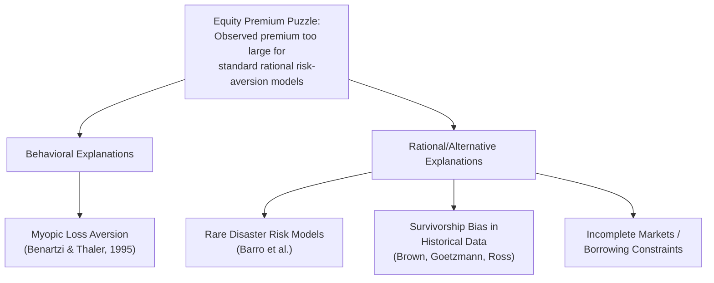
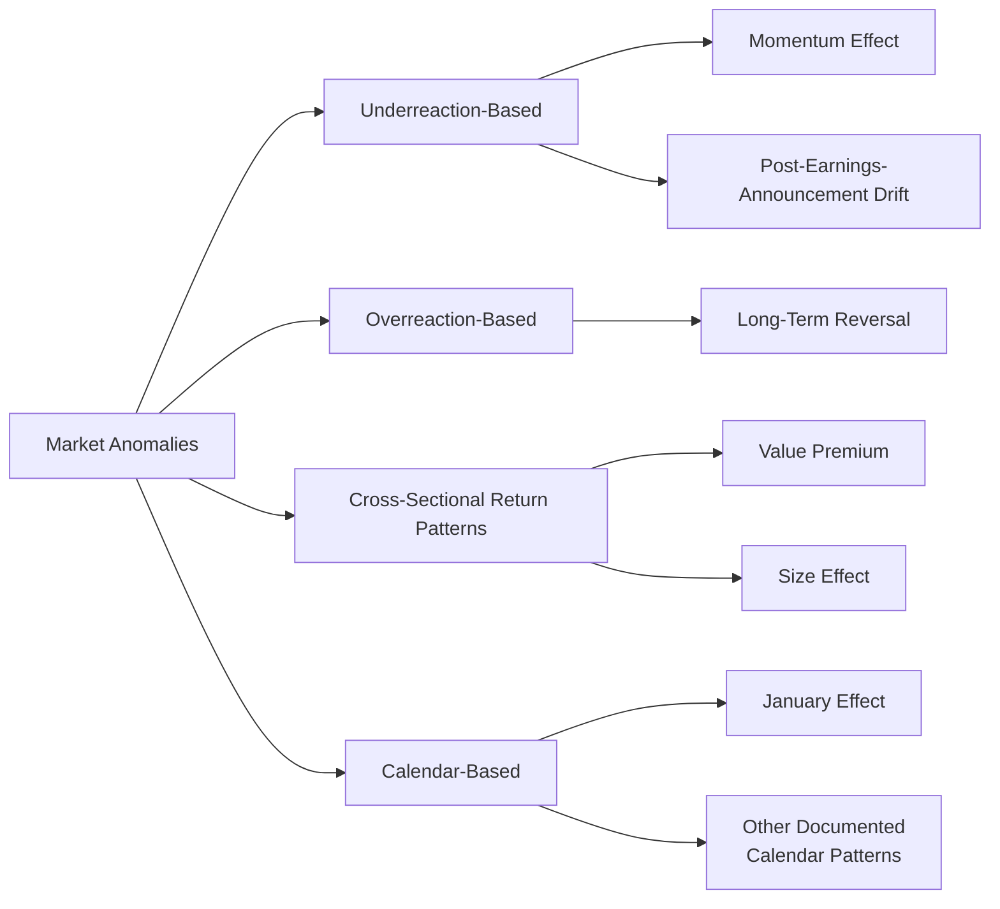

## Market Anomalies and the Equity Premium Puzzle

### Overview

Market anomalies are empirically documented patterns in asset prices and returns that are difficult to reconcile with classical asset-pricing theory and the Efficient Market Hypothesis, often serving as key evidence motivating behavioral finance explanations. Among the most significant and extensively studied of these anomalies is the **equity premium puzzle**, identified by Rajnish Mehra and Edward Prescott in their influential 1985 paper "The Equity Premium: A Puzzle" (*Journal of Monetary Economics*), which highlights a substantial gap between the historically observed excess return of equities over risk-free assets and the much smaller premium predicted by standard consumption-based asset-pricing models under conventional assumptions about investor risk aversion.

### The Equity Premium Puzzle Explained

**The empirical observation**

Historical data (particularly U.S. equity market data spanning much of the 20th century, as analyzed by Mehra and Prescott) shows that equities have delivered average real returns substantially exceeding those of risk-free government securities over long time horizons — the "equity premium" — by a magnitude considerably larger than what standard economic models would predict as fair compensation for the additional risk equities carry.

**The theoretical puzzle**

Under the standard consumption-based capital asset pricing model (CCAPM), the size of the equity premium should be determined by the covariance between equity returns and consumption growth, scaled by a coefficient of relative risk aversion. Mehra and Prescott calculated that reproducing the observed historical equity premium using plausible, empirically reasonable levels of investor risk aversion (consistent with risk-aversion levels observed in other economic contexts) would require an implausibly high risk-aversion coefficient — one considered inconsistent with reasonable calibrations of investor behavior — creating a quantitative puzzle for the standard rational asset-pricing framework.

$$\text{Equity Premium} = R_{equity} - R_{risk\text{-}free}$$

Mehra and Prescott's calibration exercise showed that under standard model assumptions, matching the observed premium required a risk-aversion coefficient far outside the range considered plausible based on other economic evidence, hence "puzzle."

### Behavioral and Alternative Explanations for the Equity Premium Puzzle

**Myopic loss aversion (Benartzi & Thaler, 1995)**

Shlomo Benartzi and Richard Thaler proposed that the puzzle can be substantially explained by combining two behavioral concepts: **loss aversion** (from prospect theory — losses loom larger than equivalent gains) and **mental accounting with frequent evaluation** ("myopia" — investors evaluate their portfolios and experience gains/losses over relatively short time horizons, such as annually, rather than over their full, much longer actual investment horizon). Under this account, investors who frequently check portfolio performance experience the volatility of equities as a series of loss-averse-weighted gains and losses, making equities appear subjectively less attractive relative to their true long-horizon risk-return profile, and demanding a correspondingly larger premium to hold them — a premium consistent in magnitude with the historically observed equity premium under Benartzi and Thaler's calibration.

**Rare disaster risk models**

An alternative, non-behavioral explanation proposed by researchers including Robert Barro and others argues that historical equity return data may understate the true probability investors rationally assigned to rare, catastrophic economic disasters (e.g., depression-scale economic collapse, wartime destruction of capital), and that once this small but consequential disaster probability is properly accounted for, a much lower and more plausible risk-aversion coefficient can rationally explain the observed premium without requiring behavioral assumptions. [Note: this represents a leading non-behavioral alternative explanation actively debated alongside behavioral accounts in the academic literature; the relative empirical support for rare-disaster versus behavioral explanations remains a subject of ongoing research and is not fully resolved in favor of either approach.]

**Survivorship bias in historical data**

Some researchers (e.g., Stephen Brown, William Goetzmann, and Stephen Ross) have argued that the historically measured U.S. equity premium may be inflated by survivorship bias, since the U.S. stock market happened to avoid the kind of catastrophic, permanent capital-market disruptions (e.g., due to war, revolution, or currency collapse) experienced by several other countries' markets during the 20th century, meaning the true, forward-looking expected equity premium facing an investor at the start of the period may have been rationally lower than what the realized U.S. historical average return implies. [Inference: the degree to which survivorship bias alone fully resolves the puzzle, versus meaningfully reducing but not eliminating it, remains an actively discussed empirical question.]

### Diagram: Competing Explanations for the Equity Premium Puzzle

### Other Major Market Anomalies in Behavioral Finance

**Momentum effect**

Documented extensively by Narasimhan Jegadeesh and Sheridan Titman (1993), stocks that have performed relatively well (or poorly) over the past 3 to 12 months tend to continue performing relatively well (or poorly) over the subsequent 3 to 12 months, a pattern inconsistent with a strict random-walk model of efficient prices and often attributed to behavioral mechanisms such as investor underreaction to new information followed by delayed, gradual price adjustment.

**Long-term reversal effect**

In apparent tension with momentum at shorter horizons, Werner De Bondt and Richard Thaler (1985) documented that stocks which have performed poorly (or well) over long horizons (3 to 5 years) tend to subsequently outperform (or underperform), a pattern attributed to investor overreaction to salient long-run information followed by an eventual correction back toward fundamental value.

**Post-earnings-announcement drift (PEAD)**

Stock prices have been documented to continue drifting in the direction of an earnings surprise for an extended period (weeks to months) following an earnings announcement, rather than adjusting immediately and fully, a well-replicated anomaly consistent with investor underreaction to new fundamental information.

**Value premium**

Stocks with low valuation ratios (e.g., low price-to-book or price-to-earnings ratios, often termed "value" stocks) have historically delivered higher average returns than high-valuation "growth" stocks, a pattern documented extensively by Eugene Fama and Kenneth French, with debate continuing over whether this reflects a rational compensation for an unmodeled risk factor (Fama and French's own preferred interpretation, within their multi-factor asset-pricing framework) or a behavioral mispricing driven by investor overextrapolation of past growth trends into the future (an interpretation favored by researchers including Josef Lakonishok, Andrei Shleifer, and Robert Vishny).

**Size effect**

Smaller-capitalization stocks have historically shown higher average returns than larger-capitalization stocks, documented by Rolf Banz (1981) and subsequently incorporated into the Fama-French three-factor model; as with the value premium, debate continues regarding rational risk-based versus behavioral explanations, and some research has questioned the robustness and persistence of the size effect in more recent data samples. [Inference: the size effect specifically has faced more replication and persistence challenges in post-publication data compared to some other anomalies discussed here.]

**Calendar anomalies**

Various documented patterns of seemingly anomalous return regularities tied to calendar timing (e.g., the "January effect," in which small-cap stocks have historically shown disproportionately strong returns in January) have been reported, though several such calendar anomalies have weakened or disappeared in post-publication data, a pattern some researchers interpret as evidence that arbitrage capital responds to well-publicized anomalies over time, consistent with limits-to-arbitrage theory's prediction that publicized mispricing is more likely to be at least partially corrected once broadly recognized. [Inference]

### Diagram: Categorizing Key Market Anomalies

### The Rational vs. Behavioral Interpretation Debate

A persistent methodological tension runs through the market anomalies literature: for nearly every documented anomaly, at least two competing classes of explanation are typically proposed —

1. **Risk-based (rational) explanations**: The anomaly reflects fair compensation for an unmodeled or imperfectly measured risk factor, meaning the "anomaly" is not evidence of market inefficiency once the correct, more complete asset-pricing model is specified (a position closely associated with Eugene Fama and the efficient-markets tradition).
2. **Behavioral explanations**: The anomaly reflects genuine mispricing driven by systematic investor psychological biases (overreaction, underreaction, loss aversion, herding) that is not fully corrected by arbitrage due to limits-to-arbitrage constraints (a position closely associated with researchers including Richard Thaler, Robert Shiller, and their behavioral finance colleagues).

This debate remains substantively unresolved for several major anomalies (notably the value and size effects), and the appropriate interpretation may well differ across different anomalies rather than requiring a single unified answer for all of them. [Inference: this reflects genuine, ongoing academic disagreement within financial economics rather than a settled consensus favoring either the purely rational or purely behavioral camp across the board.]

### Limitations and Critiques

- **Post-publication anomaly decay**: A well-documented pattern (studied extensively by researchers including R. David McLean and Jeffrey Pontiff) shows that many documented return anomalies weaken substantially in magnitude after their initial academic publication, raising questions about whether some originally reported anomalies reflected genuine, persistent phenomena, statistical artifacts of data-mining across many tested variables, or mispricing that was subsequently and at least partially corrected by arbitrage capital responding to the new public information. [Inference: the relative contribution of these three explanations for the observed post-publication decay pattern is itself a subject of ongoing academic investigation.]
- **Multiple testing and data-mining concerns**: Given the very large number of potential return-predicting variables that can be tested against historical data, a portion of documented "anomalies" in the broader academic literature may reflect false positives arising from extensive testing across many candidate variables rather than genuine, robust economic phenomena — a concern raised prominently in more recent asset-pricing methodology literature (e.g., work by Campbell Harvey and colleagues proposing higher statistical significance thresholds for newly claimed return factors).
- **Sample-period and market-specific limitations**: Much of the classic anomaly literature (including the original equity premium puzzle calculations) is based substantially on U.S. historical data over specific sample periods; the generalizability of specific magnitude estimates to other countries, asset classes, or time periods is not guaranteed and has produced mixed results in out-of-sample and international testing. [Inference]
- **Unresolved rational-versus-behavioral attribution**: As noted, the field has not achieved full consensus on whether several major anomalies reflect genuine market inefficiency or fair compensation for imperfectly measured risk, meaning conclusions drawn from any single anomaly regarding the overall validity of the Efficient Market Hypothesis versus behavioral finance should be treated with appropriate caution regarding the current state of academic agreement.

### Related Topics

- Limits to arbitrage
- Efficient Market Hypothesis
- Prospect theory and loss aversion
- Mental accounting (Thaler)
- Fama-French multi-factor asset pricing models
- Overreaction and underreaction in financial markets
- Post-publication anomaly decay research
- Behavioral portfolio theory