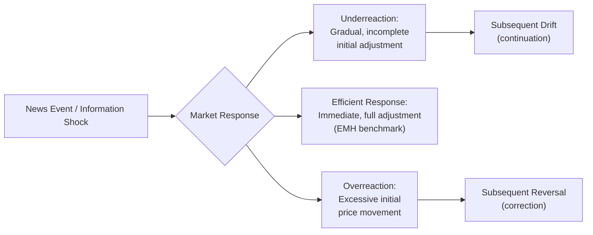
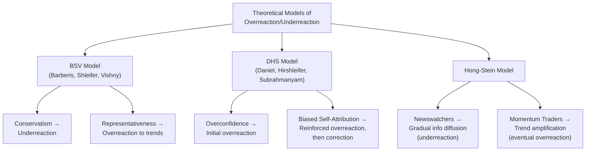

## Overreaction and Underreaction to Information

### Overview

Overreaction and underreaction describe two apparently opposite, yet both well-documented, patterns in how financial markets incorporate new information into asset prices, each representing a distinct departure from the strict efficient-markets prediction that prices should adjust immediately and fully to new information without subsequent systematic drift or reversal. The coexistence of both patterns in the empirical literature — investors sometimes appearing to underreact to news (producing continuation/drift) and sometimes appearing to overreact (producing eventual reversal) — has motivated substantial theoretical work in behavioral finance seeking to explain how the same underlying psychological mechanisms could plausibly produce both patterns depending on context, information type, and time horizon.

### Defining the Two Patterns

**Underreaction**

Occurs when prices adjust too slowly and incompletely to new information, such that the direction of a price movement following news continues (drifts) in the same direction for a subsequent period rather than fully incorporating the news immediately, creating a predictable continuation pattern exploitable, in principle, by momentum-based trading strategies.

**Overreaction**

Occurs when prices adjust too much to new information (or to a salient pattern of past information), such that a subsequent correction or reversal back toward fundamental value is predictable, creating an exploitable pattern that value/contrarian-oriented strategies aim to capture.

### Diagram: Overreaction vs. Underreaction Price Paths

### Key Empirical Evidence

**Post-earnings-announcement drift (PEAD) — underreaction**

First documented by Ray Ball and Philip Brown (1968) and substantially extended by subsequent researchers, PEAD refers to the well-replicated finding that stock prices continue to drift in the direction of an earnings surprise for weeks to months following an earnings announcement, rather than adjusting fully and immediately at the time of the announcement. This remains among the most robust and widely replicated anomalies in the empirical asset-pricing literature, consistent with systematic investor underreaction to fundamental news.

**Momentum effect — underreaction**

Jegadeesh and Titman's (1993) documentation that stocks with strong (weak) returns over the past 3–12 months tend to continue outperforming (underperforming) over the subsequent 3–12 months is generally interpreted as a medium-horizon manifestation of underreaction, whether to individual pieces of news, to a series of related news events, or to a stock's fundamental improving/deteriorating trajectory more broadly.

**Long-term reversal — overreaction**

De Bondt and Thaler's (1985) finding that extreme past losers (winners) over 3–5 year horizons tend to become subsequent winners (losers) is generally interpreted as evidence of overreaction: investors are proposed to overweight salient recent performance (whether strong or weak) when forming expectations about a firm's long-run prospects, producing prices that overshoot fundamental value and subsequently correct.

**Initial public offering (IPO) long-run underperformance — overreaction**

Documented by researchers including Jay Ritter, newly public companies have been found in some studies to underperform comparable benchmarks over multi-year post-IPO horizons, a pattern some researchers interpret as reflecting initial investor overreaction/over-optimism about a newly public company's growth prospects at the time of the offering, followed by a longer-run correction as more realistic expectations are incorporated. [Inference: this specific anomaly has shown some variation in magnitude and statistical robustness across different sample periods and countries in subsequent research.]

### Theoretical Models Reconciling Overreaction and Underreaction

A central theoretical challenge in this literature has been developing a coherent behavioral model capable of explaining why the *same* set of investors might underreact to some information (e.g., quarterly earnings surprises) while overreacting to other information or over other time horizons (e.g., extended runs of strong or weak performance). Several influential models address this apparent tension:

**Barberis, Shleifer, and Vishny (1998) — BSV Model**

Proposes that investor sentiment is driven by two well-documented psychological biases operating together: **conservatism** (a tendency to underweight new information relative to prior beliefs, producing underreaction to individual news events such as earnings announcements) and **representativeness heuristic** (a tendency to over-extrapolate a salient recent pattern or trend, producing overreaction when a consistent run of similar news accumulates over a longer period, since investors come to believe an extended trend represents a genuine, durable shift in the firm's fundamentals).

**Daniel, Hirshleifer, and Subrahmanyam (1998) — DHS Model**

Proposes a model built on **investor overconfidence** (individuals overestimate the precision of their private information) combined with **biased self-attribution** (individuals attribute successful outcomes to their own skill and unsuccessful outcomes to external/bad luck factors). Under this model, overconfident investors initially overreact to their own private signals, and a subsequent public confirmation of that signal leads to biased self-attribution that further reinforces the overreaction (increasing overconfidence following apparent confirmation), which can generate short-to-medium-term return continuation (momentum) followed by an eventual long-run correction once the initial overreaction is recognized as excessive.

**Hong and Stein (1999) — Unified Theory of Underreaction and Overreaction**

Proposes a model with two distinct investor types: "newswatchers," who trade based on private fundamental information but do not condition their trading on observed price patterns, and "momentum traders," who condition their trading purely on recent price trends. Under this model, newswatchers' information diffuses gradually through the market (producing initial underreaction and short-term continuation), while momentum traders' trend-following behavior can subsequently amplify this initial continuation into an eventual overreaction that requires a longer-run correction — providing a mechanism for both patterns to emerge sequentially from the interaction of two distinct, boundedly rational trader populations rather than from a single trader type exhibiting seemingly contradictory behavior.

### Diagram: Theoretical Models Comparison

### Relationship to Investment Strategies

**Momentum strategies**

Exploit documented short-to-medium-term underreaction/continuation patterns by buying recent outperformers and selling (or shorting) recent underperformers, typically over 3–12 month formation and holding periods.

**Contrarian/value strategies**

Exploit documented longer-term overreaction/reversal patterns by favoring stocks that have underperformed or are undervalued relative to fundamentals over extended prior periods (3–5 years or more), on the theory that extreme past performance (positive or negative) is more likely to reflect overreaction than a fully justified reassessment of fundamentals.

The apparent coexistence of profitable momentum strategies at shorter horizons and profitable contrarian strategies at longer horizons within the same broad market is itself one of the pieces of evidence the theoretical models above (particularly Hong-Stein) were developed specifically to reconcile within a single coherent framework, rather than treating the two patterns as reflecting entirely separate and unrelated market phenomena.

### Limitations and Critiques

- **Risk-based counterexplanations remain available**: As with other market anomalies (see "Market Anomalies and the Equity Premium Puzzle"), proponents of rational asset-pricing models have proposed that momentum and reversal patterns could reflect time-varying risk premia or an unmodeled risk factor rather than genuine behavioral overreaction/underreaction, and this interpretive debate remains substantively unresolved for several of the specific patterns discussed here. [Inference]
- **Model non-uniqueness**: Multiple distinct behavioral models (BSV, DHS, Hong-Stein) each offer a theoretically coherent account of the joint overreaction/underreaction evidence, but the field has not achieved consensus on which specific psychological mechanism (or combination) is empirically the primary driver, and direct empirical tests distinguishing between these competing model predictions face significant methodological challenges. [Inference]
- **Anomaly decay concerns**: As discussed in relation to market anomalies more broadly, the profitability of momentum and, to a lesser documented extent, long-term reversal strategies has shown some decline in more recent, post-publication data samples in various studies, consistent with either partial arbitrage correction over time or an original overstatement of the effect's true magnitude due to data-mining across the many variables tested in the broader anomalies literature. [Inference]
- **Momentum crashes**: Momentum strategies specifically have been documented (notably by Kent Daniel and Tobias Moskowitz) to experience occasional but severe "crashes" — sharp, large losses typically occurring during rapid market recoveries following a downturn — a risk characteristic not fully captured by simple average-return comparisons and that complicates a purely behavioral characterization of momentum as an easily and safely exploitable inefficiency.
- **Sample-period and market dependence**: The relative strength and statistical significance of overreaction versus underreaction patterns can vary meaningfully across different markets, sectors, and historical time periods, meaning findings from any single study or market should not be assumed to generalize universally. [Inference]

### Related Topics

- Market anomalies and the equity premium puzzle
- Limits to arbitrage
- Momentum and long-term reversal strategies
- Representativeness heuristic
- Overconfidence bias in financial decision-making
- Post-earnings-announcement drift
- Herding behavior in financial markets