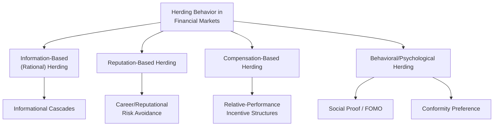
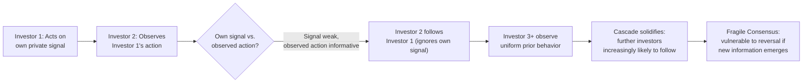

## Herding Behavior in Financial Markets

### Overview

Herding behavior refers to the tendency of investors to follow and mimic the trading decisions of other market participants, rather than acting independently based solely on their own private information and analysis. Herding is a central concept in behavioral finance because it provides a mechanism through which individually rational or semi-rational decisions, aggregated across many market participants, can produce collectively excessive price movements, bubbles, crashes, and correlated trading patterns that are difficult to reconcile with a market composed of fully independent, information-processing rational agents.

### Theoretical Categories of Herding

**Information-based (rational) herding**

Occurs when investors rationally infer information from observing the trading decisions of others, particularly when an individual investor's own private information is weak or uncertain relative to the perceived informational value of observing others' actions. This form of herding can be individually rational for each investor even though the aggregate outcome may still deviate from what full information aggregation would produce.

**Reputation-based herding**

Occurs when professional money managers, whose performance is evaluated relative to peers or benchmarks, have an incentive to mimic the portfolio allocations of other managers to avoid the reputational or career risk of being a conspicuous outlier — being wrong in the same way as everyone else is typically less costly to a manager's career than being wrong in a unique, individually attributable way (closely related to the agency/career-risk concerns discussed under "Limits to Arbitrage").

**Compensation-based herding**

A related mechanism in which fund manager compensation structures (e.g., tied to relative performance benchmarks) create direct financial incentives to hold similar positions to peers or to a benchmark index, independent of the manager's own private views about fundamental value.

**Behavioral/psychological herding**

Occurs when investors follow the crowd due to genuine psychological mechanisms such as social proof (the belief that widespread behavior reflects valid information), fear of missing out (FOMO), or a simple desire for social conformity, rather than through a rational information-inference process — this form is most directly connected to the social-influence mechanisms discussed in behavioral economics more broadly (see MINDSPACE's "Norms" and EAST's "Social" components).

### Diagram: Taxonomy of Herding Mechanisms

### Informational Cascades: A Foundational Model

A key formal mechanism underlying information-based herding is the **informational cascade**, modeled in influential papers by Sushil Bikhchandani, David Hirshleifer, and Ivo Welch (1992), and separately by Abhijit Banerjee (1992). In this model, individuals make sequential decisions and can observe the decisions (though not necessarily the private information) of those who acted before them. Under certain conditions, once a sufficient number of preceding individuals have made the same observable choice, it becomes rational for a later individual to disregard their own private information entirely and simply follow the crowd's revealed choice, since the *aggregate* revealed behavior of prior individuals is inferred to carry more informational weight than any single individual's own private signal.

**Key implication**: Cascades can occur even when every individual behaves in a locally rational, Bayesian-updating manner; the resulting aggregate market behavior can nonetheless become excessively uniform and, critically, fragile — since the cascade is based on inferred information from observed actions rather than the direct aggregation of the full underlying set of private information across all participants, a cascade can be based on collectively very little genuine information despite the appearance of a strong, unanimous market consensus, and can be reversed rapidly if new information emerges that undermines the inferred basis for the crowd's behavior.

$$P(\text{action} \mid \text{own signal}, \text{observed actions of others})$$

Once the perceived informational weight of accumulated prior observed actions exceeds the weight of an individual's own private signal, rational Bayesian updating can lead the individual to disregard their private information and herd.

### Diagram: Informational Cascade Formation

### Empirical Evidence for Herding in Financial Markets

**Analyst forecast herding**

Several empirical studies have found that sell-side equity analysts' earnings forecasts show a tendency to cluster around consensus estimates and around other analysts' previously issued forecasts more than would be predicted if each analyst relied purely on independent private information and analysis, consistent with reputation-based herding concerns (avoiding the career risk of an outlier forecast that proves wrong).

**Mutual fund and institutional herding**

Studies examining institutional trading data (e.g., work associated with researchers including Russ Wermers) have documented periods of correlated buying or selling activity across mutual funds in the same stocks beyond what would be expected from funds independently reacting to the same public fundamental information, consistent with a combination of information-based and reputation-based herding mechanisms among institutional investors. [Inference: distinguishing empirically between "correlated trading due to funds independently reacting similarly to genuinely shared public information" versus "correlated trading due to funds actively mimicking one another" remains a persistent methodological challenge in this literature, and reported herding measures are generally understood as imperfect proxies rather than direct, unambiguous measurements of herding intent.]

**Retail investor herding and social-media-driven trading**

More recent research has examined herding dynamics among retail investors coordinating via social media and online trading forums, with the "meme stock" trading episodes of 2021 (notably GameStop and AMC Entertainment) frequently cited as a prominent, large-scale illustration of retail herding dynamics amplified by social coordination, momentum-chasing behavior, and short-squeeze mechanics. [Inference: while widely discussed as an example of herding dynamics, the full causal picture of these specific episodes involved multiple contributing factors beyond herding alone, including options-market gamma dynamics and structural short-interest positioning, and academic research characterizing the precise relative contribution of pure herding behavior versus these other mechanisms in these specific cases is still developing.]

### Herding and Asset Price Bubbles

Herding behavior is frequently cited as a key contributing mechanism in the formation and amplification of speculative asset price bubbles, since a self-reinforcing cycle can develop in which rising prices attract additional herding-driven buying (interpreting the price rise itself as a positive signal, consistent with information-based herding logic, or simply driven by social proof and FOMO), which in turn drives prices further from fundamental value, continuing until the cascade eventually reverses — often triggered by a relatively small piece of new information that is sufficient to unwind the fragile, cascade-based consensus, consistent with the informational-cascade model's prediction of cascade fragility. Historical episodes frequently discussed in this context include the dot-com bubble of the late 1990s and the U.S. housing bubble preceding the 2007–2008 financial crisis, though as with other complex historical market episodes, herding is generally understood as one contributing mechanism among several rather than a complete, standalone explanation for any single historical bubble. [Inference]

### Distinguishing Genuine Herding from Correlated but Independent Behavior

A significant methodological challenge in empirical herding research is distinguishing **spurious herding** (investors independently arriving at similar trading decisions because they are rationally reacting to the same publicly available fundamental information, without actually observing or mimicking one another's behavior) from **genuine (intentional or cascade-based) herding** (investors' decisions are causally influenced by observing others' behavior, beyond what shared public information alone would predict). Various empirical measures have been proposed to address this distinction (e.g., measures examining the cross-sectional dispersion of returns relative to market-wide movements, following an approach developed by Christie and Huang, 1995, and subsequently refined by Chang, Cheng, and Khorana, 2000), though no single measure has achieved universal acceptance as definitively resolving this identification challenge. [Inference: this remains an active area of methodological development in the empirical finance literature.]

### Relevance to Market Efficiency and Regulatory Policy

**Systemic risk considerations**

Herding-driven correlated trading across many market participants is a concern for financial regulators because it can amplify market volatility and contribute to systemic risk, particularly if herding causes many institutions to hold similar concentrated positions that then require simultaneous unwinding during a market stress event (a dynamic discussed in relation to some historical episodes, including aspects of the 2007–2008 financial crisis).

**Circuit breakers and market stabilization mechanisms**

Some market-structure interventions, such as trading halts and circuit breakers, are partly motivated by a desire to interrupt potential herding-driven cascading price movements by providing a pause during which new information can be more fully processed and disseminated, potentially breaking a fragile, cascade-based consensus before it produces excessive price dislocation. [Inference: while this is a commonly cited rationale for such mechanisms, their actual empirical effectiveness specifically at interrupting herding-driven (as opposed to other liquidity-driven) price cascades is a topic of ongoing empirical debate in market microstructure research.]

### Limitations and Critiques

- **Identification challenges**: As discussed, robustly distinguishing genuine herding from spurious correlated-but-independent behavior remains a substantial and unresolved methodological challenge across much of the empirical herding literature, meaning reported "herding" measures in specific studies should be interpreted with appropriate caution regarding what they can and cannot definitively establish. [Inference]
- **Herding is not inherently irrational**: Information-based herding, reputation-based herding, and compensation-based herding can all reflect individually rational responses to genuine informational or incentive structures, meaning the presence of herding in financial markets does not by itself imply that any individual participant is behaving irrationally, even though the aggregate market outcome may still deviate meaningfully from a fully efficient benchmark.
- **Difficulty of ex-ante prediction**: While informational cascade theory explains how and why cascades can form and later reverse, predicting the specific timing, magnitude, and triggering event of a cascade reversal in real time remains empirically very difficult, limiting the practical, forward-looking predictive value of herding models for individual investors or regulators. [Inference]
- **Overattribution risk in historical narratives**: As with other complex historical financial episodes, there is a risk of retrospectively over-attributing a specific bubble or crash primarily to herding dynamics in narrative accounts, when the actual episode likely involved a more complex combination of herding, leverage, regulatory factors, and fundamental economic conditions operating together. [Inference]

### Related Topics

- Overreaction and underreaction to information
- Limits to arbitrage
- Market anomalies and the equity premium puzzle
- Informational cascades (Bikhchandani, Hirshleifer, Welch)
- Social proof (MINDSPACE / EAST frameworks)
- Speculative bubbles and financial crises
- The GameStop short squeeze and retail trading dynamics
- Systemic risk and financial regulation