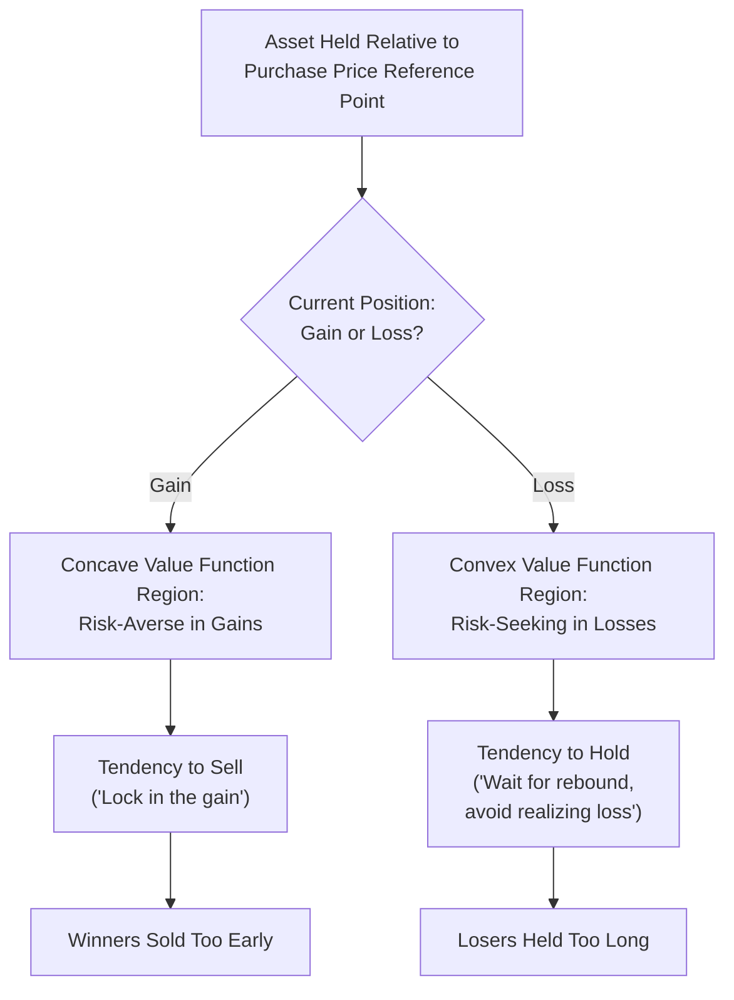

## The Disposition Effect

### Overview

The disposition effect is a well-documented behavioral bias in investor trading behavior describing the tendency to sell assets that have increased in value ("winners") too readily, while holding onto assets that have decreased in value ("losers") for too long, relative to what a normatively rational, tax- and information-optimizing trading strategy would predict. The term and its formal definition were introduced by Hersh Shefrin and Meir Statman in their influential 1985 paper "The Disposition to Sell Winners Too Early and Ride Losers Too Long" (*Journal of Finance*), and the phenomenon has since been replicated extensively across different investor populations, asset classes, and countries using a variety of datasets, including individual brokerage account records, mutual fund trading data, and real estate transaction data.

### Theoretical Basis: Prospect Theory and Mental Accounting

Shefrin and Statman's original explanation for the disposition effect draws directly on **prospect theory** (Kahneman & Tversky, 1979), combined with **mental accounting** (a concept substantially developed by Richard Thaler). The core mechanism proposed is as follows:

**Reference-dependence and the purchase price as reference point**

Investors are proposed to evaluate each holding relative to its original purchase price, treated as a psychological reference point, rather than relative to its current market value alone or to a forward-looking assessment of expected future returns independent of the purchase price.

**Prospect theory's value function shape**

Prospect theory's value function is concave over gains (implying risk-averse behavior in the domain of gains, since the function's diminishing marginal sensitivity means an investor is relatively satisfied with locking in an existing gain rather than risking it for potentially more) and convex over losses (implying risk-seeking behavior in the domain of losses, since the same diminishing marginal sensitivity in the loss domain means an investor facing a loss is relatively more willing to take on additional risk — continuing to hold, hoping for a rebound — rather than realizing the loss with certainty).

$$v(x) = \begin{cases} x^{\alpha} & x \geq 0 \\ -\lambda(-x)^{\beta} & x < 0 \end{cases}$$

Where $\lambda > 1$ represents the loss-aversion coefficient, and $\alpha, \beta$ (typically estimated around 0.88 in Kahneman and Tversky's original calibration) govern the diminishing sensitivity (concavity/convexity) in the gain and loss domains respectively.

Under this value function, an investor holding a stock currently at a gain relative to their reference point (purchase price) is in the concave, risk-averse region of the value function and is thus relatively inclined to realize (sell) the gain rather than risk it. Conversely, an investor holding a stock currently at a loss relative to their reference point is in the convex, risk-seeking region and is thus relatively inclined to continue holding (or even add to the position) in the hope of a rebound that would allow them to avoid realizing the loss, rather than accepting the certain loss by selling.

**Realization utility and the pain of "closing the book" on a loss**

A related and complementary explanation, developed in more recent research (e.g., by Nicholas Barberis and Wei Xiong), proposes that investors derive direct utility or disutility from the specific act of *realizing* a gain or loss (separate from prospect-theory-style evaluation of the paper position itself), meaning the psychological event of formally selling at a loss carries an additional, distinct emotional cost — sometimes characterized as regret aversion or the reluctance to formally admit an investment decision was mistaken — beyond what the standard prospect-theory value-function-based account alone captures. [Inference: the relative empirical contribution of pure prospect-theory reference-dependence versus a distinct realization-utility/regret-aversion mechanism remains an area of ongoing research and debate, with some studies favoring one framework's predictions over the other in specific contexts.]

### Diagram: Disposition Effect Mechanism

### Empirical Evidence

**Terrance Odean's brokerage account study (1998)**

A foundational empirical test, Odean's analysis of individual investor brokerage account records found that investors were significantly more likely to sell winning positions than losing positions, and further found that the winning stocks investors sold subsequently outperformed the losing stocks investors continued to hold, indicating the disposition effect was not merely a harmless behavioral quirk but was associated with objectively worse subsequent trading outcomes for the investors exhibiting it.

**Cross-market and cross-asset replication**

The disposition effect has been documented across numerous distinct contexts beyond individual equity brokerage accounts, including professional/institutional trading in some studies (though generally to a lesser degree than retail investors), futures markets, mutual fund manager trading decisions, and residential real estate transactions (with condominium owners in some studies shown to set higher, slower-to-adjust asking prices for units purchased at a higher original price, consistent with a loss-averse reluctance to sell at or below the original purchase price). [Inference: the magnitude of the disposition effect varies meaningfully across these different contexts and investor types, and it is generally found to be somewhat attenuated (though often still present) among more sophisticated or professional investors compared to retail investors.]

### The Disposition Effect and Tax Considerations

A particularly notable feature of the disposition effect's documented persistence is that it runs directly counter to standard tax-optimization logic in many tax jurisdictions (including the U.S.), where realizing capital losses (rather than gains) earlier is often tax-advantageous, since realized losses can typically be used to offset taxable capital gains ("tax-loss harvesting"), while realizing gains earlier (rather than deferring them) generally accelerates tax liability. The persistence of the disposition effect despite this often directly contrary tax incentive is frequently cited in the literature as particularly strong evidence that the effect reflects a genuine behavioral bias rather than merely an artifact of unmodeled rational tax-driven trading motives — since a rational, tax-optimizing investor should, if anything, exhibit the *opposite* pattern (selling losers earlier for the tax benefit, holding winners longer to defer tax) rather than the empirically observed pattern.

### Individual Differences and Moderating Factors

**Investor sophistication and experience**

Several studies have found that the disposition effect tends to be less pronounced among more experienced, professional, or financially sophisticated investors compared to less experienced retail investors, consistent with the general behavioral finance pattern that many biases can be at least partially attenuated (though rarely fully eliminated) by expertise and experience. [Inference]

**Trading frequency and mental accounting frequency**

Consistent with the myopic loss aversion framework discussed in relation to the equity premium puzzle, investors who evaluate their portfolios more frequently and who engage in more frequent, narrowly-framed mental accounting of individual positions (rather than evaluating their portfolio holistically and over longer horizons) tend to show a more pronounced disposition effect. [Inference]

**House money effect interaction**

The disposition effect has been studied in interaction with the related "house money effect" (a tendency toward increased risk-taking following prior gains, as if using "the house's money"), with some research suggesting these two related but distinct phenomena can interact in complex ways depending on the specific sequence and magnitude of an investor's prior gains and losses on a given position. [Inference]

### Consequences for Investment Performance

Beyond Odean's original finding of underperformance associated with the disposition effect, subsequent research has examined additional downstream consequences, including:

- **Suboptimal tax outcomes**: As discussed, the disposition effect's pattern runs counter to tax-loss harvesting logic in many tax systems, resulting in higher realized tax liability than an otherwise identical, tax-optimized trading strategy would produce. [Inference: the magnitude of this specific tax-related cost depends heavily on the specific tax jurisdiction and account type — e.g., the effect is not applicable within tax-advantaged retirement accounts where capital gains are not currently taxed.]
- **Portfolio drift and concentration risk**: Systematically holding losing positions longer than winning positions can, over time, shift a portfolio's composition away from an investor's original target allocation in ways not driven by a deliberate, reasoned reassessment of relative asset attractiveness. [Inference]

### Applications and Debiasing Approaches

**Financial advisor and robo-advisor design**

Some financial technology platforms and financial advisory practices have incorporated automated tax-loss harvesting features specifically designed to counteract the disposition effect's tax-suboptimal pattern by systematically realizing losses according to a rules-based (rather than emotionally-influenced) process.

**Framing and reporting interventions**

Some research has examined whether presenting portfolio performance information in ways that reduce the salience of the original purchase price as a reference point (e.g., emphasizing broader portfolio-level performance rather than individual position-level gains/losses) can reduce the magnitude of disposition-effect-driven trading distortions, drawing on the broader "boosts" and choice-architecture literature discussed elsewhere in this course. [Inference: the practical effectiveness and adoption of such specific framing interventions in real-world financial products is an area of ongoing development rather than a fully established, widely validated practice.]

### Limitations and Critiques

- **Rational alternative explanations exist for some observed patterns**: Some researchers have proposed that a portion of the observed selling-winners-holding-losers pattern could reflect rational information-based explanations in specific contexts (e.g., genuine, rationally-formed beliefs about mean reversion in a specific asset's price), though the tax-counterincentive evidence discussed above is generally considered to substantially weaken purely rational explanations for the disposition effect as a general phenomenon. [Inference]
- **Measurement and definitional variations across studies**: Different empirical studies have used somewhat varying precise definitions and statistical measures of the disposition effect (e.g., different methods for defining the reference point in cases of multiple purchases of the same asset at different prices and times), which can affect the precise magnitude estimates reported and complicate direct cross-study comparison. [Inference]
- **Attenuation but not elimination among sophisticated investors**: While professional and institutional investors generally show a smaller disposition effect than retail investors in most studies, the effect is not fully eliminated even among sophisticated market participants in much of the literature, suggesting the underlying psychological mechanism is not simply a product of financial inexperience alone. [Inference]
- **Context and market-condition dependence**: The magnitude of the disposition effect has been found in some studies to vary depending on broader market conditions (e.g., during strongly trending bull or bear markets versus more range-bound markets), suggesting the effect's strength may not be entirely stable and context-independent across all market environments. [Inference]

### Related Topics

- Prospect theory and loss aversion
- Mental accounting (Thaler)
- Overreaction and underreaction to information
- Myopic loss aversion and the equity premium puzzle
- The house money effect
- Tax-loss harvesting strategies
- Regret aversion in financial decision-making