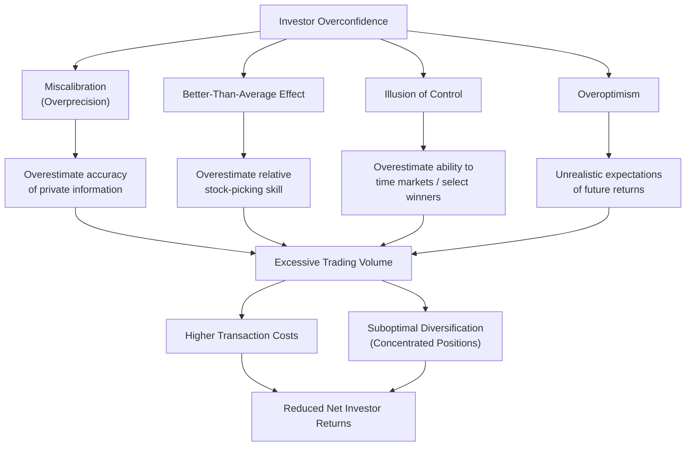

## Investor Overconfidence and Excessive Trading

### Overview

Investor overconfidence refers to a well-documented bias in which individuals systematically overestimate the precision of their own knowledge, the accuracy of their private information, and their ability to predict or outperform financial markets, relative to what their actual, objectively measurable forecasting accuracy would justify. In behavioral finance, overconfidence is one of the most extensively studied psychological biases because of its direct and empirically well-established link to a specific, measurable, and costly behavioral outcome: excessive trading volume, which has been robustly shown to erode net investor returns after accounting for transaction costs.

### Dimensions of Overconfidence

Behavioral finance research, drawing on foundational work in cognitive psychology, generally distinguishes several related but conceptually distinct components of overconfidence:

**Miscalibration (overprecision)**

The tendency to construct confidence intervals around one's estimates or predictions that are too narrow relative to one's actual accuracy — for example, an investor might state they are "90% confident" a stock will fall within a certain price range, when the true, empirically observed hit rate for such stated 90%-confidence predictions is substantially lower.

**Better-than-average effect**

The tendency for a majority of individuals within a group to rate themselves as above the group's average on a given desirable trait or skill (e.g., stock-picking ability, driving skill) — a pattern that is definitionally impossible for a majority to be true simultaneously, since by definition only half of any population can be above the group's actual median or mean on any given measured trait.

**Illusion of control**

The tendency to overestimate one's ability to control or influence outcomes that are substantially or entirely determined by chance, first extensively studied by Ellen Langer (1975) — in financial contexts, this can manifest as an inflated belief in one's ability to successfully time market entry and exit points or select outperforming individual securities through skill, when a meaningful component of realized outcomes may be attributable to chance.

**Overoptimism**

A general tendency to hold unrealistically favorable expectations about future outcomes, including the future performance of one's own investment choices, distinct from (though often co-occurring with) the more specifically calibration-focused components above.

### Diagram: Overconfidence Components and Financial Consequences

### The Theoretical Link Between Overconfidence and Trading Volume

The theoretical connection between overconfidence and excessive trading was formalized substantially in models developed by Terrance Odean and colleagues (notably Odean, 1998, and Barber & Odean, 2001), building on earlier theoretical work by researchers including Albert Kyle and Kent Daniel. The core logic is as follows: standard rational-expectations models of financial markets generally predict relatively modest trading volume, since a fully rational investor, recognizing that any counterparty willing to trade with them might possess superior information, should be relatively cautious about trading heavily on their own private information (a dynamic related to the "no-trade theorem" in rational-expectations finance theory). Overconfidence breaks this logic: an investor who overestimates the precision of their own private information relative to the information possessed by their trading counterparty will rationally (given their inflated but mistaken beliefs) trade more frequently and in larger size than an accurately calibrated investor would, since they underestimate the probability that they are trading against superior information.

### Key Empirical Evidence

**Barber and Odean's brokerage account studies**

A series of influential studies by Brad Barber and Terrance Odean, using large datasets of individual investor brokerage account records (notably their widely cited 2000 paper "Trading Is Hazardous to Your Wealth" and related work), found that investors who traded more frequently earned significantly lower net returns than investors who traded less frequently, with the gap attributable substantially to the accumulated transaction costs of excessive trading rather than to inferior underlying security selection ability alone.

**Gender differences in trading behavior**

Barber and Odean's research (notably their 2001 paper "Boys Will Be Boys: Gender, Overconfidence, and Common Stock Investment") found that male investors in their brokerage account sample traded more frequently than female investors, and that this higher trading frequency was associated with correspondingly lower net returns for the male investors in the sample, a pattern the authors interpreted as consistent with psychological research finding somewhat higher average overconfidence levels among men in certain domains, including financial and other traditionally male-dominated skill domains. [Inference: this specific finding reflects a particular dataset and time period; subsequent research examining gender and financial overconfidence/trading behavior across different populations, countries, and time periods has produced a range of findings, and the degree to which this specific pattern generalizes universally across all contexts should be treated with appropriate caution rather than as a fully universal, context-independent finding.]

**Online trading and increased trading frequency**

Some research (including work by Barber and Odean) examining investors who transitioned from traditional phone-based brokerage trading to online trading platforms found that this transition was associated with increased trading frequency and, in the specific samples studied, correspondingly worse net investment performance, a pattern interpreted as consistent with increased overconfidence stemming from easier access to trading combined with an illusion of enhanced control/information from access to online research tools and real-time quotes. [Inference: this finding is specific to particular historical datasets predating many current online and mobile trading platform designs, and direct generalization to contemporary trading app usage patterns involves some degree of extrapolation.]

**Cross-country replication**

The general overconfidence-trading-underperformance relationship has been examined and found with varying degrees of consistency in datasets from multiple countries beyond the original U.S.-focused studies, lending some additional generalizability to the core finding, though the precise magnitude of the effect varies across studies and market contexts. [Inference]

### Overconfidence and Portfolio Diversification

Beyond excessive trading volume specifically, overconfidence has also been linked in the behavioral finance literature to **underdiversification** — a tendency for individual investors to hold more concentrated portfolios than a standard rational, risk-minimizing framework would recommend, often including a disproportionate allocation to assets the investor perceives themselves as having superior personal insight into (e.g., an overweighting of employer stock, or of stocks in an industry the investor works in professionally), consistent with an overconfident belief in the investor's own informational advantage regarding these specific, familiar holdings relative to a more broadly diversified portfolio.

### Overconfidence Among Professional Investors and Analysts

While much of the most widely cited empirical evidence on overconfidence and excessive trading comes from studies of individual retail investors, related research has also examined overconfidence among financial professionals:

**Analyst forecast overconfidence**

Some studies of professional sell-side equity analysts have found evidence of miscalibration in stated forecast confidence intervals, though the degree of overconfidence found among professional analysts in various studies is generally somewhat more mixed and, in some studies, more moderate than that documented among individual retail investors, plausibly reflecting the disciplining effects of professional training, reputational accountability, and market feedback. [Inference]

**Fund manager trading behavior**

Some research has examined whether professional fund managers exhibit trading patterns consistent with overconfidence-driven excessive trading, with findings generally suggesting a smaller, though not necessarily absent, effect relative to retail investor populations. [Inference: professional investor overconfidence research is a smaller and somewhat less extensively replicated body of literature compared to the substantial retail-investor evidence base, and findings should be treated as correspondingly less definitively established.]

### Debiasing and Mitigation Approaches

**Trading friction and cooling-off mechanisms**

Some behavioral-finance-informed platform designs and advisory practices have proposed introducing deliberate friction (a form of "beneficial friction," as discussed under "Sludge and Frictions in Choice Architecture") before executing frequent trades, aiming to counteract impulsive, overconfidence-driven trading decisions by creating a brief pause for reconsideration. [Inference: the practical adoption and demonstrated effectiveness of such specific mechanisms in commercial trading platforms is an area of ongoing development rather than a fully established, widely validated industry practice.]

**Performance feedback and calibration training**

Providing investors with clear, regular feedback on their own realized trading performance relative to relevant benchmarks has been proposed as a potential debiasing tool, drawing on the general psychological finding that calibration can sometimes improve with structured, repeated feedback in other judgment domains, though the specific effectiveness of this approach for reducing financial overconfidence and associated excessive trading in real-world investor populations is less extensively and definitively tested than the underlying core overconfidence-trading link itself. [Inference]

**Default low-turnover investment vehicles**

The behavioral finance literature on overconfidence has been cited as part of the broader rationale (alongside cost and diversification considerations) for the growth of low-cost, low-turnover default investment vehicles such as target-date and broad index funds, which structurally limit the scope for overconfidence-driven excessive individual security trading within the relevant investment vehicle.

### Limitations and Critiques

- **Correlational nature of core trading-volume evidence**: While the overconfidence-trading link is theoretically well-motivated and consistent with a substantial body of empirical evidence, most of the core brokerage-account studies establish a correlation between trading frequency and returns rather than directly and independently measuring each individual investor's overconfidence level via a separate psychological instrument and then linking it to their trading behavior, meaning some degree of interpretive inference is involved in attributing the observed excessive-trading pattern specifically to overconfidence as opposed to other potential contributing factors (e.g., liquidity needs, tax considerations, or other non-overconfidence-related motivations for frequent trading). [Inference]
- **Gender-difference finding generalizability**: As noted, the specific gender-difference findings from early studies reflect particular historical datasets and should not be treated as a fully settled, universally generalizable claim across all populations, time periods, and cultural contexts. [Inference]
- **Distinguishing overconfidence from legitimate active trading strategies**: Not all frequent trading reflects overconfidence-driven bias; some legitimate, skill-based active trading strategies (e.g., certain systematic quantitative strategies) may involve high trading frequency for reasons unrelated to psychological overconfidence, and empirical studies generally examine average population-level patterns rather than definitively classifying any single individual investor's specific trading motivation. [Inference]
- **Evolving market structure**: Much of the foundational empirical evidence in this literature comes from trading data predating the substantial reduction in trading costs (including the shift to zero-commission trading at many retail brokerages) and the rise of mobile trading applications in more recent years; the precise magnitude of the overconfidence-driven return penalty in the current lower-cost, more accessible trading environment may differ from that documented in the original foundational studies, representing an area of ongoing research. [Inference]

### Related Topics

- Prospect theory and loss aversion
- The disposition effect
- Overreaction and underreaction to information
- Herding behavior in financial markets
- Illusion of control (Ellen Langer)
- Underdiversification and home bias in portfolio choice
- Sludge and beneficial friction in choice architecture