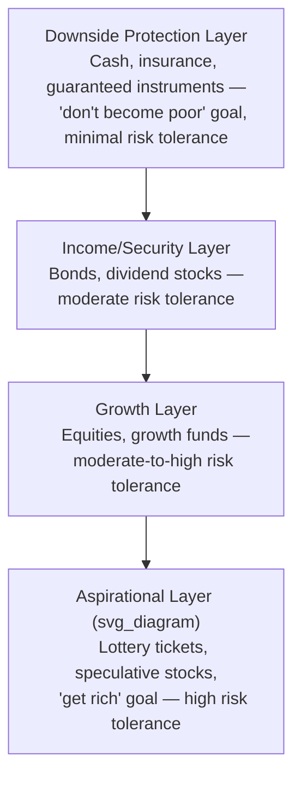

## Behavioral Portfolio Theory

### Overview

Behavioral Portfolio Theory (BPT) is a descriptive model of portfolio construction developed primarily by Hersh Shefrin and Meir Statman (1994, 2000) as an alternative to Markowitz's Mean-Variance Optimization (MVO). Rather than assuming investors evaluate portfolios holistically based on the covariance structure of assets, BPT proposes that investors build portfolios as a collection of distinct **mental accounts**, each associated with a specific goal and a specific level of aspiration and risk tolerance.

The theory integrates two major strands of behavioral finance:

- **Prospect Theory** (Kahneman & Tversky, 1979) — describing how people evaluate gains and losses relative to a reference point
- **Mental Accounting** (Thaler, 1985) — describing how people segregate money into separate, non-fungible accounts

### Core Divergence from Mean-Variance Theory

**Key Points**

| Dimension | Mean-Variance Theory (MVT) | Behavioral Portfolio Theory (BPT) |
| --- | --- | --- |
| Portfolio view | Single integrated portfolio | Layered pyramid of sub-portfolios |
| Risk measure | Variance/standard deviation (symmetric) | Risk of falling below a threshold (asymmetric, downside-focused) |
| Correlations | Explicitly optimized across all assets | Often ignored or misjudged across mental account layers |
| Investor goal | Maximize expected utility of terminal wealth | Satisfy multiple, layer-specific aspiration levels |
| Efficient frontier | Single frontier, one optimal mix per risk level | Multiple frontiers, one per mental account layer |

In MVT, an investor is assumed to care only about the joint distribution of overall portfolio returns. In BPT, an investor cares about the probability that *each individual layer* achieves its own aspiration level, largely in isolation from the other layers — even though this leads to portfolios that are not variance-efficient in aggregate.

### The Behavioral Portfolio Pyramid

BPT models the portfolio as a pyramid of layers, each funded to satisfy a distinct goal, ordered from safety-oriented at the base to aspiration-oriented at the top.

Each layer:

1. Is mentally segregated and rarely rebalanced against other layers
2. Has its own **reference point** (aspiration level) and **safety level** (minimum acceptable outcome)
3. Is evaluated using layer-specific risk attitudes, meaning the *same investor* can be simultaneously risk-averse (in the security layer) and risk-seeking (in the aspirational layer)

This produces the well-documented empirical pattern of investors holding both low-yield savings accounts and highly speculative stock positions at the same time — a combination that is difficult to rationalize under a single risk-aversion parameter in MVT.

### The SP/A Framework (Security-Potential/Aspiration)

BPT builds on Lopes' (1987) SP/A theory, which models choice as a trade-off between two more primitive psychological drivers:

- **Security (S):** the desire to avoid low, "disastrous" outcomes
- **Potential (P):** the desire for high, favorable outcomes
- **Aspiration (A):** a target level of wealth or return the investor wants to reach, with the *probability* of reaching it entering the decision separately from its magnitude

Under SP/A, an investor's decision weights are shaped by an interaction of a probability-weighting function (as in Prospect Theory) with an aspiration threshold. The investor maximizes something akin to a probability of exceeding the aspiration level, subject to keeping the probability of a "disastrous" outcome below some tolerance.

$$\max_{W} \; E[\, \mathbb{1}(W \geq A) \,] \quad \text{subject to} \quad P(W < S) \leq \alpha$$

Where:

- $W$ = terminal wealth of a given mental account layer
- $A$ = aspiration level for that layer
- $S$ = subsistence/safety level for that layer
- $\alpha$ = maximum tolerable probability of falling below $S$

**[Inference]** This formulation is a stylized representation synthesizing Lopes (1987) and Shefrin & Statman (2000); the original papers do not present a single unified closed-form objective, and different expositions of BPT render the security-potential trade-off somewhat differently.

### BPT-SA vs. BPT-MA

Shefrin and Statman (2000) distinguish two versions of the theory:

**BPT-SA (Single Mental Account)**

- The investor integrates all layers into one mental account when evaluating outcomes
- Correlations between assets *are* considered, but the investor still frames the portfolio choice around a single aspiration/safety pair rather than variance
- Under certain conditions, BPT-SA portfolios can coincide with mean-variance efficient portfolios

**BPT-MA (Multiple Mental Accounts)**

- The investor evaluates each layer separately, ignoring covariances *between* layers
- This is the more commonly observed behavior and the more "behaviorally realistic" case
- Leads to portfolios that are provably variance-inefficient relative to MVT, because diversification benefits across layers are left unexploited

**Example**

An investor with $100,000 might behaviorally partition funds as follows:

- $40,000 in a money-market fund (Downside Protection layer; safety level: never drop below $38,000)
- $35,000 in a diversified bond/equity index fund (Income/Growth layer; aspiration: 6% annual return)
- $20,000 in individual growth stocks (Growth layer; aspiration: beat the S&P 500)
- $5,000 in speculative biotech or cryptocurrency positions (Aspirational layer; aspiration: 10x return, accepted probability of total loss)

Under BPT-MA, this investor does not compute the covariance between the biotech position and the bond fund — each layer is assessed against its own target independently. Under MVT, an advisor would instead compute the full covariance matrix and potentially recommend a very different asset mix that dominates this pyramid on a risk-adjusted basis.

### Risk Attitudes Across the Pyramid

Layer-dependent risk attitude is a direct consequence of Prospect Theory's fourfold pattern applied within BPT:

| Layer | Domain (relative to aspiration) | Typical Risk Attitude |
| --- | --- | --- |
| Downside protection | Losses, high probability of achieving safety | Risk-averse |
| Aspirational | Gains, low probability of large payoff | Risk-seeking |

This mirrors the classic **fourfold pattern of risk attitudes**:

$$\text{Risk-seeking for low-probability gains} \;\; \Leftrightarrow \;\; \text{Risk-averse for high-probability gains}$$

**[Inference]** The mapping of "fourfold pattern" language directly onto pyramid layers is a common pedagogical simplification in behavioral finance courses; Shefrin and Statman's original formalization is grounded more directly in SP/A theory than in the fourfold pattern per se, though the two are consistent.

### Implications for Asset Pricing: Behavioral Asset Pricing Model (BAPM)

Shefrin and Statman (1994) extend BPT into an equilibrium asset pricing framework, the **Behavioral Asset Pricing Model**, distinguishing:

- **Information traders**: rational, mean-variance optimizers (analogous to CAPM agents)
- **Noise traders**: BPT-driven investors subject to cognitive biases (overconfidence, representativeness, affect)

Prices are set by the interaction of both trader types, so the market portfolio is *not* necessarily mean-variance efficient — a direct behavioral explanation for empirical CAPM anomalies (value premium, size effect, momentum) that standard CAPM struggles to explain.

**[Speculation]** Whether noise-trader sentiment fully or only partially explains specific pricing anomalies (e.g., the value premium) remains actively debated in the empirical asset-pricing literature, with risk-based explanations (e.g., Fama-French factors) offered as competing accounts.

### Reconciling BPT with Diversification: Lottery-Like Stocks

BPT offers a behavioral explanation for **underdiversification** and the popularity of lottery-like (positively skewed, high-variance, low-probability-of-large-gain) stocks:

- Investors accept negative expected returns on skewed securities because they are evaluated in the aspirational layer against a "home run" reference point, not against the portfolio's overall Sharpe ratio
- This is consistent with empirical findings (Kumar, 2009; Barberis & Huang, 2008) that retail investors overweight stocks with lottery-like payoff distributions, and that such stocks tend to be overpriced/underperform on average

### Practical Applications in Wealth Management

**Key Points**

- **Goals-based investing / goal-based wealth management** platforms (e.g., used by many private banks and robo-advisors) directly operationalize BPT by structuring portfolios around discrete client goals (retirement, education, legacy, speculation) rather than a single optimized blended portfolio
- Each goal-based "bucket" is assigned its own time horizon, risk tolerance, and glide path, mirroring the pyramid layers
- Advisors use BPT insights to counter irrational under-diversification by explicitly reframing "safe" and "risky" layers as parts of one integrated financial plan, nudging toward BPT-SA-like integration
- Behaviorally-informed retirement products (e.g., "floor-leverage" strategies, deferred annuities as a security layer) are direct commercial applications of the security/potential split

### Formal Comparison: Aspiration-Based Utility vs. Expected Utility

Under Expected Utility Theory (EUT), a rational investor with utility function $U(W)$ solves:

$$\max_{W} \; E[U(W)]$$

Under BPT/SP-A, the investor instead approximately solves a **threshold-based** objective:

$$\max_{W} \; P(W \geq A) \quad \text{s.t.} \quad P(W \leq S) \leq \alpha$$

This is mathematically closer to **safety-first portfolio theory** (Roy, 1952) than to von Neumann–Morgenstern expected utility, since it optimizes a probability of threshold attainment rather than the expectation of a smooth, continuously differentiable utility function. BPT can be seen as generalizing Roy's safety-first criterion by adding the aspiration/potential dimension on top of the pure safety constraint.

### Empirical Evidence and Criticisms

**Key Points**

- Supportive evidence: household portfolio surveys consistently show layered, non-integrated holdings (large cash buffers alongside speculative positions), consistent with BPT-MA rather than MVT
- Supportive evidence: options and lottery-stock demand patterns match aspirational-layer risk-seeking predictions
- Criticism: BPT is largely descriptive rather than prescriptive/normative — it explains observed suboptimal diversification but does not by itself provide a welfare-maximizing rule for what an investor *should* do
- Criticism: The pyramid layer boundaries are not always empirically well-defined; real investor mental accounts can be fuzzier and more dynamic than the discrete-layer model suggests
- Criticism: BPT-SA's claim of potential equivalence with mean-variance efficiency under integration is a special case, not the general empirical outcome

**[Unverified]** Precise quantitative estimates of the utility/wealth cost of BPT-MA-style underdiversification vary considerably by study design, time period, and asset universe, and no single consensus magnitude is well established across the literature.

### Related Topics

- Mental Accounting (Thaler)
- Prospect Theory and the Fourfold Pattern of Risk Attitudes
- SP/A Theory (Lopes)
- Safety-First Portfolio Theory (Roy)
- Goals-Based Wealth Management
- Behavioral Asset Pricing Model (BAPM)
- Lottery Preference and Skewness in Stock Returns
- Home Bias and Underdiversification
- House Money Effect
- Reference Point Formation and Adaptation