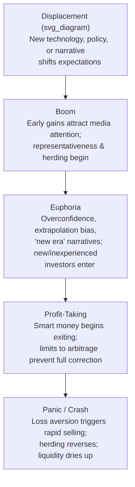

## Asset Price Bubbles and Behavioral Explanations of Crises

### Overview

An asset price bubble occurs when the market price of an asset rises substantially above a level justified by its fundamental value — the discounted stream of future cash flows — and subsequently collapses, often abruptly. Traditional finance struggles to explain bubbles under the Efficient Market Hypothesis (EMH), since rational, well-informed arbitrageurs should eliminate any mispricing. Behavioral finance instead explains bubbles as emergent outcomes of investor psychology, feedback dynamics, and structural limits on arbitrage that prevent rational forces from correcting mispricing in real time.

### Defining a Bubble

**Key Points**

- **Fundamental value ($V_f$):** the present value of expected future cash flows, discounted at an appropriate risk-adjusted rate
- **Market price ($P_t$):** the observed transaction price at time $t$
- A bubble exists when $P_t \gg V_f$ for a sustained period, typically driven by expectations of future price appreciation rather than fundamentals

$$P_t = V_f + B_t$$

Where $B_t$ is the bubble component — the portion of price attributable to speculative expectation rather than fundamentals. Rational bubble models (e.g., Blanchard & Watson, 1982) show that $B_t$ can persist in equilibrium if investors assign a positive probability to the bubble continuing, since:

$$E_t[B_{t+1}] = (1+r) B_t$$

This rational-bubble condition requires the bubble to grow at the risk-free rate in expectation to compensate for the risk of collapse — but behavioral finance argues that real-world bubbles deviate from this cleanly rational path due to systematic psychological biases.

### The Behavioral Bubble Lifecycle

This framework, adapted from Minsky's (1986) financial instability hypothesis and popularized by Kindleberger (2000) in *Manias, Panics, and Crashes*, maps closely onto behavioral biases at each stage.

### Behavioral Drivers by Bubble Phase

**Displacement and Early Boom**

- **Availability heuristic:** salient recent gains or narratives (e.g., "the internet will change everything") become overweighted relative to base rates
- **Representativeness:** investors pattern-match a new trend to historical periods of extraordinary growth, ignoring reversion tendencies
- **Anchoring:** early price levels become reference points, making subsequent gains feel like "cheap" continuations

**Euphoria**

- **Overconfidence and overoptimism:** investors overestimate the precision of their forecasts and their ability to exit before a downturn
- **Extrapolation bias:** recent price trends are naively projected forward, violating mean-reversion in fundamentals
- **Herding:** investors follow the crowd, either due to genuine belief updating (informational cascades) or social/career pressure (reputational herding)
- **Confirmation bias:** disconfirming information (falling fundamentals, warnings) is discounted or ignored
- **Fear of Missing Out (FOMO):** a colloquial label for regret aversion combined with social comparison, driving late-stage retail participation

**Profit-Taking and Reversal**

- **Disposition effect:** some investors sell winners too early, creating early selling pressure even before a broad reversal
- **Limits to arbitrage:** sophisticated investors who recognize the bubble may be unable or unwilling to short it due to costs, career risk, or uncertain timing (Shleifer & Vishny, 1997)

**Panic and Crash**

- **Loss aversion:** losses are weighted roughly 2–2.5x more heavily than equivalent gains (Kahneman & Tversky, 1979), triggering disproportionately strong selling once losses begin
- **Herding reversal:** the same social dynamics that fueled the boom now accelerate the sell-off
- **Liquidity spirals:** margin calls and forced selling compound price declines, a mechanically amplifying feedback loop independent of, but often triggered by, initial behavioral panic

### Limits to Arbitrage

A cornerstone of behavioral finance's explanation for why rational arbitrageurs fail to correct bubbles (Shleifer & Vishny, 1997; Barberis & Thaler, 2003):

| Limit | Mechanism |
| --- | --- |
| **Fundamental risk** | No perfect substitute exists to hedge a short position, exposing arbitrageurs to residual risk |
| **Noise trader risk** | Mispricing can worsen before it corrects (Keynes: "markets can stay irrational longer than you can stay solvent") |
| **Implementation costs** | Short-selling constraints, borrowing costs, margin requirements limit the scale of corrective trades |
| **Agency/horizon problems** | Fund managers face career and redemption risk if they bet against a bubble that keeps inflating, discouraging correction |

$$\text{Mispricing persists when: } \; \text{Cost of correcting} > \text{Expected arbitrage profit, risk-adjusted}$$

### Herding and Informational Cascades

Formal herding models (Banerjee, 1992; Bikhchandani, Hirshleifer & Welch, 1992) show that rational agents can generate herding even without behavioral bias, if they infer information from others' actions rather than relying solely on private signals:

- Each investor observes prior investors' decisions (e.g., buy/sell)
- If enough prior investors have bought, later investors may rationally imitate them even if their own private signal suggests otherwise
- This produces an **informational cascade**: individually rational updating aggregates into collectively excessive, fragile consensus

**[Inference]** Whether a given historical episode reflects primarily *rational* informational herding versus *behavioral* social/emotional herding is generally difficult to disentangle empirically, and most crisis case studies attribute the outcome to a mix of both mechanisms rather than isolating one.

### Case Study Patterns (Illustrative)

**Example**

| Episode | Displacement Narrative | Key Behavioral Mechanisms | Peak-to-Trough Pattern |
| --- | --- | --- | --- |
| Dutch Tulip Mania (1636–37) | Novel exotic commodity, status good | Representativeness, social contagion | Rapid speculative run-up, abrupt collapse |
| Dot-com Bubble (1995–2000) | Internet as transformative technology | Extrapolation bias, overconfidence, "new economy" narrative, limits to arbitrage (hard-to-short tech IPOs) | Multi-year boom, ~2.5-year decline (Nasdaq) |
| U.S. Housing Bubble (2003–2008) | "Housing prices never fall nationally" narrative, financial innovation (MBS/CDOs) | Availability heuristic (no recent national decline in memory), agency problems in mortgage origination, herding among institutions, disposition effects masking risk | Multi-year boom, sharp systemic crash with contagion |
| Cryptocurrency Cycles (2017, 2021) | Decentralization, blockchain narrative | FOMO, social-media-amplified herding, availability heuristic, retail overconfidence | Rapid parabolic rises, steep drawdowns |

**[Unverified]** Precise quantitative attribution of what fraction of price movement in any historical bubble is "behavioral" versus explainable by rational, evolving fundamentals remains contested among researchers and cannot be stated as a settled figure.

### Minsky's Financial Instability Hypothesis

Hyman Minsky's framework complements the psychological account with a structural/credit-cycle explanation, often integrated into behavioral crisis narratives:

1. **Hedge finance:** borrowers can service debt from cash flow (stable)
2. **Speculative finance:** borrowers can cover interest but must roll over principal (fragile)
3. **Ponzi finance:** borrowers rely on rising asset prices to service debt at all (highly fragile)

As euphoria progresses, the economy migrates from hedge to Ponzi finance — a structural amplifier of the behavioral optimism driving the bubble, and a key mechanism connecting bubble psychology to systemic financial crises rather than isolated asset mispricing.

### Behavioral Explanations of Crisis Contagion

- **Availability cascades:** media coverage of early failures (e.g., a single bank run) disproportionately raises perceived probability of broader collapse, independent of actual correlated risk
- **Ambiguity aversion:** during crises, uncertainty about counterparty exposure (not just risk) causes investors to withdraw broadly rather than discriminate between sound and unsound institutions — a behavioral amplifier of bank runs and interbank freezes
- **Recency bias:** post-crisis, investors overweight the crisis's probability of recurrence, contributing to prolonged risk aversion and slow recovery in risk asset prices (equity risk premium puzzles post-crisis)

### Policy and Detection Implications

**Key Points**

- **Bubble detection challenges:** because $V_f$ is unobservable in real time, distinguishing a "rational" high valuation (driven by genuinely improved fundamentals) from a behavioral bubble is inherently difficult *ex ante*; most identification is retrospective
- **Macroprudential tools** (loan-to-value caps, countercyclical capital buffers) are partly motivated by behavioral finance's view that market participants and regulators alike are prone to extrapolative, herding-driven blind spots during booms
- **Circuit breakers and trading halts** are designed with behavioral panic dynamics in mind, giving markets a "cooling off" period to counteract loss-aversion-driven cascading sell orders
- **Investor education and disclosure design** (e.g., simplified risk warnings) attempt to counteract availability and representativeness biases at the point of investment decision

### Conclusion

Behavioral explanations of asset bubbles do not claim that psychology alone generates crises; rather, they argue that cognitive biases (representativeness, overconfidence, herding, loss aversion) interact with structural limits to arbitrage and credit dynamics (Minsky cycles) to prevent the rapid correction that pure rational-market theory would predict. This synthesis explains both the persistence of overvaluation during the boom phase and the severity/speed of collapse during the bust phase, in ways that fundamentals-only models find difficult to replicate.

### Related Topics

- Limits to Arbitrage (Shleifer & Vishny)
- Herding Behavior and Informational Cascades
- Minsky's Financial Instability Hypothesis
- Loss Aversion and Prospect Theory
- Overconfidence and Excessive Trading
- Disposition Effect
- Noise Trader Risk (De Long, Shleifer, Summers, Waldmann)
- Efficient Market Hypothesis: Behavioral Critiques
- Systemic Risk and Contagion Modeling
- Macroprudential Regulation and Behavioral Policy Design