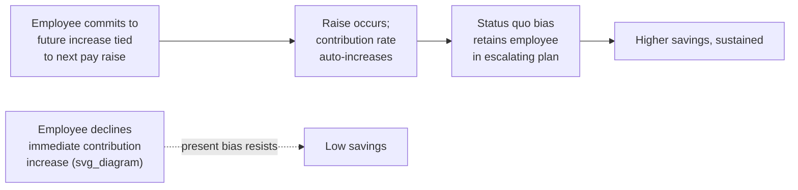

## Household Finance and Retirement Savings Behavior

### Overview

Household finance studies how individuals and families make decisions about saving, borrowing, investing, and insuring themselves against risk over the life cycle. It contrasts sharply with the predictions of the traditional **Life-Cycle Hypothesis (LCH)** (Modigliani & Brumberg, 1954) and **Permanent Income Hypothesis (PIH)** (Friedman, 1957), which assume rational, forward-looking agents smooth consumption optimally across their lifetimes. Empirically, household saving and retirement behavior deviates from these predictions in large, systematic, and well-documented ways — motivating a behavioral reformulation of household financial decision-making.

### The Rational Benchmark: Life-Cycle/Permanent Income Hypothesis

Under the standard LCH, a rational agent maximizes lifetime utility subject to a lifetime budget constraint:

$$\max \sum_{t=0}^{T} \beta^t U(C_t) \quad \text{s.t.} \quad \sum_{t=0}^{T} \frac{C_t}{(1+r)^t} \leq \sum_{t=0}^{T} \frac{Y_t}{(1+r)^t} + A_0$$

Where $C_t$ is consumption, $Y_t$ is income, $A_0$ is initial assets, $\beta$ is the discount factor, and $r$ is the interest rate. This predicts:

- Smooth consumption over the life cycle regardless of the timing of income
- Optimal, self-directed saving during working years to fund retirement
- Full utilization of tax-advantaged accounts and employer matches
- Rational decumulation of assets in retirement, roughly to zero at end of life (absent bequest motives)

**Key Points** — Empirical violations of LCH/PIH predictions include:

- Excess sensitivity of consumption to predictable income changes (Campbell & Mankiw, 1989)
- Widespread under-saving relative to LCH-optimal targets
- Slow or non-existent decumulation in retirement ("retirement consumption puzzle" and the "annuity puzzle")
- Low participation in employer retirement plans even with free matching contributions left unclaimed

### Present Bias and Under-Saving

Retirement saving requires trading off certain, immediate consumption against uncertain, distant future consumption — precisely the setting where **present bias** and hyperbolic discounting exert the strongest distorting effect.

Under quasi-hyperbolic ($\beta$-$\delta$) discounting (Laibson, 1997):

$$U_t = u(C_t) + \beta \sum_{k=1}^{\infty} \delta^k u(C_{t+k}), \quad 0 < \beta < 1$$

The parameter $\beta$ generates a discontinuity between "now" and "the future," causing:

- **Naive procrastination:** repeatedly postponing enrollment or contribution increases, believing "I'll start saving more next year"
- **Sophisticated under-saving:** even agents aware of their self-control problem may fail to save adequately without external commitment devices
- Present-biased agents disproportionately hold high-interest debt (credit cards) alongside low-interest savings — mirroring the co-existence pattern predicted by mental accounting and BPT frameworks

### Inertia, Defaults, and Complexity

**Key Points**

- **Status quo bias:** employees overwhelmingly stick with default contribution rates and default fund allocations, even when better options are clearly available
- **Choice overload:** a large number of fund options in a 401(k) menu can reduce, not increase, participation (Iyengar, Huberman & Jiang, 2004 find each additional 10 fund options is associated with a measurable decline in plan participation rates)
- **Complexity aversion:** retirement products (annuities, target-date funds, decumulation strategies) are often too complex for the average saver to evaluate, leading to avoidance or reliance on heuristics
- **Procedural rationality limits:** the sheer number of sequential decisions required (enroll → set contribution rate → choose allocation → rebalance → plan decumulation) creates multiple points of behavioral failure

### Automatic Enrollment and Save More Tomorrow

The most influential behavioral intervention in retirement savings research is Thaler & Benartzi's **Save More Tomorrow (SMarT)** program (2004), which directly exploits present bias, loss aversion, and status quo bias to increase savings rates.

**Design mechanics of SMarT:**

1. Employees are invited to commit *now* to future contribution rate increases, timed to coincide with future pay raises
2. Because the increase is scheduled for the future, present bias does not resist it as strongly as an immediate pay cut would
3. Because increases are tied to raises, take-home pay never nominally decreases — avoiding **loss aversion** relative to the current paycheck
4. Once enrolled, **status quo bias** works *for* savings rather than against it, since inertia keeps employees in the increasing-contribution plan

**[Unverified]** The original SMarT case study reported contribution rate increases from roughly 3.5% to 13.6% over about 40 months for participating employees; exact magnitudes vary considerably across firms and subsequent replications, and this figure should be treated as illustrative of the original pilot rather than a generalizable constant.

### Automatic Enrollment Design

Under **opt-out (automatic) enrollment**, new employees are defaulted into plan participation at a preset contribution rate and fund allocation unless they actively choose to opt out, reversing the default from the traditional opt-in design.

| Design Feature | Behavioral Mechanism Exploited | Typical Effect |
| --- | --- | --- |
| Automatic enrollment | Status quo bias, inertia | Sharply higher participation rates vs. opt-in |
| Automatic escalation | Present bias mitigation, loss aversion avoidance | Rising contribution rates over time |
| Default contribution rate | Anchoring | Employees tend to cluster at the default rate rather than optimizing |
| Default fund (e.g., target-date fund) | Status quo bias | High persistence in the default investment option |

**[Inference]** A frequently cited concern in the literature is that low default contribution rates (historically often around 3%) can anchor employees below what they would have rationally chosen absent any default, illustrating that defaults are a double-edged design lever — a claim with reasonably broad support but with effect sizes that vary by plan design and population studied.

### The Employer Match "Free Money" Puzzle

A substantial share of eligible employees historically fail to contribute enough to capture the full employer match — effectively leaving a guaranteed, risk-free return unclaimed. Behavioral explanations include:

- **Limited attention:** employees may not fully process or attend to the plan's matching formula, particularly at onboarding when attention is divided across many decisions
- **Complexity of match formulas:** tiered or partial matches (e.g., 50% match up to 6% of salary) are harder to mentally compute than simple full matches
- **Present bias:** even a guaranteed high effective return in the future is discounted relative to immediate consumption
- **Procrastination:** intending to increase contributions "later" to capture the full match, but never following through

### The Retirement Consumption and Annuity Puzzles

**Retirement Consumption Puzzle:** Many households show a measurable drop in consumption expenditure at the point of retirement, which is inconsistent with LCH-predicted smooth consumption absent an unanticipated income shock. Behavioral explanations include:

- Retirement reduces work-related expenses (commuting, professional attire) in ways not fully modeled by simple LCH tests
- Time reallocation toward home production substitutes for some market consumption
- **[Inference]** Some portion of the drop may also reflect that retirement itself was not perfectly anticipated or planned for financially, consistent with under-saving driven by present bias — though disentangling this from rational explanations (e.g., substitution toward home production) remains an active empirical debate

**Annuity Puzzle:** Despite the theoretical utility gains from annuitizing wealth to insure against longevity risk, voluntary annuity purchase rates remain persistently low. Behavioral explanations include:

- **Loss aversion / framing:** annuities are often framed as a gamble ("you could die early and lose your principal") rather than as insurance ("you are protected against outliving your savings") — framing substantially affects stated demand in experimental studies
- **Mental accounting:** annuitized wealth is mentally coded as "spent" or no longer "owned," reducing its perceived value relative to a liquid asset of equal actuarial worth
- **Bequest motives and flexibility preferences:** desire to retain control over assets or leave an inheritance, which interacts with, but is distinct from, purely behavioral explanations

### Overconfidence and Financial Literacy

- **Overconfidence:** households, especially those with lower financial literacy, tend to overestimate their investment knowledge and their ability to time markets or pick winning investments, contributing to excess trading and inadequate diversification
- **Financial literacy gaps:** poor understanding of compound interest, inflation, and risk diversification is strongly and consistently associated with lower retirement wealth accumulation across household finance surveys (e.g., Lusardi & Mitchell's extensive body of work on financial literacy)
- **Numeracy effects:** the ability to compute and compare probabilities and percentages is linked to better-diversified portfolios and to greater use of formal retirement planning tools

### Debt Behavior and Household Balance Sheets

**Key Points**

- **Co-holding puzzle:** many households simultaneously carry high-interest revolving credit card debt while holding lower-yielding liquid savings, a pattern difficult to reconcile with a single time-consistent discount rate but consistent with mental accounting (separate "spending" and "saving" accounts) and self-control/precautionary liquidity motives
- **Minimum payment anchoring:** credit card minimum payment amounts serve as a salient anchor, and required minimum payment disclosures have been shown in field studies to influence how much beyond the minimum cardholders pay
- **Present bias in borrowing:** the same discounting distortions that suppress saving also encourage overborrowing against future income

### Choice Architecture Interventions in Retirement Systems

| Intervention | Mechanism | Illustrative Use Case |
| --- | --- | --- |
| Automatic enrollment | Status quo bias | UK NEST, US SECURE Act provisions encouraging auto-enrollment |
| Automatic escalation | Present-bias mitigation, loss framing | Save More Tomorrow-based plan designs |
| Simplified plan menus | Reducing choice overload | Curated fund line-ups, tiered menu structures |
| Target-date funds as default | Status quo bias, complexity reduction | Widely adopted qualified default investment alternatives (QDIAs) in the US |
| Simplified/annual statements | Salience, limited-attention correction | Projected retirement income statements rather than raw account balances |
| Reframing annuities as "income insurance" | Counteracting loss-averse framing | Experimental and some commercial annuity marketing redesigns |

**[Speculation]** The long-run aggregate welfare impact of nudge-based retirement policy relative to counterfactual mandatory saving schemes is not fully settled, since nudges preserve choice (and thus permit continued under-saving among the most inattentive households) while mandates raise separate questions about paternalism and heterogeneous household needs.

### Conclusion

Household finance research demonstrates that saving and retirement decisions are shaped less by continuous rational optimization and more by present bias, mental accounting, inertia, and limited attention, layered on top of genuine complexity and financial illiteracy. This body of evidence has directly reshaped retirement plan design in practice — automatic enrollment, automatic escalation, and simplified defaults are now standard tools precisely because they work *with* documented behavioral tendencies rather than assuming they can be educated away.

### Related Topics

- Present Bias and Hyperbolic Discounting
- Save More Tomorrow and Automatic Escalation Design
- Default Effects and Status Quo Bias
- Choice Overload and the Paradox of Choice
- Mental Accounting and Fungibility Violations
- Financial Literacy and Numeracy
- Annuity Puzzle and Longevity Risk
- Nudge Theory and Libertarian Paternalism
- Behavioral Portfolio Theory
- Overconfidence and Household Trading Behavior