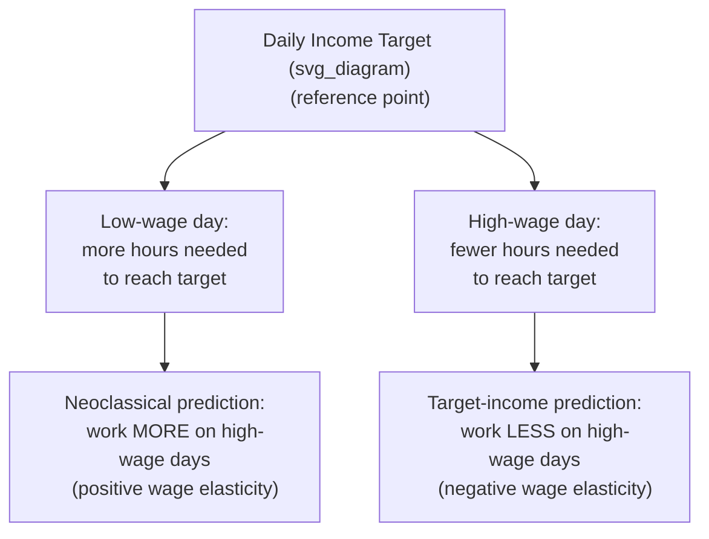

## Reference-Dependent Preferences in Labor Supply

### Overview

Reference-dependent labor supply models apply Prospect Theory's core insight — that outcomes are evaluated relative to a reference point rather than in absolute terms, with losses looming larger than equivalent gains — to the daily and periodic decisions workers make about how much to work. The canonical application is the **income-targeting model of labor supply**, most famously tested using data on New York City taxi drivers (Camerer, Babcock, Loewenstein & Thaler, 1997), which asks whether workers treat a daily income target as a reference point and quit working once it is reached, rather than supplying labor according to the standard neoclassical intertemporal substitution model.

### The Neoclassical Benchmark: Intertemporal Labor Supply

Under the standard life-cycle labor supply model, a rational worker maximizes utility over consumption and leisure, choosing hours in each period based on the prevailing wage:

$$\max_{L_t} \; U(C_t, \ell_t) \quad \text{s.t.} \quad C_t = w_t L_t + \text{other income}$$

Where $L_t$ is hours worked, $\ell_t$ is leisure, and $w_t$ is the wage. The key testable prediction is **intertemporal substitution**: workers should work *more* hours on days when the wage (or effective return to an hour of work) is temporarily high, and *less* on days when it is temporarily low, since high-wage days offer the best opportunity to "bank" income relative to low-wage days.

$$\frac{\partial L_t}{\partial w_t} > 0 \quad \text{(substitution effect dominates for a transitory wage change)}$$

### The Reference-Dependent Alternative: Daily Income Targeting

The behavioral alternative proposes that workers set a **daily income target** (a reference point, often anchored to a round number, an average recent day's earnings, or a specific savings goal) and treat falling short of that target as a loss, and exceeding it as a gain, per Prospect Theory's value function:

$$v(x) =
\begin{cases}
x^{\alpha}, & x \geq 0 \\
-\lambda(-x)^{\beta}, & x < 0
\end{cases}
\quad \lambda > 1$$

Where $x$ is income relative to the target, and $\lambda$ (loss aversion coefficient, typically estimated around 2–2.5 in laboratory settings) makes shortfalls relative to the target subjectively more painful than equivalent-sized surpluses are pleasurable.

**Key behavioral prediction:** because the marginal utility of an additional hour's income drops sharply once the target is reached (moving from the steep "loss" region to the flatter "gain" region), workers are predicted to:

- Work **longer hours on low-wage days** (to reach the target, which takes more hours when the wage is low)
- Quit **earlier on high-wage days** (target reached faster)

This produces a **negative** relationship between the wage and hours worked — the opposite sign predicted by the standard intertemporal substitution model.

### The Taxi Driver Studies

**Example**

Camerer et al. (1997) analyzed daily "trip sheets" of New York City cab drivers, comparing hours worked to the realized average daily wage (which fluctuates due to weather, day-of-week demand, tourist traffic, etc.):

- They found a **negative** elasticity of daily hours with respect to the daily wage for a substantial subset of drivers — consistent with income targeting, not intertemporal substitution
- The effect was found to be stronger among **inexperienced drivers**, while more experienced drivers' behavior was closer to the neoclassical prediction — suggesting the bias may be partially eroded by learning or market experience
- Farber (2005, 2008) subsequently challenged this interpretation using richer data (including per-trip "shift" data rather than day-level aggregates), arguing that a large share of the apparent negative elasticity could be attributed to unmodeled "stopping" decisions tied to shift length rather than a stable daily income target, and found evidence more consistent with standard reference points influencing only a subset of quitting decisions

**[Unverified]** The taxi driver literature is genuinely contested; subsequent replications and reanalyses (Farber, Crawford & Meng 2011, and others) reach different conclusions depending on data granularity, control variables, and modeling assumptions about what constitutes a "shift," and there is no settled consensus estimate of the magnitude of the targeting effect across the literature.

### Formal Reference-Dependent Labor Supply Model

Köszegi & Rabin's (2006) general reference-dependent preferences framework has been applied to labor supply by treating the reference point itself as **endogenous** — typically modeled as the worker's own recent expectations about income, rather than a fixed exogenous target:

$$U(C, \ell \mid r_C, r_\ell) = u(C) + v(\ell) + \mu(C \mid r_C) + \mu(\ell \mid r_\ell)$$

Where $r_C$ and $r_\ell$ are reference levels of consumption and leisure (formed from recent expectations), and $\mu(\cdot)$ is a gain-loss utility term applied around each reference point. This "expectations-based reference point" version can generate income-targeting-like behavior in some parameterizations while also nesting the standard model as a special case when gain-loss sensitivity is zero.

**[Inference]** The Köszegi-Rabin framework is widely used as the modern theoretical workhorse for reference-dependent labor supply because it avoids assuming an arbitrary fixed target, but applying it requires additional assumptions about how expectations are formed and updated, which vary across empirical implementations and are not fully standardized in the literature.

### Loss Aversion Around Pay Cuts and Wage Rigidity

Reference dependence also explains persistent patterns in wage-setting and worker behavior around pay changes:

- **Downward nominal wage rigidity:** employers are reluctant to cut nominal wages even during downturns, partly because workers perceive nominal pay cuts as losses relative to their current-wage reference point, generating disproportionate morale, effort, and turnover costs (Bewley, 1999; Kahneman, Knetsch & Thaler, 1986 on perceived unfairness of nominal cuts)
- **Reference-dependent effort provision:** in principal-agent settings, workers who fall short of an internalized performance or pay reference point may reduce effort ("give up") more sharply than the effort gain from exceeding the same reference point by an equal margin, consistent with loss-averse effort responses documented in some field experiments (e.g., studies of piece-rate and bonus-threshold schemes)

### Goal Setting as an Endogenous Reference Point

Related literature treats **explicit performance/sales goals** as reference points workers set for themselves or are assigned by employers:

- Bonus and commission structures with a discrete threshold ("hit $X$ in sales this month to earn the bonus") generate a kink in effort just below the threshold, as workers loss-aversely avoid falling short
- This has been documented in sales-force and gig-economy settings, where daily/weekly earnings thresholds shape stopping decisions analogously to the taxi driver findings
- **[Speculation]** Whether such goal-referenced effort patterns primarily reflect internalized loss aversion, or instead reflect rational responses to discontinuous, kinked compensation schemes designed intentionally by employers, is difficult to separate empirically since the two explanations often predict similar observed behavior

### Gig Economy Applications

**Key Points**

- Modern gig-economy platforms (ride-hailing, food delivery) generate rich, high-frequency data well suited to testing reference-dependent labor supply, and several studies have examined whether drivers exhibit income-targeting-like stopping behavior in these settings
- Platform-side interventions (e.g., real-time earnings displays, surge-pricing notifications, or gamified progress bars toward a bonus) can be interpreted as choice-architecture tools that interact directly with workers' salient reference points, shaping when workers choose to log on or off
- **[Unverified]** Findings on the magnitude and consistency of income-targeting behavior specifically within gig-economy platforms vary substantially by study, platform, and time period, and general conclusions should not be treated as uniformly established across the sector

### Implications for Labor Market Policy and Firm Design

| Domain | Reference-Dependence Implication |
| --- | --- |
| Minimum wage changes | Worker responses to wage changes may not mirror the symmetric substitution effects assumed in standard models, complicating simple elasticity-based policy forecasts |
| Piece-rate and bonus design | Threshold-based pay may induce loss-averse "bunching" just above the threshold and effort withdrawal just below it |
| Nominal wage cuts during recessions | Employers may prefer layoffs, hour reductions, or wage freezes over nominal cuts to avoid loss-averse morale/turnover costs |
| Gig platform algorithm design | Earnings displays and progress indicators can shift labor supply timing without changing underlying pay rates |

### Conclusion

Reference-dependent preferences in labor supply offer a behavioral alternative to the neoclassical intertemporal substitution model, predicting that workers may reduce hours on high-wage days and extend hours on low-wage days when a salient income target governs their stopping decisions. While the original taxi driver evidence sparked substantial debate and subsequent reanalyses have qualified the strength and generality of the effect, the broader reference-dependence framework — particularly in its Köszegi-Rabin "expectations-based" form — remains an active and influential area connecting behavioral economics to labor market design, wage rigidity, and gig-economy platform behavior.

### Related Topics

- Prospect Theory and the Value Function
- Loss Aversion and the Loss Aversion Coefficient
- Köszegi-Rabin Expectations-Based Reference Points
- Downward Nominal Wage Rigidity
- Goal Setting Theory and Threshold-Based Incentives
- Gig Economy Labor Supply and Platform Design
- Intertemporal Substitution in Labor Supply
- Piece-Rate Compensation and Bunching Behavior