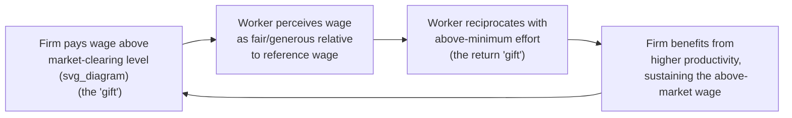

## Fairness, Wage Rigidity, and Gift-Exchange Models

### Overview

Fairness-based labor economics models explain persistent empirical anomalies in wage-setting — particularly the reluctance of firms to cut wages even during excess labor supply, and the willingness of firms to pay above market-clearing wages — as outcomes of workers' and employers' concern for fairness norms, not just standard supply-and-demand optimization. The central theoretical vehicle is the **gift-exchange model** (Akerlof, 1982), later formalized experimentally by Fehr, Kirchsteiger & Riedl (1993), which treats the employment relationship as a reciprocal exchange of "gifts" — above-market wages from the firm in exchange for above-minimum effort from the worker — rather than a pure spot-market transaction.

### The Standard Competitive Benchmark

In a competitive spot labor market, wages adjust to clear supply and demand:

$$w^* : \; L^D(w^*) = L^S(w^*)$$

Under this model, involuntary unemployment should be temporary (a disequilibrium phenomenon), and nominal wages should fall freely during downturns to restore clearing. Persistent unemployment alongside apparently "sticky" wages is difficult to reconcile with this framework without appeal to some form of friction or rigidity.

### Akerlof's Gift-Exchange Model

Akerlof (1982) proposed that the employment relationship is better modeled as a partial **gift exchange**, drawing on sociological norm-based reciprocity rather than pure price-taking:

1. The firm pays a wage above the market-clearing level — perceived by workers as a "gift"
2. Workers reciprocate with effort above the minimum enforceable level — a "gift" in return
3. Both parties are motivated partly by **fairness norms** (an internalized sense of what constitutes a reasonable wage-effort exchange) rather than pure self-interest

$$e_i = e(w_i, w^r, \text{norms}) \quad \text{with} \quad \frac{\partial e_i}{\partial (w_i - w^r)} > 0$$

Where $e_i$ is worker effort, $w_i$ is the worker's actual wage, and $w^r$ is a **reference wage** — determined by the worker's perception of a "fair" wage, often benchmarked against co-workers' pay, industry norms, or the firm's ability to pay.

### Efficiency Wage Theory Connection

Gift-exchange models sit within the broader family of **efficiency wage theories**, which explain above-market wages as profit-maximizing (not purely fairness-driven) firm strategies. It is useful to distinguish the behavioral (fairness-based) rationale from the purely rational efficiency-wage rationales:

| Efficiency Wage Variant | Mechanism | Rationality Basis |
| --- | --- | --- |
| Shirking model (Shapiro-Stiglitz, 1984) | Higher wages raise the cost of job loss, deterring shirking under imperfect monitoring | Fully rational, no fairness assumption needed |
| Adverse selection model (Weiss, 1980) | Higher wages attract higher-quality applicants | Fully rational |
| Turnover-cost model | Higher wages reduce costly turnover | Fully rational |
| **Gift-exchange / fair-wage model (Akerlof, 1982; Akerlof & Yellen, 1990)** | Higher wages elicit voluntary effort via reciprocity/fairness norms | Explicitly behavioral — relies on social preferences, not pure incentive-compatibility |

The **Fair Wage-Effort Hypothesis** (Akerlof & Yellen, 1990) formalizes the behavioral version: workers withhold effort proportionally to the shortfall between their actual wage and their perceived fair wage, even when a purely rational agent (facing no monitoring or termination risk beyond the norm violation itself) would have no incentive-based reason to reduce effort.

$$\frac{e}{e^*} = \min\left(1, \frac{w}{w^f}\right)$$

Where $e^*$ is normal/full effort and $w^f$ is the perceived fair wage — effort is proportionally withheld only when actual wage $w$ falls short of $w^f$, but is not correspondingly boosted above $e^*$ when $w$ exceeds $w^f$, reflecting an asymmetric, loss-averse-like structure to the fairness response.

### Experimental Evidence: Fehr, Kirchsteiger & Riedl (1993)

**Example**

Fehr, Kirchsteiger & Riedl's laboratory gift-exchange game directly tests Akerlof's mechanism:

1. "Firms" (experimental subjects) propose a wage to "workers"
2. "Workers" choose an effort level (often costly to the worker, valuable to the firm) in response, with effort not contractually enforceable beyond a required minimum
3. Standard game-theoretic backward induction predicts workers should always choose minimum effort (since effort is costly and unenforceable, and the interaction is often one-shot or anonymous), and firms, anticipating this, should offer minimum wages

**Key finding:** Contrary to the subgame-perfect equilibrium prediction, workers systematically **reciprocated higher wage offers with higher effort**, and firms **anticipated this** by offering wages substantially above the minimum. This result has been replicated extensively and is considered one of the more robust findings in behavioral/experimental labor economics.

**[Unverified]** Specific quantitative effort-wage reciprocity elasticities vary across replications, subject pools, and experimental design choices (e.g., one-shot vs. repeated games, strangers vs. partners matching), so no single numeric elasticity should be treated as a universal constant across the literature.

### Reference Wages and Wage Comparisons

Fairness perceptions of one's own wage are strongly shaped by **social comparison** to relevant reference groups:

- **Internal equity:** comparisons to co-workers in the same firm, particularly those in similar roles (documented extensively in pay-secrecy and pay-transparency research)
- **External equity:** comparisons to workers in similar roles at other firms or in the same industry
- **Historical/status quo anchor:** comparisons to one's own previous wage, generating the perception that a nominal pay cut is unfair even when justified by changed labor market conditions
- **Card & Krueger-style field evidence** and subsequent pay-transparency studies have found that learning one is paid below a relevant comparison group can reduce reported job satisfaction and, in some studies, subsequent effort or job search intensity — consistent with reference-wage-based fairness models

### Downward Nominal Wage Rigidity Revisited

Fairness models provide a distinct (though complementary) explanation for **downward nominal wage rigidity**, alongside the loss-aversion-based account:

- Bewley's (1999) extensive interview-based study of managers found that firms avoid nominal wage cuts primarily because of anticipated **morale and fairness-perception costs** — cutting pay is perceived by workers as a violation of an implicit fairness norm, damaging effort, cooperation, and retention even when the cut is economically justified
- Kahneman, Knetsch & Thaler's (1986) "fairness surveys" found that a majority of survey respondents rated a nominal wage cut during a period of zero inflation as **unfair**, while an equivalent *real* wage cut achieved via failing to grant a raise during positive inflation was rated as far more acceptable — demonstrating that fairness perceptions are anchored to **nominal**, not just real, wage changes (a form of **money illusion** interacting with fairness norms)

$$\text{Perceived fairness: nominal cut} \;\ll\; \text{Perceived fairness: real cut via foregone raise, equal magnitude}$$

### Firm-Level Strategic Implications

**Key Points**

- Firms facing a negative demand shock often prefer **layoffs or hour reductions** over broad nominal wage cuts, precisely because layoffs, while costly, do not violate the fairness norm governing the wage of *remaining* employees, whereas a cut would
- **Two-tier wage structures** (lower starting wages for new hires while protecting incumbent wages) are a common real-world compromise that navigates fairness constraints — incumbents' reference wages are protected, while new hires' reference wages are set fresh at the lower rate
- **Bonus and variable pay components** are sometimes structurally preferred over base wage increases/decreases specifically because bonuses appear to be judged against a different (more flexible) fairness norm than base salary, allowing firms greater downward flexibility in total compensation without violating perceived fairness as strongly
- Pay-transparency policies interact directly with fairness/reference-wage dynamics: increased transparency can raise perceived fairness where pay is genuinely equitable, but can also reveal genuine disparities and trigger the morale costs the gift-exchange framework predicts

### Distinguishing Fairness Models from Pure Reciprocity/Social Preference Models

**Key Points**

- Gift-exchange/fair-wage models sit adjacent to, but are conceptually distinct from, general **social preference models** (e.g., Fehr & Schmidt, 1999 inequity aversion) — fairness in the labor context is specifically anchored to *wage-effort norms* within an ongoing relationship, whereas inequity aversion models apply more generally to any allocation context
- **[Inference]** Much of the applied labor economics literature treats gift-exchange and fair-wage-effort models as largely overlapping/complementary explanations for the same empirical wage-rigidity phenomena, rather than as sharply competing theories, since they share the core mechanism of reference-wage-based reciprocity even though their formal derivations differ

### Conclusion

Fairness-based models reframe the employment relationship as a norm-governed exchange rather than a pure spot-market transaction, explaining wage rigidity, efficiency wages, and effort variation through reciprocity and reference-wage comparisons rather than purely incentive-based or market-clearing mechanisms. The extensive experimental gift-exchange literature and Bewley's interview-based survey evidence together provide convergent support for treating fairness perceptions as a first-order determinant of real-world wage-setting behavior, alongside — not merely secondary to — standard efficiency wage considerations.

### Related Topics

- Efficiency Wage Theory (Shapiro-Stiglitz Shirking Model)
- Fehr-Schmidt Inequity Aversion
- Downward Nominal Wage Rigidity
- Money Illusion
- Reference-Dependent Preferences in Labor Supply
- Pay Transparency and Wage Comparison Effects
- Two-Tier Wage Structures
- Reciprocity in Principal-Agent Relationships