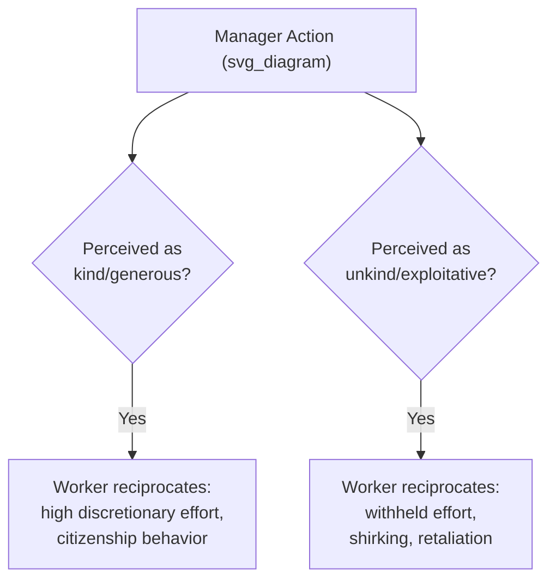

## Effort and Reciprocity in the Workplace

### Overview

Reciprocity-based models of workplace effort extend beyond the wage-effort fairness norm of gift-exchange theory (covered separately) to a broader class of **social preferences** governing how employees respond to treatment by employers, managers, and coworkers. Where gift-exchange models focus specifically on wages as the triggering "gift," this literature examines a wider set of reciprocity-eliciting actions — trust, autonomy, recognition, working conditions, and interpersonal treatment — and formalizes reciprocity using **intention-based** models that distinguish reciprocation of *kind acts* from mere reciprocation of *favorable outcomes*.

### Reciprocity vs. Pure Outcome-Based Fairness

A key theoretical distinction in this literature is between:

- **Outcome-based fairness (inequity aversion):** workers respond to the *distribution* of outcomes (e.g., their pay relative to others), regardless of the intentions behind it (Fehr & Schmidt, 1999)
- **Intention-based reciprocity:** workers respond to the perceived **kindness or unkindness of the intention** behind an action, not just its material outcome (Rabin, 1993; Dufwenberg & Kickert, 2004; Falk & Fischbacher, 2006)

**Example**

A worker who receives a bonus because the firm was legally required to pay it (no discretion, no kind intention) is predicted by intention-based models to reciprocate *less* than a worker who receives an identical bonus as a discretionary, voluntary gesture from a manager — even though the material outcome is identical. Outcome-based inequity aversion models alone cannot generate this distinction, since both scenarios produce the same final payoff distribution.

$$\text{Reciprocity response} = f(\text{outcome}, \, \underbrace{\text{perceived intention/kindness}}_{\text{distinguishes intention-based models}})$$

### Formal Reciprocity Framework (Rabin, 1993 — Simplified)

Rabin's psychological game theory formalizes reciprocity using **kindness functions**. Each player forms beliefs about the other's kindness toward them, and chooses actions that reciprocate perceived kindness with kindness, and perceived unkindness with unkindness:

$$U_i = \pi_i(a_i, b_j) + f_j(a_i, b_j) \cdot \big[1 + f_i(a_i, b_j)\big]$$

Where $\pi_i$ is material payoff, $f_j$ represents player $j$'s (the employer's) kindness toward player $i$ (the worker) as perceived by $i$, and $f_i$ represents $i$'s reciprocal kindness toward $j$. This creates multiple possible equilibria: a **mutual-kindness equilibrium** (high effort, generous treatment) and a **mutual-unkindness equilibrium** (minimum effort, adversarial treatment) can both be self-sustaining, depending on which set of beliefs coordinates behavior.

**[Inference]** This equation is a standard simplified representation used in textbook treatments of Rabin's fairness equilibrium; the original formalization involves additional technical detail regarding belief hierarchies (first-order and second-order beliefs) that is generally abstracted away in applied labor economics presentations.

### Positive Reciprocity: Discretionary Effort and Organizational Citizenship

**Key Points**

- **Organizational Citizenship Behavior (OCB):** discretionary, non-contractually-required behaviors (helping coworkers, going beyond job description, voluntary overtime) shown across the organizational behavior literature to increase when employees perceive fair, supportive treatment from management
- **Trust and autonomy as reciprocity triggers:** granting employees autonomy or trust (e.g., flexible schedules, reduced monitoring) has been documented in field and lab studies to increase reciprocal effort, consistent with a gift-exchange-like mechanism operating on non-wage dimensions
- **Recognition effects:** non-monetary recognition (public acknowledgment, positive feedback) has been found in several field experiments to produce measurable increases in subsequent effort or output, sometimes comparably sized to modest monetary bonuses, consistent with reciprocity responding to perceived kindness rather than purely to material value

### Negative Reciprocity: Retaliation and Shirking

The reciprocity framework is symmetric — unkind or exploitative treatment predicts **negative reciprocity**, including:

- **Reduced discretionary effort:** withholding OCB-type behaviors in response to perceived unfair treatment, even without formal shirking that would be independently detectable
- **Counterproductive work behavior (CWB):** minor sabotage, time theft, or deliberate underperformance following perceived mistreatment, documented extensively in organizational behavior research on "psychological contract breach"
- **Retaliatory turnover intentions:** perceived unfairness (e.g., broken promises, unfair performance evaluations) is a robust predictor of voluntary turnover intentions independent of the objective pay/benefits package
- **Whistleblowing and voice behavior:** in some studies, perceived organizational injustice is associated with increased likelihood of formal complaints or external reporting, framed as a reciprocal response to perceived organizational unkindness

### The Psychological Contract

A closely related organizational behavior construct, the **psychological contract** (Rousseau, 1989), refers to employees' implicit, unwritten beliefs about mutual obligations between themselves and their employer (e.g., "if I show loyalty, I will receive job security").

| Contract State | Employee Behavior Prediction |
| --- | --- |
| Contract fulfilled/exceeded | High reciprocal effort, OCB, retention |
| Contract breach (perceived) | Negative reciprocity: reduced trust, effort withdrawal, increased turnover intention |
| Contract violation (perceived as intentional/severe breach) | Strong negative reciprocity, potential CWB, active disengagement |

**[Inference]** The distinction between "breach" (a perceived unmet obligation, which may be attributed to circumstances beyond the employer's control) and "violation" (perceived as an intentional betrayal) in the psychological contract literature maps closely onto the intention-based reciprocity framework's emphasis on perceived kindness/unkindness of intent, though the two literatures developed somewhat independently (organizational behavior vs. behavioral/experimental economics) before converging conceptually.

### Reciprocity in Principal-Agent Design

Incorporating reciprocity into optimal contract design changes standard principal-agent predictions in several ways:

- **Reduced reliance on high-powered monitoring:** if reciprocity partially substitutes for costly monitoring/enforcement (workers reciprocate trust with effort), firms may rationally under-monitor relative to a purely self-interested-agent benchmark, as documented in field experiments contrasting monitored vs. trust-based work arrangements
- **Crowding out of intrinsic motivation:** explicit monitoring or contractual incentives can sometimes *reduce* reciprocity-driven effort by signaling distrust — a mechanism related to, but distinct from, the classic motivation crowding-out literature (Frey, 1997; Gneezy & Rustichini, 2000 on incentives backfiring)
- **Incomplete contract advantage:** because reciprocity can sustain cooperation even where formal enforcement is impossible or costly, reciprocity-aware firms may deliberately leave certain obligations informal/discretionary rather than fully contracting them, relying on the reciprocity norm itself as an informal enforcement mechanism

$$\text{Optimal monitoring intensity}^{\text{reciprocity-aware}} \;<\; \text{Optimal monitoring intensity}^{\text{purely self-interested agent}}$$

**[Speculation]** The magnitude of this monitoring-reduction effect is highly context-dependent (varying by task type, industry, and workforce composition) and there is no single generalizable formula for how much reciprocity can substitute for formal monitoring across settings; this remains an area of ongoing empirical investigation rather than a settled quantitative relationship.

### Reciprocity and Team Production

- **Peer reciprocity:** in team-based production settings, workers have been shown in several field and lab studies to condition their own effort on perceived effort/fairness of teammates, not just on their relationship with management — a horizontal extension of the vertical (employer-employee) reciprocity models
- **Conditional cooperation:** closely related to public-goods game findings, where a substantial share of participants behave as "conditional cooperators" (contributing effort in proportion to their belief about others' contribution) rather than as pure free-riders, with implications for team-based compensation and peer-monitoring system design

### Field Experimental Evidence

**Example**

Several influential field experiments have tested reciprocity predictions with real workers in naturalistic settings:

- Gneezy & List (2006) found that workers hired for a task at a wage higher than initially promised exerted greater effort in the early phase of the task than a control group paid the originally promised wage — consistent with positive reciprocity — but this effect diminished over the course of the task, suggesting reciprocity effects on effort may be strongest when novel/salient and can decay with repeated interaction
- Various studies on unconditional cash gifts, flexible scheduling grants, and discretionary bonuses in field settings have generally found effort or output responses consistent with reciprocity, though effect sizes and persistence vary considerably by context

**[Unverified]** Because field experimental reciprocity studies differ substantially in task type, duration, and measurement of "effort," aggregate effect-size comparisons across studies should be treated cautiously; no single canonical elasticity of effort with respect to perceived employer kindness is established across the literature.

### Conclusion

Reciprocity-based models extend fairness considerations in the workplace beyond wage levels to the full range of employer-employee interactions, formalizing the intuition that workers respond not merely to what they receive but to the perceived *intention* behind it. This has substantive implications for organizational design — favoring trust-based management, discretionary recognition, and honored psychological contracts as effort-eliciting tools that operate through channels distinct from, and sometimes complementary to, standard monetary incentive design.

### Related Topics

- Fairness, Wage Rigidity, and Gift-Exchange Models
- Fehr-Schmidt Inequity Aversion
- Psychological Contract Theory (Rousseau)
- Motivation Crowding-Out Effects
- Organizational Citizenship Behavior
- Principal-Agent Theory and Incomplete Contracts
- Conditional Cooperation in Team Production
- Trust Games and Behavioral Game Theory