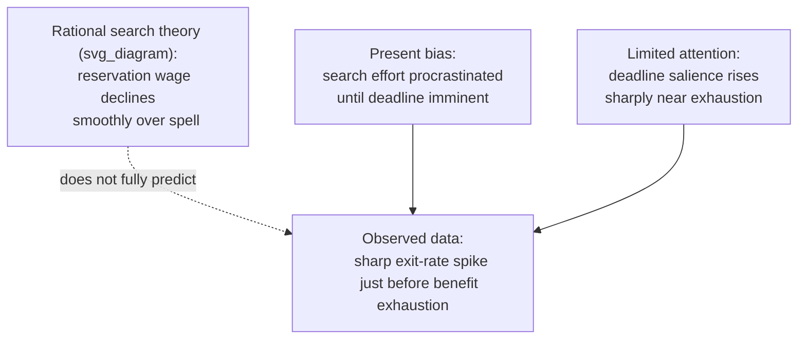

## Behavioral Aspects of Job Search and Unemployment

### Overview

Behavioral job search theory extends the standard optimal-stopping search model by incorporating present bias, reference dependence, limited attention, and motivation/self-control depletion to explain persistent empirical anomalies in unemployed workers' search behavior — most notably the failure of search effort and reservation wages to move as smoothly as rational search theory predicts, and the sharp spike in exit rates from unemployment observed just before benefits expire.

### The Rational Benchmark: McCall Search Model

The canonical rational job search model (McCall, 1970) treats an unemployed worker as sequentially sampling wage offers from a known distribution and choosing a **reservation wage** $w^*$ below which offers are rejected:

$$w^* = b + \frac{1}{1+r}\int_{w^*}^{\infty} [1 - F(w)] \, dw$$

Where $b$ is the flow value of unemployment (leisure value plus unemployment benefits), $r$ is the discount rate, and $F(w)$ is the wage offer distribution. Key rational predictions:

- The reservation wage should decline smoothly and gradually over the unemployment spell as the option value of continued search falls (a standard, well-established result in search theory)
- Search effort should respond continuously and proportionally to changes in benefit levels and the effective time remaining before benefit exhaustion
- Behavior should not exhibit sharp discontinuities unless the underlying benefit schedule itself contains a discontinuity

### The Benefit-Exhaustion Spike Puzzle

**Key Points**

Empirical studies of unemployment duration (e.g., Meyer, 1990, and subsequent replications) consistently find a **sharp spike in the exit rate from unemployment in the week or weeks immediately preceding benefit exhaustion** — a pattern the rational search model can only partially explain, since it predicts a smoothly increasing (not sharply spiking) hazard rate as the horizon shortens.

Behavioral explanations for the spike's *excess* sharpness (beyond what rational horizon effects alone would predict) include:

- **Present bias / procrastination:** job search effort, like retirement saving, is effortful and its benefits are delayed, making it a natural target for present-biased postponement — search intensifies only when the deadline (benefit exhaustion) becomes immediately pressing (DellaVigna & Paserman, 2005)
- **Limited attention / salience:** the approaching exhaustion date becomes highly salient only close to the deadline, consistent with limited-attention models where distant deadlines receive insufficient decision weight
- **Reference-dependent loss framing:** loss of benefit income may be evaluated as a discrete, salient loss relative to the current benefit-income reference point, triggering a sharper behavioral response than a smooth marginal-incentive model would predict

**[Unverified]** The precise magnitude of the exhaustion spike, and how much of it is attributable to present bias/limited attention versus purely rational horizon effects or benefit-schedule discontinuities (e.g., interactions with other program rules), varies across studies, datasets, and countries, and remains an actively debated empirical question rather than a settled decomposition.

### Present Bias and Procrastination in Search Effort

DellaVigna & Paserman (2005) and related work formalize job search as a self-control problem, applying quasi-hyperbolic discounting to the search-effort decision:

- Search effort today (sending applications, networking, attending interviews) is **costly now**, while the payoff (a job offer) is **realized in the future** and uncertain
- Present-biased ($\beta < 1$) job seekers systematically under-search relative to a time-consistent benchmark, particularly early in the unemployment spell when the deadline feels psychologically distant
- **Sophistication matters:** sophisticated present-biased searchers (aware of their own tendency to procrastinate) may partially self-correct by front-loading search effort or seeking external structure (e.g., mandatory job-search verification requirements), while naive present-biased searchers continue to underestimate their future search effort and are more prone to the sharp late-spell scramble

**[Inference]** DellaVigna & Paserman's empirical strategy generally infers the degree of present bias indirectly, by comparing predicted versus observed search-effort/duration patterns under alternative discounting assumptions, rather than directly observing a "present bias parameter"; as with most applied structural estimates of $\beta$, results are sensitive to modeling assumptions and should be treated as model-dependent estimates rather than directly measured constants.

### Mistaken Beliefs and Overoptimism in Job Search

A distinct behavioral thread examines whether unemployed workers hold **systematically biased beliefs** about their own job-finding prospects:

- **Overoptimism about job-finding probability:** several survey-based studies (e.g., Spinnewijn, 2015; Mueller, Spinnewijn & Topa, 2021) find that unemployed workers, on average, overestimate their probability of finding a job within a given horizon relative to realized outcomes, particularly early in the spell
- **Overoptimism has been linked to under-saving during unemployment:** if a worker mistakenly believes reemployment is imminent, this can rationalize (within a boundedly rational framework) less precautionary saving and less search intensity than a correctly-informed rational agent would choose, connecting job search behavior to the household finance literature on inadequate buffer-stock saving
- **Belief updating asymmetries:** some evidence suggests unemployed workers update beliefs about their prospects asymmetrically — revising down more slowly in response to rejections than they would revise up in response to positive signals, a pattern broadly consistent with motivated reasoning/confirmation bias, though **[Speculation]** the precise mechanism generating this asymmetry (self-serving bias, motivated cognition, vs. simple noisy learning) is not definitively established in this literature

### Reservation Wage Anchoring and Adaptation

- **Anchoring to pre-unemployment wage:** reservation wages have been found in survey data to be strongly anchored to the worker's most recent pre-unemployment wage, adjusting downward more slowly than rational search theory (absorbing only the declining option value of continued search) would predict on its own
- **Loss aversion around wage cuts:** accepting a job offer below the prior wage is evaluated as a loss relative to the pre-unemployment reference wage, potentially causing rejection of offers that would be accepted under a purely forward-looking rational calculation — connecting directly to the reference-dependent labor supply and fair-wage literatures covered elsewhere in this chapter
- **Adaptation over the spell:** reservation wages do eventually decline as the spell lengthens, but survey and administrative data show this adaptation can lag behind what optimal search theory predicts, particularly for workers with strong identity or status attachment to their prior occupation/wage level

### Self-Control, Depletion, and Search Quality

- **Ego depletion / limited willpower (contested):** some organizational behavior and psychology literature has proposed that sustained job search, particularly amid the stress of unemployment, depletes a finite self-control resource, degrading the quality (not just quantity) of subsequent search effort or decision-making; **[Speculation]** the broader "ego depletion" literature in psychology has faced significant replication challenges in recent years, so this specific application to job search should be treated as a plausible but empirically contested mechanism rather than an established finding
- **Mental health and motivation feedback loops:** unemployment duration is associated in numerous studies with declining psychological wellbeing, which in turn has been linked to reduced job search motivation and intensity — a potentially self-reinforcing behavioral cycle distinct from, but interacting with, the purely economic incentive structure of search models

### Choice Architecture Interventions in Job Search and Unemployment Insurance

| Intervention | Behavioral Mechanism Targeted | Illustrative Application |
| --- | --- | --- |
| Mandatory search-effort documentation/verification | Present bias, procrastination | Requiring proof of a minimum number of weekly applications |
| Reemployment bonuses front-loaded early in the spell | Countering present-biased under-search early on | Experimental early-reemployment bonus programs |
| Structured job-search plans/coaching (implementation intentions) | Limited attention, planning failures | Caseworker-assisted structured search plans |
| Simplified, salient benefit-exhaustion reminders | Limited attention/salience correction | Automated countdown notifications ahead of exhaustion |
| Default enrollment in job-matching/referral services | Status quo bias leveraged for engagement | Auto-enrollment in employment-service platforms |

**[Inference]** Evidence on the effectiveness of these behaviorally-informed interventions is mixed across studies and contexts; some (e.g., structured search plans, reemployment bonuses) have shown positive effects on reemployment speed in various trials, while others show more limited or context-dependent effects, so this table should be read as a summary of commonly proposed intervention types rather than a claim that all are uniformly effective.

### Conclusion

Behavioral job search theory shows that unemployment duration and reservation wage dynamics reflect not only the rational trade-offs of standard search theory but also present bias, limited attention, belief-formation biases, and reference-dependent wage evaluation. These mechanisms help explain persistent empirical puzzles — the benefit-exhaustion exit spike, slow reservation-wage adaptation, and worker overoptimism — and have directly informed the design of behaviorally-augmented unemployment insurance and job-search assistance programs.

### Related Topics

- Present Bias and Hyperbolic Discounting
- Reference-Dependent Preferences in Labor Supply
- Household Finance and Retirement Savings Behavior
- Limited Attention and Salience in Economic Decision-Making
- Overoptimism and Motivated Reasoning
- Implementation Intentions and Planning Failures
- Unemployment Insurance Design and Moral Hazard
- Fairness, Wage Rigidity, and Gift-Exchange Models