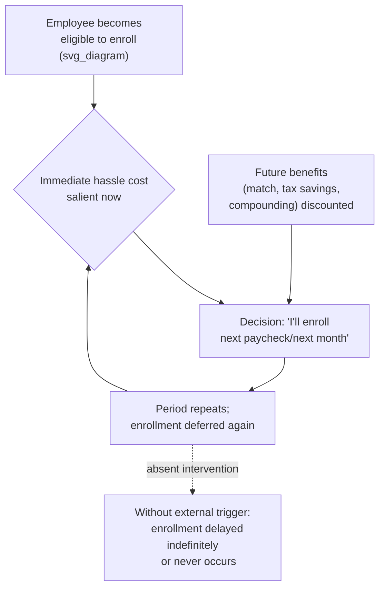

## Procrastination in Retirement Plan Enrollment

### Overview

Procrastination in retirement plan enrollment refers to the well-documented tendency of eligible employees to repeatedly delay joining an employer-sponsored retirement plan (e.g., a 401(k) in the US), delay increasing their contribution rate, or delay actively selecting an asset allocation — even when the plan offers clear expected financial benefits such as an employer match, tax advantages, or long-run compounding. This topic overlaps substantially with material covered under Household Finance and Retirement Savings Behavior, but focuses specifically on the **enrollment decision itself** as a canonical case study in present-biased procrastination and the design of "nudge" interventions that directly target it.

### Procrastination as a Present-Bias Phenomenon

Enrollment procrastination is best modeled using **quasi-hyperbolic ($\beta$-$\delta$) discounting** (Laibson, 1997; O'Donoghue & Rabin, 1999), applied specifically to a one-time or infrequent "hassle cost" decision rather than to a continuous consumption-smoothing problem:

$$U_t = u(C_t) - \kappa + \beta \sum_{k=1}^{\infty} \delta^k u(C_{t+k})$$

Where $\kappa$ represents the immediate, salient **hassle cost** of enrolling (filling out forms, researching fund options, making an active choice), and the benefits of enrollment (employer match, tax savings, compounding) are pushed into the discounted future term. Because $\beta < 1$ discounts the future disproportionately relative to the immediate hassle cost, the enrollment decision is a textbook case where present bias predicts **repeated deferral**, even when the net present value of enrolling is unambiguously positive.

### Naive vs. Sophisticated Procrastinators

O'Donoghue & Rabin's (1999) distinction between **naive** and **sophisticated** present-biased agents is central to understanding why enrollment procrastination persists even among financially literate employees:

| Agent Type | Belief About Own Future Behavior | Predicted Enrollment Pattern |
| --- | --- | --- |
| **Time-consistent (rational)** | Correctly predicts own future actions | Enrolls immediately if NPV is positive; no procrastination |
| **Naive present-biased** | Incorrectly believes future self will act patiently ("I'll enroll next month") | Repeatedly postpones, each period believing enrollment is imminent; may never enroll absent an external trigger |
| **Sophisticated present-biased** | Correctly anticipates own future procrastination | May proactively seek commitment devices (e.g., requesting automatic enrollment) or take advantage of "one-click" simplified enrollment when available, but without such tools remains vulnerable to the same deferral pattern |

**[Inference]** The naive/sophisticated distinction is a standard theoretical taxonomy from the time-inconsistency literature; empirically classifying individual employees as one type or the other is difficult in practice, and most applied retirement-savings research treats the population as a heterogeneous mix rather than attempting to sort individuals precisely into either category.

### Empirical Evidence on Enrollment Delay

**Key Points**

- Madrian & Shea (2001), in a widely cited study of a large US employer, found that under the traditional **opt-in** enrollment design, a substantial share of eligible employees who eventually enrolled did so only after a delay of many months to over a year post-eligibility, despite immediate eligibility for an employer match
- Choi, Laibson, Madrian & Metrick (2002, 2004) documented that even employees who explicitly stated an intention to enroll or increase contributions in the near term frequently failed to follow through, a pattern consistent with naive present bias rather than simple lack of interest
- Survey evidence consistently finds many eligible non-participants report **intending** to enroll "soon," a self-reported pattern consistent with the theoretical prediction that naive procrastinators continuously believe enrollment is imminent without it materializing

**[Unverified]** Exact delay durations and non-participation rates vary substantially across the specific employers, time periods, and plan designs studied in this literature; figures from any single company case study should not be generalized as representative of all opt-in retirement plans without qualification.

### Automatic Enrollment as the Primary Behavioral Countermeasure

Automatic (opt-out) enrollment directly targets the procrastination mechanism by removing the need for an *active* choice to participate:

- Under opt-out design, the default action (participation) requires **no effort or decision** from a procrastinating employee, while opting out (non-participation) now requires the same active hassle cost that enrollment previously required
- This reverses which side of the enrollment decision procrastination favors: naive present-biased employees who would have indefinitely deferred *enrolling* under opt-in design instead indefinitely defer *opting out* under opt-out design, remaining enrolled by inertia
- Madrian & Shea (2001) and subsequent replications found participation rates rose sharply under automatic enrollment relative to opt-in baselines at the same employer, with high persistence in the default contribution rate and default fund choice among auto-enrolled employees

$$\text{Opt-in design: procrastination} \Rightarrow \text{non-participation}
\qquad
\text{Opt-out design: procrastination} \Rightarrow \text{participation}$$

### Beyond Simple Automatic Enrollment: Addressing Residual Procrastination

**Key Points**

- **Default contribution rate anchoring:** because auto-enrolled employees rarely actively adjust their contribution rate away from the default (itself a form of procrastination regarding the *adjustment* decision), low default rates (historically often around 3% in early plan designs) can leave employees under-saving relative to what they might have chosen with active deliberation — motivating the pairing of automatic enrollment with **automatic escalation** (see Save More Tomorrow)
- **Simplified/streamlined enrollment interfaces:** reducing the number of steps or decisions required to actively enroll (for employees not covered by automatic enrollment) has been shown in some studies to reduce procrastination-driven non-participation, consistent with the hassle-cost ($\kappa$) component of the present-bias model
- **Active choice/mandated decision frameworks** (Carroll, Choi, Laibson, Madrian & Metrick, 2009): an alternative design requiring employees to make an explicit enrollment decision (yes or no) rather than defaulting them in — this removes the *status quo bias* channel while still addressing procrastination by forcing timely resolution, and has been found in some studies to raise both immediate participation rates and, notably, to raise average chosen contribution rates relative to a low automatic-enrollment default, since active choosers are not anchored to a low preset default

| Design | Addresses Procrastination? | Addresses Low-Default Anchoring? |
| --- | --- | --- |
| Opt-in (traditional) | No | N/A (no default rate imposed) |
| Automatic (opt-out) enrollment | Yes | No — may anchor to low default |
| Active choice (mandated decision) | Yes (forces timely resolution) | Yes — no default rate to anchor to |
| Automatic enrollment + automatic escalation | Yes | Partially — starts low but rises over time |

### Procrastination in Related Plan Decisions

The same present-bias mechanism generating enrollment delay also appears in adjacent retirement-plan decisions:

- **Delayed contribution rate increases:** employees repeatedly intend to raise their contribution rate but fail to act, addressed by automatic escalation (Save More Tomorrow)
- **Delayed rebalancing:** employees rarely actively rebalance portfolios even when drift from target allocation is substantial, addressed by defaulting employees into automatically-rebalancing target-date funds
- **Delayed beneficiary designation and estate-related paperwork:** a less-studied but related administrative-procrastination phenomenon, sometimes addressed via default beneficiary rules or simplified designation processes at the point of enrollment

### Conclusion

Procrastination in retirement plan enrollment is one of the most extensively documented and practically consequential applications of present-biased, time-inconsistent decision-making in behavioral economics. The shift from opt-in to automatic (opt-out) enrollment — directly informed by this research — represents one of the clearest cases where behavioral economic theory has been translated into large-scale, measurably effective public and private policy design, though residual concerns about low-default anchoring have motivated further refinements such as automatic escalation and active-choice frameworks.

### Related Topics

- Household Finance and Retirement Savings Behavior
- Present Bias and Hyperbolic Discounting
- Naive versus Sophisticated Time-Inconsistent Agents
- Save More Tomorrow and Automatic Escalation Design
- Default Effects and Status Quo Bias
- Active Choice Frameworks
- Commitment Devices
- Choice Architecture and Nudge Theory