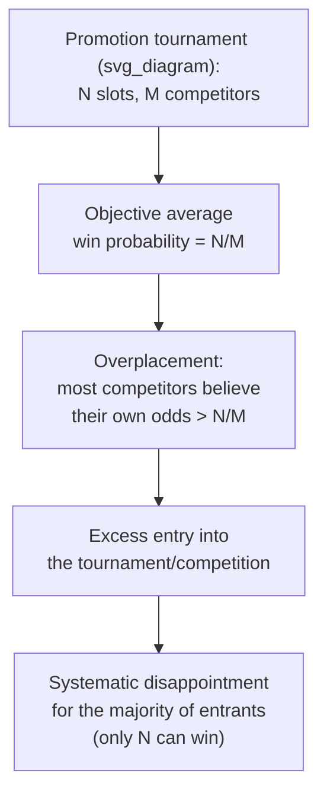

## Overconfidence in Career and Promotion Decisions

### Overview

Overconfidence is among the most robust and extensively documented biases in behavioral economics, and its application to career and promotion decisions examines how systematically inflated self-assessments of ability, performance, and control shape workers' choices about competition for promotion, entry into tournaments, occupational choice, entrepreneurial entry, and negotiation behavior. Unlike purely preference-based biases (e.g., present bias, loss aversion), overconfidence operates primarily through **distorted beliefs** about one's own relative standing, ability, or the precision of one's judgment — with direct and often costly consequences for career-related decision-making.

### Three Distinct Forms of Overconfidence

The overconfidence literature (Moore & Healy, 2008) distinguishes three conceptually and empirically separate phenomena, all relevant to career decisions but with different behavioral signatures:

| Type | Definition | Career Decision Example |
| --- | --- | --- |
| **Overestimation** | Overestimating one's own actual ability, performance, or chance of success | Believing one's objective performance review score will be higher than it turns out to be |
| **Overplacement** ("better-than-average effect") | Overestimating one's ability *relative to others* | Believing one is more likely than a typical colleague to be promoted, even when average promotion probability across colleagues must, by definition, be 50% at the median |
| **Overprecision** | Excessive confidence in the accuracy of one's beliefs (overly narrow confidence intervals) | Being highly certain about one's own market value or the outcome of a negotiation, with insufficient allowance for uncertainty |

**[Inference]** Moore & Healy's tripartite distinction is now the standard organizing framework in the overconfidence literature; specific studies on career/promotion decisions do not always explicitly classify which form of overconfidence is being measured, so applying this taxonomy to any individual study's findings sometimes requires inference about which construct the study's methodology actually captured.

### Overplacement and Tournament/Promotion Entry

Promotion processes are frequently structured as **rank-order tournaments**, where a fixed number of positions are awarded to the top performers among a competing pool. Overplacement has direct implications for entry into such tournaments:

$$P(\text{enter tournament}) = f\big(\hat{p}_i\big), \quad \hat{p}_i = \text{subjective belief of own relative rank}$$

Where $\hat{p}_i$ is the individual's *subjective* belief about their probability of winning, which overplacement inflates above the individual's *objective* probability based on true relative ability. This produces:

- **Excess entry into competitive/tournament-style promotion tracks:** more employees compete for a fixed number of promotion slots than would be predicted if all had accurate beliefs about relative ability, since each overplacement-affected individual believes their own odds are above average
- **Excess entry into high-variance career paths generally**, including entrepreneurship, which shares structural similarities to a promotion tournament (a small probability of a large payoff, contingent on relative skill/luck)

**Example**

Experimental evidence (e.g., Camerer & Lovallo, 1999, on business entry) found that when subjects were told entry into a market-entry game would be determined partly by **relative skill**, rather than randomly, excess entry increased significantly relative to the random-selection condition — consistent with overplacement (subjects believing their own skill ranked above the median) driving excess competitive entry beyond what rational expected-value calculations would predict.

### Overconfidence and Negotiation of Pay/Promotion

- **Salary and promotion negotiation:** overprecision and overplacement have been linked in several studies to more aggressive negotiating positions (e.g., higher anchor demands), which can be individually advantageous **when accurate**, but can also produce negotiation impasses or damaged relationships when the underlying confidence is miscalibrated relative to one's actual market value or bargaining position
- **Gender and overconfidence in negotiation:** a substantial body of research has examined gender differences in overconfidence and negotiation-initiation rates (e.g., Bertrand, 2011 review; Niederle & Vesterlund, 2007 on competition entry), generally finding average differences in willingness to enter competitive/negotiation contexts across gender in various experimental settings; **[Speculation]** the extent to which observed average differences reflect differential overconfidence specifically (versus differing risk preferences, social norm effects, or other factors) is an area of active and not fully settled research, and findings vary by study design, context, and population

### Overconfidence and Effort Miscalibration

- **Overestimation and effort allocation:** workers who overestimate their own ability or the likely outcome of a project may under-invest in effort, preparation, or skill development, believing success is more assured than warranted by objective probability — a pattern documented in various studies of project completion time (the **planning fallacy**, Kahneman & Tversky, 1979) applied to career/work tasks
- **Overprecision and risk-taking in career choice:** excessive certainty about the correctness of one's career forecasts (e.g., "this startup will definitely succeed," "I will definitely get promoted this cycle") can lead to insufficient hedging behavior — such as failing to maintain a backup job search, or foregoing available insurance/diversification against career risk

### Overconfidence and Managerial/Executive Decision-Making

**Key Points**

- **CEO overconfidence and corporate investment:** a substantial corporate finance literature (Malmendier & Tate, 2005, 2008) documents that overconfident executives (measured via proxies such as excessive personal stock-option holding behavior) tend to overinvest in projects, particularly using internal cash flow, and to overestimate returns to their own initiatives such as mergers and acquisitions
- **Overconfidence and hiring decisions:** managers who are overconfident about their own judgment may place excessive weight on unstructured interview impressions relative to more objective, validated selection tools (structured interviews, work-sample tests) — a pattern noted in the personnel selection literature as contributing to suboptimal hiring outcomes relative to what validated selection methods would predict
- **Overconfidence and delegation:** overconfident managers have been found in some studies to underdelegate, believing their own judgment is more reliable than a subordinate's, which can create bottlenecks and reduce organizational efficiency

### Does Overconfidence Have Career Benefits?

The relationship between overconfidence and career outcomes is not uniformly negative; several strands of evidence suggest **context-dependent benefits**, alongside costs:

- **Signaling/self-fulfilling confidence:** confident presentation, independent of underlying accuracy, has been found in various studies to influence perceptions of competence among evaluators (e.g., hiring managers, promotion committees), potentially creating a selection advantage for overconfident individuals in settings where confidence itself is (mis)read as a competence signal
- **Motivational benefits:** moderate overestimation of one's own prospects may sustain effort and persistence through setbacks that a more accurately calibrated (and possibly more discouraged) individual might not sustain — related to broader psychological literature on "positive illusions" and resilience
- **Costs concentrated at the extremes:** the literature broadly suggests that *excessive* overprecision/overplacement generates the clearest costs (poor risk assessment, negotiation breakdowns, overinvestment), while *mild* overconfidence may be less costly or even net-beneficial in some settings

**[Speculation]** Whether there exists a genuinely optimal, welfare-maximizing degree of overconfidence (as opposed to fully calibrated beliefs being strictly best) is a matter of ongoing theoretical and empirical debate in the literature; claims of an "optimal margin of overconfidence" (e.g., some evolutionary-psychology-influenced accounts) are more speculative than the well-established descriptive finding that overconfidence is prevalent and systematically biases specific career decisions.

### Organizational and Policy Responses

| Intervention | Mechanism Targeted | Application |
| --- | --- | --- |
| Structured interviews and validated assessments | Overprecision in unstructured managerial judgment | Reducing reliance on gut-feel hiring/promotion decisions |
| Calibration training and feedback | Overprecision, overestimation | Providing systematic feedback on past prediction accuracy |
| Transparent, criteria-based promotion processes | Overplacement-driven excess tournament entry | Clarifying objective promotion criteria to reduce miscalibrated entry |
| 360-degree feedback systems | Overestimation of self-performance relative to peer/subordinate perception | Providing external, multi-source performance signals |
| Pre-mortem analysis / devil's advocate processes | Planning fallacy, overprecision in project forecasting | Structured techniques to surface downside scenarios before committing |

### Conclusion

Overconfidence — in its overestimation, overplacement, and overprecision forms — systematically distorts career and promotion decisions, driving excess competitive entry into tournaments and entrepreneurship, miscalibrated negotiation behavior, and executive-level investment and hiring errors. While confident self-presentation can carry genuine signaling or motivational benefits in some contexts, the weight of the empirical evidence points to overconfidence as a net source of decision-making inefficiency in most career-related domains, motivating structured, calibration-focused organizational interventions.

### Related Topics

- Planning Fallacy and Project Forecasting Bias
- Overconfidence and Household Trading Behavior
- Tournament Theory and Rank-Order Incentives
- Gender Differences in Competition Entry
- CEO Overconfidence and Corporate Investment
- Structured versus Unstructured Personnel Selection
- Effort and Reciprocity in the Workplace
- Behavioral Aspects of Job Search and Unemployment