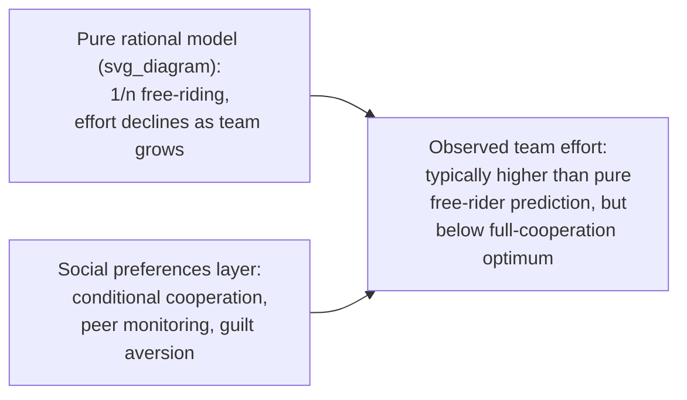

## Behavioral Approaches to Team Incentives and Motivation

### Overview

Behavioral approaches to team incentives examine how cognitive biases, social preferences, and motivational psychology shape the design and effectiveness of compensation and management systems in group/team settings, extending beyond the standard principal-agent model's assumption of purely self-interested, rationally-calculating agents. This includes the effects of relative performance comparisons, social image concerns, intrinsic-extrinsic motivation interactions, and free-riding behavior that deviates from — and sometimes contradicts — the predictions of classical tournament and team-incentive theory.

### The Standard Rational Benchmark: Team Moral Hazard

In the standard principal-agent model of team production (Holmström, 1982), team-based incentives face a fundamental tension: because individual effort is often unobservable and output is a joint team product, **free-riding** is predicted whenever compensation is shared:

$$\pi_i = \frac{1}{n}\sum_{j=1}^{n} e_j \cdot v - c(e_i)$$

Where $\pi_i$ is worker $i$'s payoff share of team output, $e_j$ is each team member's effort, $v$ is the value of output, and $c(e_i)$ is $i$'s private cost of effort. Because each worker bears the *full* cost of their own effort but receives only a $1/n$ share of the resulting value, rational agents are predicted to under-provide effort relative to the team-efficient level as team size $n$ grows — the classic **1/n problem**.

Behavioral research examines both (a) whether real teams free-ride to the degree this rational model predicts, and (b) what social/psychological factors mitigate or amplify free-riding beyond the pure incentive-based prediction.

### Social Preferences as a Mitigant of Free-Riding

**Key Points**

- **Conditional cooperation:** extensive experimental (public-goods game) and field evidence shows a substantial share of individuals behave as "conditional cooperators" — contributing effort in proportion to their belief about teammates' contributions — rather than as pure free-riders, meaning observed team effort is often higher than the pure self-interest model predicts, particularly in smaller or more socially cohesive teams
- **Peer effects and social monitoring:** field studies (e.g., Mas & Moretti, 2009, on supermarket cashiers) have found that individual worker productivity responds to the presence and productivity of visible coworkers, consistent with social-image concerns and peer-based reciprocity/norm enforcement operating alongside, or independent of, formal incentive structures
- **Guilt aversion and social image:** workers may exert effort partly to avoid guilt from perceived letting-down of teammates, or to maintain a positive social image among peers — mechanisms formalized in psychological game theory (Battigalli & Dufwenberg, 2007) as belief-dependent utility distinct from pure material self-interest

### Relative Performance Feedback and Social Comparison

- **Rank feedback as a non-monetary incentive:** several field experiments have found that simply providing employees with information about their **rank** relative to peers (without any accompanying change in pay) can increase effort/output, particularly among those ranked in the middle or lower portions of the distribution, consistent with social-comparison-driven motivation operating independently of monetary incentives
- **Asymmetric responses to rank information:** some studies find that being told one ranks *below* peers produces a stronger behavioral response than being told one ranks *above* peers, a pattern broadly consistent with loss-averse or ego-protective responses to unfavorable social comparison, though **[Unverified]** the direction and magnitude of asymmetry varies across specific studies, populations, and task types, and should not be treated as a uniform finding
- **Risk of demotivation:** rank feedback can also demotivate lower-ranked workers in some settings (particularly where the gap to top performers appears insurmountable), illustrating that relative-performance-based motivation is not uniformly positive and depends on framing, gap size, and the perceived attainability of improvement

### Intrinsic vs. Extrinsic Motivation and Crowding-Out

A central behavioral concern in team incentive design is that **explicit monetary incentives can crowd out intrinsic motivation** (Deci, 1971; Frey, 1997; Gneezy & Rustichini, 2000), a finding with direct implications for team-based compensation design:

$$\text{Total effort} = \underbrace{f(\text{monetary incentive})}_{\text{extrinsic channel}} + \underbrace{g(\text{intrinsic motivation}, \text{monetary incentive})}_{\text{intrinsic channel, potentially } \frac{\partial g}{\partial \text{incentive}} < 0}$$

- **Motivation crowding-out:** introducing or increasing monetary incentives for a task previously performed for intrinsic reasons (professional pride, mission alignment, social contribution) can, in some documented cases, *reduce* total effort if the crowding-out effect on intrinsic motivation exceeds the direct incentive effect — most famously illustrated in Gneezy & Rustichini's (2000) day-care late-pickup fine study, where introducing a fine for late pickup *increased* late pickups, consistent with the fine reframing a moral obligation as a purely transactional, purchasable option
- **Team-specific crowding risk:** in team settings with strong pre-existing norms of mutual cooperation or professional identity (e.g., healthcare teams, mission-driven nonprofits), poorly designed individual monetary incentives risk undermining the cooperative norms that were previously sustaining high team performance without formal incentive pay
- **[Speculation]** The conditions under which crowding-out dominates versus is dominated by the standard positive incentive effect are not fully predictable ex ante from theory alone; the literature generally identifies crowding-out as more likely when incentives are perceived as controlling/distrustful rather than informational/supportive, and when the task was previously governed by strong social or ethical (rather than purely economic) framing, but this remains a probabilistic tendency rather than a precise predictive rule

### Team-Based Tournament Design and Fairness Constraints

Combining tournament theory with the fairness/reciprocity literature covered elsewhere in this chapter generates additional design considerations specific to team incentive schemes:

| Design Choice | Standard Incentive-Theory View | Behavioral Consideration |
| --- | --- | --- |
| Winner-take-all team bonus | Maximizes incentive intensity for top performance | May trigger perceived unfairness among non-winning contributors, damaging future cooperation (gift-exchange/reciprocity costs) |
| Equal profit-sharing within team | Weak individual incentive (1/n problem) | Leverages conditional cooperation and social monitoring; may sustain effort via peer norms rather than individual pay-effort linkage |
| Team-based bonus thresholds | Standard incentive-compatible target-setting | Risk of last-mile free-riding once threshold is perceived as unreachable or already secured, similar to reference-dependent effort withdrawal patterns |
| Public recognition alongside/instead of pay | Not modeled in classical incentive theory | Leverages social image and intrinsic motivation; lower crowding-out risk than equivalent monetary incentives in norm-sensitive contexts |

### Gamification and Behavioral Nudges in Team Motivation

**Key Points**

- **Leaderboards and progress bars:** widely used in sales teams and gig-platform work, these tools leverage relative-comparison and goal-gradient effects (motivation intensifying as a target is perceived to be nearer), documented in both laboratory and applied field settings
- **Goal-gradient effect:** effort and persistence toward a target have been found in multiple studies to increase as perceived distance to the goal shrinks, a pattern distinct from, but complementary to, the reference-dependent "target income" effects discussed elsewhere in this chapter
- **Caution on gamification design:** poorly calibrated leaderboards (e.g., where the same few top performers always lead) risk demotivating the majority of a team, echoing the asymmetric rank-feedback concerns noted above — design choices such as segmenting leaderboards by peer group or emphasizing personal-best comparisons are commonly proposed mitigations

### Conclusion

Behavioral approaches to team incentive design move beyond the classical 1/n free-riding prediction by incorporating conditional cooperation, social image, reciprocity, and the risk of intrinsic-motivation crowding-out. Effective team incentive design, from this perspective, requires balancing standard incentive-alignment principles against the risk that poorly framed monetary incentives, rank comparisons, or tournament structures may undermine the cooperative social norms and intrinsic motivations that often sustain team performance in ways pure pay-for-performance models do not capture.

### Related Topics

- Effort and Reciprocity in the Workplace
- Motivation Crowding-Out Effects
- Tournament Theory and Rank-Order Incentives
- Fairness, Wage Rigidity, and Gift-Exchange Models
- Conditional Cooperation in Public-Goods Games
- Goal-Gradient Effect and Goal Setting Theory
- Social Comparison Theory
- Overconfidence in Career and Promotion Decisions