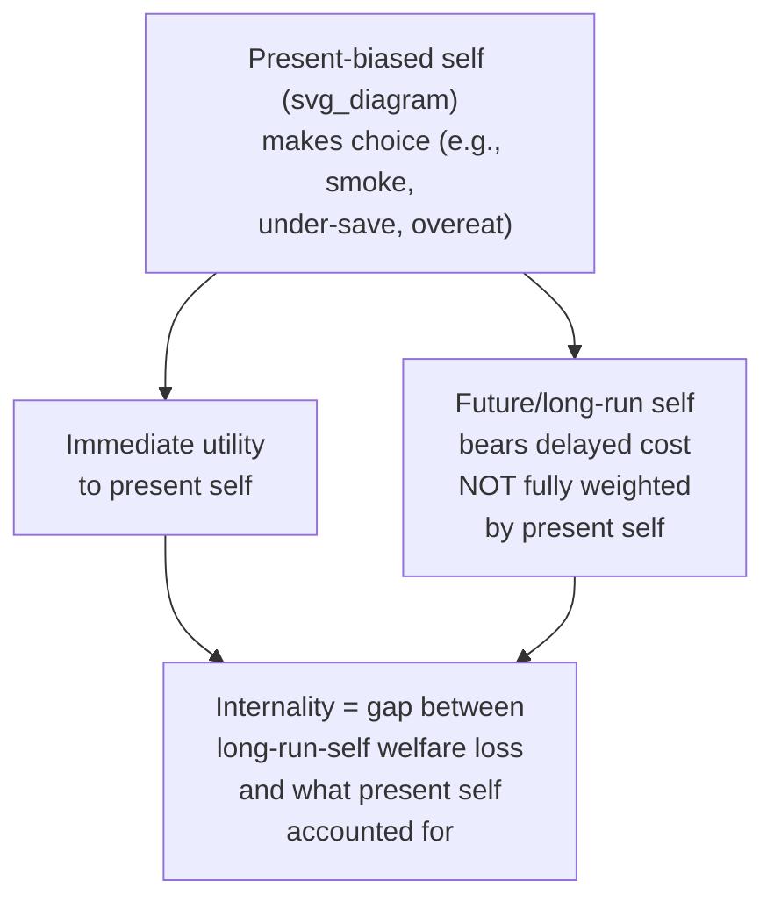

## Behavioral Welfare Economics and the Concept of Internalities

### Overview

Behavioral welfare economics reconstructs the normative foundations of welfare analysis to accommodate the empirical finding that individuals' choices are systematically shaped by cognitive biases, self-control problems, and errors in judgment — meaning that **revealed preference** (inferring welfare from observed choice) can no longer be treated as automatically equivalent to **true welfare**. The central conceptual innovation of this literature is the **internality**: a cost that an individual's present or biased self imposes on their own future or "true" self, analogous to an externality but occurring entirely *within* a single decision-maker rather than between different people.

### The Breakdown of Revealed Preference as a Welfare Standard

Classical welfare economics rests on the **revealed preference axiom**: if an agent chooses $A$ over $B$ when both are available, $A$ is assumed to make the agent at least as well off as $B$. This assumption underlies the First Welfare Theorem's link between competitive equilibrium and Pareto efficiency, and underlies most cost-benefit analysis of consumer choice.

Behavioral economics challenges this link directly: if choices are distorted by present bias, addiction, misinformation, or systematic cognitive errors, then **observed choice may diverge from what the same individual would choose under full information, full self-control, and correct beliefs** — the informal standard often used to define "true" or normatively relevant preferences in this literature.

$$\text{Standard welfare economics: } \; W(A) \geq W(B) \iff A \text{ chosen over } B$$

$$\text{Behavioral welfare economics: } \; W(A) \geq W(B) \; \not\Leftrightarrow \; A \text{ chosen over } B \text{ (in general)}$$

**[Inference]** This does not imply behavioral welfare economists reject revealed preference entirely — rather, the mainstream position in this literature (following Bernheim & Rangel, 2009 and related work) is that revealed preference remains informative but requires supplementation with additional structure (e.g., distinguishing "cold state" from "hot state" choices, or identifying dominated alternatives across choice contexts) to recover a defensible welfare-relevant preference ordering.

### Defining the Internality

An **internality** (Herrnstein et al., 1993; formalized further in Gruber & Köszegi, 2001 and O'Donoghue & Rabin, 2003, 2006) is the uncompensated cost that a decision-maker's current choice imposes on their own future self, arising from a systematic bias (most commonly present bias/hyperbolic discounting) rather than from a rational, freely chosen intertemporal tradeoff.

$$\text{Internality} = U^{\text{long-run self}}(\text{decision}) - U^{\text{long-run self}}(\text{decision agent would make if fully rational})$$

The internality concept deliberately mirrors the structure of a Pigouvian **externality**, but relocates the "victim" from another economic agent to the decision-maker's own future self:

| Concept | "Harmed" Party | Standard Policy Response |
| --- | --- | --- |
| Externality | A third party outside the transaction | Pigouvian tax/subsidy to align private and social cost |
| Internality | The decision-maker's own future/long-run self | "Sin taxes," defaults, or other corrective nudges aligning present-self choice with long-run self welfare |

### The Bernheim-Rangel Choice-Theoretic Framework

Bernheim & Rangel's (2007, 2009) influential approach attempts to construct welfare analysis using **only observed choice data**, while still accommodating behavioral biases, by introducing the concept of **ancillary conditions**:

- Choices are recorded not just as "$A$ chosen over $B$" but as "$A$ chosen over $B$ in choice situation/context $X$" (the ancillary condition — e.g., whether the decision-maker was in a "hot" emotionally aroused state, under time pressure, or exposed to a particular framing)
- A choice is classified as potentially **welfare-relevant** only if it is *not* dominated by a different, more favorable choice pattern observed under a different ancillary condition for the same underlying tradeoff (e.g., if a person consistently chooses the healthy snack when given time to reflect, but the unhealthy snack under time pressure, the time-pressured choice is treated as suspect)
- This generates a **generalized revealed preference relation** that is more conservative than the standard one — sometimes leaving certain welfare comparisons genuinely indeterminate rather than resolving them via an assumed "true preference," which the authors treat as a feature (avoiding paternalistic overreach) rather than a limitation

**[Inference]** The Bernheim-Rangel framework is widely regarded as methodologically rigorous specifically because it avoids the analyst needing to assume a privileged, unobservable "true preference"; however, this rigor comes at the cost of frequently being unable to fully rank welfare in ambiguous cases, which is itself a debated tradeoff in the subsequent literature relative to simpler "correct the bias directly" approaches.

### Quantifying Internalities: The O'Donoghue-Rabin Approach

O'Donoghue & Rabin's (2003, 2006) work on "optimal sin taxes" provides a widely used applied framework for quantifying and correcting internalities using quasi-hyperbolic discounting:

$$\tau^* = \underbrace{\text{externality per unit}}_{\text{standard Pigouvian term}} + \underbrace{(1-\beta) \cdot \text{marginal future harm}}_{\text{internality-correcting term}}$$

Where $\tau^*$ is the optimal corrective tax, and the second term captures the wedge introduced by present bias ($\beta < 1$): because present-biased consumers systematically under-weight the future harm of the taxed good (e.g., sugary drinks, cigarettes) relative to a time-consistent optimizer, the socially optimal tax includes an internality-correction component *in addition to* any standard externality correction, even for goods that impose no cost on third parties at all.

**[Inference]** This decomposition is a standard simplified representation of the O'Donoghue-Rabin sin-tax framework used in applied and textbook treatments; the original formal derivation involves additional structure regarding the distribution of self-control heterogeneity across the population (since a uniform tax affects both biased and unbiased consumers), which complicates the simple additive formula above in practice.

### Heterogeneity and the Regressivity Concern

A major applied and normative concern with internality-correcting taxation (e.g., soda taxes, cigarette taxes) is that a single uniform tax rate applies to **both** present-biased and time-consistent (rational) consumers of the same good:

- For the time-consistent minority, the tax is a pure welfare loss (a standard deadweight-loss-generating distortion on an already-optimal choice)
- For the present-biased majority, the tax can be welfare-improving by correcting the internality
- **Regressivity concern:** because internality-correcting "sin taxes" on goods like tobacco, sugary beverages, or alcohol are consumed disproportionately by lower-income households in many empirical studies, the tax burden (and any resulting deadweight loss on time-consistent consumers within that group) may fall disproportionately on lower-income populations, a significant equity concern raised prominently in the public finance and public health literature

**[Speculation]** Whether internality-correcting sin taxes are, on net, regressive or progressive in their true welfare effects (accounting for the internality-correction benefit to biased consumers, not just the nominal tax incidence) is genuinely contested in the literature and depends heavily on assumptions about the distribution of self-control problems across income groups — assumptions that are difficult to empirically pin down with precision.

### Internalities Beyond "Sin" Goods

While much of the applied literature focuses on tobacco, alcohol, and sugar, the internality concept generalizes to a broad range of behavioral economics topics covered elsewhere in this syllabus:

| Domain | Internality Source | Related Chapter Topic |
| --- | --- | --- |
| Retirement under-saving | Present bias reduces valuation of future retirement consumption | Household Finance and Retirement Savings Behavior |
| Job search procrastination | Present bias delays costly search effort | Behavioral Aspects of Job Search and Unemployment |
| Retirement plan non-enrollment | Present bias delays low-hassle-cost enrollment | Procrastination in Retirement Plan Enrollment |
| Overborrowing on high-interest credit | Present bias underweights future repayment burden | Household Finance (debt behavior) |
| Excessive screen time/attention-capturing technology use | Present bias, limited self-control over immediate gratification | Digital/attention economics (broader behavioral literature) |

### Distinguishing Internalities from Simple Preference Heterogeneity

**Key Points**

- Not every choice that looks "suboptimal" from an outside observer's perspective constitutes an internality — the concept specifically requires that the individual's *own* long-run/considered preferences would favor a different choice, not merely that the choice diverges from some external, paternalistically-imposed standard
- This distinction is central to the debate over **libertarian paternalism** and "asymmetric paternalism" (Camerer et al., 2003): interventions justified via internality correction are intended to help only those whose choices genuinely diverge from their own long-run preferences, while ideally imposing minimal cost on those making fully deliberated, preference-consistent choices
- **[Inference]** In practice, distinguishing a genuine internality from legitimate preference heterogeneity (e.g., a rational, well-informed individual who simply enjoys smoking and fully accounts for the health costs) is empirically difficult, and this identification challenge is a recurring methodological concern across the applied internality literature, not merely a theoretical footnote

### Policy Design Implications

| Policy Tool | Internality-Correction Rationale |
| --- | --- |
| "Sin taxes" (tobacco, sugary beverages, alcohol) | Directly raises the present-period price to counteract present-biased underweighting of future harm |
| Default/opt-out enrollment in savings plans | Corrects internality from procrastination without restricting choice for those who would actively opt out |
| Cooling-off periods for large purchases | Allows "hot state" decisions to be revisited after emotional/urgency-driven distortions subside |
| Mandatory disclosure of long-run costs (e.g., total interest paid) | Targets limited-attention-driven internalities without altering the choice set itself |
| Commitment device subsidies (e.g., subsidized commitment savings accounts) | Directly addresses the internality by making self-imposed commitment cheaper/more accessible |

### Conclusion

Behavioral welfare economics and the internality concept together provide the normative foundation connecting descriptive behavioral biases (present bias, limited attention, misperception) to specific, justifiable policy interventions, while explicitly grappling with the methodological challenge of inferring "true" welfare from potentially biased choice data. The internality framework's core contribution is reframing a wide range of seemingly individual, self-regarding "mistakes" as a welfare-economically tractable problem — structurally analogous to the externality concept that has long justified Pigouvian intervention in standard welfare economics — while remaining attentive to the identification and equity challenges this reframing introduces.

### Related Topics

- Present Bias and Hyperbolic Discounting
- Optimal Sin Taxation (O'Donoghue-Rabin)
- Bernheim-Rangel Choice-Theoretic Welfare Framework
- Libertarian Paternalism and Asymmetric Paternalism
- Nudge Theory and Choice Architecture
- Household Finance and Retirement Savings Behavior
- Procrastination in Retirement Plan Enrollment
- Regressivity and Equity in Corrective Taxation