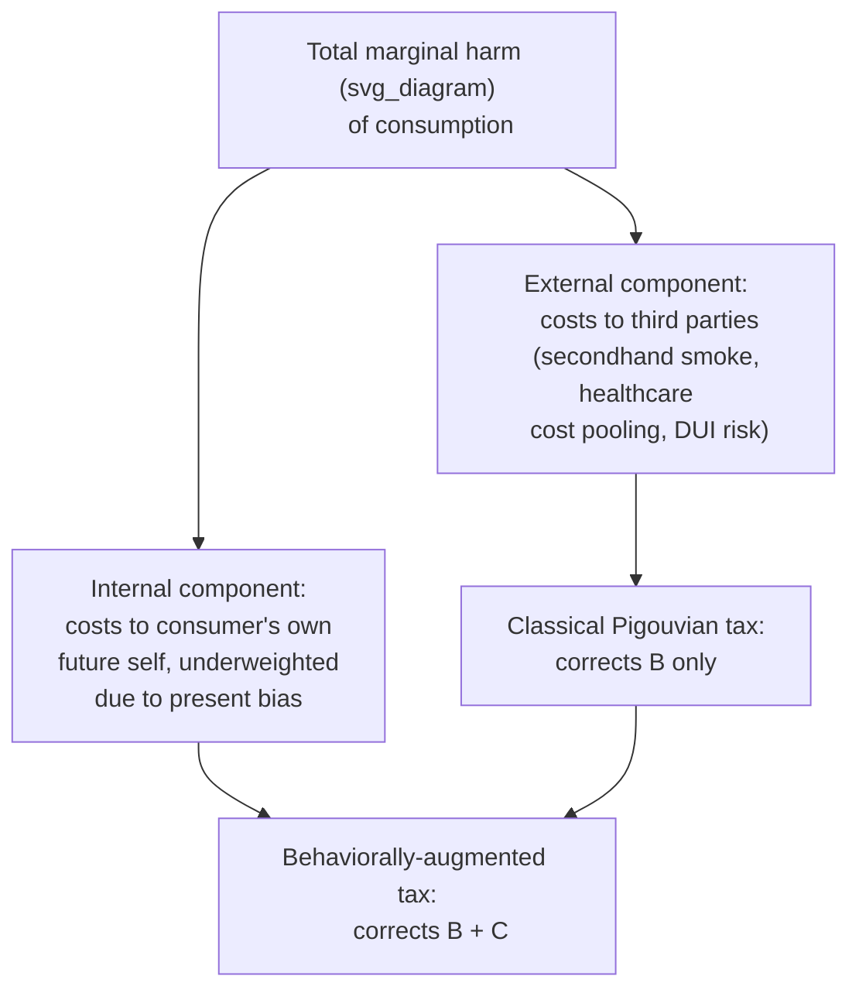

## Sin Taxes and Corrective Policy

### Overview

Sin taxes are excise taxes levied on goods considered harmful to the consumer, third parties, or both — most prominently tobacco, alcohol, sugar-sweetened beverages, and, in some jurisdictions, cannabis and gambling. While the classical Pigouvian justification for such taxes rests entirely on **externalities** (uncompensated costs imposed on third parties, e.g., secondhand smoke, drunk-driving risk, public healthcare costs), behavioral public economics adds a second, distinct justification: the **internality-correction** rationale, under which the tax corrects a self-control/present-bias-driven wedge between a consumer's momentary choice and their own long-run welfare. This entry builds directly on the internality concept and applies it to concrete corrective tax design.

### The Classical Pigouvian Baseline

The standard Pigouvian prescription sets a per-unit tax equal to the marginal external cost imposed on third parties:

$$\tau_{\text{Pigou}} = MEC(q)$$

Where $MEC(q)$ is the marginal external cost of consumption at quantity $q$. This is the tax rate that internalizes the externality and restores the socially efficient consumption level, under the standard assumption that the consumer's own private marginal benefit calculation is otherwise accurate and undistorted.

### The Behavioral Addition: Internality-Corrected Optimal Tax

Building on O'Donoghue & Rabin's (2003, 2006) framework introduced under internalities, the behaviorally-augmented optimal sin tax adds a second term:

$$\tau^* = \underbrace{MEC(q)}_{\text{externality correction}} + \underbrace{(1-\beta)\,MIC(q)}_{\text{internality correction}}$$

Where $MIC(q)$ is the marginal *internal* cost (future harm to the consumer's own long-run self) and $\beta$ is the present-bias parameter (with $\beta = 1$ representing full time-consistency, in which case the internality term vanishes and the formula collapses to the standard Pigouvian prescription). This makes explicit that **even a good with zero externalities can justify a positive corrective tax** under this framework, purely on internality-correction grounds, provided consumers are shown to be present-biased with respect to that good.

### Applied Examples by Product Category

**Example**

| Product | Primary Externality Component | Primary Internality Component | Notable Policy Examples |
| --- | --- | --- | --- |
| Cigarettes | Secondhand smoke, pooled healthcare costs | Present-biased underweighting of long-run health harm; well-documented high addiction/self-control difficulty | US federal/state cigarette excise taxes; UK, Australia high-tax regimes |
| Alcohol | Drunk driving, violence, pooled healthcare costs | Present-biased underweighting of long-run health harm; acute impaired judgment during consumption ("hot state" decision-making) | Minimum unit pricing (Scotland); graduated alcohol excise taxes |
| Sugar-sweetened beverages | Modest direct externality (largely pooled healthcare cost argument) | Present bias, limited attention to cumulative health effects of small frequent choices | Mexico's 2014 soda tax; UK Soft Drinks Industry Levy; various US city-level soda taxes (e.g., Berkeley, Philadelphia) |
| Gambling | Limited direct third-party externality in most framings | Present bias, near-miss/variable-reward psychological effects, potential addiction | Gambling excise taxes; some jurisdictions' self-exclusion program funding via taxation |

**[Unverified]** The relative *magnitude* split between externality and internality components varies substantially by product and by study methodology; for sugar-sweetened beverages in particular, some economists argue the externality component is small relative to tobacco/alcohol, making the internality-correction argument comparatively more central to the policy case — but this is a matter of ongoing empirical and methodological debate rather than an agreed-upon fixed ratio.

### Evidence on Consumer Responsiveness: The Mexico Soda Tax Case

The 2014 Mexican excise tax on sugar-sweetened beverages (roughly one peso per liter) is among the most extensively studied applied sin-tax natural experiments:

- Multiple peer-reviewed studies found measurable reductions in purchases of taxed beverages following the tax's introduction, with effects that were generally found to be larger among lower-socioeconomic-status households in several of these studies
- This body of evidence has been cited in subsequent policy debates (e.g., UK Soft Drinks Industry Levy design, Philadelphia's beverage tax) as suggestive evidence that beverage taxes can measurably shift consumption patterns
- **[Unverified]** Specific point-estimate percentage reductions in consumption reported across different studies of the Mexican soda tax vary depending on data source, time window studied, and econometric method, so no single precise percentage figure should be treated as definitively established without consulting the specific study and its stated confidence interval

### The Regressivity Debate in Sin Tax Design

**Key Points**

This concern, introduced under internalities, has specific applied policy dimensions for sin tax design:

- **Nominal incidence regressivity:** because tobacco, alcohol, and sugary beverage consumption (as a share of income) tends to be higher among lower-income households in many studies, the nominal tax burden falls disproportionately on this group
- **Internality-correction benefit distribution:** if present bias/self-control problems are also more prevalent or more consequential among lower-income or otherwise more financially constrained populations (a claim found in some, though not all, of the underlying behavioral literature), then the welfare *benefit* of internality correction may also be concentrated among the same group that bears the nominal tax burden — complicating a simple regressivity verdict based on tax incidence alone
- **Revenue recycling as a mitigant:** several sin tax designs earmark revenue for programs disproportionately benefiting lower-income populations (e.g., early childhood education funding from Philadelphia's beverage tax, health programs from various tobacco tax revenues), which policy analysts frequently cite as a way to offset regressive incidence concerns, independent of the underlying internality debate

**[Speculation]** Whether a given sin tax is net progressive or regressive once internality-correction welfare benefits and revenue recycling are both accounted for is a genuinely unresolved empirical and normative question, sensitive to assumptions that are difficult to verify directly (e.g., the true distribution of self-control problems across income groups), and should not be presented as settled in either direction.

### Alternative and Complementary Corrective Policy Instruments

Sin taxes are one instrument among several behaviorally-informed corrective tools, each targeting a distinct mechanism:

| Instrument | Primary Mechanism | Contrast with Sin Taxes |
| --- | --- | --- |
| Sin taxes | Price-based correction of externality + internality | Broad-based, revenue-generating, but blunt (affects all consumers uniformly) |
| Quantity/portion regulation (e.g., soda size limits) | Directly restricts choice architecture | More paternalistic; does not preserve consumer choice at the margin the way a tax does |
| Graphic warning labels / plain packaging | Salience/attention correction | Targets limited attention rather than price; historically applied heavily to tobacco |
| Sin tax + commitment device subsidy pairing | Combines price correction with voluntary self-control tools | Attempts to help sophisticated present-biased consumers commit, rather than only taxing the unsophisticated |
| Advertising restrictions | Reduces exposure to demand-inflating cues | Targets the formation of preferences/salience rather than the point-of-purchase decision itself |

### Political Economy and Industry Response

**Key Points**

- Sin tax proposals frequently face substantial industry-funded opposition and lobbying, a political economy dynamic well documented in the tobacco and, more recently, sugar-sweetened beverage policy literature
- **Cross-border substitution/avoidance:** localized sin taxes (e.g., city-level soda taxes) can be partially undermined by consumers purchasing the taxed good in a neighboring untaxed jurisdiction, a standard tax-avoidance concern that interacts with, but is analytically separate from, the behavioral internality-correction rationale for the tax itself
- **Tax salience effects:** behavioral research on tax salience (Chetty, Looney & Kroft, 2009) finds that taxes not included in the displayed shelf price (and only added at checkout) tend to have smaller behavioral effects than economically equivalent taxes that are already included in the posted price — a finding directly relevant to sin tax design, since maximizing the internality-correcting behavioral response favors taxes that are salient at the point of decision, not merely economically equivalent in present-value terms

### Conclusion

Sin taxes sit at the intersection of classical Pigouvian externality correction and behavioral internality correction, with the behavioral addition providing a distinct economic justification for taxing goods even where third-party externalities alone would justify a smaller (or no) corrective tax. Applied evidence, most notably from tobacco taxation and the Mexican soda tax, demonstrates measurable consumption responses to these policies, while the regressivity debate and tax-salience design considerations remain central, actively contested dimensions of how such taxes should be structured and evaluated.

### Related Topics

- Behavioral Welfare Economics and the Concept of Internalities
- Present Bias and Hyperbolic Discounting
- Tax Salience Effects (Chetty, Looney & Kroft)
- Regressivity and Equity in Corrective Taxation
- Libertarian Paternalism and Asymmetric Paternalism
- Nudge Theory and Choice Architecture
- Commitment Devices
- Household Finance and Retirement Savings Behavior