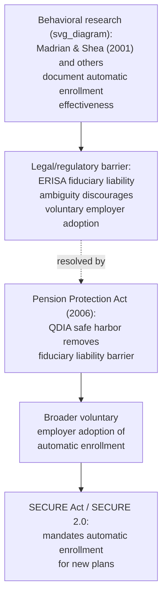

## Automatic Enrollment and Retirement Policy

### Overview

Automatic enrollment policy examines the design, adoption, and welfare consequences of opt-out retirement savings defaults at the **national and regulatory policy level**, distinct from the earlier micro-level treatment of individual procrastination (covered under Procrastination in Retirement Plan Enrollment) and household saving behavior more broadly. This entry focuses on how governments and regulators have translated behavioral evidence into statutory and regulatory frameworks — including landmark legislation, cross-country policy design variation, and the ongoing debate over defaults versus mandates as tools of retirement income policy.

### From Behavioral Evidence to Statute: The US Policy Pathway

**Key Points**

- Prior to the mid-2000s, US employer retirement plan sponsors offering automatic enrollment faced legal ambiguity under ERISA regarding fiduciary responsibility for defaulted contributions and default investment choices, which limited voluntary adoption despite the strong behavioral evidence (Madrian & Shea, 2001, and related studies) already available
- The **Pension Protection Act of 2006 (PPA)** provided explicit statutory safe-harbor protections for employers adopting automatic enrollment with a **Qualified Default Investment Alternative (QDIA)** — typically a target-date fund, balanced fund, or managed account — substantially reducing employer legal exposure and catalyzing broader voluntary adoption of automatic enrollment across US employer plans
- The **SECURE Act (2019)** and **SECURE 2.0 Act (2022)** extended this framework further, including provisions requiring **automatic enrollment for new 401(k) and 403(b) plans established after a specified date**, alongside mandated automatic escalation provisions — moving US policy from a purely voluntary, safe-harbor-incentivized model toward a more mandatory default-based framework for new plans

**[Unverified]** Specific statutory default contribution rate ranges, escalation caps, and effective/applicability dates in SECURE 2.0 involve multiple detailed provisions and phase-in schedules that are subject to ongoing regulatory guidance; readers requiring current, precise compliance details should consult current IRS/Department of Labor guidance or official legislative text rather than relying on a general summary.

### Cross-Country Policy Variation

Automatic enrollment and default-based retirement policy design vary considerably across countries, reflecting different starting points (voluntary vs. mandatory base systems) and different regulatory philosophies:

| Country/Region | Policy Design | Notable Features |
| --- | --- | --- |
| United States | Primarily employer-level automatic enrollment, incentivized/mandated by federal statute (PPA, SECURE Act) | Plan-level opt-out defaults; QDIA framework; state-level auto-IRA programs for employers without employer plans (e.g., OregonSaves, CalSavers) |
| United Kingdom | National automatic enrollment mandate (Pensions Act 2008, phased implementation from 2012) | Employers legally required to automatically enroll eligible employees into a qualifying pension scheme (including the National Employment Savings Trust, NEST) unless the employee opts out |
| New Zealand | KiwiSaver — automatic enrollment for new employees, with opt-out window | Combines automatic enrollment with government contribution incentives (member tax credits) |
| Australia | Mandatory employer superannuation guarantee contributions | Structurally closer to a **mandate** than a pure behavioral default, since contribution is not opter-outable by the employee in the same way as UK/US auto-enrollment models |

**[Inference]** Categorizing a given national system as a "behavioral default" versus a "mandate" is not always clean in practice — several systems (e.g., Australia's superannuation guarantee) combine elements of both, and classification often depends on which specific parameter (participation vs. contribution rate vs. fund choice) is being described as default-based versus compulsory.

### Defaults vs. Mandates: The Policy Design Spectrum

A central normative and design question in retirement policy is where along the **choice-preserving-to-compulsory spectrum** a given policy should sit:

$$\text{Pure opt-in} \;\rightarrow\; \text{Opt-out default (auto-enrollment)} \;\rightarrow\; \text{Active choice mandate} \;\rightarrow\; \text{Compulsory contribution (no opt-out)}$$

| Design | Choice Preserved? | Addresses Procrastination? | Addresses Low Financial Literacy/Poor Choice Quality? |
| --- | --- | --- | --- |
| Pure opt-in | Yes, fully | No | No |
| Opt-out automatic enrollment | Yes (opt-out available) | Yes | Partially (default rate/fund substitutes for active choice) |
| Mandated active choice | Yes, but decision is compulsory | Yes (forces timely resolution) | No (still relies on individual to choose well) |
| Compulsory contribution (no opt-out) | No | Fully (moot) | Fully (moot — no choice quality concern since no choice exists) |

**Key Points**

- Proponents of stronger mandates (Australia-style) argue that opt-out defaults, while behaviorally effective, still permit meaningful under-saving among a persistent minority of opt-out employees, particularly lower-income or highly liquidity-constrained workers who may have genuine short-term reasons to opt out
- Proponents of the softer default-based approach (US/UK-style) emphasize **libertarian paternalism** — preserving the ability of genuinely well-informed, deliberate opt-outers (e.g., those with legitimate competing financial priorities) to exit the system, consistent with the internality-correction principle that policy should target biased choosers without unduly constraining unbiased ones
- **[Speculation]** Whether opt-out defaults versus outright mandates produce superior long-run retirement adequacy outcomes, once behavioral response, coverage gaps, and adequacy of default parameters (contribution rate, investment default) are all accounted for, remains a genuinely open empirical and normative policy question without a clear consensus answer across the comparative pensions literature

### Auto-IRA Programs: Extending Coverage Beyond Employer Plans

**Example**

A significant US policy innovation addresses the **coverage gap** for workers at small employers who do not offer a retirement plan at all (where the automatic enrollment behavioral lever cannot apply because no plan exists to be defaulted into):

- **State-facilitated auto-IRA programs** (e.g., OregonSaves — the first state program, launched 2017 — followed by CalSavers, IllinoisSecure Choice, and numerous other state programs) mandate that employers **without an existing qualifying retirement plan** facilitate payroll-deduction IRA contributions, with employees automatically enrolled and able to opt out
- These programs directly extend the automatic-enrollment behavioral mechanism to a population (small-employer and gig/contract workers) historically excluded from the primary channel (employer-sponsored 401(k) plans) through which most prior behavioral retirement research and legislation operated
- **[Unverified]** Enrollment, retention, and asset accumulation figures for specific state auto-IRA programs vary by state, program maturity, and reporting methodology; current program-specific statistics should be verified against each state program's official reporting rather than treated as uniform across programs.

### Default Parameter Design as a Policy Lever

Beyond the binary choice of auto-enrollment or not, policymakers and plan designers face granular parameter choices, each with distinct behavioral consequences documented in the underlying research:

| Parameter | Policy Design Question | Behavioral Consideration |
| --- | --- | --- |
| Default contribution rate | What rate should employees be defaulted into? | Anchoring risk: employees rarely move away from the default, so a low default rate can become a de facto ceiling rather than a floor |
| Default escalation | Should contribution rates auto-increase over time? | SECURE 2.0-style mandated escalation directly addresses this, building on Save More Tomorrow-style behavioral design |
| Default investment fund (QDIA) | What should the default fund be? | Target-date funds are the dominant QDIA choice, reducing complexity-driven procrastination in fund selection while providing age-appropriate risk glide paths |
| Default decumulation/annuitization | Should retirees be defaulted into an income-stream product rather than a lump sum? | Directly engages the annuity puzzle; policy proposals for "default annuitization" or partial annuitization defaults remain more contested and less widely implemented than accumulation-phase defaults |

### Political Economy and Implementation Challenges

**Key Points**

- Automatic enrollment mandates impose compliance costs and administrative burdens on employers, particularly small businesses, a recurring theme in legislative debate and a factor shaping phase-in schedules and small-employer exemptions in statutes like SECURE 2.0
- Industry stakeholders (recordkeepers, asset managers) have both supported (larger addressable market from higher participation) and, in some specific provisions, resisted aspects of automatic enrollment mandates depending on how the policy affects their existing business models — a political economy dynamic relevant to understanding the specific, sometimes incremental, design choices found in enacted legislation versus academically "ideal" behavioral designs
- **Measurement and evaluation challenges:** because automatic enrollment policy is often evaluated using employer- or plan-level data rather than population-representative surveys, aggregate claims about national retirement adequacy improvements attributable specifically to automatic enrollment policy (as opposed to other concurrent factors, such as rising employer plan availability generally) require care in interpretation

### Conclusion

Automatic enrollment retirement policy represents one of the most consequential real-world translations of behavioral economics research into statute, moving from foundational academic findings (Madrian & Shea, 2001) through legal safe-harbor reform (Pension Protection Act, 2006) to increasingly mandatory default frameworks (SECURE Act, SECURE 2.0) and cross-national adoption (UK automatic enrollment, KiwiSaver, state auto-IRA programs). The continuing policy debate over defaults versus outright mandates, and over the specific calibration of default parameters, illustrates that translating behavioral insight into policy requires not only identifying the relevant bias but making contested normative and political-economy tradeoffs about how far policy should move along the choice-preserving-to-compulsory spectrum.

### Related Topics

- Procrastination in Retirement Plan Enrollment
- Household Finance and Retirement Savings Behavior
- Save More Tomorrow and Automatic Escalation Design
- Libertarian Paternalism and Asymmetric Paternalism
- Default Effects and Status Quo Bias
- Behavioral Welfare Economics and the Concept of Internalities
- Comparative Pension System Design
- Active Choice Frameworks