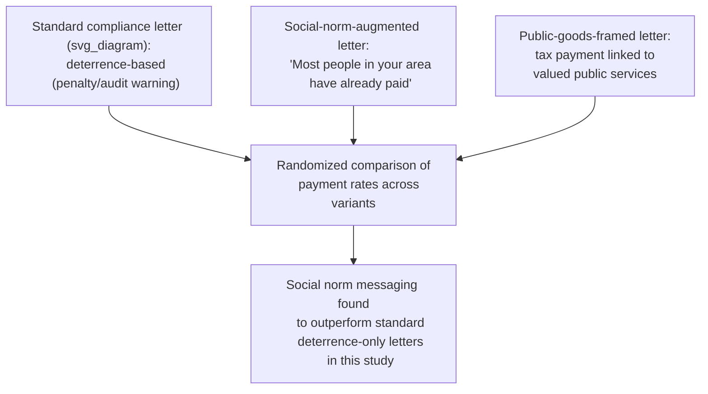

## Behavioral Insights in Tax Compliance

### Overview

Behavioral insights in tax compliance examine how tax authorities have applied findings from behavioral economics — social norms, salience, framing, deterrence psychology, and simplification — to increase voluntary tax compliance and payment, often as a complement to, or substitute for, traditional deterrence-based enforcement (audits and penalties). This area has produced some of the most widely cited randomized field experiments in applied behavioral public policy, most notably the UK's HM Revenue and Customs (HMRC) "nudge unit" collaborations.

### The Classical Deterrence Model of Tax Compliance

The standard economic model of tax compliance (Allingham & Sandmo, 1972) treats compliance as an expected-utility gamble:

$$\max_{D} \; (1-p) \cdot U(W - t(W-D)) + p \cdot U(W - t(W-D) - \pi \cdot t \cdot D)$$

Where $D$ is the amount of income underreported (evaded), $p$ is the probability of audit/detection, $t$ is the tax rate, and $\pi$ is the penalty multiplier applied to evaded tax if caught. This model predicts that compliance should respond primarily to the audit probability and penalty severity — a **pure deterrence** framework.

**Key Points** — Empirical anomaly: observed compliance rates in most countries are substantially **higher** than the Allingham-Sandmo model predicts given realistic (typically low, often under 2%) audit probabilities and penalty levels, a long-standing puzzle in public finance often referred to as the "compliance puzzle" — motivating the search for non-deterrence explanations, many of which are behavioral.

### Behavioral Explanations for the Compliance Puzzle

| Mechanism | Description |
| --- | --- |
| **Social norms / tax morale** | Many taxpayers comply substantially out of an internalized sense of civic obligation or social norm adherence, not purely expected-utility calculation |
| **Overestimation of audit probability** | Taxpayers may systematically overestimate the true (low) probability of being audited, generating compliance behavior closer to what a higher, subjectively-perceived $p$ would predict under the standard model |
| **Loss aversion around penalties** | The prospect of a penalty, framed as a loss relative to a reference point, may be weighted more heavily than the Allingham-Sandmo expected-utility framework (which treats gains and losses symmetrically) would predict |
| **Reciprocity with the state** | Taxpayers who perceive the government as providing valued public goods fairly in return for tax payments may comply partly as a reciprocal "gift exchange" with the state, echoing the gift-exchange mechanism covered elsewhere in this syllabus |
| **Limited attention/salience of filing deadlines and obligations** | Simple inattention, rather than deliberate evasion, explains a meaningful share of late filing and underpayment in various studies |

**[Inference]** The relative contribution of each mechanism to the overall compliance puzzle is not precisely decomposed in the literature; most studies test one or two mechanisms at a time (e.g., a specific norm-based message's effect on compliance) rather than jointly estimating the full decomposition implied by the table above.

### Social Norm Messaging: The Landmark UK Field Experiments

**Example**

Hallsworth, List, Metcalfe & Vlaev's (2017) large-scale randomized field experiment with UK HMRC, testing reminder letter variants sent to individuals with overdue tax payments, is among the most influential applied studies in this literature:

- Letters incorporating **social norm messages** — informing recipients that the large majority of people in their local area or nationally had already paid their tax on time — produced measurably higher subsequent payment rates than a standard reminder letter without the norm information, in a large-scale randomized comparison
- The study also tested variations emphasizing the **public goods funded** by tax payments (e.g., framing tax as directly supporting valued public services), which in some specification produced positive effects on payment behavior, consistent with the reciprocity-based explanation above
- This experiment is frequently cited as a canonical example of a low-cost, easily scalable behavioral intervention (a rewritten letter, at essentially zero marginal cost per recipient) producing a measurable improvement in a costly outcome (tax debt collection) relative to standard enforcement-letter baselines

**[Unverified]** Precise effect-size estimates (e.g., percentage-point increases in payment rates) from the Hallsworth et al. study and its various replications differ across the specific letter variant, recipient population, and country context tested; general claims about "nudges increasing tax compliance" should not be read as implying a single universal effect size applicable across all contexts.

### Cross-Country Replication and Heterogeneity

**Key Points**

- Subsequent studies applying similar social-norm and simplification-based messaging to tax compliance in other countries (including various government "nudge unit" or behavioral insights team collaborations) have found effects that vary in direction and magnitude by context, population, and specific message design, rather than uniformly replicating the original UK findings at the same magnitude
- **[Speculation]** Cross-cultural variation in baseline tax morale and social norm sensitivity is a plausible explanation for heterogeneous replication results, though this remains a hypothesis requiring further systematic cross-country comparative research rather than an established finding
- Meta-analyses and systematic reviews of tax-nudge field experiments generally find that social-norm and deterrence-salience messages produce **positive but modest** average effects, with substantial heterogeneity across studies — a pattern consistent with the broader "nudge effect size" debate in applied behavioral economics more generally

### Simplification and Salience Interventions

Beyond social norm messaging, several other behaviorally-informed interventions have been tested and implemented in tax administration:

- **Simplified filing and pre-populated returns:** reducing the complexity/hassle cost of filing (analogous to the hassle-cost mechanism in retirement enrollment procrastination) has been associated with improved compliance and timeliness in various country implementations (e.g., pre-filled tax return systems used in several Scandinavian and other countries)
- **Deadline salience and reminder timing:** simple reminder messages sent closer to filing/payment deadlines, leveraging limited-attention correction rather than deterrence framing, have shown positive effects on timely compliance in multiple studies
- **Simplified penalty communication:** clearly and simply communicating the specific consequences of non-payment (rather than vague or legalistic penalty language) has been found in some studies to improve compliance relative to more complex or ambiguous penalty framing, consistent with the broader finding that salient, easily processed information outperforms technically complete but harder-to-parse communication

### Tax Salience and the Structure of the Tax Itself

Related to, but distinct from, compliance-letter interventions, the broader **tax salience** literature (Chetty, Looney & Kroft, 2009) examines how the visibility of a tax at the point of a economic decision (not just the compliance/payment stage) affects behavior:

$$\text{Behavioral response to tax} \; \neq \; \text{Behavioral response to economically equivalent price change, when tax salience is low}$$

- Taxes that are not included in a displayed price (added only at checkout, or embedded in a way that is not immediately visible) tend to produce **smaller** demand responses than economically identical taxes that are fully incorporated into the posted price, indicating that consumers do not always correctly account for taxes they are not actively attending to
- This has direct implications for **excise and sin tax design** (covered separately) — if the policy goal is behavioral change (e.g., internality correction) rather than pure revenue generation, tax salience at the point of purchase becomes a first-order design consideration, not merely an implementation detail

### Deterrence and Behavioral Insights as Complements, Not Substitutes

**Key Points**

- Most tax authorities implementing behavioral insights programs (HMRC's Behavioural Insights Team collaboration, and analogous units in other countries) treat nudge-based compliance interventions as a **complement** to, rather than a replacement for, traditional audit-and-penalty enforcement — targeting the large population of marginally-compliant or inattentive taxpayers with low-cost messaging, while reserving costly audit resources for higher-risk or larger-scale evasion cases
- **Risk-based targeting combined with behavioral messaging:** some tax administration research examines whether behavioral messages can be more precisely targeted (e.g., varying message content by taxpayer risk profile or prior compliance history) to improve overall cost-effectiveness relative to a one-size-fits-all letter, an active area of applied tax administration research
- **[Inference]** The general framing of behavioral nudges as "low-cost, moderate-effect" complements to enforcement (rather than as a wholesale substitute capable of achieving high compliance without any deterrence infrastructure) reflects the broad consensus in the applied tax administration literature, though the precise optimal mix of nudge-based and deterrence-based resources is an ongoing empirical and administrative design question rather than a settled formula.

### Conclusion

Behavioral insights in tax compliance demonstrate that voluntary compliance is shaped substantially by social norms, salience, framing, and perceived reciprocity with the state, in addition to the classical deterrence channels (audit probability and penalty severity) that dominate the traditional Allingham-Sandmo model. Landmark field experiments — particularly HMRC's social-norm letter studies — established this as one of the most influential applied domains of behavioral public economics, while subsequent cross-country replication has revealed meaningful heterogeneity in effect sizes, reinforcing that behavioral tax compliance interventions function best as scalable complements to, rather than replacements for, traditional enforcement infrastructure.

### Related Topics

- Behavioral Welfare Economics and the Concept of Internalities
- Tax Salience Effects (Chetty, Looney & Kroft)
- Social Norms and Norm-Based Messaging
- Sin Taxes and Corrective Policy
- Fairness, Wage Rigidity, and Gift-Exchange Models (reciprocity mechanism)
- Nudge Theory and Choice Architecture
- Limited Attention and Salience in Economic Decision-Making
- Field Experiments in Applied Behavioral Economics