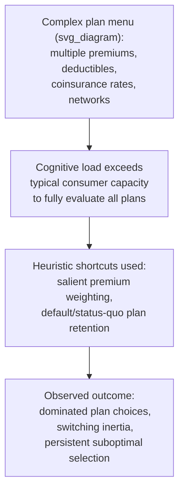

## Consumer Choice in Insurance and Complex Markets

### Overview

Insurance and other complex financial/administrative markets (health plans, mortgages, mobile phone contracts, utility tariffs) require consumers to evaluate probabilistic outcomes, multi-attribute pricing structures, and menus of options that often exceed the cognitive capacity most people bring to routine purchasing decisions. Behavioral research in this domain documents systematic, costly errors in plan choice — frequently choosing dominated options, misjudging risk, and failing to switch even when clearly better alternatives exist — motivating a distinct behavioral public economics literature on market and disclosure design for complex products.

### Why Insurance Choice Is a Hard Behavioral Test Case

Insurance choice combines several features that behavioral research identifies as individually error-prone, compounding their combined difficulty:

- **Probabilistic reasoning under uncertainty:** insurance value depends on subjective assessment of a low-probability, high-loss event — precisely the domain where Prospect Theory's probability weighting function predicts systematic overweighting of small probabilities and misjudgment of relative risk
- **Multi-attribute, non-linear pricing:** plans typically combine premiums, deductibles, coinsurance rates, out-of-pocket maximums, and provider networks (for health insurance) into a single bundled choice, requiring consumers to mentally integrate several nonlinear cost components to compare options correctly
- **Infrequent decisions with limited feedback:** many insurance choices (health plan selection, life insurance) are made annually or even less often, providing little opportunity for experiential learning to correct errors over repeated choices — unlike frequently repeated consumer decisions where feedback can gradually improve choice quality
- **High switching costs (real or perceived):** administrative hassle, uncertainty about network disruption, or simple inertia can suppress switching even when superior options are objectively available

### Evidence of Systematic Plan-Choice Errors

**Key Points**

- **Dominated plan choice:** several influential studies (e.g., Bhargava, Loewenstein & Sydnor, 2017, on employer health insurance) find that a substantial share of employees choose health insurance plans that are **financially dominated** — meaning an alternative available plan would have left them better off in every realized health-spending scenario, not merely in expectation — indicating the error is not merely a matter of risk-preference heterogeneity but a genuine mistake
- **Excessive weight on premiums relative to expected out-of-pocket costs:** some studies find consumers place disproportionate weight on the more salient, upfront premium relative to the less salient, probabilistic expected out-of-pocket spending, a pattern consistent with **salience-based decision-making** rather than full expected-cost calculation
- **Inertia in plan switching (Medicare Part D):** research on Medicare Part D prescription drug plan choice (e.g., Ericson, 2014; Abaluck & Gruber, 2011) finds substantial switching inertia — many beneficiaries remain in plans that become relatively worse over time (as formularies and premiums change) rather than re-optimizing annually, despite low nominal switching costs

### Probability Weighting and Insurance Demand Anomalies

Building on Prospect Theory's probability weighting function, insurance demand exhibits documented anomalies inconsistent with expected-utility-based insurance theory:

$$w(p) \neq p \quad \text{(subjective decision weight diverges from objective probability } p\text{)}$$

- **Overinsurance against small, salient, low-probability losses:** consumers frequently purchase low-deductible plans, extended warranties, or narrow-event insurance (e.g., flight cancellation insurance, appliance extended warranties) at prices that are actuarially unfavorable relative to the expected loss, consistent with probability-weighting-driven overweighting of vivid, low-probability risks
- **Underinsurance against larger, less salient risks:** conversely, some studies document underinsurance or under-annuitization against larger, more abstract, or less immediately salient risks (e.g., long-term disability, longevity risk in retirement), where the loss is real but less vivid or less immediately top-of-mind at the point of the insurance decision
- **[Inference]** This asymmetric pattern — overinsuring salient small risks while underinsuring larger but less vivid risks — is commonly attributed in the behavioral insurance literature to a combination of probability weighting and the availability heuristic operating jointly, though isolating the precise relative contribution of each specific mechanism in any given empirical study is often difficult given typical field data limitations.

### Extended Warranties as a Canonical Behavioral Anomaly

**Example**

Extended warranties on consumer electronics and appliances are frequently cited as a textbook example of behaviorally-anomalous insurance demand:

- The expected payout of most extended warranties is well below their price, reflecting the retailer's substantial profit margin built into the product — a pattern noted repeatedly in consumer-finance commentary and analysis
- Purchase is nonetheless common, consistent with probability-weighting-driven overvaluation of the (typically low) probability of product failure, combined with **loss aversion** framing (the warranty is often pitched at the point of sale using loss-framed language, e.g., emphasizing the cost of an uncovered repair)
- The point-of-sale timing itself is behaviorally significant: warranty offers are typically presented immediately after the consumer has committed to the primary purchase, a moment when consumers may be in a less deliberative, more impulse-prone decision state

### Choice Architecture Interventions for Complex Markets

| Intervention | Mechanism Targeted | Application Example |
| --- | --- | --- |
| Standardized plan comparison tools | Reduces cognitive load of multi-attribute comparison | Healthcare.gov plan comparison interface; Medicare Plan Finder |
| Personalized cost estimators (showing expected total annual cost, not just premium) | Counters premium-salience bias | Some employer benefits platforms displaying "total expected cost" alongside premium |
| Simplified/standardized product design | Reduces search and comparison friction | Standardized Medigap plan letters (A, B, C, etc.) in the US, enabling apples-to-apples comparison across insurers |
| Active choice / re-enrollment prompts | Counters switching inertia | Periodic prompts requiring active reconfirmation or reconsideration, rather than automatic passive rollover |
| Default/recommended plan based on prior usage | Leverages status quo bias productively | Some Medicare Part D and employer platforms recommend a specific plan based on the individual's prior year's prescription history |

### Regulatory and Disclosure Approaches

**Key Points**

- **Simplified disclosure mandates:** regulatory requirements for standardized summary documents (e.g., the US Affordable Care Act's "Summary of Benefits and Coverage" standardized format) aim to reduce the comparison difficulty documented in the plan-choice error literature, though evidence on the magnitude of resulting choice-quality improvement varies across studies of specific disclosure reforms
- **Cooling-off periods:** mandated reconsideration windows for certain insurance products (e.g., some life insurance "free-look" periods) allow consumers to revisit "hot state" or high-pressure point-of-sale decisions after a reflection period, directly addressing the sales-context vulnerability illustrated by extended warranty purchases
- **Restrictions on point-of-sale add-on selling practices:** some regulatory approaches restrict or require additional disclosure for high-margin add-on insurance products sold at the point of a primary purchase, reflecting behavioral concern about decision quality in that specific sales context

### Debate: Choice Architecture vs. Simplifying the Choice Set Itself

**Key Points**

A significant normative and design debate in this literature concerns **whether the correct policy response is to improve decision-support tools within a complex menu, or to simplify the menu itself**:

- **Decision-support/nudge approach:** preserves plan variety and market competition while attempting to reduce the cognitive burden of comparison through better tools, defaults, and disclosure — consistent with libertarian paternalism's preference for preserving choice
- **Menu-simplification/standardization approach:** directly reduces the number or complexity of available options (e.g., standardized Medigap letter plans), trading off some product variety/customization for reduced comparison error, potentially at the cost of restricting genuinely useful heterogeneity in consumer needs
- **[Speculation]** Which approach dominates in welfare terms likely depends on the specific market's underlying need for genuine product heterogeneity (health needs vary substantially across individuals, arguably justifying more plan variety) versus the cognitive cost that variety imposes — a tradeoff that does not have a single generalizable resolution across all complex-choice markets, and is better evaluated market-by-market than via a universal design principle

### Conclusion

Consumer choice in insurance and other complex markets is one of the clearest empirical domains where documented behavioral errors — probability misweighting, salience-driven premium overweighting, and switching inertia — produce measurable, financially consequential welfare losses, including outright dominated plan selections that cannot be explained by preference heterogeneity alone. This evidence base has directly motivated a range of policy responses, from standardized disclosure and comparison tools to more structural menu-simplification approaches, with the underlying normative debate over how far to move from decision-support toward outright market simplification remaining an active and context-dependent question in behavioral public economics.

### Related Topics

- Prospect Theory and Probability Weighting
- Behavioral Welfare Economics and the Concept of Internalities
- Default Effects and Status Quo Bias
- Household Finance and Retirement Savings Behavior
- Annuity Puzzle and Longevity Risk
- Nudge Theory and Choice Architecture
- Limited Attention and Salience in Economic Decision-Making
- Regulatory Disclosure Design in Consumer Finance