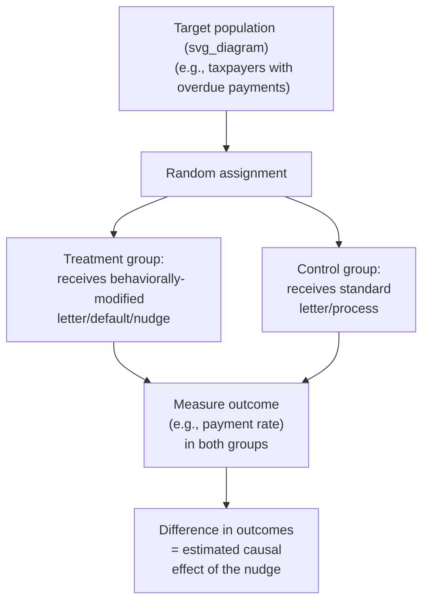
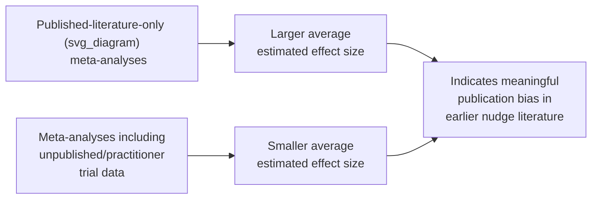

## Randomized Controlled Trials in Policy Evaluation

### Overview

Randomized controlled trials (RCTs) are the methodological backbone of modern applied behavioral public economics, providing the causal identification strategy that distinguishes credible evidence of a nudge or policy intervention's effect from mere correlation. This entry covers the design logic, strengths, and limitations of RCTs as applied specifically to behavioral policy evaluation — including the rise of government "nudge units," the specific threats to validity that arise in behavioral (as opposed to purely economic/clinical) interventions, and the ongoing debate over the generalizability of RCT findings across contexts.

### Why RCTs Are Central to Behavioral Policy Evaluation

Behavioral interventions (a reworded letter, a changed default, a simplified form) are typically low-cost, easy to implement in variant form, and testable at scale within an existing administrative process — making them unusually well-suited to randomization relative to many traditional economic policy interventions (e.g., a national interest rate change) that cannot be randomized at all.

$$\text{ATE} = E[Y_i(1)] - E[Y_i(0)]$$

Where $\text{ATE}$ is the average treatment effect, and $Y_i(1)$, $Y_i(0)$ are the potential outcomes for individual $i$ under treatment and control respectively. Randomization ensures that treatment and control groups are, in expectation, identical on both observed and **unobserved** characteristics, allowing the simple difference in group means to be interpreted as a causal effect — a critical advantage over observational comparisons, which may be confounded by exactly the kind of unobserved individual heterogeneity (e.g., underlying financial sophistication, risk tolerance) that behavioral research is often specifically interested in studying.

### Standard RCT Design Elements Applied to Behavioral Policy

**Key Points**

- **Unit of randomization:** behavioral policy RCTs may randomize at the individual level (e.g., letter variant assigned per taxpayer) or at a cluster level (e.g., entire school, branch office, or geographic region assigned to a treatment arm), with cluster-randomized designs requiring larger sample sizes and different standard-error calculations (clustered standard errors) to avoid overstating statistical precision
- **Stratified/blocked randomization:** researchers frequently stratify randomization by key observable characteristics (e.g., prior compliance history, income band) to ensure balance across treatment arms and to enable more precise subgroup analysis
- **Factorial designs:** some behavioral RCTs test multiple intervention components simultaneously in a factorial structure (e.g., independently varying both social-norm messaging and public-goods framing, as in some tax compliance letter studies), allowing estimation of each component's effect and any interaction between them within a single trial

### Government Behavioral Insights ("Nudge") Units

**Key Points**

- The UK's **Behavioural Insights Team (BIT)**, established in 2010 within the UK Cabinet Office (subsequently partly privatized/spun out), was among the first dedicated government units to systematically apply RCT methodology to policy design, running large-scale trials across tax compliance, organ donation messaging, job search support, and numerous other domains
- Similar units were subsequently established in other jurisdictions, including the **US Social and Behavioral Sciences Team (SBST)**, established via a 2015 executive order, along with numerous city, state, and other national government equivalents internationally
- **[Unverified]** The current operational status, staffing, and specific active project portfolios of these units change over time with shifts in government administration and priorities; readers requiring current organizational details should verify against the relevant government's current official sources rather than relying on a general historical description.
- A common institutional design feature across these units is embedding RCT methodology directly into routine government operations (e.g., testing multiple letter variants on a live administrative process) rather than commissioning separate, standalone academic studies — enabling faster iteration and more direct translation of findings into immediate policy practice

### Threats to Validity Specific to Behavioral Policy RCTs

**Key Points**

- **Novelty/Hawthorne effects:** because many behavioral interventions rely on an element of surprise or salience relative to a status-quo communication, an intervention's measured effect may partly reflect the *novelty* of the changed message rather than a durable behavioral mechanism, raising concern about whether effects persist once an intervention becomes routine/expected — a concern less prominent in interventions testing more stable structural changes (e.g., a default)
- **Spillover and general equilibrium effects:** individual-level RCTs may not capture effects that would emerge only at full population scale (e.g., a tax compliance letter's effect on the *individual* recipient may differ from its aggregate societal effect if widespread deployment changes social norms or expectations more broadly) — a concern sometimes described as a "scaling problem" in the applied nudge literature (Al-Ubaydli, List & Suskind, and related work on scaling challenges)
- **Publication bias and the replication concern:** as with the broader empirical social science literature, behavioral policy RCTs are subject to concern about selective publication/reporting of larger, more "interesting" effects, motivating increased emphasis on pre-registration of study designs and hypotheses in more recent behavioral policy research practice
- **Heterogeneous treatment effects across context:** many behavioral RCT findings, even when internally valid within their original study, show substantial variation in effect size (and sometimes direction) when re-tested in different countries, populations, or administrative systems — the cross-country tax compliance heterogeneity noted elsewhere in this chapter is a direct illustration of this broader pattern

### The "Nudge Effect Size" Debate

A significant recent methodological development is the emergence of large-scale meta-analyses specifically examining the *average* effect size of nudge-type interventions across many published and unpublished RCTs:

- Some meta-analyses restricted to **published** studies have found relatively large average effect sizes for nudge interventions
- Subsequent meta-analyses incorporating a broader set of studies, including large numbers of **unpublished, null, or "file drawer" results** obtained directly from government and industry practitioner datasets (e.g., Mertens et al., DellaVigna & Linos, and related work published in the early-to-mid 2020s), have found substantially **smaller** average effect sizes than the published-literature-only estimates — indicating a meaningful publication bias problem in the earlier nudge literature
- **[Unverified]** The precise magnitude of the gap between published-literature and full-sample (including unpublished) nudge effect-size estimates varies across the specific meta-analytic studies conducted, their inclusion criteria, and the categories of interventions covered, so exact comparative figures should be verified against the specific meta-analysis being cited rather than treated as a single settled number

### Pre-Registration and Open Science Practices

**Key Points**

- In response to the publication bias and replication concerns above, an increasing share of behavioral policy RCTs now use **pre-registration** — publicly documenting the study's hypotheses, outcome measures, and analysis plan before data collection begins, reducing the scope for post-hoc "fishing" for significant results across many possible outcome variables
- Some government nudge units and academic-practitioner collaborations now publish **null results** as a matter of practice, partly in response to critiques that the earlier literature overrepresented successful interventions relative to the true underlying distribution of effects
- **[Inference]** This methodological shift toward pre-registration and null-result publication is widely regarded within the field as a maturation of the discipline, though it is a relatively recent and still-developing norm rather than a universally adopted standard across all behavioral policy research to date.

### External Validity and Scaling Challenges

**Key Points**

- A well-designed internally-valid RCT in one context (e.g., a single US state's tax authority) does not automatically guarantee the same effect when the intervention is scaled nationally or transferred to a different institutional/cultural context — a distinction between **internal validity** (confidence the measured effect within the study is causal) and **external validity** (confidence the effect generalizes elsewhere)
- Some researchers have proposed conducting smaller "**pilot-then-scale**" RCT sequences, or explicitly testing interventions across multiple heterogeneous sites simultaneously (multi-site RCTs), specifically to better estimate how effects vary with context before committing to full-scale policy rollout
- **[Speculation]** Whether multi-site or pilot-then-scale RCT designs meaningfully improve real-world policy outcomes relative to single-site RCTs followed by direct scaling remains an area of ongoing methodological development, without a fully settled best-practice consensus applicable across all policy domains

### Conclusion

RCTs provide the central methodological tool through which behavioral public economics has translated psychological insight into credible, causally-identified evidence for policy design, exemplified by the institutionalization of government nudge units and landmark trials such as the UK tax compliance letter studies. However, the field has undergone significant methodological self-correction in recent years, with large-scale meta-analyses revealing meaningful publication bias in earlier nudge effect-size estimates and growing attention to novelty effects, scaling challenges, and cross-context heterogeneity — collectively pushing the discipline toward more rigorous pre-registration practices and more cautious, context-aware claims about the generalizability of any single trial's findings.

### Related Topics

- Behavioral Insights in Tax Compliance
- Automatic Enrollment and Retirement Policy
- Field Experiments in Applied Behavioral Economics
- Publication Bias and Replication in Social Science
- Nudge Theory and Choice Architecture
- Pre-Registration and Open Science Practices
- External Validity and Policy Scaling
- Behavioral Welfare Economics and the Concept of Internalities