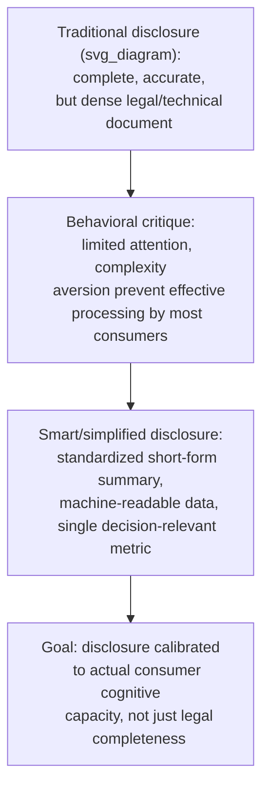

## Behavioral Approaches to Regulation and Disclosure

### Overview

Behavioral approaches to regulation and disclosure examine how regulatory frameworks — particularly in consumer finance, product safety, and contract design — can be redesigned around empirically documented decision-making limitations rather than the traditional assumption that disclosure alone (providing accurate information) is sufficient to protect consumers. This entry synthesizes the regulatory design philosophy underlying much of the preceding policy material (sin taxes, retirement defaults, insurance disclosure) into a general framework for behaviorally-informed regulation, along with the major theoretical and institutional developments specific to regulatory design itself.

### The Limits of Traditional Disclosure-Based Regulation

Classical consumer protection regulation rests heavily on a **disclosure paradigm**: mandate that firms provide accurate, complete information, and assume rational consumers will process it correctly to make welfare-maximizing choices. Behavioral economics challenges the sufficiency of this paradigm on several documented grounds:

- **Information overload:** providing more complete information does not guarantee better decisions if the volume or complexity of disclosed information exceeds what consumers can process — directly paralleling the choice-overload and complexity-aversion findings discussed under consumer choice in insurance and complex markets
- **Limited attention at the point of decision:** disclosures presented in dense legal or technical language (e.g., loan terms, "terms of service" agreements) are frequently not read or processed by the large majority of consumers in various studies, regardless of their technical accuracy or completeness
- **Timing mismatch:** disclosures are often provided at a point in the transaction (e.g., closing documents for a mortgage) where switching costs have already effectively been incurred, limiting their practical behavioral influence on the decision itself

$$\text{Disclosure effectiveness} = f(\text{accuracy}, \text{completeness}) \; \not\Rightarrow \; \text{Improved consumer decisions}$$

Behavioral regulatory design reframes the goal from *complete accurate disclosure* to **effective, processable disclosure calibrated to actual consumer cognition** — a materially different design target.

### Smart Disclosure and Simplified Formats

**Key Points**

- **Smart disclosure:** an approach emphasizing machine-readable, standardized data formats that can be fed into third-party comparison tools, rather than relying solely on consumers directly reading dense disclosure documents — shifting some cognitive burden from the individual consumer to intermediary tools/services designed to process the same underlying data
- **Simplified, standardized summary formats:** the "Summary of Benefits and Coverage" (US health insurance), the "Schumer box" (US credit card terms summary, required since the 1988 Fair Credit and Charge Card Disclosure Act), and the EU's Packaged Retail and Insurance-based Investment Products (PRIIPs) Key Information Document are examples of regulator-mandated, standardized, short-form disclosures designed specifically to be comparable across products at a glance
- **Visual and numeric simplification:** formats such as traffic-light nutrition labeling (front-of-pack labeling used in various countries) and simplified APR/total-cost figures in lending disclosures aim to convey the single most decision-relevant number or signal rather than requiring the consumer to compute it themselves from raw component data

### The Truth in Lending Act and CARD Act: A Behavioral Regulatory Case Study

**Example**

US consumer credit regulation illustrates the evolution from pure-disclosure to behaviorally-informed regulatory design:

- The original **Truth in Lending Act (1968)** mandated APR disclosure, reflecting the classical disclosure paradigm — assuming that standardizing the interest rate figure would enable rational comparison shopping
- The **Credit CARD Act of 2009** incorporated more explicitly behavioral design elements in response to evidence of systematic errors in credit card use, including requirements to display the total cost of making only minimum payments over time (directly counteracting **minimum payment anchoring**, documented in behavioral research showing many cardholders pay close to the minimum, partly because the minimum figure itself serves as a salient anchor) and restrictions on certain "hot state"/impulsive marketing practices (e.g., limits on card marketing to college students, requirements around fee increase notifications)
- **[Inference]** Regulatory histories of this kind are typically described in retrospective policy analysis as reflecting a gradual, evidence-influenced shift toward behavioral design principles; the original legislative drafters of any given provision may not have explicitly framed their intent in academic behavioral-economics terms, so attributing a specific provision's design directly to a specific piece of behavioral research requires some interpretive care rather than treating the connection as always explicitly documented in legislative history.

### Regulating the Choice Architecture of Firms

A distinct thread in behavioral regulation targets not just what information is disclosed, but how firms structure the choice environment itself, given evidence that firms may strategically exploit known biases:

**Key Points**

- **Dark patterns regulation:** increasing regulatory attention (e.g., FTC enforcement actions in the US, provisions in the EU's Digital Services Act and Digital Markets Act) targets user-interface design patterns specifically engineered to exploit cognitive biases — such as making subscription cancellation deliberately difficult relative to sign-up (asymmetric friction), pre-checked add-on boxes exploiting default/status-quo bias, or artificial urgency messaging exploiting scarcity heuristics
- **Negative-option/auto-renewal regulation:** several jurisdictions now require clear, easy cancellation mechanisms for auto-renewing subscriptions specifically to counteract the same inertia/status-quo mechanism that automatic-enrollment retirement policy exploits *productively* — illustrating that the same behavioral lever (defaults/inertia) can be either welfare-enhancing (retirement savings) or welfare-reducing (unwanted subscription retention) depending on whose interest the default serves, a distinction central to normative behavioral regulatory design
- **Cooling-off periods and rescission rights:** mandated reconsideration windows (e.g., door-to-door sales rescission rights, some loan/insurance "free-look" periods) directly regulate the *timing* of commitment relative to high-pressure or "hot state" sales contexts, addressed briefly under insurance choice and generalized here as a broader regulatory tool applicable across high-pressure sales contexts

### The Asymmetric Paternalism / Libertarian Paternalism Framework in Regulatory Design

Camerer, Issacharoff, Loewenstein, O'Donoghue & Rabin's (2003) **asymmetric paternalism** framework provides a general normative criterion for evaluating behaviorally-informed regulation, explicitly designed to bridge the tension between paternalistic intervention and respect for consumer autonomy:

$$\text{Regulation justified if: } \; \text{Benefit to biased/mistaken consumers} \; \gg \; \text{Cost imposed on fully rational consumers}$$

- A regulation satisfying this criterion helps those making systematic errors (e.g., those who would fall for a dark pattern or fail to read dense fine print) while imposing minimal cost on consumers who would have made the same choice anyway under full information and rationality
- This criterion underlies the general preference in behavioral regulatory design for **defaults, simplified disclosure, and friction-reduction** over outright product bans or restriction, since these tools tend to satisfy the asymmetric paternalism criterion more readily than blunter interventions that remove choice entirely
- **[Speculation]** Whether any given real-world regulation actually satisfies the asymmetric paternalism criterion in practice is an empirical question that is rarely precisely measured in the course of ordinary regulatory rulemaking, meaning the framework functions more as a normative aspiration guiding regulatory design philosophy than as a routinely and rigorously applied quantitative test

### Behavioral Regulation of Financial Products: The CFPB Model

**Key Points**

- The US **Consumer Financial Protection Bureau (CFPB)**, established by the Dodd-Frank Act (2010) partly in response to the 2008 financial crisis, explicitly incorporated behavioral economics research capacity into its regulatory design process, including a dedicated behavioral economics research function informing rulemaking on mortgage disclosure simplification (the integrated "Know Before You Owe" mortgage disclosure forms), payday lending regulation, and other consumer finance domains
- This represents one of the most institutionally significant examples globally of a financial regulator formally integrating behavioral economics expertise into its regulatory design process, alongside the UK Financial Conduct Authority's own behavioral economics unit and research program
- **[Unverified]** The current scope, staffing, and specific active regulatory priorities of the CFPB's behavioral economics function are subject to change with shifts in agency leadership and political administration; readers requiring current details on specific active rules or the agency's present organizational structure should consult current official CFPB sources rather than relying on a general historical description.

### Tensions and Critiques of Behavioral Regulation

**Key Points**

- **Regulatory capture and the "who decides what's a bias" problem:** critics note that regulators themselves are not immune to their own cognitive limitations or political pressures, raising the concern that behavioral regulatory tools could be applied inconsistently, subject to lobbying influence, or based on contested rather than well-established behavioral findings
- **Innovation and cost concerns:** industry stakeholders frequently argue that behaviorally-motivated design mandates (specific disclosure formats, friction requirements) impose compliance costs and constrain legitimate product innovation, a standard regulatory cost-benefit tension not unique to behavioral regulation but often raised specifically in this context
- **The "manipulation" boundary question:** a genuinely contested normative question in this literature is where the line falls between *correcting* a consumer bias (broadly viewed as legitimate under asymmetric paternalism) and a regulator or firm *exploiting* consumer psychology for other ends (e.g., a nudge designed primarily to increase government revenue or firm profit under the guise of consumer protection) — **[Speculation]** there is no fully settled, operationalizable test in the literature for reliably distinguishing legitimate behavioral regulation from manipulative design in all cases, and this remains a genuinely disputed area of normative and legal scholarship

### Conclusion

Behavioral approaches to regulation and disclosure represent a systematic shift from assuming that accurate, complete information is sufficient for consumer protection toward designing disclosure formats, choice architecture rules, and timing safeguards calibrated to actual, empirically documented decision-making processes. Institutionalized through bodies such as the CFPB and reflected in legislation such as the CARD Act, this approach is guided normatively by the asymmetric paternalism framework, while remaining subject to ongoing debate over regulatory capture, innovation costs, and the contested boundary between legitimate bias-correction and manipulative design.

### Related Topics

- Consumer Choice in Insurance and Complex Markets
- Behavioral Welfare Economics and the Concept of Internalities
- Libertarian Paternalism and Asymmetric Paternalism
- Dark Patterns and Digital Choice Architecture
- Default Effects and Status Quo Bias
- Randomized Controlled Trials in Policy Evaluation
- Automatic Enrollment and Retirement Policy
- Tax Salience Effects (Chetty, Looney & Kroft)