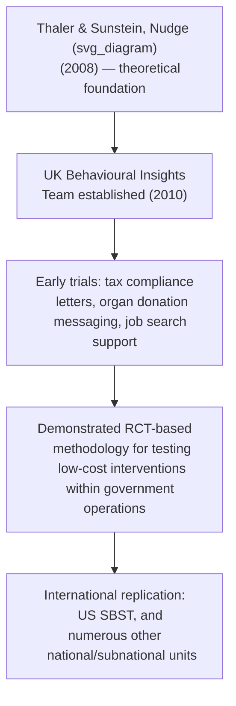

## Nudge Units and Government Behavioral Insights Teams

### Overview

Nudge units — dedicated government teams tasked with applying behavioral science, typically via randomized trials, to public policy and administration — represent the primary institutional mechanism through which behavioral economics research has been operationalized into ongoing government practice, as distinct from one-off academic studies or individual legislative provisions. This entry covers the origins, organizational models, operating methodology, and cross-national landscape of these units, building directly on the RCT methodology and specific policy applications (tax compliance, disclosure, retirement defaults) covered elsewhere in this chapter.

### Origins: The UK Behavioural Insights Team

**Key Points**

- The UK's **Behavioural Insights Team (BIT)**, established in 2010 within the Cabinet Office under the coalition government, is widely credited as the first dedicated government nudge unit and the model most subsequently referenced units drew upon
- BIT's early mandate combined applying behavioral science principles (drawing directly on Thaler & Sunstein's *Nudge*, 2008) to existing government processes, with an explicit methodological commitment to **testing interventions via randomized controlled trials** wherever feasible, rather than relying on either pure theory or untested intuition about "what nudge should work"
- BIT was subsequently restructured into a partly independent, mutually-owned social purpose company (with continued UK government, Nesta, and staff ownership stakes), a hybrid public-private organizational model that has itself become influential as other jurisdictions considered how to structure their own units
- **[Unverified]** BIT's precise current ownership structure, size, and international operations have evolved over time since its founding; readers requiring current organizational details should consult BIT's own current public materials rather than relying on a static historical description.

### Core Operating Methodology

**Key Points**

- **Embedding within existing administrative processes:** rather than commissioning standalone studies, nudge units typically work directly with the relevant government department or agency to test intervention variants (e.g., alternative letter wording, form redesign, default settings) within processes the department already runs, allowing large sample sizes at low marginal cost
- **The "EAST" and similar practical frameworks:** BIT popularized simplified practitioner frameworks intended to guide non-specialist civil servants in generating candidate interventions — the EAST framework (make it Easy, Attractive, Social, Timely) is among the most widely cited, functioning as an applied heuristic translation of the underlying academic behavioral literature (limited attention/hassle costs, salience, social norms, and present bias/timing respectively) rather than as a novel theoretical contribution itself
- **Iterative test-and-learn cycles:** rather than committing to a single large-scale policy change, the methodology emphasizes testing a small number of variants at modest scale first, then scaling the most effective variant — directly paralleling the pilot-then-scale RCT design logic discussed under Randomized Controlled Trials in Policy Evaluation
- **[Inference]** Practitioner frameworks like EAST are generally understood within the field as communication and ideation tools for translating academic behavioral findings into actionable government practice, rather than as new theoretical claims requiring independent empirical validation in their own right, though this distinction is not always made explicit in general audience descriptions of these frameworks.

### The US Social and Behavioral Sciences Team

**Key Points**

- The **Social and Behavioral Sciences Team (SBST)** was established via a September 2015 US presidential executive order, situated within the Executive Office of the President, tasked with applying behavioral insights across federal agencies
- SBST's published annual reports documented trials across domains including retirement savings (military and federal employee savings plan enrollment), student loan repayment reminders, and various other federal administrative processes, generally following the same RCT-based test-and-learn methodology pioneered by BIT
- **[Unverified]** SBST's institutional status has been affected by subsequent changes in US presidential administrations since its founding; its current operational status and any successor structure should be verified against current federal government sources rather than assumed to be unchanged from its original 2015 mandate.

### International Landscape of Nudge Units

| Region/Country | Notable Unit(s) | General Focus Areas (Illustrative) |
| --- | --- | --- |
| United Kingdom | Behavioural Insights Team (BIT) | Tax compliance, health, education, international expansion into other countries' government advisory work |
| United States | Social and Behavioral Sciences Team (SBST) | Federal administrative processes, retirement savings, student loans |
| Australia | Behavioural Economics Team of the Australian Government (BETA) | Various federal policy domains |
| Germany | Behavioural Insights Unit within the German Chancellery | Various federal policy domains |
| Netherlands | Ministry-level behavioral insights teams (various) | Tax administration, regulatory compliance |
| Singapore | Behavioural Insights initiatives within various government bodies | Public health, financial planning |
| International organizations | World Bank's "Mind, Society, and Behavior" initiative (World Development Report 2015); OECD behavioral insights work | Development policy, cross-country policy comparison and toolkits |

**[Unverified]** This list reflects the general shape of the international nudge unit landscape as broadly documented in comparative behavioral policy literature; specific unit names, organizational placements, and active status are subject to change with government reorganizations, and current authoritative country-by-country details should be verified against each government's current official sources rather than treated as a fixed, permanent list.

### Methodological Contributions Beyond Individual Trials

**Key Points**

- **Standardized trial reporting and evaluation templates:** several nudge units have contributed to broader methodological standardization in applied policy trials, including structured approaches to pre-registration, power calculation, and result reporting adapted specifically for the government administrative-process context (as opposed to laboratory or clinical trial settings)
- **Building internal government evaluation capacity:** a stated goal of several units (explicitly including BIT's own public materials) has been not only running specific trials but building broader government capability to design and interpret evidence-based policy interventions more generally, extending influence beyond the specific interventions any single unit directly tests itself
- **Contribution to the publication bias correction discussed under RCT methodology:** several major nudge-effect-size meta-analyses that revealed smaller true average effects than earlier published literature suggested (discussed under Randomized Controlled Trials in Policy Evaluation) specifically relied on unpublished trial data obtained directly from nudge units' own internal records — meaning these units' practice of retaining and eventually sharing null/unpublished results was itself instrumental in correcting a bias in the broader academic literature

### Critiques and Debates Specific to Nudge Unit Institutional Design

**Key Points**

- **Scope and mandate creep concerns:** as nudge units have expanded from narrow administrative-process trials (e.g., a single reminder letter) into broader policy advisory roles, some critics have raised concern about behavioral insights being applied to domains (e.g., major structural policy questions) where the underlying evidence base is less well-established than in the narrower, well-tested administrative-nudge domains where the methodology originated
- **Accountability and transparency:** because nudge unit trials are often embedded within routine government operations rather than conducted as clearly-labeled research studies, questions have been raised in policy and ethics literature about appropriate consent, transparency, and oversight standards for citizens who are, in effect, research subjects in government-run behavioral experiments — an ethical dimension distinct from, but related to, standard human-subjects research ethics frameworks
- **Resource and political sustainability:** several units' scale, funding, and political support have fluctuated with changes in government administration (illustrated by SBST's institutional history), raising questions about the long-term sustainability of nudge units as a stable feature of government policy infrastructure versus a contingent, politically-dependent institutional experiment
- **[Speculation]** Whether nudge units represent a durable, permanent addition to standard government policy infrastructure or a historically contingent feature closely tied to a particular period's political and intellectual enthusiasm for behavioral economics is not a question with a settled answer, and reasonable analysts differ in their assessment of the field's long-term institutional trajectory

### Conclusion

Government nudge units, beginning with the UK's Behavioural Insights Team and subsequently replicated across numerous countries and international organizations, represent the key institutional bridge between behavioral economics research and routine government policy practice, embedding RCT methodology directly into administrative operations across tax compliance, retirement savings, health, and other domains. While these units have made substantial contributions — including, notably, helping correct publication bias in the broader nudge effect-size literature by sharing unpublished trial data — their institutional durability, appropriate scope, and governance/transparency standards remain actively debated questions rather than fully settled features of the field.

### Related Topics

- Randomized Controlled Trials in Policy Evaluation
- Behavioral Insights in Tax Compliance
- Behavioral Approaches to Regulation and Disclosure
- Automatic Enrollment and Retirement Policy
- Nudge Theory and Choice Architecture
- Libertarian Paternalism and Asymmetric Paternalism
- Publication Bias and Replication in Social Science
- Behavioral Welfare Economics and the Concept of Internalities