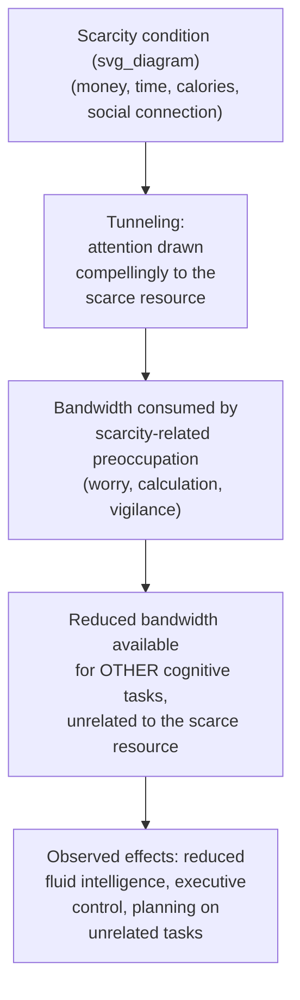
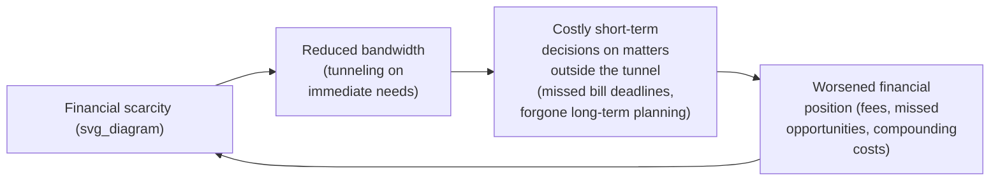

## The Psychology of Scarcity

### Overview

The psychology of scarcity examines how conditions of material deprivation — insufficient money, time, or other resources — systematically alter cognitive function and decision-making, independent of any underlying difference in intelligence, character, or preferences. The central theoretical contribution, developed most influentially by Sendhil Mullainathan and Eldar Shafir in *Scarcity: Why Having Too Little Means So Much* (2013), argues that scarcity itself consumes limited cognitive "bandwidth," producing a **scarcity mindset** that can generate short-term-focused, seemingly poor decisions as a direct cognitive consequence of deprivation — not merely a pre-existing trait of those experiencing it.

### The Bandwidth/Cognitive Load Framework

Mullainathan & Shafir's core theoretical claim is that scarcity — of any resource, not only money — imposes a **tax on cognitive bandwidth**, the limited mental resources available for cognitive function (fluid intelligence, executive control) at any given moment:

$$\text{Bandwidth}_{\text{available}} = \text{Bandwidth}_{\text{total}} - \text{Bandwidth}_{\text{consumed by scarcity preoccupation}}$$

Because attention is drawn compellingly and involuntarily toward the scarce resource (a phenomenon they term **"tunneling"**), less cognitive capacity remains available for other tasks — including tasks entirely unrelated to the scarce resource itself, such as parenting, work performance, or unrelated financial planning. This is framed as a general cognitive mechanism, structurally analogous across different types of scarcity (money, time, calories/dieting, social connection/loneliness), rather than a phenomenon specific to poverty alone.

### Tunneling: Attention Capture by the Scarce Resource

**Key Points**

- **Tunneling** describes the mechanism by which scarcity compellingly captures attention on the pressing scarce resource, at the expense of attention to other, potentially important considerations outside the "tunnel"
- Tunneling can produce genuine short-term performance advantages within the tunnel (e.g., sharper focus on an urgent, immediate deadline) — Mullainathan & Shafir explicitly note this as a partial benefit, sometimes termed the "focus dividend"
- The costs of tunneling arise specifically from **what falls outside the tunnel**: items, considerations, or long-term planning tasks that are not the immediate scarce-resource focus become neglected, even when objectively important (e.g., a cash-constrained individual may focus intensely on this week's bills while neglecting a straightforward, valuable long-term financial opportunity that falls outside the immediate tunnel)

### Experimental Evidence: The Sugarcane Farmer Study

**Example**

Mani, Mullainathan, Shafir & Zhao's (2013) widely cited study of Indian sugarcane farmers provides a quasi-experimental test of the bandwidth hypothesis using a within-subject, before/after-harvest design:

- The same farmers were tested on cognitive measures (a Raven's Progressive Matrices-style fluid intelligence task, and a cognitive control task) both **before harvest** (when farmers are relatively cash-poor, having spent the growing season's income) and **after harvest** (when farmers are relatively cash-rich, having just been paid for their crop)
- The study found that the same individuals performed measurably worse on cognitive tasks when tested in the pre-harvest, cash-poor condition compared to the post-harvest, cash-rich condition — a within-subject comparison specifically designed to rule out a fixed difference in innate ability, since the identical individuals were compared to themselves across the two financial states
- The magnitude of the reported cognitive performance difference has frequently been compared in secondary discussion to effects associated with a substantial loss of a night's sleep, though **[Unverified]** this specific sleep-deprivation comparison is a widely circulated secondary framing rather than a direct component of the original study's own reported statistical results, and readers seeking the precise original effect-size figures should consult the original published study directly

**[Unverified]** As with many influential single-study findings in behavioral science, the sugarcane farmer study's specific findings have been subject to methodological discussion and, in some cases, attempted replication or reanalysis in subsequent literature; general summaries of "the scarcity/cognitive bandwidth effect" should be understood as resting substantially on this and a small number of related studies rather than a large, fully independently replicated body of directly comparable evidence, particularly regarding precise effect magnitudes.

### The Scarcity Trap: A Behavioral Poverty Feedback Loop

A central applied implication of the bandwidth framework is the **scarcity trap** — a self-reinforcing cycle in which scarcity-induced bandwidth reduction produces decisions that, in turn, perpetuate or worsen the underlying scarcity condition:

- **Key mechanism distinction from purely dispositional explanations:** the scarcity-trap framework explicitly argues that the observed short-term-focused, seemingly poor financial decisions of low-income individuals reflect a **situational cognitive effect of scarcity itself**, not an underlying character trait, low intelligence, or lack of foresight — a reframing with significant normative implications for how poverty-related behavior is interpreted and addressed
- **[Inference]** This situational reframing is the central normative contribution frequently emphasized in popularizations of the scarcity research; it is worth noting that the underlying causal claim (that scarcity *causes* reduced cognitive bandwidth, rather than reduced bandwidth or other underlying factors independently contributing to both scarcity and poor decisions) rests on the specific quasi-experimental evidence discussed above and related studies, and represents an active area of ongoing behavioral science research rather than a fully closed empirical question.

### Scarcity Beyond Money: Time, Loneliness, and Dieting

The bandwidth framework is explicitly generalized by Mullainathan & Shafir to other resource domains, with structurally analogous predicted mechanisms:

| Scarce Resource | Tunneling Focus | "Outside the Tunnel" Cost |
| --- | --- | --- |
| Money (poverty) | Immediate bills, urgent expenses | Long-term financial planning, opportunities requiring upfront attention |
| Time (busyness) | Immediate deadlines, urgent tasks | Longer-term or lower-urgency but important tasks, relationship maintenance |
| Calories (dieting) | Food-related thoughts, hunger management | Unrelated cognitive tasks, self-control in non-food domains |
| Social connection (loneliness) | Social evaluation, threat monitoring in interactions | Broader cognitive/emotional bandwidth for unrelated tasks |

**[Speculation]** The degree to which the specific mechanism and magnitude documented in the money-scarcity literature (particularly the sugarcane farmer study) generalizes precisely to these other domains is more asserted by analogy in the popular presentation of this work than directly, comprehensively empirically established across all four domains with comparable rigor; readers should treat the cross-domain generalization as a plausible theoretical extension rather than an equally well-evidenced empirical finding in every listed domain.

### Implications for Poverty Alleviation Program Design

**Key Points**

- **Reducing bandwidth demands, not just providing resources:** the scarcity framework suggests that poverty interventions may be more effective when they also reduce the cognitive/administrative burden of accessing and using assistance (simplified application processes, reduced paperwork, fewer conditional requirements), not merely when they provide additional financial resources
- **Timing of decisions relative to scarcity cycles:** program design that requires complex decisions (e.g., signing up for a savings program, completing detailed benefit applications) may be more effective if scheduled during relatively lower-scarcity periods (e.g., shortly after a cash transfer or harvest payment) rather than during peak scarcity, when bandwidth for careful decision-making is most constrained
- **Caution against "poverty equals poor decision-making" stigmatizing interpretations:** the scarcity framework is frequently invoked specifically to push back against interpretations of poverty-related behavior that attribute it to individual failings, instead locating the causal mechanism in the situational cognitive load imposed by deprivation itself — a framing with direct relevance to the design and political communication of anti-poverty policy more broadly

### Relationship to Other Behavioral Development Economics Concepts

- **Present bias distinction:** scarcity-induced tunneling is a related but conceptually distinct mechanism from standard present bias/hyperbolic discounting — tunneling operates through reduced bandwidth/attention allocation, while present bias operates through the discount function applied to intertemporal tradeoffs; both can produce similar-looking short-term-focused behavior, but via different underlying psychological mechanisms, and disentangling their relative contributions in any specific poverty-related behavior is often empirically difficult
- **Complementary to, not a replacement for, structural/institutional explanations:** the scarcity/bandwidth framework is generally presented in the development economics literature as a complement to, rather than a substitute for, standard structural explanations of poverty persistence (credit constraints, lack of insurance markets, limited market access), adding a cognitive-psychological layer to an already multi-causal understanding of poverty traps rather than claiming to fully explain poverty on its own

### Conclusion

The psychology of scarcity reframes many behaviors historically attributed to individual failings among low-income populations as predictable, situational consequences of a genuine cognitive bandwidth tax imposed by deprivation itself, most directly evidenced through the sugarcane farmer natural experiment comparing the same individuals across relatively cash-poor and cash-rich states. While this framework has been highly influential in shaping both academic behavioral development economics and applied anti-poverty program design — particularly around reducing administrative/cognitive burden in program access — its precise causal mechanisms, cross-domain generalizability, and relationship to related concepts like present bias remain areas of active research rather than fully settled science.

### Related Topics

- Present Bias and Hyperbolic Discounting
- Poverty Traps and Behavioral Development Economics
- Cognitive Load and Decision Fatigue
- Limited Attention and Salience in Economic Decision-Making
- Administrative Burden in Social Program Design
- Household Finance and Retirement Savings Behavior
- Field Experiments in Applied Behavioral Economics