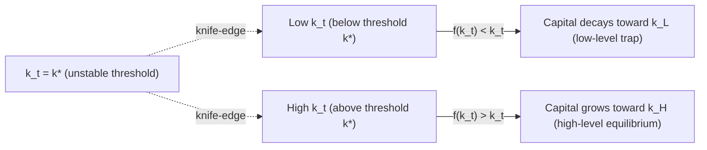

## Poverty Traps and Present Bias

### Definitions and Conceptual Overview

**Poverty trap**: a self-reinforcing mechanism whereby being poor today causally increases the probability of being poor in the future, producing multiple stable equilibria rather than convergence to a single steady state. Unlike neoclassical models where all agents converge to one equilibrium level of wealth, poverty-trap models predict that initial conditions determine long-run outcomes — a form of path dependence.

**Present bias**: a time-inconsistent preference pattern in which an agent's relative valuation of a reward shifts systematically depending on whether the comparison is being made in the present or between two future dates. An agent may prefer a smaller reward now over a larger reward later, yet prefer the larger later reward when both options are moved equally into the future. This is distinct from simple exponential discounting (patience), which is time-consistent by construction.

The chapter link between the two concepts is causal and bidirectional in the literature:

- Present bias can generate behaviorally-induced poverty traps (underinvestment in health, education, savings, and capital compounds over time).
- Poverty itself can amplify present bias (scarcity narrows cognitive bandwidth, raising the effective discounting of the future) — the "scarcity mindset" hypothesis.

### Formal Modeling of Present Bias

The standard workhorse is the **quasi-hyperbolic (β-δ) discounting model** (Laibson, 1997; building on Phelps & Pollak, 1968):

$$U_t = u(c_t) + \beta \sum_{k=1}^{\infty} \delta^k u(c_{t+k})$$

Where:

- $u(c_t)$ is instantaneous utility from consumption at time $t$
- $\delta \in (0,1)$ is the standard long-run discount factor
- $\beta \in (0,1)$ is the present-bias parameter — applied only to *future* periods relative to today

When $\beta = 1$, this collapses to standard exponential discounting (time-consistent). When $\beta < 1$, the agent discounts all future periods by an extra factor $\beta$, but this bias only "activates" for the now-vs-future comparison, not future-vs-future comparisons. This creates **time inconsistency**: a plan made today about future behavior will not be the plan actually carried out when that future period arrives.

**Sophistication vs. naivety**: a critical modeling distinction.

- **Sophisticated** present-biased agents correctly anticipate their own future self-control problems and may demand commitment devices.
- **Naive** present-biased agents believe $\beta = 1$ will hold in the future even though it will not, leading to systematic over-optimism about future self-control (e.g., "I'll start saving next month") and under-demand for commitment.
- **Partially naive** agents (parameterized by $\hat{\beta} \in (\beta, 1)$) represent an empirically common intermediate case.

### Mechanisms Linking Present Bias to Poverty Traps

**Key Points**

- **Underinvestment in human capital**: education and health investments have costs today and payoffs far in the future — exactly the structure present bias penalizes most heavily.
- **Undersaving**: small, recurring temptations to consume today (relative to future income) prevent capital accumulation past a critical threshold needed to escape subsistence.
- **S-shaped income dynamics**: if the production function for income/capital is convex at low capital levels and concave at higher levels (an S-shape), multiple equilibria emerge — a low-level trap and a high-level steady state — and present bias makes it harder for agents near the trap to save their way across the inflection point.
- **Nonconvexities plus present bias compound**: even without behavioral bias, nonconvexities (fixed costs, indivisibilities in technology or credit) can create traps; present bias lowers the effective savings rate needed to escape them, making the trap "stickier" than a purely neoclassical model would predict.

### The S-Shaped Wealth Dynamics Model

Let $k_t$ be capital/assets and $k_{t+1} = f(k_t)$ the law of motion. A poverty trap requires $f$ to cross the 45° line more than once.

Below the unstable threshold $k^*$, dynamics pull capital down to a low stable point $k_L$ (the trap); above $k^*$, dynamics push capital up to $k_H$. Present bias effectively **raises** the threshold $k^*$ that must be crossed via savings, because the marginal utility cost of saving today is overweighted relative to the true long-run return.

(svg_diagram) S-shaped capital accumulation function with multiple equilibria:

<svg xmlns="http://www.w3.org/2000/svg" viewBox="0 0 560 420" font-family="sans-serif">
<title>S-shaped Law of Motion and Multiple Equilibria (svg_diagram)</title>
<line x1="60" y1="360" x2="520" y2="360" stroke="black" stroke-width="1.5" />
<line x1="60" y1="360" x2="60" y2="30" stroke="black" stroke-width="1.5" />
<text x="500" y="380" font-size="13">k_t</text>
<text x="20" y="40" font-size="13">k_(t+1)</text>
<line x1="60" y1="360" x2="500" y2="40" stroke="gray" stroke-dasharray="4,4" stroke-width="1" />
<text x="480" y="35" font-size="11" fill="gray">45° line</text>
<path d="M 60 340 C 150 335, 220 300, 260 230 C 300 160, 360 90, 500 70" fill="none" stroke="#1a6fbd" stroke-width="2.5" />
<circle cx="95" cy="349" r="5" fill="#1a6fbd" />
<text x="80" y="400" font-size="12">k_L (trap)</text>
<circle cx="255" cy="238" r="5" fill="#c0392b" />
<text x="230" y="255" font-size="12" fill="#c0392b">k* (unstable)</text>
<circle cx="470" cy="82" r="5" fill="#1a6fbd" />
<text x="420" y="60" font-size="12">k_H (equilibrium)</text>
<text x="120" y="20" font-size="14" font-weight="bold">S-Shaped Accumulation Function (svg_diagram)</text>
</svg>

### Empirical Evidence

**Behavioral field experiments**:

- Fertilizer commitment savings in Kenya (Duflo, Kremer & Robinson, 2011): offering farmers a discounted, time-limited fertilizer delivery service shortly after harvest (when cash is available) substantially raised fertilizer use relative to free delivery at planting time — consistent with present-biased farmers valuing a small commitment mechanism that locks in the future-optimal input decision before temptation intervenes.
- Commitment savings accounts in the Philippines (Ashraf, Karlan & Yin, 2006): a savings product with self-imposed withdrawal restrictions (a "SEED" account) raised savings balances substantially among clients who exhibited hyperbolic-discounting patterns in survey measures, and had negligible effect on time-consistent respondents — direct evidence that demand for commitment tracks present bias rather than general savings motives.
- Multiple studies find measured discount-rate estimates from experimental choice tasks correlate with poverty status, though the direction of causality (bias causes poverty vs. poverty induces bias) remains actively debated. [Inference: correlational designs in most of this literature cannot definitively separate selection from causation without exogenous income shocks.]

**Scarcity and cognitive bandwidth** (Mullainathan & Shafir, 2013; Mani, Mullainathan, Shafir & Zhao, 2013): experiments using cognitive-load tasks administered to the same farmers before and after harvest (when liquidity differs) found lower fluid-intelligence and cognitive-control task performance in the pre-harvest, cash-poor period. The proposed channel is that scarcity consumes limited "mental bandwidth," which can manifest behaviorally as increased apparent impatience or present bias — though whether this reflects a genuine preference shift or a resource-constrained decision process remains a subject of ongoing theoretical debate. [Inference: the bandwidth-depletion interpretation is one of several competing explanations and is not universally accepted as the mechanism.]

### Policy and Design Implications

**Example**

A microfinance institution wants to increase adoption of a preventive health product (e.g., chlorine dispensers for water treatment) among a present-biased population.

- **Naive design (fails)**: charge full price at time of use → underused if the health benefit is diffuse/future and the cost is immediate and salient.
- **Behaviorally-informed design**:
  1. Offer a small, one-time discount voucher redeemable only within a narrow window right after a salient trigger (payday, harvest) — reduces the "cost now" salience.
  2. Pair with a public commitment mechanism (e.g., a village-level sign-up sheet) to leverage social commitment alongside self-control commitment.
  3. Default enrollment with easy opt-out rather than opt-in, exploiting status-quo bias to counteract present bias at the point of decision.

**Common trap-breaking interventions documented in the literature**:

- **Commitment devices**: locked savings accounts, commitment contracts (e.g., stickK-style), automatic payroll deductions.
- **Cash transfers with conditionality or lump-sum structuring**: "Big push" one-time capital grants (e.g., graduation programs, BRAC's Targeting the Ultra-Poor model) designed to push assets past the unstable threshold $k^*$ in a single jump rather than requiring sustained self-directed saving.
- **Reminders and simplification**: SMS reminders for savings goals, reducing the cognitive/attention cost of following through on stated intentions — cheap interventions that address naivety about future self-control rather than the discounting parameter itself.
- **Soft commitment / social accountability**: public goal-setting, savings groups (ROSCAs) that use peer monitoring as an external commitment substitute.

### Distinguishing Poverty Traps: Structural vs. Behavioral

| Trap Type | Mechanism | Policy Implication |
| --- | --- | --- |
| Structural (nonconvexity) | Fixed costs, indivisible technology, missing credit/insurance markets | Capital grants, credit access, insurance provision |
| Behavioral (present bias) | Time-inconsistent preferences causing chronic underinvestment even absent structural constraints | Commitment devices, defaults, reminders |
| Nutritional/health-based | Low caloric intake reduces labor productivity, reducing income, reducing intake further | Direct nutritional supplementation, cash transfers |
| Psychological (aspirations/scarcity) | Poverty narrows aspiration windows or cognitive bandwidth, reducing forward-looking investment | Aspiration-raising interventions, bandwidth-preserving program design |

[Unverified] The relative magnitude of behavioral vs. purely structural contributions to observed poverty traps varies substantially by context and is not resolved by a single dominant estimate in the literature; most rigorous studies report context-specific effect sizes rather than a generalizable behavioral-share parameter.

### Critiques and Open Debates

- **Identification problem**: distinguishing "poor because present-biased" from "present-biased because poor" requires either exogenous variation in wealth (e.g., lottery winnings, unconditional cash transfer RCTs) or long panel data with instruments — both are relatively scarce, so causal claims should be read cautiously.
- **External validity of lab-elicited discount rates**: hypothetical or small-stakes time-preference elicitation tasks may not extrapolate to large real-world investment decisions (education, land purchases). [Inference]
- **Structural rational-expectations alternative**: some economists argue apparent "present bias" in poor populations is fully explained by legitimately higher effective discount rates due to mortality risk, credit constraints, or uninsurable background risk — not a preference anomaly at all. This remains a live methodological dispute rather than a settled question.

### Related Topics

- Hyperbolic discounting and the β-δ model (formal derivation and calibration methods)
- Commitment devices: theory and empirical design (stickK, SEED accounts, lockboxes)
- The "Big Push" graduation model and ultra-poor targeting programs
- Scarcity, cognitive bandwidth, and decision fatigue
- S-shaped production functions and multiple equilibria in growth theory
- Nutritional efficiency wage models (Dasgupta & Ray)
- Aspiration failure and the capability approach (Appadurai; Ray)
- Randomized controlled trials in development economics: design and identification strategies