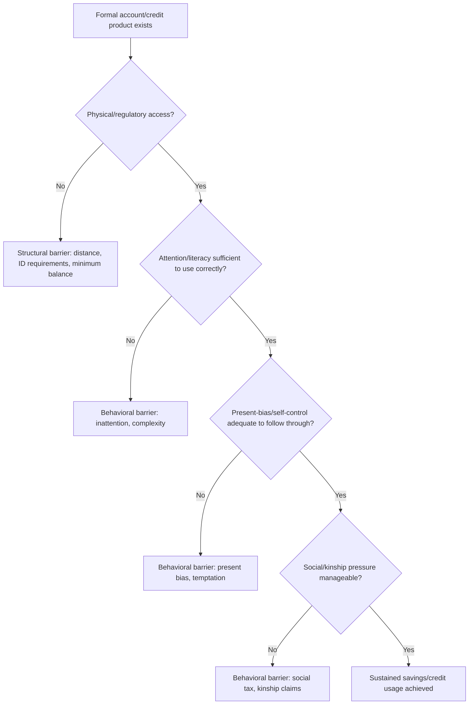

## Behavioral Barriers to Savings and Credit Access

### Definitions and Scope

This topic covers the behavioral (as opposed to purely institutional or structural) frictions that suppress savings accumulation and impede efficient credit use among low-income populations, even when formal financial products are technically available. It sits adjacent to but distinct from **poverty traps and present bias**: while present bias is one specific mechanism, this topic broadens the frame to include limited attention, mental accounting, social constraints on savings, and demand-side behavioral frictions in borrowing.

### Taxonomy of Behavioral Barriers

**Key Points**

- **Present bias / self-control problems**: temptation to consume today crowds out saving for future-dated goals (see companion topic for formal β-δ treatment).
- **Limited attention and inattention costs**: the cognitive and time cost of tracking balances, deadlines, and goals causes underuse of financial products even when net expected returns are positive.
- **Mental accounting**: money is treated as non-fungible across "mental buckets" (daily consumption, savings, emergency fund), which can help *or* hurt depending on whether the buckets are behaviorally reinforced or easily raided.
- **Social taxation / kinship pressure**: savings held as visible cash or liquid bank balances are subject to redistributive claims from family and social networks, creating a rational (not merely psychological) incentive to hold savings in illiquid or hidden forms — sometimes at negative real returns.
- **Loss aversion and reference dependence**: framing a missed savings goal as a "loss" relative to a target can be more motivating than framing accumulation as a "gain," but the same mechanism can also cause maladaptive avoidance of formal accounts after a single negative experience (e.g., an unexpected fee).
- **Overconfidence and projection bias in credit demand**: borrowers may underestimate future repayment burden by projecting their current (better) financial state forward, leading to over-borrowing or mistimed borrowing.
- **Complexity and low financial literacy**: contract terms (compound interest, fee structures, balloon payments) that are cognitively costly to parse lead to error-prone borrowing and saving decisions independent of preferences.

### Formal Framework: Mental Accounting and Fungibility Violations

Standard economic theory assumes money is fungible: $c_t = \sum_i m_{i,t}$ regardless of the source or labeled purpose of each $m_i$. Mental accounting models (Thaler, 1990) posit separate "accounts" with distinct marginal propensities to consume:

$$c_t = f(m_{\text{current income}}, m_{\text{assets}}, m_{\text{future income}})$$

where $\frac{\partial c_t}{\partial m_{\text{current income}}} > \frac{\partial c_t}{\partial m_{\text{assets}}}$ even when both are equally accessible. This asymmetry can be **exploited constructively**: labeling a savings account for a specific goal (e.g., "school fees account") raises the psychological cost of withdrawal for non-labeled purposes, functioning as a soft commitment device without any contractual lock-in.

### The Social Tax / Kinship Constraint Model

A distinctive feature of savings behavior in many low-income settings, formalized by Jakiela & Ozier (2016) and others:

- Visible liquid savings held by an individual can trigger informal claims from extended family or community members under social norms of mutual insurance.
- This creates an effective **implicit tax rate** $\tau_{\text{social}}$ on observable savings, such that the private return to saving visibly is:

$$r_{\text{effective}} = r_{\text{nominal}} \times (1 - \tau_{\text{social}})$$

- Rational responses include: hiding savings (informal, low-return instruments like cash-under-mattress or livestock), joining ROSACs where claimed withdrawal rules are external and non-negotiable, or preferring formal bank accounts specifically *because* their illiquidity/inaccessibility provides a legitimate excuse ("the bank won't let me withdraw") to deflect kinship claims.

[Inference: the magnitude of the social tax varies substantially across cultural and kinship-network contexts and is not a universal constant; experimental estimates are context-specific.]

### Barrier Diagram: From Access to Actual Usage

### Credit-Side Behavioral Barriers

**Debt aversion vs. rational avoidance**: field evidence shows some populations avoid formal microcredit even at favorable rates, driven partly by loss-averse framing of debt (a certain future obligation looms larger than an uncertain future gain) and partly by legitimate risk aversion to income-contingent repayment obligations in volatile-income settings.

**Contract complexity effects**: Studies of microloan take-up find that simplifying loan terms and providing transparent, standardized disclosure (rather than solely lowering interest rates) can measurably shift borrowing behavior, indicating that comprehension frictions — not just price — govern credit decisions. [Inference: effect sizes for disclosure/simplification interventions are heterogeneous across studies and loan products; results should not be over-generalized to all credit contexts.]

**Overindebtedness via projection bias**: borrowers evaluating a new loan while in a temporarily favorable income state (e.g., right after harvest) tend to project that state forward, underestimating the burden of repayment during the subsequent low-income period — a mechanism distinct from, but complementary to, present bias.

### Empirical Evidence on Interventions

**Example**

Selected field-experiment findings relevant to this topic:

- **Commitment savings (Philippines, Ashraf/Karlan/Yin, 2006)**: a savings account with self-imposed withdrawal restrictions increased savings substantially among individuals who displayed hyperbolic-discounting patterns, with no effect on time-consistent individuals — evidence that the barrier addressed was self-control-specific, not general liquidity access.
- **Labeled/goal accounts**: several field studies find that simply labeling a savings account or envelope for a specific purpose (school fees, agricultural inputs) raises savings rates relative to unlabeled accounts of identical formal terms, consistent with mental-accounting-based commitment.
- **Reminders (savings, Kenya and Peru)**: SMS or letter reminders referencing a stated savings goal increase savings balances at low marginal cost, addressing inattention rather than preference-based barriers.
- **Rainfall-indexed and other index insurance take-up puzzles**: take-up of formal index insurance among farmers remains persistently below what expected-utility models predict as beneficial, attributed in part to trust deficits, complexity of payout triggers, and present-biased valuation of the immediate premium versus a distant contingent payout.

### Design Implications for Financial Products

**Next Steps** (for product/policy design)

- Build **default enrollment with easy opt-out** into savings products distributed through employers or agricultural cooperatives, exploiting status-quo tendencies to raise participation without restricting choice.
- Use **earmarking/labeling** (dedicated sub-accounts, physical lockboxes, mobile-money savings "goals" features) as low-cost commitment substitutes where contractual illiquidity is not feasible or desired.
- Pair credit products with **simplified, standardized disclosure** (effective interest rate stated plainly, total repayment amount emphasized over periodic installment framing) to reduce complexity-driven errors.
- Where social-tax dynamics are salient, design formal savings products explicitly marketed as offering a **legitimate external excuse** for illiquidity (e.g., locked-term accounts marketed for their inaccessibility as a *feature*, not a bug).
- Combine reminders with **specific implementation intentions** ("if payday, then transfer X to savings") rather than generic reminders, drawing on implementation-intention research from psychology.

### Distinguishing Structural from Behavioral Credit/Savings Barriers

| Barrier | Type | Example Remedy |
| --- | --- | --- |
| No nearby bank branch | Structural | Mobile money, agent banking |
| High minimum balance | Structural | Tiered/no-minimum accounts |
| Present bias / temptation spending | Behavioral | Commitment savings, lockboxes |
| Inattention to deadlines | Behavioral | SMS reminders, autopay |
| Kinship/social tax on visible savings | Behavioral (social) | Formal illiquid accounts as social excuse |
| Contract complexity | Behavioral (cognitive) | Simplified disclosure, standardized terms |
| Uninsurable background risk | Structural | Index insurance, consumption smoothing transfers |

[Unverified] The relative contribution of behavioral versus structural barriers to the "financial inclusion gap" differs by market and is actively studied; no single universal decomposition is established in the literature.

### Related Topics

- Poverty Traps and Present Bias (formal β-δ modeling, S-shaped dynamics)
- Mental accounting theory (Thaler) and labeled savings products
- Microfinance and microcredit: impact evaluation evidence (Banerjee, Duflo et al.)
- Index insurance take-up puzzles in agricultural risk management
- Mobile money and digital financial inclusion (e.g., M-Pesa impact studies)
- Nudges and defaults in financial decision-making
- Social networks, risk-sharing, and informal insurance arrangements
- Financial literacy interventions: design and measured effectiveness