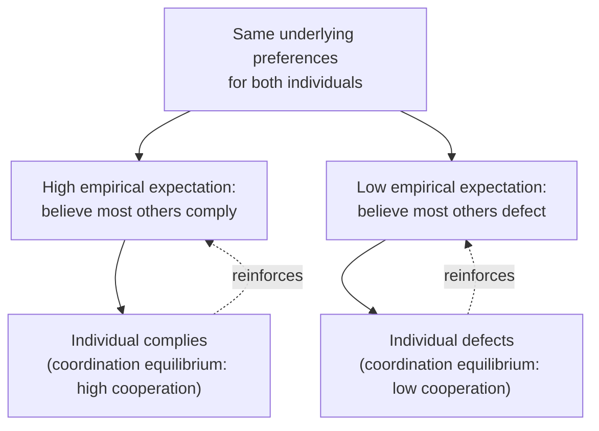

## Social Norms and Collective Action in Development

### Definitions and Scope

**Social norms**: shared beliefs within a reference group about (a) what behavior is typical (*empirical/descriptive expectations*) and (b) what behavior is socially approved or sanctioned (*normative expectations*). Norms differ from simple preferences in that compliance is conditional on beliefs about others' behavior and beliefs about others' approval — making norms a coordination phenomenon, not merely an aggregation of independent individual tastes.

**Collective action problems**: situations where individually rational choices produce a collectively suboptimal outcome, typically because a public good is underprovided or a common-pool resource is overexploited absent coordination. The canonical formalization is the **free-rider problem** in public goods provision and the **tragedy of the commons** in shared-resource extraction.

This topic connects to the chapter's behavioral development frame because norms and coordination failures interact with the same cognitive and belief-based mechanisms (bounded rationality, belief updating, social identity) that shape poverty-trap and savings-barrier dynamics — but the unit of analysis shifts from the individual decision-maker to group-level equilibria.

### Formal Model: Conditional Cooperation and Multiple Equilibria

Bicchieri's (2006) framework models norm compliance as conditional on two belief types:

$$\text{Comply}_i = 1 \iff U_i(\text{comply} \mid e_i^{\text{emp}}, e_i^{\text{norm}}) > U_i(\text{defect} \mid e_i^{\text{emp}}, e_i^{\text{norm}})$$

where $e_i^{\text{emp}}$ is individual $i$'s empirical expectation (belief about the prevalence of the behavior among others) and $e_i^{\text{norm}}$ is the normative expectation (belief about others' approval/disapproval and willingness to sanction).

Because compliance depends on beliefs about others' beliefs, **multiple equilibria** can be sustained by the same underlying preferences: a population may be "stuck" in a low-cooperation equilibrium not because individuals prefer low cooperation, but because each individual (correctly) believes others will not cooperate, making non-cooperation the best response. This is formally analogous to the multiple-equilibria structure in poverty-trap models, but the state variable is a belief distribution rather than a capital stock.

### Coordination Failure Diagram

### Key Mechanisms in Collective Action

**Key Points**

- **Free-riding**: non-excludable, non-rival goods (irrigation infrastructure maintenance, community forest protection) are underprovided when individual contribution costs are private but benefits are shared.
- **Common-pool resource dynamics**: Ostrom's (1990) empirical work identified design principles under which communities self-govern shared resources (grazing land, fisheries, water) without external enforcement, contradicting the pessimistic prediction of inevitable overexploitation.
- **Social sanctioning as enforcement**: informal punishment (gossip, exclusion, reputational cost) substitutes for formal contract enforcement in settings with weak state capacity, but requires monitoring and coordinated willingness to sanction, which is itself a second-order collective action problem.
- **Focal points and coordination devices**: public rituals, leadership announcements, and visible commitment ceremonies can shift a population's empirical expectations rapidly, triggering a jump between equilibria without requiring preference change.
- **Network structure effects**: the topology of social ties (density, centrality, bridging ties across subgroups) determines how quickly information about others' behavior propagates, which governs how fast belief-driven equilibrium shifts can occur.

### Ostrom's Design Principles for Self-Governed Commons

1. Clearly defined resource and group boundaries.
2. Congruence between appropriation/provision rules and local conditions.
3. Collective-choice arrangements allowing most resource users to participate in rule modification.
4. Monitoring, ideally by accountable users themselves.
5. Graduated sanctions for rule violators.
6. Low-cost, accessible conflict-resolution mechanisms.
7. Minimal external recognition of the group's right to self-organize.
8. Nested enterprises for larger common-pool resources (polycentric governance).

[Inference: Ostrom's principles describe empirically observed correlates of successful commons governance across case studies; they function as a diagnostic checklist rather than a strictly sufficient causal formula guaranteeing success in any given new context.]

### Norm Change and Intervention Design

**Example**

An NGO seeks to shift a harmful norm (e.g., open defecation) using behavioral tools rather than only infrastructure provision (toilets).

- **Infrastructure-only approach**: build latrines. Frequently insufficient alone — usage rates often remain low if the underlying norm still treats open defecation as unremarkable or if visible non-use by neighbors reinforces low empirical expectations.
- **Community-Led Total Sanitation (CLTS)** approach: uses public "triggering" exercises (mapping defecation sites, calculating collective fecal load) designed to induce collective disgust and shift shared normative expectations simultaneously across a community, rather than targeting individual households sequentially — exploiting the coordination structure of the norm directly.
- **Effectiveness caveats**: CLTS and similar norm-based sanitation interventions show mixed and context-dependent results across evaluations; some studies find durable behavior change while others find reversion once external triggering pressure is removed. [Unverified as a general claim: effect persistence appears to depend on local monitoring/sanctioning capacity after program exit, and single-study estimates should not be generalized across all contexts.]

### Empirical Evidence

- **Information and descriptive norm interventions**: correcting misperceptions about the true prevalence of a behavior (e.g., informing individuals that contraceptive use, fertilizer adoption, or tax compliance is more common than believed) has been shown in multiple field studies to shift behavior toward the corrected empirical belief, consistent with conditional-cooperation models.
- **Ostrom's fieldwork on irrigation and forestry commons**: comparative case studies across multiple countries found that communities meeting more of the design principles above sustained resource use more effectively than those relying purely on top-down state management or full privatization, challenging the presumption that only privatization or centralized control can solve commons problems.
- **Public goods games in experimental economics**: laboratory and lab-in-the-field public goods games consistently find that adding a costly peer-punishment option raises average contribution levels relative to a no-punishment baseline, though punishment can also trigger retaliatory "anti-social punishment" in some cross-cultural samples, reducing net welfare gains.
- **Networks and technology diffusion**: studies of agricultural technology adoption find diffusion speed correlates with network centrality of early adopters, consistent with a belief-propagation account of behavior change rather than a purely independent-adoption model.

### Distinguishing Norm-Based from Purely Material Collective Action Failures

| Failure Type | Core Mechanism | Typical Remedy |
| --- | --- | --- |
| Pure free-riding (material incentive) | Individually costly, collectively beneficial contribution | Formal contracts, taxation, Pigouvian subsidies |
| Belief-driven norm trap | Low empirical/normative expectations sustain low cooperation despite aligned preferences | Public information correction, triggering events, focal-point coordination |
| Monitoring/enforcement failure | Contributions observable in principle but costly to monitor | Community-based monitoring, graduated sanctions |
| Network fragmentation | Information about others' behavior does not propagate across subgroups | Bridging interventions, seeding across network clusters |

### Related Topics

- Poverty Traps and Present Bias (parallel multiple-equilibria structure at individual vs. group level)
- Ostrom's design principles and polycentric governance of common-pool resources
- Public goods games and peer-punishment mechanisms in experimental economics
- Community-Led Total Sanitation (CLTS) and norm-based public health interventions
- Social network analysis and technology diffusion in agricultural economics
- Conditional cooperation and belief-based coordination games (Bicchieri framework)
- Identity economics and group-based behavioral incentives (Akerlof & Kranton)
- Field experiments on information provision and belief correction