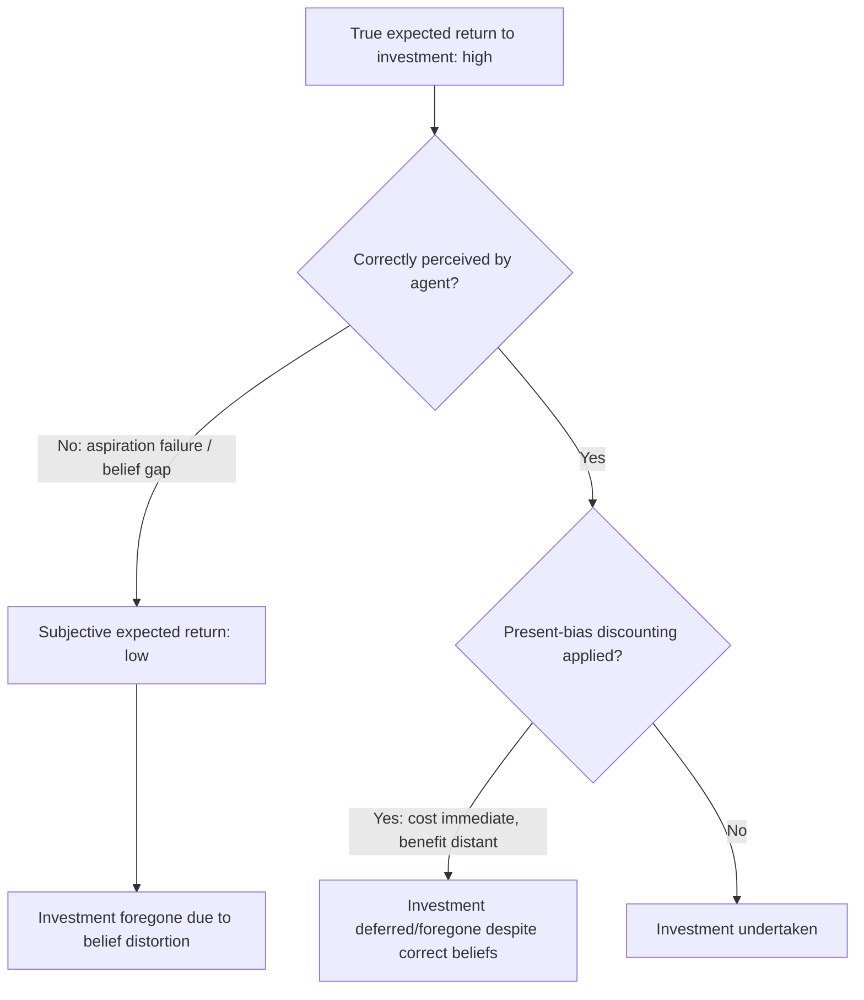

## Behavioral Explanations for Underinvestment in Health and Education

### Definitions and Scope

This topic examines why observed investment in preventive health (vaccination, deworming, water treatment, prenatal care) and education (school attendance, homework effort, schooling duration) frequently falls below the level that standard cost-benefit calculations — using conventional estimates of returns to health and schooling — would predict as individually optimal. The central puzzle: many of these investments have low monetary cost and high estimated returns, yet uptake remains persistently low even when access barriers are removed. Behavioral development economics attributes part of this gap to decision-making frictions rather than solely to income constraints or mismeasured returns.

### Taxonomy of Behavioral Mechanisms

**Key Points**

- **Present bias**: preventive health and schooling investments impose costs today (time, discomfort, forgone labor) for benefits realized far in the future — the exact intertemporal structure present bias penalizes most (see companion topic for formal β-δ treatment).
- **Salience and inattention**: benefits of prevention are invisible/counterfactual (a disease that did not occur, a skill gained gradually), while costs are immediate and salient, causing systematic underweighting of benefits in the decision calculus.
- **Limited attention to probabilistic, low-frequency risks**: rare-but-severe health events are difficult to intuitively weight correctly; some individuals underreact (optimism bias) while others overreact (availability-driven overestimation of vivid but rare risks) depending on framing and recent experience.
- **Projection bias**: parents/individuals in good current health project that state forward, underestimating future vulnerability and thus undervaluing preventive investment.
- **Aspiration failure**: perceived low returns to education for one's own reference group (due to observed labor market outcomes of similar peers) can suppress investment even when true returns are high, because subjective expected returns — not objective returns — drive the decision.
- **Social image and signaling concerns**: health behaviors performed in public view (e.g., accepting a stigmatized vaccine, visiting a clinic associated with a stigmatized disease) carry a social cost that competes with health benefit.
- **Limited belief updating / model misspecification**: agents may not correctly update beliefs about the returns to schooling or health investment from available information, especially when returns are heterogeneous and individual-specific signals are noisy.

### Formal Framework: Subjective vs. Objective Expected Returns

Investment decisions can be modeled as comparing subjective expected utility against cost:

$$\text{Invest} \iff \hat{E}[\text{benefit}] \cdot p_i - c_t > 0$$

where $\hat{E}[\cdot]$ denotes the agent's *subjective* expectation, $p_i$ is the perceived probability of realizing that benefit, and $c_t$ is the immediate cost. The behavioral development literature argues that gaps between actual and predicted investment often trace to systematic wedges between $\hat{E}[\cdot]$ (or $p_i$) and the true, econometrically-estimated expected return — rather than to $c_t$ alone. This reframes many "low investment" puzzles as **belief and attention problems**, not pure price or income problems.

### Underinvestment Pathway Diagram

### Health Investment: Empirical Evidence

**Example**

Deworming and immunization take-up field experiments provide some of the most cited evidence in this literature:

- **Deworming take-up (Kremer & Miguel; Kremer, Miguel, Mullainathan, Null & Zwane, 2011)**: even very small positive prices for deworming pills caused sharp drops in take-up relative to free provision, a magnitude of price sensitivity difficult to reconcile with the low absolute cost involved relative to the health benefit — consistent with present bias and salience effects dominating the marginal cost-benefit calculation at low price points.
- **Immunization incentives (Banerjee, Duflo, Glennerster & Kothari, 2010)**: providing small non-cash incentives (e.g., bags of lentils) at mobile immunization camps in Rajasthan substantially raised full-immunization completion rates relative to camps without incentives, and relative even to fixed camps without incentives — suggesting that a modest immediate reward can counteract present-biased deferral of the multi-visit completion cost required for full immunization.
- **Chlorination and water treatment take-up**: take-up of household water chlorination remains low even when the product is subsidized and locally available, attributed partly to the invisible/uncertain nature of the health benefit (avoided illness) relative to the small but salient behavioral cost (remembering to treat water at each use) — an inattention-driven account distinct from affordability.

[Inference: price sensitivity in these studies is frequently interpreted as evidence of behavioral frictions (present bias, salience) rather than pure income constraints, because the price changes involved are too small relative to household budgets to be explained by standard income-elasticity arguments alone; this interpretation, while widely cited, remains subject to alternative explanations including uncertainty about product quality/efficacy.]

### Education Investment: Empirical Evidence

- **Information and returns-to-education interventions (Jensen, 2010, Dominican Republic)**: providing students with accurate information about the true (higher-than-perceived) returns to secondary schooling increased subsequent school attendance, indicating that at least part of observed underinvestment in schooling reflects a correctable belief gap rather than a fixed preference for low schooling.
- **Aspiration-based interventions**: exposure to successful role models from similar socioeconomic backgrounds (via documentary screenings, mentorship, or media) has been associated with increased educational aspirations and subsequent investment in some field studies, consistent with an aspiration-failure account, though effect persistence over long horizons is less consistently established. [Unverified as a general claim: aspiration-intervention effect sizes vary by study design and duration of follow-up.]
- **Small immediate incentives for school attendance**: conditional or unconditional small immediate rewards for attendance (uniforms, small cash transfers, merit scholarships) have shown attendance effects sometimes disproportionate to their monetary value relative to the estimated long-run returns to schooling, again suggestive of present-bias-consistent responsiveness to near-term incentives.
- **Parental investment and time-inconsistency**: parents making educational investment decisions on behalf of children face the same intertemporal structure (cost today, benefit realized in the child's distant future), and some evidence suggests parental present bias can be a distinct channel from the child's own preferences in explaining underinvestment.

### Distinguishing Behavioral from Structural Underinvestment

| Explanation | Mechanism | Diagnostic Evidence | Policy Implication |
| --- | --- | --- | --- |
| Credit constraints | Cannot finance upfront cost despite wanting to invest | High price-sensitivity even for large-return investments; demand for microloans for this purpose | Targeted credit, cash transfers |
| Present bias | Correct beliefs about returns but temporal discounting distorts choice | Small non-monetary immediate incentives shift behavior disproportionately | Commitment devices, near-term incentives |
| Aspiration/belief failure | Subjective expected return diverges from true return | Information-provision interventions alone shift behavior | Information campaigns, role-model exposure |
| Salience/attention failure | Correct beliefs but low behavioral follow-through | Reminders and simplification improve completion without changing incentives | Reminders, simplified enrollment/take-up processes |
| Genuine low true returns (rational underinvestment) | Local labor market genuinely offers low returns to the investment | Investment low regardless of information/incentive changes | Labor market and structural interventions, not behavioral nudges |

### Policy Design Implications

**Next Steps** (for intervention design)

- Combine **information correction** (survey and correct perceived returns before assuming a preference-based explanation) with **incentive-timing redesign** (move small rewards closer to the point of behavioral cost, e.g., attendance-linked small immediate rewards rather than end-of-year prizes).
- Use **default and simplification design** for multi-step health investments (e.g., pre-scheduled immunization reminders with a designated follow-up date) to address attention rather than incentive gaps.
- Be cautious about assuming a single dominant mechanism: rigorous diagnosis (e.g., varying price alone vs. varying information alone vs. varying reminder frequency alone in a factorial design) is needed to distinguish credit constraints, present bias, and belief gaps before designing a scaled intervention, since the correct remedy differs sharply by mechanism.
- Avoid over-reliance on one-off role-model or aspiration interventions without complementary structural investment, since aspiration change alone does not relax genuine credit or labor-market constraints if those are independently binding. [Inference]

### Related Topics

- Poverty Traps and Present Bias (formal β-δ modeling of intertemporal underinvestment)
- Behavioral Barriers to Savings and Credit Access (parallel frictions in financial behavior)
- Aspiration failure and the capability approach (Appadurai; Ray)
- Randomized controlled trials in development economics: identifying mechanisms via factorial design
- Conditional cash transfers and human capital investment (PROGRESA/Oportunidades evidence)
- Nudges, defaults, and reminders in health-seeking behavior
- Projection bias and reference-dependent preferences
- Social stigma and health-seeking behavior in low-income settings